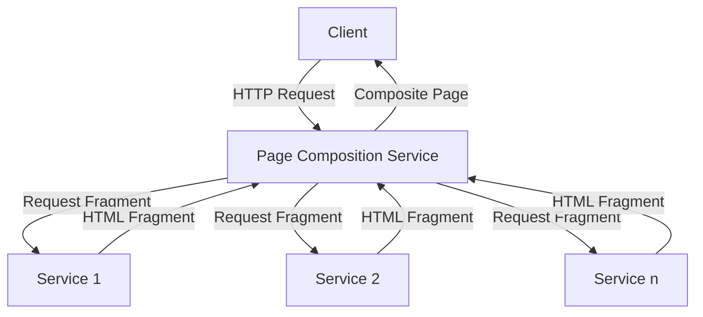
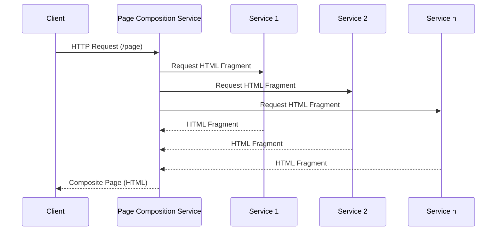
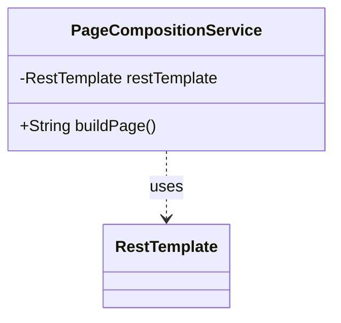
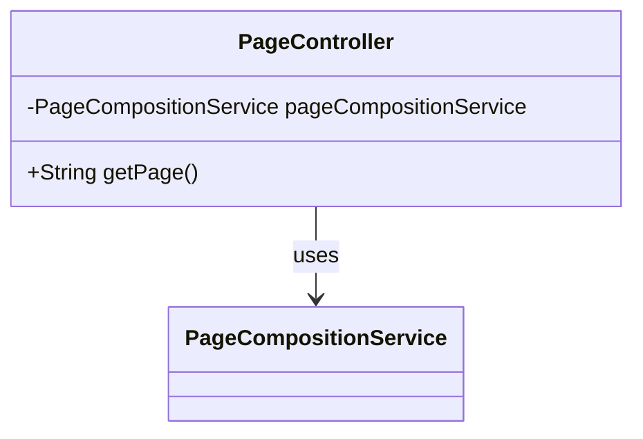
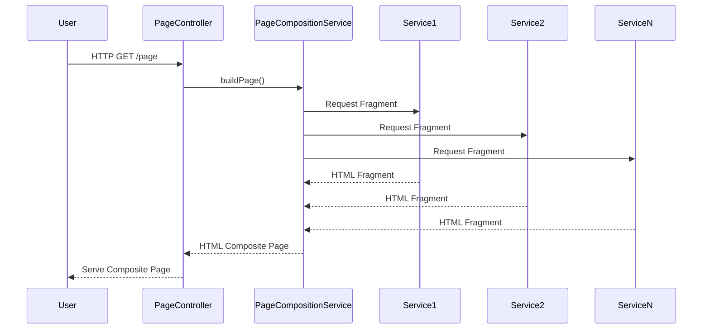

## Definition

Server-Side Page Fragment Composition is a microservices pattern where a web page is constructed on the server by composing HTML fragments generated by multiple independently deployable web applications or services. These fragments are then collated and served as a single web page to the client.

## Intent

The primary intent of Server-Side Page Fragment Composition is to:
- Enable easy integration of data and functionalities from multiple microservices into a unified web page.
- Decouple the different parts of the UI, which correspond to different business capabilities or subdomains, allowing them to be developed and deployed independently.

## Also Known As

- Page Composition Gateway
- Page Assembler

## Detailed Definitions and Explanations

In a microservices architecture, each service typically corresponds to a particular subdomain or business capability. Designing the UI to consume data from these services directly via client-side composition can result in complexity and performance problems. Instead, Server-Side Page Fragment Composition consolidates HTML fragments from multiple services into a single, server-rendered HTML document.

### Diagrams

#### Architecture Diagram



#### Sequence Diagram



## Key Features

- **Decoupled Development**: Each web application fragment can be developed, tested, and deployed independently.
- **Improved Maintainability**: Changes in one part of the application do not impact the other parts.
- **Enhanced Performance**: Server-side composition reduces the data load on the client and optimizes rendering speed.

## Code Examples

### Java Spring Boot Implementation

#### Page Composition Service

```java
import org.springframework.beans.factory.annotation.Autowired;
import org.springframework.stereotype.Service;
import org.springframework.web.client.RestTemplate;

@Service
public class PageCompositionService {

    @Autowired
    private RestTemplate restTemplate;

    public String buildPage() {
        String fragment1 = restTemplate.getForObject("http://service1/fragment", String.class);
        String fragment2 = restTemplate.getForObject("http://service2/fragment", String.class);
        String fragmentN = restTemplate.getForObject("http://serviceN/fragment", String.class);

        return "<html><body>"
                + fragment1
                + fragment2
                + fragmentN
                + "</body></html>";
    }
}
```

#### RestController

```java
import org.springframework.beans.factory.annotation.Autowired;
import org.springframework.web.bind.annotation.GetMapping;
import org.springframework.web.bind.annotation.RestController;

@RestController
public class PageController {

    @Autowired
    private PageCompositionService pageCompositionService;

    @GetMapping("/page")
    public String getPage() {
        return pageCompositionService.buildPage();
    }
}
```

## Example Class Diagrams

#### PageCompositionService



#### RestController



## Example Sequence Diagrams



## Benefits

- **Data Integration**: Easy integration of data and services from multiple microservices into a unified UI.
- **Separation of Concerns**: Different functionalities and business logic are isolated by service boundaries.
- **Reduced Complexity**: Client-side rendering complexity is minimized, leading to better performance and easier development.

## Trade-offs

- **Latency**: Multiple network calls to fetch fragments could increase latency.
- **Complexity**: Adds complexity to the server-side page composition service due to the need to manage and aggregate multiple fragments.

## When To Use

- When multiple backend services need to be combined into a single user interface.
- When independent deployment and development cycles for different UI components are required.
- When you need to improve performance by minimizing handling complexity on the client-side.

## Example Use Cases

- Dashboards that aggregate data from several microservices.
- E-commerce sites displaying content from different catalog, pricing, and recommendation services.
- Admin panels where functionality spans across multiple backend systems.

## When Not To Use

- When the integration between UI fragments and backend services can be efficiently managed by client-side frameworks.
- In scenarios where real-time interaction with a single cohesive backend is essential.
- For very high-latency environments where multiple back-and-forth server calls would degrade performance.

## Anti-Patterns

- **Monolithic UI**: Avoid creating a tightly coupled monolith for the UI composition as that contradicts the microservice architecture principle.
- **Missing Abstract Layer**: Directly embedding service communication logic in the Page Controller without separation of responsibilities can lead to rigid and fragile codebases.

## Related Design Patterns

### Backend for Frontend (BFF)

#### Description and Comparison

- While the Server-Side Page Fragment Composition focuses on composing fragments into a holistic page, BFF abstracts the backend services ensuring that each frontend gets the specific backend knowledge essential to it. The focus is more on API mediation and adapting backend data to frontend needs.

### API Gateway

#### Description and Comparison

- An API Gateway pattern might include functionalities to retrieve data from different services like a Page Composition Service but typically focuses on routing requests, not necessarily composing HTML content.

## References

1. *Building Microservices* by Sam Newman
2. [Designing Data-Intensive Applications](https://amzn.to/4cuX2Na) by Martin Kleppmann

## Credits

This example draws heavily from recognized works in Microservice Architecture and thoughts discussed in various tech blogs about the growing trend of UI composition in a distributed system setting.

## Open Source Frameworks

- **Spring Cloud Netflix Zuul**: Used for routing and aggregating requests.
- **Spring Boot**: Quick setup of REST services and dependency management.

## Third Party Tools

- **Apollo Client**: Used for client-side data fetching and state management in scenarios when partial UI rendering is done client-side.
- **GraphQL**: Allows cross-service data fetching with a single query suitable for client-side processing but also applicable to server aggregation.

## Cloud Computing, SAAS, DAAS, PAAS

- **Server-Side Page Fragment Composition** benefits are amplified when deployed in Platform as a Service (PaaS) offerings such as **AWS Elastic Beanstalk** or **Google App Engine** which provide scalability and manage CI/CD painlessly.
  
## Suggested Books for Further Studies

- *Microservices Patterns* by Chris Richardson
- [Implementing Domain-Driven Design](https://amzn.to/3SnNqvq) by Vaughn Vernon
- Architectural Patterns: Uncover Essential Patterns in the Quest for Sustainable Architecture by O'Reilly Media
