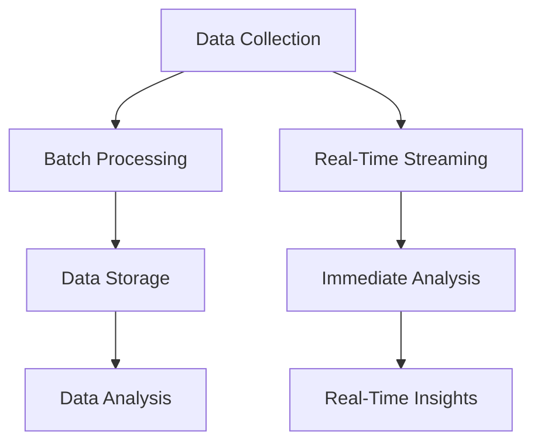

## 1.1.1 From Batch Processing to Real-Time Streaming

### Introduction

The evolution of data architectures has been a journey from traditional batch processing methods to the dynamic world of real-time streaming. This transformation is driven by the need for organizations to process and analyze data with minimal latency, enabling timely decision-making and enhancing operational efficiency. This section explores the paradigm shift from batch processing to real-time streaming, highlighting the challenges of batch processing, the advantages of real-time streaming, and real-world applications that demonstrate the impact of this transition.

### Understanding Batch Processing

Batch processing is a method of processing data where data is collected over a period and processed in bulk at a scheduled time. This approach has been the backbone of data processing for decades, particularly in scenarios where immediate data processing is not critical. 

#### Example of Batch Processing

Consider a retail company that processes sales transactions. Traditionally, the company might collect all sales data throughout the day and run a batch job overnight to update inventory levels, generate sales reports, and perform other analytics tasks. This approach allows the company to handle large volumes of data efficiently, but it introduces significant latency between data collection and data analysis.

#### Challenges of Batch Processing

While batch processing is effective for handling large datasets, it comes with several challenges:

- **Latency**: The inherent delay in processing data means that insights and decisions are based on outdated information.
- **Resource Utilization**: Batch jobs often require significant computational resources, leading to peak loads during processing times.
- **Inflexibility**: Batch processing is not well-suited for scenarios requiring immediate data insights or actions.
- **Complexity**: Managing and scheduling batch jobs can become complex, especially as data volumes grow.

### Introduction to Real-Time Streaming

Real-time streaming, on the other hand, involves processing data as it arrives, allowing for immediate analysis and action. This approach is increasingly favored in environments where timely data insights are crucial, such as financial services, e-commerce, and IoT applications.

#### Key Concepts of Real-Time Streaming

- **Low Latency**: Data is processed with minimal delay, enabling near-instantaneous insights.
- **Continuous Processing**: Unlike batch processing, data is continuously ingested and processed, providing a constant flow of information.
- **Scalability**: Real-time streaming systems are designed to handle varying data loads, scaling up or down as needed.

### Addressing Batch Processing Limitations with Real-Time Streaming

Real-time streaming addresses many of the limitations associated with batch processing:

- **Reduced Latency**: By processing data as it arrives, organizations can make decisions based on the most current information available.
- **Improved Resource Utilization**: Continuous processing spreads the computational load over time, reducing peak resource demands.
- **Enhanced Flexibility**: Real-time streaming supports dynamic data environments, allowing organizations to respond quickly to changing conditions.
- **Simplified Complexity**: With real-time streaming, the need for complex batch job scheduling is minimized, simplifying data processing workflows.

### Real-World Applications and Benefits

#### Case Study: Financial Services

In the financial services industry, real-time streaming is used for fraud detection. By analyzing transaction data as it occurs, financial institutions can identify and respond to fraudulent activities almost instantaneously, reducing potential losses and enhancing customer trust.

#### Case Study: E-Commerce

E-commerce platforms leverage real-time streaming to personalize customer experiences. By processing user behavior data in real-time, these platforms can offer personalized recommendations and dynamic pricing, improving customer satisfaction and increasing sales.

#### Case Study: Internet of Things (IoT)

IoT applications, such as smart cities and connected vehicles, rely on real-time streaming to process sensor data. This enables real-time monitoring and control, enhancing operational efficiency and safety.

### Implementing Real-Time Streaming with Apache Kafka

Apache Kafka is a leading platform for building real-time streaming applications. Its distributed architecture and robust ecosystem make it an ideal choice for organizations looking to transition from batch processing to real-time streaming.

#### Kafka's Role in Real-Time Streaming

- **Scalability**: Kafka's distributed nature allows it to handle large volumes of data with ease.
- **Fault Tolerance**: Kafka's replication and partitioning mechanisms ensure data reliability and availability.
- **Integration**: Kafka integrates seamlessly with various data sources and sinks, facilitating real-time data pipelines.

#### Sample Code: Real-Time Streaming with Kafka

Below are examples of how to implement a simple real-time streaming application using Apache Kafka in different programming languages.

**Java Example**

```java
import org.apache.kafka.clients.producer.KafkaProducer;
import org.apache.kafka.clients.producer.ProducerRecord;
import java.util.Properties;

public class RealTimeProducer {
    public static void main(String[] args) {
        Properties props = new Properties();
        props.put("bootstrap.servers", "localhost:9092");
        props.put("key.serializer", "org.apache.kafka.common.serialization.StringSerializer");
        props.put("value.serializer", "org.apache.kafka.common.serialization.StringSerializer");

        KafkaProducer<String, String> producer = new KafkaProducer<>(props);
        for (int i = 0; i < 100; i++) {
            producer.send(new ProducerRecord<>("real-time-topic", Integer.toString(i), "message-" + i));
        }
        producer.close();
    }
}
```

**Scala Example**

```scala
import org.apache.kafka.clients.producer.{KafkaProducer, ProducerRecord}
import java.util.Properties

object RealTimeProducer extends App {
  val props = new Properties()
  props.put("bootstrap.servers", "localhost:9092")
  props.put("key.serializer", "org.apache.kafka.common.serialization.StringSerializer")
  props.put("value.serializer", "org.apache.kafka.common.serialization.StringSerializer")

  val producer = new KafkaProducer[String, String](props)
  for (i <- 0 until 100) {
    producer.send(new ProducerRecord[String, String]("real-time-topic", i.toString, s"message-$i"))
  }
  producer.close()
}
```

**Kotlin Example**

```kotlin
import org.apache.kafka.clients.producer.KafkaProducer
import org.apache.kafka.clients.producer.ProducerRecord
import java.util.Properties

fun main() {
    val props = Properties().apply {
        put("bootstrap.servers", "localhost:9092")
        put("key.serializer", "org.apache.kafka.common.serialization.StringSerializer")
        put("value.serializer", "org.apache.kafka.common.serialization.StringSerializer")
    }

    KafkaProducer<String, String>(props).use { producer ->
        repeat(100) {
            producer.send(ProducerRecord("real-time-topic", it.toString(), "message-$it"))
        }
    }
}
```

**Clojure Example**

```clojure
(require '[clojure.java.io :as io])
(import '[org.apache.kafka.clients.producer KafkaProducer ProducerRecord])

(defn create-producer []
  (let [props (doto (java.util.Properties.)
                (.put "bootstrap.servers" "localhost:9092")
                (.put "key.serializer" "org.apache.kafka.common.serialization.StringSerializer")
                (.put "value.serializer" "org.apache.kafka.common.serialization.StringSerializer"))]
    (KafkaProducer. props)))

(defn send-messages [producer]
  (doseq [i (range 100)]
    (.send producer (ProducerRecord. "real-time-topic" (str i) (str "message-" i)))))

(defn -main []
  (let [producer (create-producer)]
    (send-messages producer)
    (.close producer)))
```

### Visualizing the Transition

To better understand the transition from batch processing to real-time streaming, consider the following diagram illustrating the differences in data flow and processing:



**Caption**: The diagram contrasts batch processing, where data is collected and processed in bulk, with real-time streaming, where data is processed continuously for immediate insights.

### Conclusion

The shift from batch processing to real-time streaming represents a significant evolution in data architectures, driven by the need for timely insights and operational agility. Real-time streaming offers numerous advantages over traditional batch processing, including reduced latency, improved resource utilization, and enhanced flexibility. By leveraging platforms like Apache Kafka, organizations can effectively implement real-time streaming solutions that meet the demands of modern data environments.

### Knowledge Check

To reinforce your understanding of the transition from batch processing to real-time streaming, consider the following questions and exercises.

## Test Your Knowledge: Real-Time Streaming and Batch Processing Quiz



### What is a primary disadvantage of batch processing?

- [x] High latency
- [ ] Continuous resource utilization
- [ ] Real-time data insights
- [ ] Simplified data management

> **Explanation:** Batch processing involves processing data in bulk at scheduled times, leading to high latency and delayed insights.

### How does real-time streaming improve data processing?

- [x] By reducing latency
- [ ] By increasing batch sizes
- [ ] By simplifying data storage
- [ ] By eliminating data redundancy

> **Explanation:** Real-time streaming processes data as it arrives, reducing latency and providing timely insights.

### Which industry benefits significantly from real-time streaming for fraud detection?

- [x] Financial services
- [ ] Retail
- [ ] Manufacturing
- [ ] Agriculture

> **Explanation:** Financial services use real-time streaming to detect and respond to fraudulent activities quickly.

### What is a key feature of Apache Kafka that supports real-time streaming?

- [x] Distributed architecture
- [ ] Batch processing capabilities
- [ ] High latency
- [ ] Manual scaling

> **Explanation:** Apache Kafka's distributed architecture allows it to handle large volumes of data efficiently, supporting real-time streaming.

### Which of the following is a challenge associated with batch processing?

- [x] Complex scheduling
- [ ] Immediate data insights
- [ ] Continuous data flow
- [ ] Low resource utilization

> **Explanation:** Batch processing requires complex scheduling to manage data processing jobs, especially as data volumes grow.

### What does real-time streaming enable in e-commerce platforms?

- [x] Personalized customer experiences
- [ ] Delayed transaction processing
- [ ] Static pricing models
- [ ] Manual inventory updates

> **Explanation:** Real-time streaming allows e-commerce platforms to process user behavior data in real-time, enabling personalized recommendations and dynamic pricing.

### How does real-time streaming affect resource utilization?

- [x] It spreads computational load over time
- [ ] It increases peak resource demands
- [ ] It requires batch job scheduling
- [ ] It reduces data accuracy

> **Explanation:** Real-time streaming spreads the computational load over time, reducing peak resource demands and improving resource utilization.

### What is a common use case for real-time streaming in IoT applications?

- [x] Real-time monitoring and control
- [ ] Batch data analysis
- [ ] Delayed sensor data processing
- [ ] Manual data collection

> **Explanation:** IoT applications use real-time streaming to process sensor data in real-time, enabling real-time monitoring and control.

### Which programming language is NOT shown in the code examples for real-time streaming with Kafka?

- [x] Python
- [ ] Java
- [ ] Scala
- [ ] Kotlin

> **Explanation:** The code examples provided include Java, Scala, Kotlin, and Clojure, but not Python.

### True or False: Real-time streaming eliminates the need for data storage.

- [ ] True
- [x] False

> **Explanation:** Real-time streaming processes data as it arrives, but data storage is still necessary for historical analysis and compliance purposes.



By understanding the transition from batch processing to real-time streaming, you can better appreciate the capabilities and advantages of modern data architectures. This knowledge is crucial for designing systems that meet the demands of today's fast-paced, data-driven environments.
