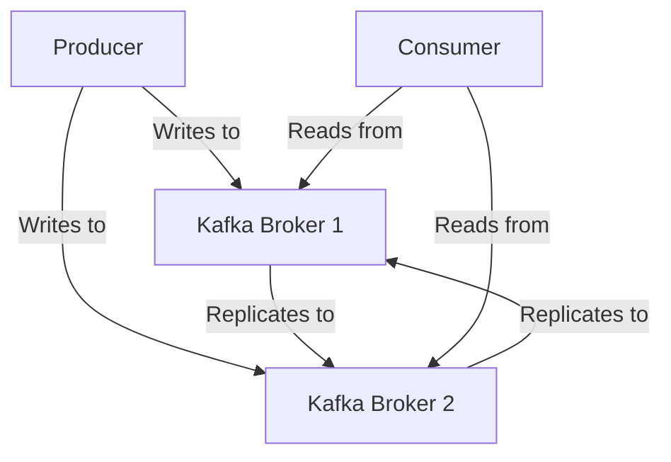

## 1.1.2 The Role of Kafka in Modern Data Systems

Apache Kafka has emerged as a pivotal technology in the landscape of modern data systems, serving as the backbone for high-throughput, low-latency data pipelines. Its architecture is designed to support real-time analytics and event-driven architectures, making it an indispensable tool for enterprises aiming to harness the power of data. This section delves into Kafka's core functionalities, its architectural strengths, and its practical applications in enterprise environments, emphasizing its scalability, fault tolerance, and robustness.

### Introduction to Apache Kafka

Apache Kafka is an open-source distributed event streaming platform capable of handling trillions of events a day. Originally developed by LinkedIn and later open-sourced, Kafka is now part of the Apache Software Foundation. It is designed to provide a unified, high-throughput, low-latency platform for handling real-time data feeds.

#### Core Functionalities

- **Publish and Subscribe**: Kafka allows applications to publish and subscribe to streams of records, similar to a message queue or enterprise messaging system.
- **Store Streams of Records**: Kafka can store streams of records in a fault-tolerant manner.
- **Process Streams of Records**: Kafka provides the ability to process streams of records as they occur.

### Kafka's Architecture: A Foundation for Real-Time Processing

Kafka's architecture is a key factor in its suitability for real-time processing. It is built around a distributed system of brokers, topics, partitions, and consumer groups, which together provide a robust and scalable framework for data streaming.

#### Distributed Architecture

Kafka's distributed architecture allows it to scale horizontally by adding more brokers to a cluster. This architecture ensures high availability and fault tolerance, as data is replicated across multiple brokers.



*Diagram: Kafka's distributed architecture with producers, brokers, and consumers.*

#### Topics and Partitions

Kafka organizes data into topics, which are further divided into partitions. Each partition is an ordered, immutable sequence of records that is continually appended to—a log. Partitions enable Kafka to parallelize processing by distributing data across multiple brokers.

- **Scalability**: By increasing the number of partitions, Kafka can handle more data and more consumers.
- **Fault Tolerance**: Data is replicated across partitions, ensuring that it is not lost if a broker fails.

### Kafka in Action: Enterprise Use Cases

Kafka's architecture and capabilities make it ideal for a variety of enterprise use cases, from real-time analytics to event-driven microservices.

#### Real-Time Analytics

Enterprises use Kafka to build real-time analytics platforms that process and analyze data as it is generated. For example, a financial services company might use Kafka to process stock market data in real time, enabling instant decision-making.

```java
// Java example of a Kafka producer for real-time analytics
Properties props = new Properties();
props.put("bootstrap.servers", "localhost:9092");
props.put("key.serializer", "org.apache.kafka.common.serialization.StringSerializer");
props.put("value.serializer", "org.apache.kafka.common.serialization.StringSerializer");

Producer<String, String> producer = new KafkaProducer<>(props);
producer.send(new ProducerRecord<>("real-time-analytics", "key", "value"));
producer.close();
```

#### Event-Driven Microservices

Kafka is also used to decouple microservices in an event-driven architecture. By acting as a central hub for events, Kafka allows services to communicate asynchronously, improving scalability and resilience.

```scala
// Scala example of a Kafka consumer in an event-driven microservice
import org.apache.kafka.clients.consumer.KafkaConsumer
import java.util.Properties
import scala.collection.JavaConverters._

val props = new Properties()
props.put("bootstrap.servers", "localhost:9092")
props.put("group.id", "microservice-group")
props.put("key.deserializer", "org.apache.kafka.common.serialization.StringDeserializer")
props.put("value.deserializer", "org.apache.kafka.common.serialization.StringDeserializer")

val consumer = new KafkaConsumer[String, String](props)
consumer.subscribe(List("event-driven-microservices").asJava)

while (true) {
  val records = consumer.poll(100)
  for (record <- records.asScala) {
    println(s"Received message: ${record.value()} at offset ${record.offset()}")
  }
}
```

### Scalability, Fault Tolerance, and Robustness

Kafka's design inherently supports scalability, fault tolerance, and robustness, making it a reliable choice for enterprise-grade applications.

#### Scalability

Kafka's ability to scale horizontally by adding more brokers and partitions allows it to handle increasing loads without sacrificing performance. This scalability is crucial for enterprises that need to process large volumes of data in real time.

#### Fault Tolerance

Kafka ensures data durability and availability through replication. Each partition can be replicated across multiple brokers, ensuring that data remains accessible even if some brokers fail.

#### Robustness

Kafka's robust architecture and support for exactly-once semantics make it suitable for critical applications where data integrity is paramount. This robustness is achieved through features like idempotent producers and transactional messaging.

### Practical Applications and Real-World Scenarios

Kafka's versatility is demonstrated through its wide range of applications across different industries.

#### Internet of Things (IoT)

In IoT applications, Kafka is used to collect and process data from millions of sensors in real time. This capability is essential for applications like smart cities and industrial automation.

#### Big Data Integration

Kafka serves as a bridge between real-time data streams and big data platforms like Hadoop and Spark, enabling seamless integration and processing of large datasets. For more details, see [1.4.4 Big Data Integration]( "Big Data Integration").

#### Stream Processing Applications

Kafka's integration with stream processing frameworks like Apache Flink and Kafka Streams allows enterprises to build complex data processing pipelines that can transform and analyze data in real time.

### Conclusion

Apache Kafka's role in modern data systems is characterized by its ability to provide a scalable, fault-tolerant, and robust platform for real-time data processing. Its architecture and capabilities make it an ideal choice for enterprises looking to build data-driven applications that require high throughput and low latency. By serving as the backbone of modern data systems, Kafka enables organizations to unlock the full potential of their data, driving innovation and competitive advantage.

## Test Your Knowledge: Apache Kafka's Role in Modern Data Systems Quiz



### What is a primary function of Apache Kafka in modern data systems?

- [x] Facilitating high-throughput, low-latency data pipelines
- [ ] Serving as a relational database
- [ ] Providing a graphical user interface for data visualization
- [ ] Managing network security protocols

> **Explanation:** Apache Kafka is designed to handle high-throughput, low-latency data pipelines, making it ideal for real-time data processing.

### How does Kafka achieve scalability?

- [x] By adding more brokers and partitions
- [ ] By increasing CPU speed
- [ ] By reducing data replication
- [ ] By using a single server architecture

> **Explanation:** Kafka achieves scalability by allowing the addition of more brokers and partitions, enabling it to handle increased data loads.

### What is a key feature of Kafka's architecture that ensures fault tolerance?

- [x] Data replication across multiple brokers
- [ ] Use of a single point of failure
- [ ] Centralized data storage
- [ ] Manual data backup processes

> **Explanation:** Kafka ensures fault tolerance by replicating data across multiple brokers, ensuring data availability even if some brokers fail.

### In what scenario is Kafka commonly used in enterprise environments?

- [x] Real-time analytics
- [ ] Static website hosting
- [ ] Manual data entry
- [ ] Batch processing of printed documents

> **Explanation:** Kafka is commonly used for real-time analytics, where data needs to be processed and analyzed as it is generated.

### What is an advantage of using Kafka in event-driven microservices?

- [x] Asynchronous communication between services
- [ ] Synchronous communication between services
- [ ] Increased dependency between services
- [ ] Reduced scalability

> **Explanation:** Kafka enables asynchronous communication between services in an event-driven architecture, improving scalability and resilience.

### What is the role of partitions in Kafka?

- [x] To parallelize data processing
- [ ] To store configuration files
- [ ] To manage user access
- [ ] To encrypt data

> **Explanation:** Partitions in Kafka allow data processing to be parallelized, enabling higher throughput and scalability.

### How does Kafka support exactly-once semantics?

- [x] Through idempotent producers and transactional messaging
- [ ] By using a single broker
- [ ] By disabling data replication
- [ ] By reducing network latency

> **Explanation:** Kafka supports exactly-once semantics through features like idempotent producers and transactional messaging, ensuring data integrity.

### What is a common use case for Kafka in IoT applications?

- [x] Collecting and processing sensor data in real time
- [ ] Hosting static web pages
- [ ] Managing email servers
- [ ] Printing documents

> **Explanation:** In IoT applications, Kafka is used to collect and process data from sensors in real time, enabling applications like smart cities.

### What is a benefit of Kafka's distributed architecture?

- [x] High availability and fault tolerance
- [ ] Centralized data processing
- [ ] Single point of failure
- [ ] Manual data replication

> **Explanation:** Kafka's distributed architecture provides high availability and fault tolerance by replicating data across multiple brokers.

### True or False: Kafka is primarily used for batch processing.

- [ ] True
- [x] False

> **Explanation:** False. Kafka is primarily used for real-time data processing, not batch processing.



---

In this comprehensive exploration of Apache Kafka's role in modern data systems, we have examined its core functionalities, architectural strengths, and practical applications. Kafka's ability to provide scalable, fault-tolerant, and robust data pipelines makes it an essential tool for enterprises seeking to leverage real-time analytics and event-driven architectures. By understanding and applying Kafka's capabilities, organizations can unlock new opportunities for innovation and growth.
