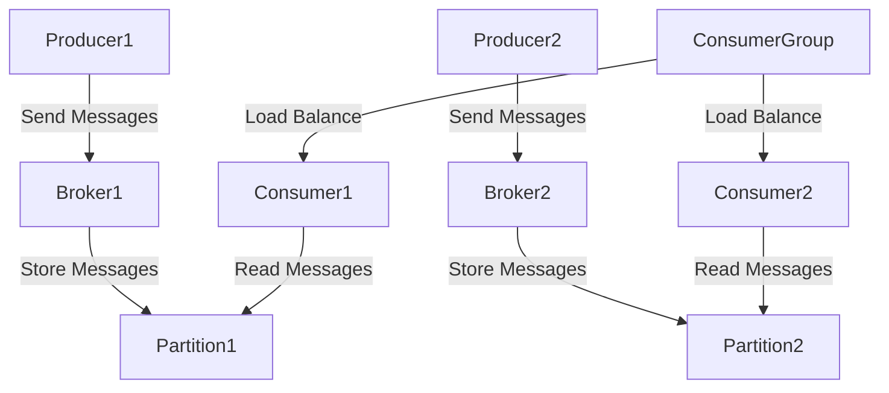

## 1.2.1 Core Concepts and Terminology

Apache Kafka is a powerful distributed event streaming platform capable of handling trillions of events a day. To leverage its full potential, it is crucial to understand its core concepts and terminology. This section will introduce you to the fundamental building blocks of Kafka, providing a solid foundation for mastering more advanced topics.

### Key Concepts and Terminology

#### 1. **Message**

A **message** in Kafka is the fundamental unit of data. It consists of a key, a value, and metadata including a timestamp. Messages are the data records that Kafka brokers store and manage. They can represent any type of data, such as logs, metrics, or user activity.

- **Key**: Used for partitioning and ordering within a partition.
- **Value**: The actual data payload.
- **Metadata**: Includes information like timestamp and headers.

**Example Analogy**: Think of a message as a letter. The key is the address, the value is the content of the letter, and the metadata is the postmark and other postal information.

#### 2. **Topic**

A **topic** is a category or feed name to which messages are published. Topics in Kafka are similar to tables in a database or folders in a file system. They are used to organize messages and are identified by a unique name.

- **Immutable**: Once a message is written to a topic, it cannot be changed.
- **Multi-subscriber**: Multiple consumers can read from the same topic.

**Example Analogy**: Consider a topic as a radio frequency. Producers broadcast messages on a frequency, and consumers tune in to listen.

#### 3. **Partition**

A **partition** is a division of a topic. Each partition is an ordered, immutable sequence of messages that is continually appended to. Partitions enable Kafka to scale horizontally and provide parallelism.

- **Order**: Messages within a partition are strictly ordered.
- **Parallelism**: Multiple partitions allow for concurrent processing.

**Example Analogy**: Imagine a partition as a single lane on a highway. Each lane (partition) has cars (messages) traveling in a specific order.

#### 4. **Broker**

A **broker** is a Kafka server that stores data and serves client requests. Each broker in a Kafka cluster is responsible for managing partitions and replicating data for fault tolerance.

- **Cluster**: A group of brokers working together.
- **Scalability**: Adding more brokers increases capacity and reliability.

**Example Analogy**: Think of a broker as a post office. It receives, stores, and forwards messages (letters) to the appropriate destinations.

#### 5. **Producer**

A **producer** is a client application that publishes messages to Kafka topics. Producers are responsible for choosing which partition to send a message to within a topic.

- **Load Balancing**: Producers can distribute messages across partitions.
- **Asynchronous**: Messages can be sent asynchronously for higher throughput.

**Example Analogy**: A producer is like a radio station broadcasting signals (messages) to listeners (consumers).

#### 6. **Consumer**

A **consumer** is a client application that reads messages from Kafka topics. Consumers can subscribe to one or more topics and process the messages in real-time.

- **Offset Management**: Consumers track their position in each partition using offsets.
- **Consumer Group**: Multiple consumers can work together to read from a topic.

**Example Analogy**: A consumer is like a radio listener tuning into a specific frequency (topic) to receive broadcasts (messages).

#### 7. **Offset**

An **offset** is a unique identifier for each message within a partition. It represents the position of a message in the partition and is used by consumers to track which messages have been read.

- **Sequential**: Offsets are assigned in the order messages are written.
- **Persistence**: Offsets are stored to ensure consumers can resume from where they left off.

**Example Analogy**: An offset is like a bookmark in a book, marking the last page read.

#### 8. **Consumer Group**

A **consumer group** is a collection of consumers that work together to consume messages from a topic. Each consumer in the group reads from a unique partition, allowing for parallel processing.

- **Load Balancing**: Distributes the load across multiple consumers.
- **Fault Tolerance**: If a consumer fails, others can take over its partitions.

**Example Analogy**: A consumer group is like a team of workers on an assembly line, each handling a specific part of the process.

### Interaction of Kafka Components

Understanding how these components interact is crucial for designing efficient Kafka-based systems. Let's explore the interactions through a typical Kafka workflow:

1. **Producers** send messages to a **topic**. Each message is assigned to a **partition** based on the key or a partitioning strategy.
2. **Brokers** store the messages in the assigned partitions and replicate them across other brokers for fault tolerance.
3. **Consumers** subscribe to topics and read messages from partitions. They track their progress using **offsets**.
4. **Consumer Groups** allow multiple consumers to read from a topic in parallel, with each consumer handling different partitions.

### Practical Applications and Real-World Scenarios

Kafka's architecture and components are designed to handle real-time data processing and integration scenarios. Here are some practical applications:

- **Event-Driven Microservices**: Kafka enables microservices to communicate asynchronously, decoupling service interactions and improving scalability. See [1.4.1 Event-Driven Microservices]( "Event-Driven Microservices").
- **Real-Time Data Pipelines**: Kafka can ingest, process, and distribute data in real-time, making it ideal for building data pipelines. Refer to [1.4.2 Real-Time Data Pipelines]( "Real-Time Data Pipelines").
- **Stream Processing Applications**: Kafka's integration with stream processing frameworks allows for complex event processing and analytics. Explore [1.4.3 Stream Processing Applications]( "Stream Processing Applications").
- **Big Data Integration**: Kafka serves as a backbone for big data architectures, facilitating data movement and processing. Learn more in [1.4.4 Big Data Integration]( "Big Data Integration").

### Code Examples

To solidify your understanding, let's look at some code examples demonstrating these concepts in Java, Scala, Kotlin, and Clojure.

#### Java Example

```java
import org.apache.kafka.clients.producer.KafkaProducer;
import org.apache.kafka.clients.producer.ProducerRecord;
import java.util.Properties;

public class KafkaProducerExample {
    public static void main(String[] args) {
        Properties props = new Properties();
        props.put("bootstrap.servers", "localhost:9092");
        props.put("key.serializer", "org.apache.kafka.common.serialization.StringSerializer");
        props.put("value.serializer", "org.apache.kafka.common.serialization.StringSerializer");

        KafkaProducer<String, String> producer = new KafkaProducer<>(props);
        ProducerRecord<String, String> record = new ProducerRecord<>("my-topic", "key", "value");

        producer.send(record);
        producer.close();
    }
}
```

**Explanation**: This Java code creates a Kafka producer that sends a message with a key and value to a topic named "my-topic".

#### Scala Example

```scala
import org.apache.kafka.clients.producer.{KafkaProducer, ProducerRecord}
import java.util.Properties

object KafkaProducerExample extends App {
  val props = new Properties()
  props.put("bootstrap.servers", "localhost:9092")
  props.put("key.serializer", "org.apache.kafka.common.serialization.StringSerializer")
  props.put("value.serializer", "org.apache.kafka.common.serialization.StringSerializer")

  val producer = new KafkaProducer[String, String](props)
  val record = new ProducerRecord[String, String]("my-topic", "key", "value")

  producer.send(record)
  producer.close()
}
```

**Explanation**: This Scala code snippet demonstrates a similar producer setup, sending a message to "my-topic".

#### Kotlin Example

```kotlin
import org.apache.kafka.clients.producer.KafkaProducer
import org.apache.kafka.clients.producer.ProducerRecord
import java.util.Properties

fun main() {
    val props = Properties().apply {
        put("bootstrap.servers", "localhost:9092")
        put("key.serializer", "org.apache.kafka.common.serialization.StringSerializer")
        put("value.serializer", "org.apache.kafka.common.serialization.StringSerializer")
    }

    val producer = KafkaProducer<String, String>(props)
    val record = ProducerRecord("my-topic", "key", "value")

    producer.send(record)
    producer.close()
}
```

**Explanation**: The Kotlin example follows the same logic, showcasing Kotlin's concise syntax.

#### Clojure Example

```clojure
(require '[clojure.java.io :as io])
(import '[org.apache.kafka.clients.producer KafkaProducer ProducerRecord])

(defn kafka-producer-example []
  (let [props (doto (java.util.Properties.)
                (.put "bootstrap.servers" "localhost:9092")
                (.put "key.serializer" "org.apache.kafka.common.serialization.StringSerializer")
                (.put "value.serializer" "org.apache.kafka.common.serialization.StringSerializer"))
        producer (KafkaProducer. props)
        record (ProducerRecord. "my-topic" "key" "value")]
    (.send producer record)
    (.close producer)))
```

**Explanation**: This Clojure code demonstrates a Kafka producer using Clojure's functional style.

### Visualizing Kafka Concepts

To better understand Kafka's architecture and data flow, let's visualize these concepts using diagrams.

#### Kafka Architecture Diagram



**Caption**: This diagram illustrates the interaction between producers, brokers, partitions, and consumers in a Kafka cluster.

### Knowledge Check

To reinforce your understanding, consider the following questions:

1. What is the role of a partition in Kafka?
2. How do consumer groups enhance parallel processing?
3. Why are offsets important for consumers?
4. How does Kafka ensure fault tolerance with brokers?

### Conclusion

Understanding the core concepts and terminology of Apache Kafka is essential for designing robust and scalable event streaming solutions. By mastering these fundamentals, you can effectively leverage Kafka's capabilities to build real-time data processing systems.

### References and Further Reading

- [Apache Kafka Documentation](https://kafka.apache.org/documentation/)
- [Confluent Documentation](https://docs.confluent.io/)
- [Kafka: The Definitive Guide](https://www.oreilly.com/library/view/kafka-the-definitive/9781491936153/)

## Test Your Knowledge: Core Concepts and Terminology in Apache Kafka



### What is a message in Kafka?

- [x] A fundamental unit of data consisting of a key, value, and metadata.
- [ ] A category or feed name to which messages are published.
- [ ] A division of a topic for parallel processing.
- [ ] A server that stores data and serves client requests.

> **Explanation:** A message in Kafka is the fundamental unit of data, consisting of a key, value, and metadata.

### What is the purpose of a topic in Kafka?

- [x] To organize messages into categories or feeds.
- [ ] To track the position of messages within a partition.
- [ ] To manage client requests and store data.
- [ ] To distribute messages across partitions.

> **Explanation:** A topic in Kafka is used to organize messages into categories or feeds.

### How does a partition enhance Kafka's scalability?

- [x] By allowing parallel processing of messages.
- [ ] By storing metadata for messages.
- [ ] By managing client requests.
- [ ] By organizing messages into categories.

> **Explanation:** Partitions enable Kafka to scale horizontally by allowing parallel processing of messages.

### What is the role of a broker in Kafka?

- [x] To store data and serve client requests.
- [ ] To publish messages to topics.
- [ ] To read messages from topics.
- [ ] To track the position of messages within a partition.

> **Explanation:** A broker in Kafka is a server that stores data and serves client requests.

### How do consumer groups enhance parallel processing?

- [x] By allowing multiple consumers to read from a topic in parallel.
- [ ] By organizing messages into categories.
- [ ] By storing data and serving client requests.
- [ ] By distributing messages across partitions.

> **Explanation:** Consumer groups allow multiple consumers to read from a topic in parallel, enhancing parallel processing.

### What is an offset in Kafka?

- [x] A unique identifier for each message within a partition.
- [ ] A category or feed name to which messages are published.
- [ ] A server that stores data and serves client requests.
- [ ] A client application that publishes messages to topics.

> **Explanation:** An offset is a unique identifier for each message within a partition, used by consumers to track which messages have been read.

### What is the role of a producer in Kafka?

- [x] To publish messages to Kafka topics.
- [ ] To read messages from Kafka topics.
- [ ] To store data and serve client requests.
- [ ] To track the position of messages within a partition.

> **Explanation:** A producer in Kafka is a client application that publishes messages to Kafka topics.

### How do brokers ensure fault tolerance in Kafka?

- [x] By replicating data across other brokers.
- [ ] By organizing messages into categories.
- [ ] By allowing parallel processing of messages.
- [ ] By tracking the position of messages within a partition.

> **Explanation:** Brokers ensure fault tolerance in Kafka by replicating data across other brokers.

### What is the purpose of a consumer in Kafka?

- [x] To read messages from Kafka topics.
- [ ] To publish messages to Kafka topics.
- [ ] To store data and serve client requests.
- [ ] To organize messages into categories.

> **Explanation:** A consumer in Kafka is a client application that reads messages from Kafka topics.

### True or False: A consumer group allows multiple consumers to read the same partition simultaneously.

- [ ] True
- [x] False

> **Explanation:** In a consumer group, each partition is read by only one consumer at a time, allowing for parallel processing across partitions.



---
