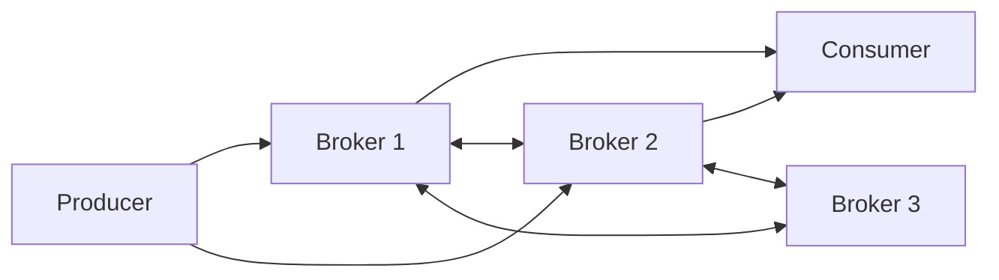
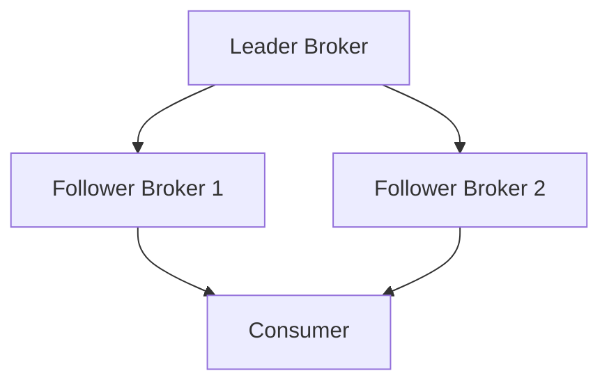

## 1.2.2 Kafka's Distributed Architecture

Apache Kafka is renowned for its robust distributed architecture, which is designed to provide high availability, scalability, and fault tolerance. This section delves into the core components and mechanisms that enable Kafka to handle large volumes of data efficiently and reliably. We will explore the role of brokers, the significance of partitioning, and the critical function of replication in maintaining data integrity and system resilience.

### The Role of Brokers in a Kafka Cluster

In Kafka, a broker is a server that stores data and serves client requests. A Kafka cluster is composed of multiple brokers, each responsible for managing a portion of the data. Brokers are the backbone of Kafka's distributed architecture, ensuring that data is stored, retrieved, and processed efficiently.

#### Key Responsibilities of Brokers

- **Data Storage**: Brokers store data in the form of logs, which are append-only files. Each log corresponds to a topic partition.
- **Client Requests Handling**: Brokers handle requests from producers (to write data) and consumers (to read data).
- **Data Replication**: Brokers replicate data across the cluster to ensure fault tolerance.
- **Leader Election**: Brokers participate in leader election processes to determine which broker will handle read and write requests for a partition.

#### Broker Interactions

Brokers interact with each other to coordinate data replication and leader election. They communicate using Kafka's binary protocol, which ensures efficient data transfer and coordination.



**Diagram 1**: This diagram illustrates the interaction between producers, consumers, and brokers within a Kafka cluster. Brokers communicate with each other to manage data replication and leader election.

### Partitioning: Enhancing Data Distribution and Parallelism

Partitioning is a fundamental concept in Kafka that allows for data distribution across multiple brokers. Each topic in Kafka is divided into partitions, and each partition is an ordered, immutable sequence of records. Partitioning enables Kafka to achieve high throughput and parallelism.

#### Impact of Partitioning

- **Data Distribution**: By distributing partitions across multiple brokers, Kafka ensures that data is evenly spread across the cluster, preventing any single broker from becoming a bottleneck.
- **Parallelism**: Partitioning allows multiple consumers to read data in parallel, increasing the overall throughput of the system.
- **Scalability**: As the volume of data grows, new partitions can be added to the topic, and existing partitions can be rebalanced across brokers.

#### Designing Effective Partition Strategies

When designing partition strategies, consider the following:

- **Key-Based Partitioning**: Use a key to determine the partition for each record, ensuring that records with the same key are sent to the same partition. This is useful for maintaining order within a key.
- **Custom Partitioning**: Implement custom partition logic to distribute data based on specific criteria, such as data size or type.

```java
// Java example of a custom partitioner
public class CustomPartitioner implements Partitioner {
    @Override
    public int partition(String topic, Object key, byte[] keyBytes, Object value, byte[] valueBytes, Cluster cluster) {
        // Custom logic to determine partition
        return key.hashCode() % cluster.partitionCountForTopic(topic);
    }
}
```

```scala
// Scala example of a custom partitioner
class CustomPartitioner extends Partitioner {
  override def partition(topic: String, key: Any, keyBytes: Array[Byte], value: Any, valueBytes: Array[Byte], cluster: Cluster): Int = {
    // Custom logic to determine partition
    key.hashCode % cluster.partitionCountForTopic(topic)
  }
}
```

```kotlin
// Kotlin example of a custom partitioner
class CustomPartitioner : Partitioner {
    override fun partition(topic: String, key: Any?, keyBytes: ByteArray?, value: Any?, valueBytes: ByteArray?, cluster: Cluster): Int {
        // Custom logic to determine partition
        return key.hashCode() % cluster.partitionCountForTopic(topic)
    }
}
```

```clojure
;; Clojure example of a custom partitioner
(defn custom-partitioner
  [topic key key-bytes value value-bytes cluster]
  ;; Custom logic to determine partition
  (mod (.hashCode key) (.partitionCountForTopic cluster topic)))
```

### Replication: Ensuring Data Redundancy and Fault Tolerance

Replication is a critical feature of Kafka's architecture that ensures data redundancy and fault tolerance. Each partition in Kafka is replicated across multiple brokers, creating a replica set. One of these replicas is designated as the leader, while the others are followers.

#### Benefits of Replication

- **Data Redundancy**: Replication ensures that data is not lost in the event of a broker failure. If the leader broker fails, one of the follower brokers is elected as the new leader.
- **Fault Tolerance**: By replicating data across multiple brokers, Kafka can continue to operate even if some brokers are unavailable.
- **High Availability**: Replication allows Kafka to provide high availability, ensuring that data is always accessible to consumers.

#### Configuring Replication

To configure replication in Kafka, set the `replication.factor` parameter for each topic. This parameter determines the number of replicas for each partition.

```properties
# Example Kafka topic configuration
replication.factor=3
```



**Diagram 2**: This diagram shows the replication of a partition across multiple brokers. The leader broker handles all read and write requests, while follower brokers replicate the data.

### Practical Applications and Real-World Scenarios

Kafka's distributed architecture is widely used in various industries to build scalable and resilient data processing systems. Here are some practical applications:

- **Event-Driven Microservices**: Kafka's architecture supports event-driven microservices by providing a reliable messaging backbone. Each microservice can produce and consume events independently, enabling loose coupling and scalability.
- **Real-Time Data Pipelines**: Kafka is often used to build real-time data pipelines that process and analyze data as it arrives. This is particularly useful in industries such as finance and e-commerce, where timely data processing is critical.
- **Big Data Integration**: Kafka's ability to handle large volumes of data makes it an ideal choice for integrating with big data platforms. It can ingest data from various sources and feed it into data lakes or analytics systems for further processing.

For more information on Kafka's integration with big data platforms, refer to [1.4.4 Big Data Integration]( "Big Data Integration").

### Conclusion

Kafka's distributed architecture is a cornerstone of its ability to provide high availability, scalability, and fault tolerance. By leveraging brokers, partitioning, and replication, Kafka can handle large volumes of data efficiently and reliably. Understanding these core components is essential for designing and implementing robust data processing systems with Kafka.

### Knowledge Check

To reinforce your understanding of Kafka's distributed architecture, consider the following questions and challenges:

- How do brokers contribute to Kafka's scalability and fault tolerance?
- What are the benefits of partitioning in Kafka, and how does it impact data distribution?
- How does replication ensure data redundancy and high availability in Kafka?
- Experiment with the provided code examples by implementing a custom partitioner in your Kafka setup.

For further exploration, refer to the [Apache Kafka Documentation](https://kafka.apache.org/documentation/) and [Confluent Documentation](https://docs.confluent.io/).

## Test Your Knowledge: Kafka's Distributed Architecture Quiz



### What is the primary role of a broker in a Kafka cluster?

- [x] To store data and handle client requests
- [ ] To manage network configurations
- [ ] To provide user authentication
- [ ] To analyze data streams

> **Explanation:** Brokers are responsible for storing data and handling requests from producers and consumers.

### How does partitioning enhance Kafka's scalability?

- [x] By distributing data across multiple brokers
- [ ] By reducing the number of brokers needed
- [ ] By increasing the replication factor
- [ ] By limiting the number of consumers

> **Explanation:** Partitioning distributes data across multiple brokers, allowing for parallel processing and increased scalability.

### What is the purpose of replication in Kafka?

- [x] To ensure data redundancy and fault tolerance
- [ ] To increase data processing speed
- [ ] To reduce storage requirements
- [ ] To simplify data serialization

> **Explanation:** Replication ensures that data is not lost in the event of a broker failure, providing redundancy and fault tolerance.

### Which component is responsible for handling read and write requests for a partition?

- [x] The leader broker
- [ ] The follower broker
- [ ] The producer
- [ ] The consumer

> **Explanation:** The leader broker handles all read and write requests for a partition, while follower brokers replicate the data.

### What is a key benefit of using key-based partitioning?

- [x] It maintains order within a key
- [ ] It reduces the number of partitions
- [x] It ensures data is evenly distributed
- [ ] It simplifies consumer configuration

> **Explanation:** Key-based partitioning ensures that records with the same key are sent to the same partition, maintaining order within a key and ensuring even data distribution.

### How does Kafka achieve high availability?

- [x] Through data replication across multiple brokers
- [ ] By using a single broker for all data
- [ ] By limiting the number of consumers
- [ ] By reducing the number of partitions

> **Explanation:** Kafka achieves high availability by replicating data across multiple brokers, ensuring that data is always accessible.

### What is the effect of increasing the replication factor?

- [x] It enhances fault tolerance
- [ ] It reduces data redundancy
- [x] It increases data availability
- [ ] It simplifies partition management

> **Explanation:** Increasing the replication factor enhances fault tolerance and data availability by ensuring more copies of the data are stored across the cluster.

### Which of the following is a practical application of Kafka's architecture?

- [x] Event-driven microservices
- [ ] Static website hosting
- [ ] Image processing
- [ ] Video rendering

> **Explanation:** Kafka's architecture supports event-driven microservices by providing a reliable messaging backbone.

### What happens when a leader broker fails?

- [x] A follower broker is elected as the new leader
- [ ] All data is lost
- [ ] The cluster stops processing data
- [ ] The producer takes over the leader role

> **Explanation:** When a leader broker fails, a follower broker is elected as the new leader to ensure continued data processing.

### True or False: Partitioning allows multiple consumers to read data in parallel.

- [x] True
- [ ] False

> **Explanation:** Partitioning enables multiple consumers to read data in parallel, increasing the overall throughput of the system.



By understanding Kafka's distributed architecture, you can design systems that are not only robust and resilient but also capable of handling the demands of modern data processing.
