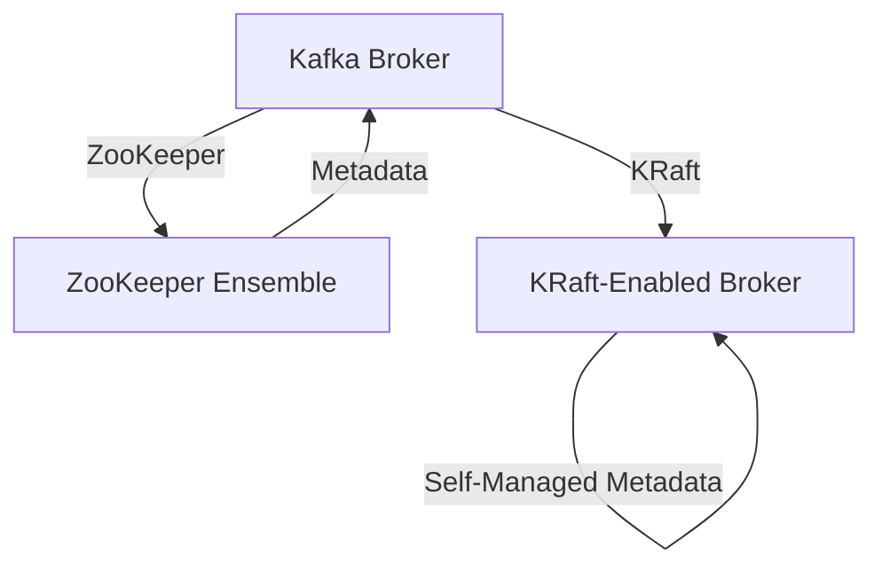

## 1.2.3 ZooKeeper's Role and the Transition to KRaft

### Introduction

Apache Kafka has long been a cornerstone of real-time data processing systems, renowned for its ability to handle high-throughput, fault-tolerant, and scalable data streams. A critical component of Kafka's architecture has been Apache ZooKeeper, which has historically played a vital role in managing cluster coordination. However, with the introduction of KRaft (Kafka Raft), Kafka is evolving to eliminate its dependency on ZooKeeper, offering a more streamlined and efficient approach to metadata management. This section delves into the historical significance of ZooKeeper in Kafka, the challenges it presented, and the transformative impact of transitioning to KRaft.

### The Role of ZooKeeper in Kafka's Architecture

#### Why ZooKeeper Was Essential

ZooKeeper has been an integral part of Kafka's architecture since its inception. It served several crucial functions:

- **Cluster Coordination**: ZooKeeper managed the coordination of Kafka brokers, ensuring that they worked together seamlessly as a unified cluster.
- **Leader Election**: It facilitated leader election for partitions, ensuring that there was always a designated broker responsible for handling writes and coordinating reads.
- **Configuration Management**: ZooKeeper stored and managed configuration data for brokers, topics, and partitions, providing a centralized repository for metadata.
- **State Management**: It maintained the state of the Kafka cluster, including the status of brokers and the health of the system.

These roles were essential for maintaining the consistency and reliability of Kafka clusters, particularly in distributed environments where coordination is complex.

#### Limitations and Challenges of Using ZooKeeper

While ZooKeeper provided essential services, it also introduced several challenges:

- **Operational Complexity**: Managing a separate ZooKeeper ensemble added operational overhead, requiring additional expertise and resources.
- **Scalability Constraints**: ZooKeeper's architecture was not designed to handle the same scale as Kafka, leading to potential bottlenecks in large deployments.
- **Latency Issues**: The need for coordination between ZooKeeper and Kafka brokers could introduce latency, affecting the overall performance of the system.
- **Single Point of Failure**: Although ZooKeeper is designed to be fault-tolerant, any issues with the ZooKeeper ensemble could impact the entire Kafka cluster.

These limitations prompted the Kafka community to explore alternatives that could simplify operations and enhance performance.

### Introducing KRaft: Kafka's New Metadata Quorum

#### What is KRaft?

KRaft, short for Kafka Raft, is a new architecture introduced to manage Kafka's metadata natively, without relying on ZooKeeper. It leverages the Raft consensus algorithm to provide a self-managed metadata quorum, allowing Kafka to handle its own cluster coordination.

#### Benefits of KRaft Over ZooKeeper

KRaft offers several advantages over the traditional ZooKeeper-based architecture:

- **Simplified Operations**: By eliminating the need for a separate ZooKeeper ensemble, KRaft reduces the complexity of managing Kafka clusters.
- **Improved Scalability**: KRaft is designed to scale with Kafka, handling metadata management more efficiently in large deployments.
- **Reduced Latency**: With KRaft, metadata operations are integrated directly into Kafka brokers, minimizing the latency associated with external coordination.
- **Enhanced Fault Tolerance**: KRaft's use of the Raft consensus algorithm ensures robust leader election and state management, improving the resilience of Kafka clusters.

These benefits make KRaft a compelling choice for organizations looking to optimize their Kafka deployments.

### How KRaft Simplifies Operations and Improves Performance

#### Streamlined Metadata Management

KRaft integrates metadata management directly into Kafka brokers, eliminating the need for external coordination. This integration simplifies the architecture and reduces the operational burden of maintaining a separate ZooKeeper ensemble.

#### Efficient Leader Election

KRaft uses the Raft consensus algorithm to manage leader election, providing a more efficient and reliable mechanism for ensuring that partitions have designated leaders. This approach reduces the risk of split-brain scenarios and improves the overall stability of the cluster.

#### Optimized Resource Utilization

By consolidating metadata management within Kafka, KRaft optimizes resource utilization, allowing organizations to allocate resources more effectively and reduce the total cost of ownership.

### Transitioning from ZooKeeper to KRaft

#### Planning the Transition

Transitioning from ZooKeeper to KRaft requires careful planning and execution. Organizations should consider the following steps:

1. **Evaluate Current Architecture**: Assess the existing Kafka deployment to understand the role of ZooKeeper and identify potential challenges in transitioning to KRaft.
2. **Upgrade Kafka Version**: Ensure that the Kafka version in use supports KRaft, as this feature is available in newer releases.
3. **Test in a Staging Environment**: Before transitioning production systems, test the KRaft architecture in a staging environment to identify any issues and validate performance improvements.
4. **Develop a Transition Plan**: Create a detailed plan for transitioning to KRaft, including timelines, resource allocation, and risk mitigation strategies.

#### Executing the Transition

Once the planning phase is complete, organizations can proceed with the transition:

1. **Deploy KRaft-Enabled Brokers**: Begin by deploying Kafka brokers configured to use KRaft for metadata management.
2. **Migrate Metadata**: Transfer metadata from ZooKeeper to the KRaft-enabled brokers, ensuring that all configuration data is accurately replicated.
3. **Monitor and Validate**: Continuously monitor the performance and stability of the KRaft-enabled cluster, validating that it meets operational requirements.
4. **Decommission ZooKeeper**: Once the KRaft architecture is fully operational, decommission the ZooKeeper ensemble, freeing up resources and simplifying the overall architecture.

### Code Examples

To illustrate the transition from ZooKeeper to KRaft, let's explore code examples in Java, Scala, Kotlin, and Clojure.

#### Java Example

```java
import org.apache.kafka.clients.admin.AdminClient;
import org.apache.kafka.clients.admin.NewTopic;
import org.apache.kafka.common.KafkaFuture;

import java.util.Collections;
import java.util.Properties;

public class KafkaKRaftExample {
    public static void main(String[] args) {
        Properties props = new Properties();
        props.put("bootstrap.servers", "localhost:9092");
        props.put("client.id", "kraft-example");

        try (AdminClient adminClient = AdminClient.create(props)) {
            NewTopic newTopic = new NewTopic("kraft-topic", 1, (short) 1);
            KafkaFuture<Void> future = adminClient.createTopics(Collections.singleton(newTopic)).all();
            future.get();
            System.out.println("Topic created successfully with KRaft.");
        } catch (Exception e) {
            e.printStackTrace();
        }
    }
}
```

#### Scala Example

```scala
import org.apache.kafka.clients.admin.{AdminClient, NewTopic}
import java.util.Properties
import scala.jdk.CollectionConverters._

object KafkaKRaftExample extends App {
  val props = new Properties()
  props.put("bootstrap.servers", "localhost:9092")
  props.put("client.id", "kraft-example")

  val adminClient = AdminClient.create(props)
  val newTopic = new NewTopic("kraft-topic", 1, 1.toShort)

  try {
    val result = adminClient.createTopics(List(newTopic).asJava).all()
    result.get()
    println("Topic created successfully with KRaft.")
  } catch {
    case e: Exception => e.printStackTrace()
  } finally {
    adminClient.close()
  }
}
```

#### Kotlin Example

```kotlin
import org.apache.kafka.clients.admin.AdminClient
import org.apache.kafka.clients.admin.NewTopic
import java.util.Properties

fun main() {
    val props = Properties().apply {
        put("bootstrap.servers", "localhost:9092")
        put("client.id", "kraft-example")
    }

    AdminClient.create(props).use { adminClient ->
        val newTopic = NewTopic("kraft-topic", 1, 1.toShort())
        val result = adminClient.createTopics(listOf(newTopic)).all()
        result.get()
        println("Topic created successfully with KRaft.")
    }
}
```

#### Clojure Example

```clojure
(ns kafka-kraft-example
  (:import [org.apache.kafka.clients.admin AdminClient NewTopic]
           [java.util Properties]))

(defn create-topic []
  (let [props (doto (Properties.)
                (.put "bootstrap.servers" "localhost:9092")
                (.put "client.id" "kraft-example"))
        admin-client (AdminClient/create props)
        new-topic (NewTopic. "kraft-topic" 1 (short 1))]
    (try
      (-> (.createTopics admin-client [new-topic])
          (.all)
          (.get))
      (println "Topic created successfully with KRaft.")
      (finally
        (.close admin-client)))))

(create-topic)
```

### Visualizing the Transition

To better understand the transition from ZooKeeper to KRaft, consider the following diagram illustrating the architectural changes:



**Caption**: This diagram illustrates the transition from a ZooKeeper-based architecture to a KRaft-enabled architecture, highlighting the shift to self-managed metadata within Kafka brokers.

### Conclusion

The transition from ZooKeeper to KRaft represents a significant evolution in Kafka's architecture, offering numerous benefits in terms of simplicity, scalability, and performance. By eliminating the need for a separate ZooKeeper ensemble, KRaft streamlines operations and enhances the resilience of Kafka clusters. As organizations embrace this new architecture, they can expect to achieve greater efficiency and reliability in their real-time data processing systems.

## Test Your Knowledge: Kafka's Transition from ZooKeeper to KRaft



### What was the primary role of ZooKeeper in Kafka's architecture?

- [x] Cluster coordination and leader election
- [ ] Data storage and retrieval
- [ ] Message serialization
- [ ] Network communication

> **Explanation:** ZooKeeper was primarily responsible for cluster coordination and leader election in Kafka's architecture.

### What is a key benefit of transitioning from ZooKeeper to KRaft?

- [x] Simplified operations and reduced latency
- [ ] Increased data storage capacity
- [ ] Enhanced message serialization
- [ ] Improved network communication

> **Explanation:** Transitioning to KRaft simplifies operations and reduces latency by integrating metadata management directly into Kafka brokers.

### Which consensus algorithm does KRaft use?

- [x] Raft
- [ ] Paxos
- [ ] Two-Phase Commit
- [ ] Byzantine Fault Tolerance

> **Explanation:** KRaft uses the Raft consensus algorithm for managing metadata and leader election.

### What challenge does ZooKeeper introduce in Kafka's architecture?

- [x] Operational complexity and scalability constraints
- [ ] Lack of fault tolerance
- [ ] Poor message serialization
- [ ] Inefficient network communication

> **Explanation:** ZooKeeper introduces operational complexity and scalability constraints in Kafka's architecture.

### How does KRaft improve resource utilization?

- [x] By consolidating metadata management within Kafka
- [ ] By increasing data storage capacity
- [ ] By enhancing message serialization
- [ ] By optimizing network communication

> **Explanation:** KRaft improves resource utilization by consolidating metadata management within Kafka brokers.

### What is the first step in transitioning from ZooKeeper to KRaft?

- [x] Evaluate the current architecture
- [ ] Decommission ZooKeeper
- [ ] Deploy KRaft-enabled brokers
- [ ] Migrate metadata

> **Explanation:** The first step in transitioning to KRaft is to evaluate the current architecture to understand the role of ZooKeeper.

### What is a potential drawback of using ZooKeeper in Kafka?

- [x] Single point of failure
- [ ] Lack of data storage
- [ ] Poor message serialization
- [ ] Inefficient network communication

> **Explanation:** A potential drawback of using ZooKeeper is that it can become a single point of failure in Kafka's architecture.

### How does KRaft enhance fault tolerance?

- [x] By using the Raft consensus algorithm
- [ ] By increasing data storage capacity
- [ ] By enhancing message serialization
- [ ] By optimizing network communication

> **Explanation:** KRaft enhances fault tolerance by using the Raft consensus algorithm for leader election and state management.

### What is the final step in transitioning to KRaft?

- [x] Decommission ZooKeeper
- [ ] Evaluate the current architecture
- [ ] Deploy KRaft-enabled brokers
- [ ] Migrate metadata

> **Explanation:** The final step in transitioning to KRaft is to decommission ZooKeeper once the KRaft architecture is fully operational.

### True or False: KRaft eliminates the need for ZooKeeper in Kafka's architecture.

- [x] True
- [ ] False

> **Explanation:** True. KRaft eliminates the need for ZooKeeper by providing a self-managed metadata quorum within Kafka brokers.


