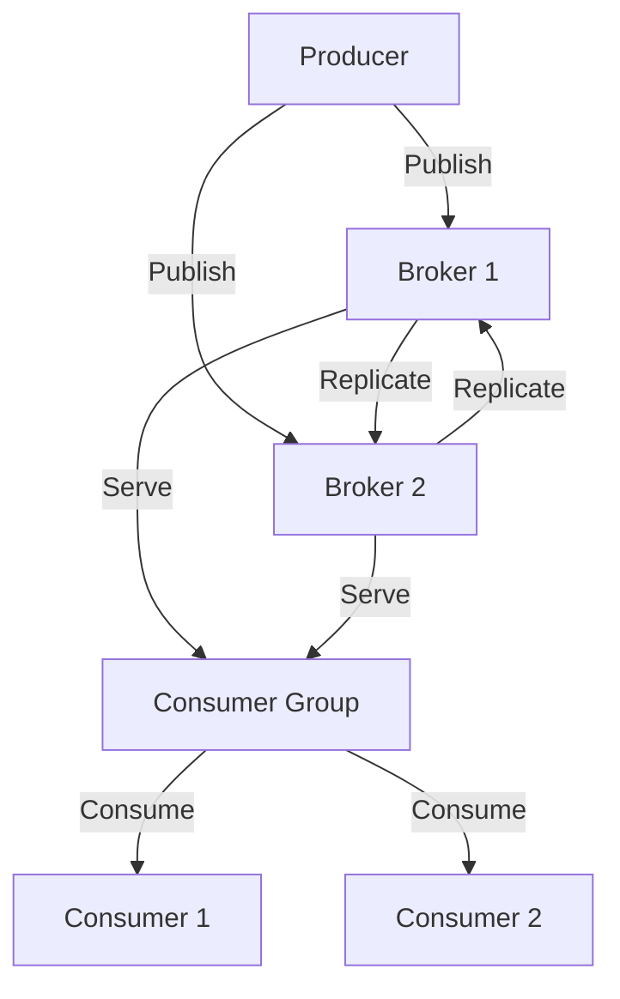
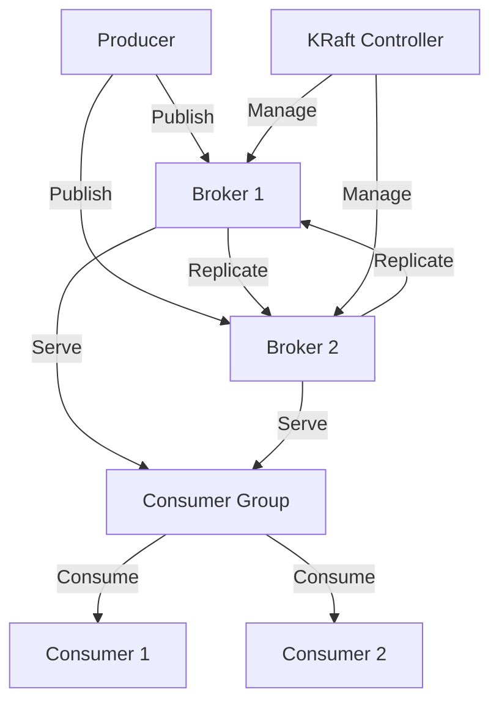

## 1.2 Understanding Apache Kafka

Apache Kafka is a powerful distributed event streaming platform capable of handling trillions of events a day. It is designed to provide a unified, high-throughput, low-latency platform for handling real-time data feeds. This section delves into the core concepts, distributed architecture, and the evolution of Kafka from using ZooKeeper to adopting the new KRaft architecture.

### Core Concepts and Terminology

To effectively work with Apache Kafka, it is crucial to understand its core components and terminology. These elements form the backbone of Kafka's architecture and functionality.

#### Topics

- **Definition**: A topic in Kafka is a category or feed name to which records are published. Topics are partitioned, meaning a topic is spread over multiple partitions, allowing for parallel processing.
- **Purpose**: Topics serve as the logical grouping of messages, enabling producers to send data to a specific topic and consumers to read from it.

#### Partitions

- **Definition**: Partitions are a way to parallelize a topic by splitting it into multiple segments. Each partition is an ordered, immutable sequence of records that is continually appended to.
- **Purpose**: Partitions allow Kafka to scale horizontally by distributing data across multiple servers, enabling high throughput and fault tolerance.

#### Brokers

- **Definition**: A broker is a Kafka server that stores data and serves client requests. Each broker is identified by a unique ID and can handle multiple partitions.
- **Purpose**: Brokers manage the storage of data and serve as the interface for producers and consumers to interact with Kafka.

#### Producers

- **Definition**: Producers are client applications that publish records to one or more Kafka topics.
- **Purpose**: Producers send data to Kafka topics, which are then consumed by consumers.

#### Consumers

- **Definition**: Consumers are client applications that subscribe to one or more topics and process the feed of published records.
- **Purpose**: Consumers read data from Kafka topics and process it according to application logic.

#### Consumer Groups

- **Definition**: A consumer group is a group of consumers that work together to consume data from a topic. Each consumer in a group processes data from a unique partition.
- **Purpose**: Consumer groups enable load balancing and fault tolerance by distributing the processing of data across multiple consumers.

#### Offsets

- **Definition**: An offset is a unique identifier for a record within a partition. It represents the position of a record in the partition.
- **Purpose**: Offsets allow consumers to track their position in a partition, enabling them to resume processing from a specific point in case of failure.

### Kafka's Distributed Architecture

Apache Kafka is designed as a distributed system, allowing it to handle large volumes of data with high throughput and fault tolerance. The architecture is built around the following key principles:

#### Horizontal Scalability

Kafka achieves horizontal scalability by distributing data across multiple brokers and partitions. This design allows Kafka to handle large volumes of data by adding more brokers to the cluster.

#### Fault Tolerance

Kafka ensures fault tolerance through data replication. Each partition can have multiple replicas, and Kafka automatically handles broker failures by electing a new leader for the partition.

#### High Throughput and Low Latency

Kafka is optimized for high throughput and low latency, making it suitable for real-time data processing. The architecture is designed to handle large volumes of data with minimal delay.

#### Data Durability

Kafka provides data durability by persisting data to disk. This ensures that data is not lost in case of a broker failure.

#### Diagram: Kafka's Distributed Architecture

**Caption**: The diagram illustrates Kafka's distributed architecture, showing how producers publish data to brokers, which replicate data for fault tolerance, and consumers read data from brokers.

### ZooKeeper's Role and the Transition to KRaft

ZooKeeper has traditionally played a critical role in Kafka's architecture, providing coordination services for managing brokers, topics, and partitions. However, Kafka is transitioning to a new architecture called KRaft, which eliminates the dependency on ZooKeeper.

#### ZooKeeper's Role

- **Coordination**: ZooKeeper is responsible for managing the metadata of Kafka clusters, including broker configurations, topic metadata, and partition assignments.
- **Leader Election**: ZooKeeper handles leader election for partitions, ensuring that each partition has a designated leader broker.
- **Configuration Management**: ZooKeeper stores configuration data for Kafka brokers and topics, enabling centralized management.

#### Transition to KRaft

KRaft (Kafka Raft) is a new architecture that aims to simplify Kafka's architecture by removing the dependency on ZooKeeper. This transition brings several benefits:

- **Reduced Complexity**: By eliminating ZooKeeper, Kafka's architecture becomes simpler and easier to manage.
- **Improved Performance**: KRaft reduces the latency associated with ZooKeeper coordination, leading to improved performance.
- **Enhanced Scalability**: KRaft allows Kafka to scale more efficiently by reducing the overhead of managing ZooKeeper nodes.

#### Diagram: KRaft Architecture

**Caption**: The diagram illustrates the KRaft architecture, showing how the KRaft controller manages brokers directly, eliminating the need for ZooKeeper.

### Practical Applications and Real-World Scenarios

Apache Kafka is widely used in various industries for real-time data processing and event streaming. Here are some practical applications and real-world scenarios:

- **Event-Driven Microservices**: Kafka is often used to decouple microservices, enabling them to communicate asynchronously through events. This approach enhances scalability and fault tolerance in microservices architectures.
- **Real-Time Data Pipelines**: Kafka serves as the backbone for real-time data pipelines, allowing organizations to process and analyze data as it arrives. This capability is crucial for applications such as fraud detection and real-time analytics.
- **Stream Processing Applications**: Kafka's integration with stream processing frameworks like Kafka Streams and Apache Flink enables the development of complex stream processing applications. These applications can perform real-time transformations and aggregations on data streams.
- **Big Data Integration**: Kafka is commonly used to integrate with big data platforms like Hadoop and Spark, enabling the ingestion and processing of large volumes of data. For more information, see [1.4.4 Big Data Integration]( "Big Data Integration").
- **Internet of Things (IoT) Applications**: Kafka is ideal for IoT applications that require the collection and processing of sensor data in real-time. Its ability to handle high-throughput data streams makes it suitable for IoT use cases.

### Knowledge Check

To reinforce your understanding of Apache Kafka, consider the following questions:

1. What is the purpose of partitions in Kafka, and how do they contribute to scalability?
2. How does Kafka ensure fault tolerance, and what role do replicas play in this process?
3. Explain the transition from ZooKeeper to KRaft and the benefits it brings to Kafka's architecture.
4. Describe a real-world scenario where Kafka would be an ideal solution for data processing.

### Summary

In this section, we explored the core concepts and distributed architecture of Apache Kafka, including its key components such as topics, partitions, brokers, producers, and consumers. We also discussed the role of ZooKeeper in Kafka's architecture and the transition to the new KRaft architecture. Understanding these foundational elements is crucial for leveraging Kafka's capabilities in real-world applications.

## Test Your Knowledge: Understanding Apache Kafka Quiz



### What is a topic in Kafka?

- [x] A category or feed name to which records are published.
- [ ] A unique identifier for a record within a partition.
- [ ] A client application that subscribes to one or more topics.
- [ ] A Kafka server that stores data and serves client requests.

> **Explanation:** A topic in Kafka is a category or feed name to which records are published. It serves as the logical grouping of messages.

### How does Kafka achieve horizontal scalability?

- [x] By distributing data across multiple brokers and partitions.
- [ ] By using a single broker to handle all data.
- [ ] By storing data in a centralized database.
- [ ] By replicating data to a single partition.

> **Explanation:** Kafka achieves horizontal scalability by distributing data across multiple brokers and partitions, allowing it to handle large volumes of data.

### What is the role of ZooKeeper in Kafka's architecture?

- [x] Managing metadata and coordinating brokers, topics, and partitions.
- [ ] Storing data and serving client requests.
- [ ] Publishing records to Kafka topics.
- [ ] Consuming data from Kafka topics.

> **Explanation:** ZooKeeper manages metadata and coordinates brokers, topics, and partitions in Kafka's architecture.

### What is the primary benefit of transitioning to KRaft?

- [x] Reduced complexity and improved performance.
- [ ] Increased dependency on ZooKeeper.
- [ ] Centralized data storage.
- [ ] Higher latency in data processing.

> **Explanation:** The transition to KRaft reduces complexity and improves performance by eliminating the dependency on ZooKeeper.

### In Kafka, what is an offset?

- [x] A unique identifier for a record within a partition.
- [ ] A client application that publishes records to topics.
- [ ] A Kafka server that stores data and serves client requests.
- [ ] A category or feed name to which records are published.

> **Explanation:** An offset is a unique identifier for a record within a partition, representing its position.

### What is the purpose of consumer groups in Kafka?

- [x] To enable load balancing and fault tolerance by distributing data processing.
- [ ] To publish records to Kafka topics.
- [ ] To manage metadata and coordinate brokers.
- [ ] To store data and serve client requests.

> **Explanation:** Consumer groups enable load balancing and fault tolerance by distributing data processing across multiple consumers.

### How does Kafka ensure data durability?

- [x] By persisting data to disk.
- [ ] By storing data in memory.
- [ ] By using a centralized database.
- [ ] By replicating data to a single partition.

> **Explanation:** Kafka ensures data durability by persisting data to disk, preventing data loss in case of broker failure.

### What is a broker in Kafka?

- [x] A Kafka server that stores data and serves client requests.
- [ ] A client application that publishes records to topics.
- [ ] A unique identifier for a record within a partition.
- [ ] A category or feed name to which records are published.

> **Explanation:** A broker is a Kafka server that stores data and serves client requests, handling multiple partitions.

### What is the purpose of partitions in Kafka?

- [x] To parallelize a topic by splitting it into multiple segments.
- [ ] To store data in a centralized database.
- [ ] To manage metadata and coordinate brokers.
- [ ] To publish records to Kafka topics.

> **Explanation:** Partitions parallelize a topic by splitting it into multiple segments, allowing for horizontal scalability.

### True or False: KRaft eliminates the need for ZooKeeper in Kafka's architecture.

- [x] True
- [ ] False

> **Explanation:** True. KRaft eliminates the need for ZooKeeper in Kafka's architecture, simplifying the system.


