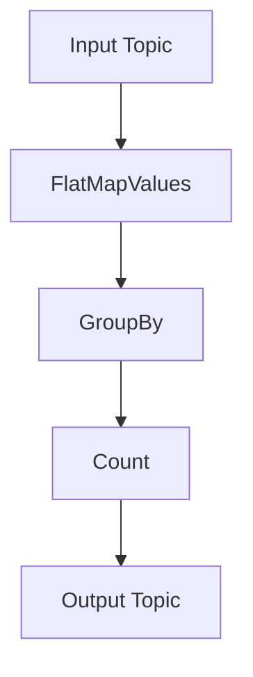

## 1.3.1 Kafka Streams API

The Kafka Streams API is a robust and versatile library that enables developers to build real-time, scalable, and fault-tolerant stream processing applications directly within Apache Kafka. Unlike traditional batch processing systems, Kafka Streams allows for continuous processing of data as it arrives, making it ideal for applications that require real-time insights and actions.

### Understanding Kafka Streams API

The Kafka Streams API is part of the broader Kafka ecosystem, designed to simplify the development of stream processing applications. It abstracts the complexities of distributed stream processing, allowing developers to focus on business logic rather than infrastructure concerns. By leveraging Kafka's distributed architecture, Kafka Streams provides a powerful framework for processing data streams with high throughput and low latency.

#### Key Features of Kafka Streams API

1. **Stateful Processing**: Kafka Streams supports stateful operations, enabling applications to maintain state across records. This is crucial for operations like aggregations, joins, and windowed computations.

2. **Windowing**: The API provides built-in support for windowing operations, allowing developers to define time-based windows for aggregating data. This is essential for scenarios like calculating rolling averages or detecting trends over time.

3. **Exactly-Once Processing**: Kafka Streams ensures exactly-once processing semantics, meaning each record is processed exactly once, even in the face of failures. This is achieved through Kafka's transactional capabilities.

4. **Interactive Queries**: Applications can expose their state stores for querying, enabling real-time access to the processed data. This feature is particularly useful for building dashboards and monitoring tools.

5. **Scalability and Fault Tolerance**: Built on Kafka's distributed architecture, Kafka Streams applications can scale horizontally by adding more instances. The API handles failover and recovery automatically, ensuring high availability.

6. **Integration with Kafka Ecosystem**: Kafka Streams seamlessly integrates with other components of the Kafka ecosystem, such as Kafka Connect and the Schema Registry, facilitating the development of end-to-end data pipelines.

7. **Language Support**: While primarily designed for Java, Kafka Streams also supports Scala and can be used with other JVM languages like Kotlin and Clojure.

### Simplifying Stream Processing

One of the primary advantages of Kafka Streams is its ability to simplify stream processing without the need for external processing frameworks. Traditional stream processing systems often require complex setups and additional infrastructure. In contrast, Kafka Streams is a lightweight library that runs within your application, leveraging Kafka's existing infrastructure.

#### How Kafka Streams Works

Kafka Streams processes data by consuming records from Kafka topics, applying transformations, and producing results back to Kafka topics. The API provides a high-level DSL (Domain-Specific Language) for defining stream processing logic, as well as a lower-level Processor API for more advanced use cases.

- **Streams DSL**: The Streams DSL is a functional programming style API that allows developers to define stream processing logic using operations like map, filter, groupBy, and aggregate. It is designed to be intuitive and easy to use, making it accessible to developers familiar with functional programming paradigms.

- **Processor API**: For more complex processing requirements, the Processor API provides fine-grained control over the processing logic. Developers can define custom processors and connect them to form a processing topology.

#### Example Applications

Kafka Streams is used in a wide range of applications, from real-time analytics and monitoring to fraud detection and recommendation systems. Here are a few examples:

1. **Real-Time Analytics**: Companies use Kafka Streams to process and analyze data in real-time, providing insights into customer behavior, system performance, and more.

2. **Fraud Detection**: Financial institutions leverage Kafka Streams to detect fraudulent activities by analyzing transaction patterns and identifying anomalies.

3. **Recommendation Systems**: E-commerce platforms use Kafka Streams to generate personalized recommendations based on user interactions and preferences.

4. **Monitoring and Alerting**: Kafka Streams can be used to monitor system metrics and trigger alerts when certain thresholds are exceeded.

### Code Examples

To illustrate the power and flexibility of Kafka Streams, let's explore code examples in Java, Scala, Kotlin, and Clojure.

#### Java Example

```java
import org.apache.kafka.streams.KafkaStreams;
import org.apache.kafka.streams.StreamsBuilder;
import org.apache.kafka.streams.StreamsConfig;
import org.apache.kafka.streams.kstream.KStream;
import org.apache.kafka.streams.kstream.KTable;
import org.apache.kafka.streams.kstream.Materialized;

import java.util.Properties;

public class WordCountExample {
    public static void main(String[] args) {
        Properties props = new Properties();
        props.put(StreamsConfig.APPLICATION_ID_CONFIG, "wordcount-app");
        props.put(StreamsConfig.BOOTSTRAP_SERVERS_CONFIG, "localhost:9092");

        StreamsBuilder builder = new StreamsBuilder();
        KStream<String, String> textLines = builder.stream("input-topic");
        KTable<String, Long> wordCounts = textLines
            .flatMapValues(textLine -> Arrays.asList(textLine.toLowerCase().split("\\W+")))
            .groupBy((key, word) -> word)
            .count(Materialized.as("counts-store"));

        wordCounts.toStream().to("output-topic");

        KafkaStreams streams = new KafkaStreams(builder.build(), props);
        streams.start();
    }
}
```

#### Scala Example

```scala
import org.apache.kafka.streams.{KafkaStreams, StreamsBuilder, StreamsConfig}
import org.apache.kafka.streams.kstream.{KStream, KTable, Materialized}

import java.util.Properties

object WordCountExample extends App {
  val props = new Properties()
  props.put(StreamsConfig.APPLICATION_ID_CONFIG, "wordcount-app")
  props.put(StreamsConfig.BOOTSTRAP_SERVERS_CONFIG, "localhost:9092")

  val builder = new StreamsBuilder()
  val textLines: KStream[String, String] = builder.stream("input-topic")
  val wordCounts: KTable[String, Long] = textLines
    .flatMapValues(_.toLowerCase.split("\\W+"))
    .groupBy((_, word) => word)
    .count(Materialized.as("counts-store"))

  wordCounts.toStream.to("output-topic")

  val streams = new KafkaStreams(builder.build(), props)
  streams.start()
}
```

#### Kotlin Example

```kotlin
import org.apache.kafka.streams.KafkaStreams
import org.apache.kafka.streams.StreamsBuilder
import org.apache.kafka.streams.StreamsConfig
import org.apache.kafka.streams.kstream.KStream
import org.apache.kafka.streams.kstream.KTable
import org.apache.kafka.streams.kstream.Materialized

fun main() {
    val props = Properties().apply {
        put(StreamsConfig.APPLICATION_ID_CONFIG, "wordcount-app")
        put(StreamsConfig.BOOTSTRAP_SERVERS_CONFIG, "localhost:9092")
    }

    val builder = StreamsBuilder()
    val textLines: KStream<String, String> = builder.stream("input-topic")
    val wordCounts: KTable<String, Long> = textLines
        .flatMapValues { it.toLowerCase().split("\\W+".toRegex()) }
        .groupBy { _, word -> word }
        .count(Materialized.as("counts-store"))

    wordCounts.toStream().to("output-topic")

    val streams = KafkaStreams(builder.build(), props)
    streams.start()
}
```

#### Clojure Example

```clojure
(ns wordcount-example
  (:import [org.apache.kafka.streams KafkaStreams StreamsBuilder StreamsConfig]
           [org.apache.kafka.streams.kstream KStream KTable Materialized]))

(defn -main [& args]
  (let [props (doto (java.util.Properties.)
                (.put StreamsConfig/APPLICATION_ID_CONFIG "wordcount-app")
                (.put StreamsConfig/BOOTSTRAP_SERVERS_CONFIG "localhost:9092"))
        builder (StreamsBuilder.)
        text-lines (.stream builder "input-topic")
        word-counts (-> text-lines
                        (.flatMapValues (fn [text-line] (clojure.string/split (clojure.string/lower-case text-line) #"\W+")))
                        (.groupBy (fn [_ word] word))
                        (.count (Materialized/as "counts-store")))]
    (.toStream word-counts)
    (.to word-counts "output-topic")
    (let [streams (KafkaStreams. (.build builder) props)]
      (.start streams))))
```

### Visualizing Kafka Streams Topology

To better understand how Kafka Streams processes data, consider the following topology diagram:



**Caption**: This diagram illustrates a simple Kafka Streams topology for a word count application. Data flows from the input topic through a series of transformations, resulting in aggregated word counts being written to the output topic.

### Practical Applications and Real-World Scenarios

Kafka Streams is widely used across various industries for its ability to process data in real-time. Here are some practical applications:

- **E-commerce**: Real-time inventory management and dynamic pricing based on demand and supply.
- **Telecommunications**: Monitoring network performance and detecting anomalies in real-time.
- **Healthcare**: Analyzing patient data streams for early detection of health issues.
- **Finance**: Real-time risk assessment and fraud detection in financial transactions.

### Best Practices for Using Kafka Streams

1. **Design for Scalability**: Ensure your Kafka Streams application can scale horizontally by distributing processing across multiple instances.

2. **Optimize State Stores**: Use RocksDB for stateful operations to improve performance and reduce memory usage.

3. **Monitor and Tune Performance**: Regularly monitor your Kafka Streams application and adjust configurations to optimize performance.

4. **Leverage Exactly-Once Semantics**: Use Kafka's transactional capabilities to ensure exactly-once processing, especially for critical applications.

5. **Integrate with Schema Registry**: Use the [1.3.3 Schema Registry]( "Schema Registry") to manage and enforce data schemas, ensuring data consistency across your pipeline.

### References and Further Reading

- Official Kafka Streams Documentation: [Apache Kafka Streams](https://kafka.apache.org/documentation/streams)
- Confluent Platform Enhancements: [Confluent Documentation](https://docs.confluent.io/current/streams/index.html)

### Knowledge Check

To reinforce your understanding of Kafka Streams, consider the following questions:

1. What are the key features of Kafka Streams that differentiate it from other stream processing frameworks?
2. How does Kafka Streams ensure exactly-once processing semantics?
3. Describe a real-world scenario where Kafka Streams could be effectively used.
4. What are the advantages of using the Streams DSL over the Processor API?
5. How can Kafka Streams applications be scaled to handle increased data volumes?

### Conclusion

The Kafka Streams API is a powerful tool for building real-time stream processing applications. Its integration with the Kafka ecosystem, support for stateful processing, and exactly-once semantics make it an ideal choice for developers looking to harness the power of real-time data. By following best practices and leveraging its features, you can build scalable, fault-tolerant applications that deliver real-time insights and actions.

## Test Your Knowledge: Advanced Kafka Streams API Quiz



### What is a key feature of Kafka Streams that supports stateful operations?

- [x] State Stores
- [ ] Batch Processing
- [ ] External Databases
- [ ] File Systems

> **Explanation:** Kafka Streams uses state stores to maintain state across records, enabling stateful operations like aggregations and joins.

### How does Kafka Streams ensure exactly-once processing semantics?

- [x] By using Kafka's transactional capabilities
- [ ] By duplicating messages
- [ ] By using external databases
- [ ] By ignoring duplicate messages

> **Explanation:** Kafka Streams leverages Kafka's transactional capabilities to ensure exactly-once processing semantics.

### Which API in Kafka Streams provides fine-grained control over processing logic?

- [x] Processor API
- [ ] Streams DSL
- [ ] Kafka Connect
- [ ] Schema Registry

> **Explanation:** The Processor API provides fine-grained control over the processing logic, allowing developers to define custom processors.

### What is the primary advantage of using the Streams DSL in Kafka Streams?

- [x] It provides a functional programming style API for defining stream processing logic.
- [ ] It requires less memory.
- [ ] It is faster than the Processor API.
- [ ] It uses external databases for state management.

> **Explanation:** The Streams DSL offers a functional programming style API, making it intuitive and easy to use for defining stream processing logic.

### In which scenarios is Kafka Streams particularly useful?

- [x] Real-time analytics
- [x] Fraud detection
- [ ] Batch processing
- [ ] File storage

> **Explanation:** Kafka Streams is particularly useful for real-time analytics and fraud detection due to its ability to process data in real-time.

### What is the role of windowing in Kafka Streams?

- [x] To define time-based windows for aggregating data
- [ ] To store data in external databases
- [ ] To batch process data
- [ ] To manage state stores

> **Explanation:** Windowing in Kafka Streams allows developers to define time-based windows for aggregating data, which is essential for operations like calculating rolling averages.

### How can Kafka Streams applications be scaled?

- [x] By adding more instances
- [ ] By increasing memory
- [x] By distributing processing across multiple instances
- [ ] By using external databases

> **Explanation:** Kafka Streams applications can be scaled by adding more instances and distributing processing across multiple instances.

### What is the benefit of using RocksDB in Kafka Streams?

- [x] It improves performance and reduces memory usage for stateful operations.
- [ ] It increases latency.
- [ ] It requires less disk space.
- [ ] It simplifies code.

> **Explanation:** RocksDB is used in Kafka Streams to improve performance and reduce memory usage for stateful operations.

### Which component of Kafka Streams allows for querying the state of the application?

- [x] Interactive Queries
- [ ] Streams DSL
- [ ] Processor API
- [ ] Kafka Connect

> **Explanation:** Interactive Queries allow applications to expose their state stores for querying, enabling real-time access to the processed data.

### True or False: Kafka Streams requires external processing frameworks to function.

- [x] False
- [ ] True

> **Explanation:** Kafka Streams is a lightweight library that runs within your application, leveraging Kafka's existing infrastructure without the need for external processing frameworks.


