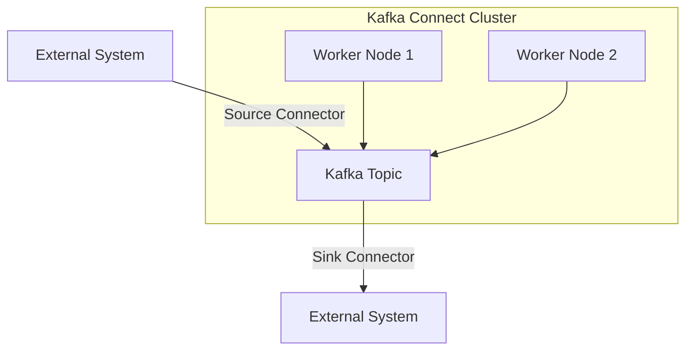

## 1.3.2 Kafka Connect

### Introduction

Kafka Connect is a powerful and flexible framework within the Apache Kafka ecosystem designed to facilitate seamless integration between Kafka and a wide array of external systems. It enables the efficient import and export of data at scale, making it an essential tool for building robust data pipelines. This section delves into the core concepts of Kafka Connect, its architecture, and practical applications, providing expert insights into its role in modern data integration strategies.

### Understanding Kafka Connect

Kafka Connect serves as a scalable and reliable data integration framework that simplifies the process of connecting Kafka with various data sources and sinks. It abstracts the complexities involved in data movement, allowing developers to focus on the business logic rather than the intricacies of data transfer.

#### Core Concepts

- **Connectors**: At the heart of Kafka Connect are connectors, which are pluggable components that enable data integration. Connectors are categorized into two types:
  - **Source Connectors**: These connectors are responsible for pulling data from external systems into Kafka topics. They enable real-time data ingestion from databases, message queues, and other data stores.
  - **Sink Connectors**: These connectors push data from Kafka topics to external systems, facilitating data export to databases, file systems, and other data sinks.

- **Tasks**: Connectors can be parallelized into multiple tasks, allowing for scalable data processing. Each task is a unit of work that handles a portion of the data transfer, enabling efficient resource utilization.

- **Workers**: Kafka Connect operates in a distributed environment with workers that execute the tasks. Workers can be deployed in standalone or distributed mode, providing flexibility in deployment strategies.

- **Configurations**: Kafka Connect configurations define the behavior of connectors, including connection details, data formats, and transformation logic. These configurations are typically specified in JSON format.

### Architecture of Kafka Connect

Kafka Connect's architecture is designed to provide scalability, fault tolerance, and ease of use. It consists of the following key components:

- **Connect Cluster**: A Connect cluster is a group of worker nodes that collaborate to execute connector tasks. The cluster can be scaled horizontally to handle increased data loads.

- **REST API**: Kafka Connect exposes a REST API for managing connectors, tasks, and configurations. This API allows for dynamic configuration changes and monitoring of connector status.

- **Offset Management**: Kafka Connect manages offsets for source connectors, ensuring data consistency and reliability. Offsets track the progress of data ingestion, allowing for seamless recovery in case of failures.

- **Data Transformation**: Kafka Connect supports Single Message Transforms (SMTs), which allow for in-flight data transformations. SMTs can be used to modify, filter, or enrich data as it flows through the pipeline.

### Source and Sink Connectors

Kafka Connect's versatility is largely attributed to its extensive library of source and sink connectors. These connectors enable integration with a wide range of systems, making Kafka Connect a critical component in enterprise data architectures.

#### Source Connectors

Source connectors are designed to ingest data from external systems into Kafka topics. Commonly used source connectors include:

- **JDBC Source Connector**: Facilitates data ingestion from relational databases using JDBC. It supports incremental data loading and change data capture (CDC) for real-time updates.

- **File Source Connector**: Reads data from files and streams it into Kafka topics. It is useful for batch processing and log file ingestion.

- **HTTP Source Connector**: Pulls data from HTTP endpoints, enabling integration with RESTful APIs and web services.

- **Debezium Connector**: A popular choice for CDC, Debezium captures changes from databases like MySQL, PostgreSQL, and MongoDB, and streams them into Kafka.

#### Sink Connectors

Sink connectors export data from Kafka topics to external systems. Commonly used sink connectors include:

- **JDBC Sink Connector**: Writes data from Kafka topics to relational databases. It supports batch processing and upsert operations.

- **Elasticsearch Sink Connector**: Streams data into Elasticsearch for search and analytics use cases.

- **HDFS Sink Connector**: Exports data to Hadoop Distributed File System (HDFS), enabling integration with big data processing frameworks.

- **S3 Sink Connector**: Writes data to Amazon S3, facilitating data archiving and integration with cloud-based analytics platforms.

### Simplifying Data Pipeline Development

Kafka Connect significantly simplifies the development of data pipelines by providing a standardized framework for data integration. Its declarative configuration model and extensive connector ecosystem reduce the need for custom coding, accelerating the deployment of data pipelines.

#### Key Benefits

- **Scalability**: Kafka Connect's distributed architecture allows for horizontal scaling, enabling it to handle large volumes of data with ease.

- **Fault Tolerance**: Built-in offset management and task recovery mechanisms ensure data consistency and reliability, even in the face of failures.

- **Flexibility**: The ability to dynamically configure connectors and tasks via the REST API provides flexibility in managing data pipelines.

- **Extensibility**: The open-source nature of Kafka Connect allows for the development of custom connectors and transformations, catering to specific integration needs.

### Practical Applications and Real-World Scenarios

Kafka Connect is widely used in various industries for building real-time data pipelines. Some practical applications include:

- **Event-Driven Architectures**: Kafka Connect enables seamless integration of event-driven microservices by facilitating data exchange between services and Kafka.

- **Real-Time Analytics**: By streaming data from operational databases to analytics platforms, Kafka Connect supports real-time analytics and business intelligence.

- **Data Lake Ingestion**: Kafka Connect simplifies the ingestion of data into data lakes, supporting big data processing and machine learning workflows.

- **IoT Data Processing**: With connectors for MQTT and other IoT protocols, Kafka Connect is used to ingest and process sensor data in IoT applications.

### Code Examples

To illustrate the use of Kafka Connect, let's explore code examples in Java, Scala, Kotlin, and Clojure for setting up a simple data pipeline using Kafka Connect.

#### Java Example

```java
import org.apache.kafka.connect.runtime.ConnectorConfig;
import org.apache.kafka.connect.runtime.WorkerConfig;
import java.util.Properties;

public class KafkaConnectExample {
    public static void main(String[] args) {
        Properties props = new Properties();
        props.put(WorkerConfig.BOOTSTRAP_SERVERS_CONFIG, "localhost:9092");
        props.put(ConnectorConfig.NAME_CONFIG, "my-connector");
        props.put(ConnectorConfig.CONNECTOR_CLASS_CONFIG, "org.apache.kafka.connect.file.FileStreamSourceConnector");
        props.put("file", "/path/to/input/file");
        props.put("topic", "my-topic");

        // Initialize and start the connector
        // Note: In a real-world scenario, use the Kafka Connect REST API to manage connectors
    }
}
```

#### Scala Example

```scala
import org.apache.kafka.connect.runtime.ConnectorConfig
import org.apache.kafka.connect.runtime.WorkerConfig
import java.util.Properties

object KafkaConnectExample extends App {
  val props = new Properties()
  props.put(WorkerConfig.BOOTSTRAP_SERVERS_CONFIG, "localhost:9092")
  props.put(ConnectorConfig.NAME_CONFIG, "my-connector")
  props.put(ConnectorConfig.CONNECTOR_CLASS_CONFIG, "org.apache.kafka.connect.file.FileStreamSourceConnector")
  props.put("file", "/path/to/input/file")
  props.put("topic", "my-topic")

  // Initialize and start the connector
  // Note: In a real-world scenario, use the Kafka Connect REST API to manage connectors
}
```

#### Kotlin Example

```kotlin
import org.apache.kafka.connect.runtime.ConnectorConfig
import org.apache.kafka.connect.runtime.WorkerConfig
import java.util.Properties

fun main() {
    val props = Properties().apply {
        put(WorkerConfig.BOOTSTRAP_SERVERS_CONFIG, "localhost:9092")
        put(ConnectorConfig.NAME_CONFIG, "my-connector")
        put(ConnectorConfig.CONNECTOR_CLASS_CONFIG, "org.apache.kafka.connect.file.FileStreamSourceConnector")
        put("file", "/path/to/input/file")
        put("topic", "my-topic")
    }

    // Initialize and start the connector
    // Note: In a real-world scenario, use the Kafka Connect REST API to manage connectors
}
```

#### Clojure Example

```clojure
(ns kafka-connect-example
  (:import [org.apache.kafka.connect.runtime ConnectorConfig WorkerConfig]
           [java.util Properties]))

(defn -main []
  (let [props (doto (Properties.)
                (.put WorkerConfig/BOOTSTRAP_SERVERS_CONFIG "localhost:9092")
                (.put ConnectorConfig/NAME_CONFIG "my-connector")
                (.put ConnectorConfig/CONNECTOR_CLASS_CONFIG "org.apache.kafka.connect.file.FileStreamSourceConnector")
                (.put "file" "/path/to/input/file")
                (.put "topic" "my-topic"))]

    ;; Initialize and start the connector
    ;; Note: In a real-world scenario, use the Kafka Connect REST API to manage connectors
    ))
```

### Visualizing Kafka Connect Architecture

To better understand Kafka Connect's architecture, consider the following diagram illustrating the flow of data through a Kafka Connect pipeline:



**Caption**: The diagram depicts a Kafka Connect pipeline with source and sink connectors facilitating data flow between external systems and Kafka topics. Worker nodes within the Kafka Connect cluster execute connector tasks.

### Best Practices for Using Kafka Connect

- **Connector Configuration**: Carefully configure connectors to optimize performance and resource utilization. Pay attention to batch sizes, polling intervals, and error handling settings.

- **Monitoring and Management**: Use the Kafka Connect REST API to monitor connector status and manage configurations. Implement alerting and logging to detect and resolve issues promptly.

- **Data Transformation**: Leverage Single Message Transforms (SMTs) to perform lightweight data transformations. For complex transformations, consider using Kafka Streams or external processing frameworks.

- **Security**: Secure Kafka Connect deployments by enabling SSL/TLS encryption and authentication. Use access control mechanisms to restrict connector configurations and data access.

- **Scalability**: Scale Kafka Connect clusters by adding worker nodes to handle increased data loads. Distribute tasks evenly across workers to maximize throughput.

### References and Further Reading

- Official Kafka Connect Documentation: [Apache Kafka Connect](https://kafka.apache.org/documentation/#connect)
- Confluent Platform Documentation: [Confluent Kafka Connect](https://docs.confluent.io/platform/current/connect/index.html)

### Knowledge Check

To reinforce your understanding of Kafka Connect, consider the following questions:

## Test Your Knowledge: Kafka Connect and Data Integration Quiz



### What is the primary role of Kafka Connect in the Kafka ecosystem?

- [x] To facilitate seamless integration between Kafka and external systems.
- [ ] To manage Kafka brokers and topics.
- [ ] To provide a user interface for Kafka administration.
- [ ] To handle Kafka consumer group rebalancing.

> **Explanation:** Kafka Connect is designed to integrate Kafka with external systems, enabling efficient data import and export.

### Which type of connector is responsible for pulling data from external systems into Kafka topics?

- [x] Source Connector
- [ ] Sink Connector
- [ ] Transformation Connector
- [ ] Offset Connector

> **Explanation:** Source connectors are responsible for ingesting data from external systems into Kafka topics.

### What is the purpose of Single Message Transforms (SMTs) in Kafka Connect?

- [x] To perform lightweight data transformations in-flight.
- [ ] To manage connector configurations.
- [ ] To handle offset management.
- [ ] To monitor connector status.

> **Explanation:** SMTs allow for in-flight data transformations, modifying, filtering, or enriching data as it flows through the pipeline.

### How does Kafka Connect ensure data consistency and reliability?

- [x] By managing offsets for source connectors.
- [ ] By using a graphical user interface.
- [ ] By providing a command-line tool.
- [ ] By integrating with external databases.

> **Explanation:** Kafka Connect manages offsets to track data ingestion progress, ensuring data consistency and reliability.

### Which of the following is a commonly used sink connector?

- [x] Elasticsearch Sink Connector
- [ ] JDBC Source Connector
- [ ] File Source Connector
- [ ] HTTP Source Connector

> **Explanation:** The Elasticsearch Sink Connector is commonly used to stream data into Elasticsearch for search and analytics.

### What is the benefit of using Kafka Connect's distributed mode?

- [x] It allows for horizontal scaling and fault tolerance.
- [ ] It provides a user-friendly interface.
- [ ] It simplifies connector configuration.
- [ ] It reduces network latency.

> **Explanation:** Distributed mode enables horizontal scaling and fault tolerance by distributing tasks across multiple worker nodes.

### Which API does Kafka Connect expose for managing connectors and configurations?

- [x] REST API
- [ ] GraphQL API
- [ ] SOAP API
- [ ] WebSocket API

> **Explanation:** Kafka Connect exposes a REST API for managing connectors, tasks, and configurations.

### What is a key advantage of using Kafka Connect for data pipeline development?

- [x] It reduces the need for custom coding by providing a standardized framework.
- [ ] It requires extensive manual configuration.
- [ ] It only supports batch processing.
- [ ] It is limited to on-premises deployments.

> **Explanation:** Kafka Connect provides a standardized framework that reduces the need for custom coding, accelerating data pipeline development.

### Which component of Kafka Connect executes connector tasks?

- [x] Worker Nodes
- [ ] Broker Nodes
- [ ] Consumer Groups
- [ ] Producer Clients

> **Explanation:** Worker nodes in a Kafka Connect cluster execute connector tasks, handling data transfer between Kafka and external systems.

### True or False: Kafka Connect can only be used for real-time data processing.

- [ ] True
- [x] False

> **Explanation:** Kafka Connect supports both real-time and batch data processing, making it versatile for various data integration scenarios.



By mastering Kafka Connect, you can unlock the full potential of Apache Kafka for seamless data integration, enabling the development of scalable, fault-tolerant data pipelines that drive real-time analytics and business intelligence.
