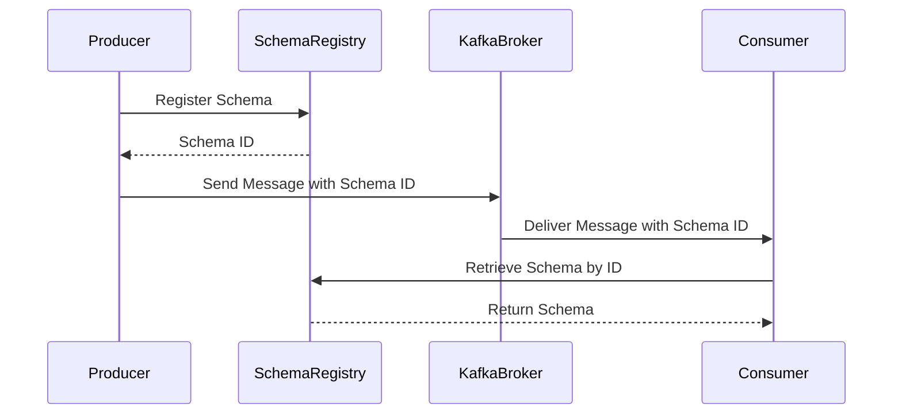

## 1.3.3 Schema Registry

In the realm of distributed data systems, managing data schemas is crucial for ensuring data integrity and compatibility across various components. The Schema Registry plays a pivotal role in Apache Kafka ecosystems by providing a centralized service for managing and enforcing data schemas. This section delves into the importance of schema management, the workings of the Schema Registry with serialization formats like Avro, Protobuf, and JSON, and the intricacies of schema versioning and compatibility settings.

### Importance of Schema Management in Kafka

Schema management is essential in Kafka for several reasons:

- **Data Consistency**: Ensures that data producers and consumers agree on the data structure, preventing runtime errors and data corruption.
- **Schema Evolution**: Facilitates changes to data structures over time without breaking existing applications.
- **Data Governance**: Provides a framework for managing data schemas, enabling compliance with data governance policies.
- **Interoperability**: Allows different systems and applications to communicate effectively by adhering to a common schema.

### How Schema Registry Works

The Schema Registry is a standalone service that provides a RESTful interface for storing and retrieving schemas. It integrates seamlessly with Kafka producers and consumers to enforce schema validation and compatibility.

#### Serialization Formats

The Schema Registry supports multiple serialization formats, each with its own advantages:

- **Avro**: A compact binary format that supports rich data structures and schema evolution. Avro is widely used in Kafka due to its efficiency and compatibility features.
- **Protobuf**: Developed by Google, Protobuf is a language-neutral, platform-neutral extensible mechanism for serializing structured data. It is known for its performance and flexibility.
- **JSON**: A text-based format that is human-readable and easy to debug. JSON is less efficient than binary formats but is often used for its simplicity and ease of integration.

#### Schema Registration and Retrieval

Schemas are registered with the Schema Registry using a unique subject name, typically derived from the topic name. Each schema is assigned a unique ID, which is used by Kafka clients to retrieve the schema from the registry.



*Diagram 1: Interaction between Producer, Schema Registry, and Consumer.*

### Schema Versioning and Compatibility

Schema versioning is a critical feature of the Schema Registry, allowing schemas to evolve over time without breaking existing applications. The Schema Registry supports several compatibility settings:

- **Backward Compatibility**: New schema versions can read data written by previous versions.
- **Forward Compatibility**: Previous schema versions can read data written by new versions.
- **Full Compatibility**: Combines backward and forward compatibility, ensuring that both new and old versions can read each other's data.

#### Schema Evolution Scenarios

Schema evolution allows changes to data structures while maintaining compatibility. Common scenarios include:

- **Adding Fields**: New fields can be added with default values to maintain backward compatibility.
- **Removing Fields**: Fields can be removed if they are not required by older versions.
- **Changing Field Types**: Field types can be changed if they are compatible with previous types.

### Practical Applications and Real-World Scenarios

Schema Registry is widely used in real-world applications to manage data schemas across distributed systems. Here are some scenarios where it proves invaluable:

- **Microservices Communication**: Ensures consistent data exchange between microservices by enforcing a common schema.
- **Data Lakes and Warehouses**: Facilitates schema management in data lakes, ensuring data consistency across ingestion and processing layers.
- **IoT Data Processing**: Manages schemas for diverse IoT data sources, enabling seamless integration and processing.

### Code Examples

Let's explore how to use the Schema Registry with different serialization formats in various programming languages.

#### Java Example with Avro

```java
import io.confluent.kafka.serializers.AbstractKafkaAvroSerDeConfig;
import io.confluent.kafka.serializers.KafkaAvroSerializer;
import org.apache.kafka.clients.producer.KafkaProducer;
import org.apache.kafka.clients.producer.ProducerConfig;
import org.apache.kafka.clients.producer.ProducerRecord;

import java.util.Properties;

public class AvroProducer {
    public static void main(String[] args) {
        Properties props = new Properties();
        props.put(ProducerConfig.BOOTSTRAP_SERVERS_CONFIG, "localhost:9092");
        props.put(ProducerConfig.KEY_SERIALIZER_CLASS_CONFIG, "org.apache.kafka.common.serialization.StringSerializer");
        props.put(ProducerConfig.VALUE_SERIALIZER_CLASS_CONFIG, KafkaAvroSerializer.class.getName());
        props.put(AbstractKafkaAvroSerDeConfig.SCHEMA_REGISTRY_URL_CONFIG, "http://localhost:8081");

        KafkaProducer<String, User> producer = new KafkaProducer<>(props);
        User user = new User("John Doe", 30);
        ProducerRecord<String, User> record = new ProducerRecord<>("users", user.getName(), user);
        producer.send(record);
        producer.close();
    }
}
```

*Java code example using Avro serialization with Schema Registry.*

#### Scala Example with Protobuf

```scala
import io.confluent.kafka.serializers.protobuf.KafkaProtobufSerializer
import org.apache.kafka.clients.producer.{KafkaProducer, ProducerConfig, ProducerRecord}

import java.util.Properties

object ProtobufProducer extends App {
  val props = new Properties()
  props.put(ProducerConfig.BOOTSTRAP_SERVERS_CONFIG, "localhost:9092")
  props.put(ProducerConfig.KEY_SERIALIZER_CLASS_CONFIG, "org.apache.kafka.common.serialization.StringSerializer")
  props.put(ProducerConfig.VALUE_SERIALIZER_CLASS_CONFIG, classOf[KafkaProtobufSerializer[User]].getName)
  props.put("schema.registry.url", "http://localhost:8081")

  val producer = new KafkaProducer[String, User](props)
  val user = User.newBuilder().setName("Jane Doe").setAge(25).build()
  val record = new ProducerRecord[String, User]("users", user.getName, user)
  producer.send(record)
  producer.close()
}
```

*Scala code example using Protobuf serialization with Schema Registry.*

#### Kotlin Example with JSON

```kotlin
import io.confluent.kafka.serializers.KafkaJsonSerializer
import org.apache.kafka.clients.producer.KafkaProducer
import org.apache.kafka.clients.producer.ProducerConfig
import org.apache.kafka.clients.producer.ProducerRecord

fun main() {
    val props = Properties().apply {
        put(ProducerConfig.BOOTSTRAP_SERVERS_CONFIG, "localhost:9092")
        put(ProducerConfig.KEY_SERIALIZER_CLASS_CONFIG, "org.apache.kafka.common.serialization.StringSerializer")
        put(ProducerConfig.VALUE_SERIALIZER_CLASS_CONFIG, KafkaJsonSerializer::class.java.name)
        put("schema.registry.url", "http://localhost:8081")
    }

    val producer = KafkaProducer<String, User>(props)
    val user = User("Alice", 28)
    val record = ProducerRecord("users", user.name, user)
    producer.send(record)
    producer.close()
}
```

*Kotlin code example using JSON serialization with Schema Registry.*

#### Clojure Example with Avro

```clojure
(ns avro-producer
  (:import [org.apache.kafka.clients.producer KafkaProducer ProducerConfig ProducerRecord]
           [io.confluent.kafka.serializers KafkaAvroSerializer]
           [java.util Properties]))

(defn create-producer []
  (let [props (doto (Properties.)
                (.put ProducerConfig/BOOTSTRAP_SERVERS_CONFIG "localhost:9092")
                (.put ProducerConfig/KEY_SERIALIZER_CLASS_CONFIG "org.apache.kafka.common.serialization.StringSerializer")
                (.put ProducerConfig/VALUE_SERIALIZER_CLASS_CONFIG KafkaAvroSerializer)
                (.put "schema.registry.url" "http://localhost:8081"))]
    (KafkaProducer. props)))

(defn send-user [producer user]
  (let [record (ProducerRecord. "users" (:name user) user)]
    (.send producer record)))

(defn -main []
  (let [producer (create-producer)
        user {:name "Bob" :age 35}]
    (send-user producer user)
    (.close producer)))
```

*Clojure code example using Avro serialization with Schema Registry.*

### Best Practices for Using Schema Registry

- **Version Control**: Maintain a version history of schemas to track changes and ensure compatibility.
- **Schema Governance**: Implement policies for schema approval and deployment to prevent breaking changes.
- **Testing**: Thoroughly test schema changes in a staging environment before deploying to production.
- **Monitoring**: Use monitoring tools to track schema usage and detect potential compatibility issues.

### Conclusion

The Schema Registry is an indispensable tool for managing data schemas in Apache Kafka ecosystems. By providing a centralized service for schema management, it ensures data compatibility, facilitates schema evolution, and supports data governance. Understanding and leveraging the Schema Registry is crucial for building robust, scalable, and maintainable data systems.

For more information, refer to the [Confluent Schema Registry](https://docs.confluent.io/platform/current/schema-registry/index.html).

## Test Your Knowledge: Mastering Schema Registry in Apache Kafka



### What is the primary role of the Schema Registry in Kafka?

- [x] To manage and enforce data schemas
- [ ] To store Kafka topics
- [ ] To monitor Kafka brokers
- [ ] To manage consumer offsets

> **Explanation:** The Schema Registry manages and enforces data schemas to ensure data compatibility and integrity.

### Which serialization format is known for its compact binary structure and schema evolution support?

- [x] Avro
- [ ] JSON
- [ ] XML
- [ ] CSV

> **Explanation:** Avro is a compact binary format that supports rich data structures and schema evolution.

### What does backward compatibility ensure in schema versioning?

- [x] New schema versions can read data written by previous versions.
- [ ] Previous schema versions can read data written by new versions.
- [ ] Both new and old versions can read each other's data.
- [ ] Schemas cannot be changed.

> **Explanation:** Backward compatibility ensures that new schema versions can read data written by previous versions.

### Which of the following is NOT a supported serialization format in the Schema Registry?

- [ ] Avro
- [ ] Protobuf
- [x] XML
- [ ] JSON

> **Explanation:** The Schema Registry supports Avro, Protobuf, and JSON, but not XML.

### What is the purpose of schema versioning?

- [x] To allow schemas to evolve over time without breaking existing applications.
- [ ] To prevent any changes to schemas.
- [ ] To store schemas in a database.
- [ ] To convert schemas to XML.

> **Explanation:** Schema versioning allows schemas to evolve over time without breaking existing applications.

### How are schemas identified in the Schema Registry?

- [x] By a unique subject name and schema ID
- [ ] By the Kafka topic name
- [ ] By the producer's IP address
- [ ] By the consumer group ID

> **Explanation:** Schemas are identified by a unique subject name and schema ID in the Schema Registry.

### Which compatibility setting ensures that both new and old schema versions can read each other's data?

- [x] Full Compatibility
- [ ] Backward Compatibility
- [ ] Forward Compatibility
- [ ] No Compatibility

> **Explanation:** Full Compatibility ensures that both new and old schema versions can read each other's data.

### What is a common scenario for schema evolution?

- [x] Adding fields with default values
- [ ] Removing all fields
- [ ] Changing all field types to strings
- [ ] Converting schemas to XML

> **Explanation:** A common scenario for schema evolution is adding fields with default values to maintain backward compatibility.

### Which tool is recommended for monitoring schema usage and detecting compatibility issues?

- [x] Monitoring tools
- [ ] Schema Registry CLI
- [ ] Kafka Connect
- [ ] Kafka Streams

> **Explanation:** Monitoring tools are recommended for tracking schema usage and detecting compatibility issues.

### True or False: The Schema Registry can only be used with Avro serialization.

- [ ] True
- [x] False

> **Explanation:** The Schema Registry supports multiple serialization formats, including Avro, Protobuf, and JSON.



---
