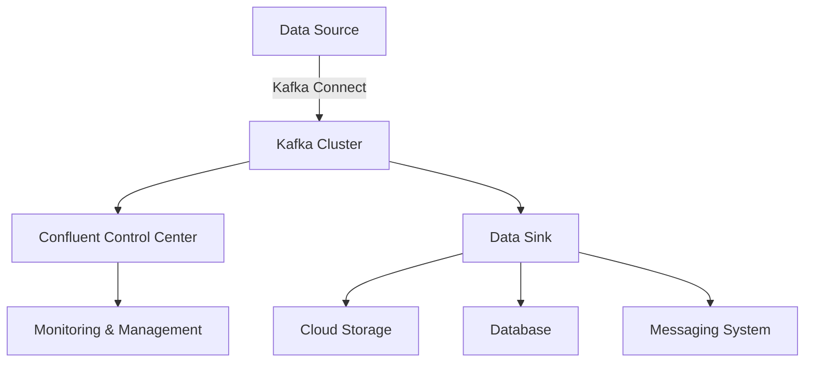

## 1.3.4 Confluent Platform Enhancements

### Introduction to Confluent and Its Contributions to the Kafka Ecosystem

Confluent, founded by the original creators of Apache Kafka, has been instrumental in advancing Kafka's capabilities beyond its open-source roots. The Confluent Platform is a comprehensive suite of tools and services designed to enhance Kafka's functionality, making it more suitable for enterprise-grade deployments. This platform provides a robust framework for building real-time data pipelines and streaming applications, addressing the needs of modern data architectures.

Confluent's contributions to the Kafka ecosystem include a range of enhancements that improve Kafka's usability, security, and integration capabilities. These enhancements are crucial for organizations looking to leverage Kafka for complex, large-scale data processing tasks.

### Key Enhancements of the Confluent Platform

#### 1. Confluent Control Center

The Confluent Control Center is a powerful management and monitoring tool that provides a user-friendly interface for managing Kafka clusters. It offers real-time visibility into Kafka's performance and health, enabling administrators to monitor key metrics and troubleshoot issues effectively.

- **Features**:
  - **Cluster Monitoring**: Visualize the health and performance of Kafka clusters with dashboards that display metrics such as throughput, latency, and consumer lag.
  - **Alerting**: Set up alerts for critical metrics to ensure timely responses to potential issues.
  - **Data Flow Monitoring**: Track data flows across topics and connectors, providing insights into data movement and processing.

- **Benefits**:
  - **Improved Operational Efficiency**: Simplifies the management of Kafka clusters, reducing the operational overhead.
  - **Enhanced Troubleshooting**: Facilitates quick identification and resolution of issues, minimizing downtime.

#### 2. Pre-Built Connectors

Confluent Platform includes a rich set of pre-built connectors that simplify the integration of Kafka with various data sources and sinks. These connectors are part of the Kafka Connect framework, which provides a scalable and reliable way to stream data between Kafka and other systems.

- **Common Connectors**:
  - **Database Connectors**: Integrate with popular databases such as MySQL, PostgreSQL, and MongoDB.
  - **Cloud Storage Connectors**: Stream data to and from cloud storage services like Amazon S3 and Google Cloud Storage.
  - **Messaging Systems Connectors**: Connect with other messaging systems like JMS and RabbitMQ.

- **Benefits**:
  - **Rapid Integration**: Accelerates the development of data pipelines by providing ready-to-use connectors.
  - **Scalability**: Supports high-throughput data ingestion and delivery, essential for enterprise applications.

#### 3. Advanced Security Features

Security is a critical concern for any data processing platform, and Confluent Platform offers advanced security features to protect data in transit and at rest.

- **Security Enhancements**:
  - **Encryption**: Supports SSL/TLS encryption for secure data transmission.
  - **Authentication**: Provides robust authentication mechanisms, including SASL and OAuth.
  - **Authorization**: Implements fine-grained access control with role-based access control (RBAC) and Apache Ranger integration.

- **Benefits**:
  - **Data Protection**: Ensures that sensitive data is protected against unauthorized access and breaches.
  - **Compliance**: Helps organizations meet regulatory requirements for data security and privacy.

### How Confluent Platform Enhancements Benefit Enterprise Deployments

The enhancements provided by the Confluent Platform are designed to address the challenges faced by enterprises in deploying and managing Kafka at scale. These enhancements offer several key benefits:

- **Scalability and Performance**: Confluent's tools and optimizations enable Kafka to handle large volumes of data with low latency, making it suitable for mission-critical applications.
- **Ease of Use**: The user-friendly interfaces and pre-built connectors reduce the complexity of deploying and managing Kafka, allowing organizations to focus on building value-added applications.
- **Security and Compliance**: Advanced security features ensure that data is protected, helping organizations comply with industry regulations and standards.
- **Integration and Interoperability**: The wide range of connectors and integration tools facilitate seamless data exchange between Kafka and other systems, supporting a unified data architecture.

### Code Examples

To illustrate the practical application of Confluent Platform enhancements, let's explore some code examples demonstrating the use of Kafka Connect with pre-built connectors.

#### Java Example: Using a Kafka Connector for MySQL

```java
import org.apache.kafka.connect.json.JsonConverter;
import org.apache.kafka.connect.runtime.ConnectorConfig;
import org.apache.kafka.connect.runtime.WorkerConfig;
import org.apache.kafka.connect.storage.FileOffsetBackingStore;

import java.util.HashMap;
import java.util.Map;

public class MySQLConnectorExample {
    public static void main(String[] args) {
        Map<String, String> props = new HashMap<>();
        props.put(ConnectorConfig.NAME_CONFIG, "mysql-source-connector");
        props.put(ConnectorConfig.CONNECTOR_CLASS_CONFIG, "io.confluent.connect.jdbc.JdbcSourceConnector");
        props.put("connection.url", "jdbc:mysql://localhost:3306/mydb");
        props.put("connection.user", "user");
        props.put("connection.password", "password");
        props.put("topic.prefix", "mysql-");

        WorkerConfig workerConfig = new WorkerConfig(props);
        FileOffsetBackingStore offsetBackingStore = new FileOffsetBackingStore();
        JsonConverter keyConverter = new JsonConverter();
        JsonConverter valueConverter = new JsonConverter();

        // Initialize and start the connector
        // Note: This is a simplified example. In practice, use Kafka Connect's REST API to manage connectors.
    }
}
```

#### Scala Example: Configuring a Kafka Connector for Amazon S3

```scala
import org.apache.kafka.connect.s3.S3SinkConnector
import org.apache.kafka.connect.storage.StringConverter

object S3ConnectorExample extends App {
  val props = Map(
    "name" -> "s3-sink-connector",
    "connector.class" -> classOf[S3SinkConnector].getName,
    "topics" -> "my-topic",
    "s3.bucket.name" -> "my-bucket",
    "s3.region" -> "us-west-2",
    "key.converter" -> classOf[StringConverter].getName,
    "value.converter" -> classOf[StringConverter].getName
  )

  // Initialize and start the connector
  // Note: This is a simplified example. In practice, use Kafka Connect's REST API to manage connectors.
}
```

#### Kotlin Example: Setting Up a Kafka Connector for Google Cloud Storage

```kotlin
import org.apache.kafka.connect.gcs.GcsSinkConnector
import org.apache.kafka.connect.storage.StringConverter

fun main() {
    val props = mapOf(
        "name" to "gcs-sink-connector",
        "connector.class" to GcsSinkConnector::class.java.name,
        "topics" to "my-topic",
        "gcs.bucket.name" to "my-bucket",
        "gcs.region" to "us-central1",
        "key.converter" to StringConverter::class.java.name,
        "value.converter" to StringConverter::class.java.name
    )

    // Initialize and start the connector
    // Note: This is a simplified example. In practice, use Kafka Connect's REST API to manage connectors.
}
```

#### Clojure Example: Configuring a Kafka Connector for MongoDB

```clojure
(ns mongodb-connector-example
  (:require [org.apache.kafka.connect.mongodb.MongoDbSourceConnector :as mongo-connector]
            [org.apache.kafka.connect.storage.StringConverter :as string-converter]))

(def props
  {"name" "mongodb-source-connector"
   "connector.class" (str mongo-connector/MongoDbSourceConnector)
   "connection.uri" "mongodb://localhost:27017"
   "database" "mydb"
   "collection" "mycollection"
   "key.converter" (str string-converter/StringConverter)
   "value.converter" (str string-converter/StringConverter)})

;; Initialize and start the connector
;; Note: This is a simplified example. In practice, use Kafka Connect's REST API to manage connectors.
```

### Visualizing Confluent Platform Enhancements

To better understand the architecture and data flow of Confluent Platform enhancements, let's explore a diagram illustrating the integration of Kafka with various data sources and sinks using Kafka Connect.



**Diagram Description**: This diagram illustrates how Kafka Connect facilitates data flow from various data sources to a Kafka cluster, which is then monitored and managed using Confluent Control Center. Data can be streamed to multiple sinks, including cloud storage, databases, and messaging systems.

### References and Links

- [Confluent Platform](https://www.confluent.io/product/confluent-platform/)
- [Apache Kafka Documentation](https://kafka.apache.org/documentation/)
- [Confluent Documentation](https://docs.confluent.io/)

### Knowledge Check

To reinforce your understanding of Confluent Platform enhancements, consider the following questions:

1. What are the primary benefits of using Confluent Control Center for managing Kafka clusters?
2. How do pre-built connectors in Confluent Platform facilitate data integration?
3. What security features does Confluent Platform offer to protect data in transit and at rest?
4. How can Confluent Platform's enhancements improve the scalability and performance of Kafka deployments?

### Exercises

1. **Experiment with Kafka Connect**: Set up a Kafka Connect instance using one of the pre-built connectors provided by Confluent Platform. Try connecting to a database or cloud storage service and observe the data flow.
2. **Explore Confluent Control Center**: Deploy Confluent Control Center and monitor a Kafka cluster. Set up alerts for key metrics and experiment with different visualization options.
3. **Implement Security Features**: Configure SSL/TLS encryption and SASL authentication for a Kafka cluster using Confluent Platform's security features. Test the setup to ensure data is transmitted securely.

### Conclusion

The Confluent Platform significantly enhances Apache Kafka's capabilities, making it a powerful tool for enterprise-grade data processing and integration. By providing advanced management tools, pre-built connectors, and robust security features, Confluent enables organizations to deploy and manage Kafka at scale with ease and confidence. As you continue to explore Kafka and its ecosystem, consider how these enhancements can be leveraged to meet your organization's specific needs and challenges.

## Test Your Knowledge: Confluent Platform Enhancements Quiz



### What is the primary purpose of Confluent Control Center?

- [x] To provide a user-friendly interface for managing Kafka clusters
- [ ] To replace Kafka brokers
- [ ] To store Kafka topics
- [ ] To encrypt Kafka data

> **Explanation:** Confluent Control Center is designed to offer a user-friendly interface for managing and monitoring Kafka clusters, providing insights into performance and health.

### Which of the following is a benefit of using pre-built connectors in Confluent Platform?

- [x] Rapid integration with various data sources and sinks
- [ ] Increased Kafka broker capacity
- [ ] Enhanced topic replication
- [ ] Reduced need for data encryption

> **Explanation:** Pre-built connectors facilitate rapid integration with different data sources and sinks, streamlining the development of data pipelines.

### What security feature does Confluent Platform provide for data in transit?

- [x] SSL/TLS encryption
- [ ] Data compression
- [ ] Topic partitioning
- [ ] Consumer group balancing

> **Explanation:** Confluent Platform supports SSL/TLS encryption to secure data transmission between Kafka clients and brokers.

### How does Confluent Platform enhance Kafka's scalability?

- [x] By providing tools and optimizations for handling large volumes of data
- [ ] By reducing the number of Kafka brokers needed
- [ ] By eliminating the need for ZooKeeper
- [ ] By increasing the number of partitions per topic

> **Explanation:** Confluent Platform offers tools and optimizations that enable Kafka to handle large data volumes efficiently, enhancing scalability.

### Which of the following is a feature of Confluent Control Center?

- [x] Real-time cluster monitoring
- [ ] Topic creation
- [ ] Broker shutdown
- [ ] Data encryption

> **Explanation:** Confluent Control Center provides real-time monitoring of Kafka clusters, allowing administrators to track performance and health metrics.

### What is the role of Kafka Connect in the Confluent Platform?

- [x] To facilitate data integration between Kafka and other systems
- [ ] To manage Kafka broker configurations
- [ ] To encrypt Kafka data
- [ ] To monitor Kafka consumer groups

> **Explanation:** Kafka Connect is a framework within the Confluent Platform that enables data integration between Kafka and various external systems.

### Which authentication mechanism is supported by Confluent Platform?

- [x] SASL
- [ ] HTTP Basic
- [ ] FTP
- [ ] SMTP

> **Explanation:** Confluent Platform supports SASL (Simple Authentication and Security Layer) for authenticating Kafka clients.

### What is a key benefit of using Confluent Platform's security features?

- [x] Ensuring data protection and compliance with regulations
- [ ] Increasing Kafka broker throughput
- [ ] Reducing the number of Kafka topics
- [ ] Simplifying consumer group management

> **Explanation:** Confluent Platform's security features help protect data and ensure compliance with industry regulations and standards.

### How do pre-built connectors enhance the Confluent Platform?

- [x] By providing ready-to-use solutions for data integration
- [ ] By increasing Kafka broker storage capacity
- [ ] By reducing network latency
- [ ] By simplifying topic partitioning

> **Explanation:** Pre-built connectors offer ready-to-use solutions for integrating Kafka with various data sources and sinks, streamlining data pipeline development.

### True or False: Confluent Platform eliminates the need for ZooKeeper in Kafka deployments.

- [ ] True
- [x] False

> **Explanation:** Confluent Platform does not eliminate the need for ZooKeeper; however, it provides tools and enhancements that improve Kafka's overall functionality and management.




