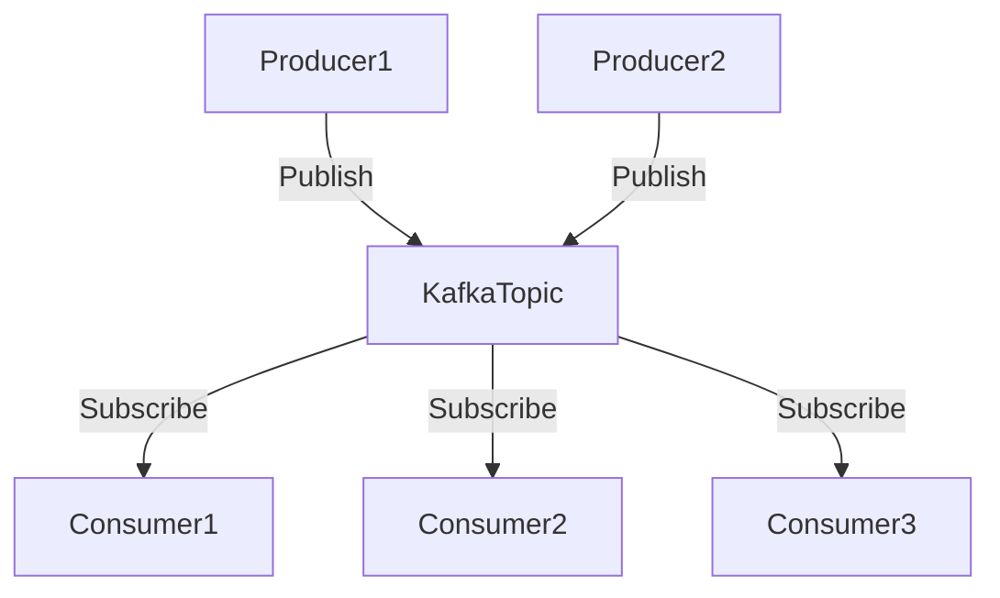

## 1.4.1 Event-Driven Microservices

### Introduction

Event-driven microservices represent a paradigm shift in how modern applications are architected, enabling systems to be more responsive, scalable, and maintainable. Apache Kafka plays a pivotal role in facilitating this architecture by providing a robust platform for asynchronous communication between services. This section delves into the intricacies of event-driven architectures, the advantages they offer, and how Kafka serves as a cornerstone for implementing these systems.

### Understanding Event-Driven Architecture

#### Definition and Advantages

**Event-driven architecture (EDA)** is a design paradigm in which services communicate by producing and consuming events. An event is a significant change in state, such as a user making a purchase or a sensor reading a temperature change. This architecture is characterized by:

- **Decoupling**: Services are independent and communicate through events, reducing dependencies and allowing for easier maintenance and scalability.
- **Scalability**: Systems can scale horizontally by adding more instances of services without affecting others.
- **Resilience**: Services can fail independently without bringing down the entire system, as they are loosely coupled.
- **Real-time Processing**: Events are processed as they occur, enabling real-time analytics and decision-making.

#### Kafka's Role in EDA

Apache Kafka is a distributed event streaming platform that excels in handling high-throughput, fault-tolerant, and scalable event-driven systems. It provides the backbone for EDA by:

- **Facilitating Asynchronous Communication**: Kafka decouples producers and consumers, allowing them to operate independently and at their own pace.
- **Ensuring Durability and Reliability**: With its distributed log, Kafka ensures that events are stored durably and can be replayed if necessary.
- **Supporting High Throughput**: Kafka can handle millions of events per second, making it suitable for large-scale applications.

### Asynchronous Communication with Kafka

#### How Kafka Enables Asynchronous Communication

In an event-driven system, services communicate asynchronously, meaning they do not wait for a response after sending a message. Kafka facilitates this by acting as an intermediary:

- **Producers**: Services that generate events and publish them to Kafka topics.
- **Consumers**: Services that subscribe to Kafka topics and process events.

This model allows producers and consumers to operate independently, improving system resilience and scalability.

#### Publish-Subscribe Pattern

The **publish-subscribe** pattern is a core concept in event-driven architectures, where producers publish events to a topic, and multiple consumers can subscribe to that topic to receive events. This pattern is ideal for scenarios where multiple services need to react to the same event.



*Caption*: The publish-subscribe pattern in Kafka, where multiple producers publish to a topic, and multiple consumers subscribe to it.

#### Event Sourcing

**Event sourcing** is a pattern where state changes are logged as a sequence of events. Instead of storing the current state, the system reconstructs the state by replaying events. Kafka's immutable log makes it an ideal platform for event sourcing, as it can store and replay events efficiently.

```java
// Java example of an event sourcing pattern
public class OrderService {
    private final KafkaProducer<String, OrderEvent> producer;

    public OrderService(KafkaProducer<String, OrderEvent> producer) {
        this.producer = producer;
    }

    public void createOrder(Order order) {
        OrderEvent event = new OrderCreatedEvent(order);
        producer.send(new ProducerRecord<>("order-events", order.getId(), event));
    }
}
```

*Explanation*: This Java code snippet demonstrates how an order creation event is published to a Kafka topic, enabling event sourcing.

### Best Practices for Integrating Kafka with Microservices

#### Designing Topics and Partitions

- **Use Meaningful Topic Names**: Ensure topic names are descriptive and reflect the event type or domain.
- **Partitioning Strategy**: Design partitions to balance load across consumers. Use key-based partitioning to ensure related events are processed by the same consumer.

#### Ensuring Data Consistency

- **Idempotent Producers**: Ensure producers can safely retry sending events without causing duplicates.
- **Exactly-Once Semantics**: Use Kafka's transactional capabilities to achieve exactly-once processing, ensuring data consistency across services.

#### Monitoring and Observability

- **Metrics and Logging**: Implement comprehensive logging and metrics collection to monitor Kafka's performance and health.
- **Distributed Tracing**: Use tracing tools to track event flows across services, aiding in debugging and performance optimization.

#### Security Considerations

- **Authentication and Authorization**: Implement SSL/TLS and SASL for secure communication. Use ACLs to control access to Kafka topics.
- **Data Encryption**: Encrypt sensitive data at rest and in transit to comply with regulatory requirements.

### Real-World Scenarios and Use Cases

#### E-commerce Platforms

In an e-commerce platform, Kafka can be used to handle events such as order placements, inventory updates, and payment processing. Each service can independently process these events, improving system responsiveness and scalability.

#### IoT Applications

For IoT applications, Kafka can ingest and process sensor data in real-time, enabling immediate analysis and decision-making. This is crucial for applications like smart homes and industrial automation.

#### Financial Services

In financial services, Kafka can be used for real-time fraud detection and transaction processing. Events such as transactions and account updates can be processed in real-time, enhancing security and customer experience.

### Conclusion

Event-driven microservices, powered by Apache Kafka, offer a robust solution for building scalable, resilient, and responsive systems. By leveraging Kafka's capabilities, organizations can decouple services, process events in real-time, and scale their applications efficiently. As you integrate Kafka into your microservices architecture, consider the best practices and patterns discussed in this section to maximize the benefits of event-driven systems.

## Test Your Knowledge: Mastering Event-Driven Microservices with Kafka



### What is a primary advantage of event-driven architecture?

- [x] Decoupling of services
- [ ] Synchronous communication
- [ ] Increased latency
- [ ] Reduced scalability

> **Explanation:** Event-driven architecture decouples services, allowing them to operate independently and improving scalability and maintainability.

### How does Kafka facilitate asynchronous communication?

- [x] By acting as an intermediary between producers and consumers
- [ ] By enforcing synchronous communication
- [ ] By storing events in a database
- [ ] By requiring direct service-to-service calls

> **Explanation:** Kafka acts as an intermediary, allowing producers and consumers to operate independently and asynchronously.

### What pattern involves storing state changes as a sequence of events?

- [x] Event sourcing
- [ ] Publish-subscribe
- [ ] Command-query separation
- [ ] State replication

> **Explanation:** Event sourcing involves logging state changes as events, which can be replayed to reconstruct the state.

### Which Kafka feature ensures exactly-once processing?

- [x] Transactions
- [ ] Partitions
- [ ] Consumer groups
- [ ] Log compaction

> **Explanation:** Kafka's transactional capabilities enable exactly-once processing, ensuring data consistency across services.

### What is a key consideration when designing Kafka topics?

- [x] Use meaningful topic names
- [ ] Minimize the number of partitions
- [ ] Avoid using keys for partitioning
- [ ] Use random topic names

> **Explanation:** Meaningful topic names help in organizing and managing events effectively.

### How can you ensure secure communication in Kafka?

- [x] Implement SSL/TLS and SASL
- [ ] Use plain text communication
- [ ] Disable authentication
- [ ] Allow open access to all topics

> **Explanation:** SSL/TLS and SASL provide secure communication and authentication in Kafka.

### What is a common use case for Kafka in IoT applications?

- [x] Real-time sensor data processing
- [ ] Batch processing of historical data
- [ ] Manual data entry
- [ ] Static report generation

> **Explanation:** Kafka is used in IoT applications for real-time processing of sensor data, enabling immediate analysis and decision-making.

### Which pattern allows multiple consumers to receive the same event?

- [x] Publish-subscribe
- [ ] Event sourcing
- [ ] Command-query separation
- [ ] Direct messaging

> **Explanation:** The publish-subscribe pattern allows multiple consumers to subscribe to a topic and receive the same events.

### What is a benefit of using idempotent producers in Kafka?

- [x] Safe retries without duplicates
- [ ] Increased message size
- [ ] Reduced throughput
- [ ] Synchronous processing

> **Explanation:** Idempotent producers ensure that retries do not result in duplicate events, maintaining data consistency.

### True or False: Kafka can be used for real-time fraud detection in financial services.

- [x] True
- [ ] False

> **Explanation:** Kafka's real-time processing capabilities make it suitable for applications like fraud detection in financial services.


