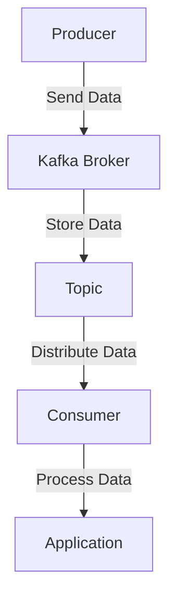

## 1.4.2 Real-Time Data Pipelines

### Introduction to Real-Time Data Pipelines

Real-time data pipelines are essential for modern enterprises that require immediate insights from data as it is generated. Unlike traditional batch processing, which involves collecting data over a period and processing it in bulk, real-time data pipelines allow for continuous data ingestion, processing, and analysis. This capability is crucial for businesses that need to react swiftly to changing conditions, such as financial markets, telecommunications, and e-commerce.

Apache Kafka, a distributed event streaming platform, is at the forefront of enabling real-time data pipelines. Its robust architecture and features make it an ideal choice for handling high-throughput, low-latency data streams. In this section, we will explore how Kafka supports real-time data pipelines, examine industry use cases, and discuss complementary tools that enhance Kafka's capabilities.

### Understanding Real-Time Data Pipelines

#### Definition and Importance

Real-time data pipelines are systems designed to process data as soon as it is produced. They are crucial for applications that require immediate data insights, such as fraud detection, real-time analytics, and operational monitoring. These pipelines enable organizations to make data-driven decisions quickly, improving efficiency and competitiveness.

#### Key Characteristics

- **Low Latency**: Data is processed with minimal delay, allowing for near-instantaneous insights.
- **Scalability**: The ability to handle large volumes of data without performance degradation.
- **Fault Tolerance**: Ensures data integrity and availability even in the event of failures.
- **Flexibility**: Supports various data sources and destinations, enabling seamless integration with existing systems.

### Apache Kafka's Role in Real-Time Data Pipelines

#### Core Features Supporting Real-Time Processing

Apache Kafka's architecture is designed to handle real-time data ingestion and processing efficiently. Key features include:

- **Distributed Architecture**: Kafka's distributed nature allows it to scale horizontally, handling large volumes of data across multiple nodes.
- **High Throughput**: Kafka can process millions of messages per second, making it suitable for high-velocity data streams.
- **Low Latency**: Kafka's efficient data handling ensures minimal delay between data ingestion and processing.
- **Fault Tolerance**: Data replication across multiple brokers ensures data availability and durability.
- **Stream Processing**: Kafka Streams API enables real-time processing and transformation of data streams.

#### Kafka's Distributed Architecture

Kafka's architecture consists of several key components that work together to provide a robust platform for real-time data pipelines:

- **Brokers**: Kafka brokers are responsible for storing and serving data. They handle incoming data from producers and deliver it to consumers.
- **Topics and Partitions**: Data is organized into topics, which are further divided into partitions for parallel processing and scalability.
- **Producers and Consumers**: Producers send data to Kafka topics, while consumers read data from these topics for processing.



*Diagram: Kafka's architecture facilitates real-time data flow from producers to consumers.*

#### Real-Time Ingestion and Processing

Kafka's ability to handle real-time data ingestion and processing is enhanced by its support for:

- **Kafka Connect**: A framework for integrating Kafka with external systems, enabling seamless data ingestion from various sources.
- **Kafka Streams**: A powerful library for building real-time stream processing applications directly on top of Kafka.

### Industry Use Cases for Real-Time Data Pipelines

#### Finance

In the financial industry, real-time data pipelines are used for:

- **Fraud Detection**: Monitoring transactions in real-time to identify and prevent fraudulent activities.
- **Market Data Analysis**: Processing stock market data to provide traders with up-to-the-minute insights.

#### Telecommunications

Telecommunications companies leverage real-time data pipelines for:

- **Network Monitoring**: Continuously analyzing network performance to detect and resolve issues promptly.
- **Customer Experience Management**: Real-time analysis of customer interactions to enhance service delivery.

#### E-commerce

E-commerce platforms utilize real-time data pipelines for:

- **Personalized Recommendations**: Analyzing customer behavior in real-time to provide personalized product recommendations.
- **Inventory Management**: Monitoring stock levels and sales trends to optimize inventory.

### Complementary Tools for Building Real-Time Data Pipelines

#### Kafka Connect

Kafka Connect is a powerful tool for integrating Kafka with various data sources and sinks. It simplifies the process of data ingestion and export, supporting a wide range of connectors for databases, file systems, and cloud services.

- **Source Connectors**: Enable data ingestion from external systems into Kafka.
- **Sink Connectors**: Allow data to be exported from Kafka to other systems.

#### Kafka Streams

Kafka Streams is a client library for building real-time stream processing applications. It provides a high-level DSL for defining complex data transformations and aggregations.

- **Stateless Processing**: Operations that do not require maintaining state, such as filtering and mapping.
- **Stateful Processing**: Operations that require maintaining state, such as aggregations and joins.

#### Complementary Tools

- **Apache Flink**: A stream processing framework that integrates with Kafka for complex event processing and real-time analytics.
- **Apache Beam**: A unified programming model for batch and stream processing, supporting integration with Kafka for real-time data pipelines.
- **Confluent Platform**: An enterprise-grade distribution of Kafka that includes additional tools and features for managing and monitoring Kafka clusters.

### Building a Real-Time Data Pipeline with Kafka

#### Step-by-Step Guide

1. **Define Data Sources and Sinks**: Identify the data sources and destinations for your pipeline. Use Kafka Connect to integrate these systems with Kafka.

2. **Design Data Flow**: Plan the flow of data through your pipeline, considering the transformations and processing required.

3. **Implement Stream Processing**: Use Kafka Streams or a complementary tool like Apache Flink to implement real-time data processing logic.

4. **Monitor and Optimize**: Continuously monitor the performance of your pipeline and optimize configurations for throughput and latency.

#### Sample Code Snippets

- **Java Example**: Implementing a simple Kafka Streams application.

    ```java
    import org.apache.kafka.streams.KafkaStreams;
    import org.apache.kafka.streams.StreamsBuilder;
    import org.apache.kafka.streams.kstream.KStream;

    public class RealTimePipeline {
        public static void main(String[] args) {
            StreamsBuilder builder = new StreamsBuilder();
            KStream<String, String> sourceStream = builder.stream("source-topic");

            sourceStream
                .filter((key, value) -> value.contains("important"))
                .to("destination-topic");

            KafkaStreams streams = new KafkaStreams(builder.build(), new Properties());
            streams.start();
        }
    }
    ```

- **Scala Example**: Using Kafka Streams DSL for data transformation.

    ```scala
    import org.apache.kafka.streams.scala._
    import org.apache.kafka.streams.scala.kstream._

    object RealTimePipeline extends App {
        val builder = new StreamsBuilder()
        val sourceStream: KStream[String, String] = builder.stream("source-topic")

        sourceStream
            .filter((key, value) => value.contains("important"))
            .to("destination-topic")

        val streams = new KafkaStreams(builder.build(), new Properties())
        streams.start()
    }
    ```

- **Kotlin Example**: Real-time filtering with Kafka Streams.

    ```kotlin
    import org.apache.kafka.streams.KafkaStreams
    import org.apache.kafka.streams.StreamsBuilder
    import org.apache.kafka.streams.kstream.KStream

    fun main() {
        val builder = StreamsBuilder()
        val sourceStream: KStream<String, String> = builder.stream("source-topic")

        sourceStream
            .filter { _, value -> value.contains("important") }
            .to("destination-topic")

        val streams = KafkaStreams(builder.build(), Properties())
        streams.start()
    }
    ```

- **Clojure Example**: Leveraging Kafka Streams for real-time processing.

    ```clojure
    (ns real-time-pipeline
      (:require [org.apache.kafka.streams StreamsBuilder KafkaStreams]
                [org.apache.kafka.streams.kstream KStream]))

    (defn -main []
      (let [builder (StreamsBuilder.)
            source-stream (.stream builder "source-topic")]

        (.filter source-stream (fn [key value] (.contains value "important")))
        (.to source-stream "destination-topic")

        (let [streams (KafkaStreams. (.build builder) (Properties.))]
          (.start streams))))
    ```

### Conclusion

Real-time data pipelines are transforming how businesses operate, enabling them to harness the power of data as it is generated. Apache Kafka, with its robust architecture and rich ecosystem, is a key enabler of these pipelines. By leveraging Kafka's features and complementary tools, organizations can build scalable, fault-tolerant systems that deliver real-time insights and drive data-driven decision-making.

## Test Your Knowledge: Real-Time Data Pipelines with Apache Kafka



### What is a key characteristic of real-time data pipelines?

- [x] Low Latency
- [ ] High Latency
- [ ] Batch Processing
- [ ] Manual Data Entry

> **Explanation:** Real-time data pipelines are designed to process data with minimal delay, providing near-instantaneous insights.

### Which Apache Kafka feature supports real-time stream processing?

- [x] Kafka Streams
- [ ] Kafka Connect
- [ ] Kafka Broker
- [ ] Kafka Topic

> **Explanation:** Kafka Streams is a client library for building real-time stream processing applications on top of Kafka.

### In which industry is real-time fraud detection a common use case for data pipelines?

- [x] Finance
- [ ] Agriculture
- [ ] Manufacturing
- [ ] Education

> **Explanation:** The finance industry uses real-time data pipelines for fraud detection by monitoring transactions as they occur.

### What is the role of Kafka Connect in real-time data pipelines?

- [x] Integrating Kafka with external systems
- [ ] Processing data streams
- [ ] Storing data
- [ ] Visualizing data

> **Explanation:** Kafka Connect is used to integrate Kafka with various data sources and sinks, facilitating data ingestion and export.

### Which tool is NOT typically used to complement Kafka in real-time data pipelines?

- [ ] Apache Flink
- [ ] Apache Beam
- [ ] Confluent Platform
- [x] Microsoft Word

> **Explanation:** Microsoft Word is not a tool used for building or managing real-time data pipelines.

### What is a benefit of using Kafka's distributed architecture?

- [x] Scalability
- [ ] Increased Latency
- [ ] Manual Configuration
- [ ] Limited Data Sources

> **Explanation:** Kafka's distributed architecture allows it to scale horizontally, handling large volumes of data efficiently.

### Which Kafka component is responsible for storing and serving data?

- [x] Broker
- [ ] Producer
- [ ] Consumer
- [ ] Topic

> **Explanation:** Kafka brokers are responsible for storing and serving data, handling incoming data from producers and delivering it to consumers.

### What is the primary function of Kafka Streams?

- [x] Real-time data processing
- [ ] Data storage
- [ ] Data visualization
- [ ] Data entry

> **Explanation:** Kafka Streams is used for real-time data processing, enabling complex transformations and aggregations on data streams.

### Which programming language is NOT shown in the code examples for Kafka Streams?

- [ ] Java
- [ ] Scala
- [ ] Kotlin
- [x] Python

> **Explanation:** The code examples provided are in Java, Scala, Kotlin, and Clojure, but not Python.

### True or False: Real-time data pipelines are only useful for large enterprises.

- [ ] True
- [x] False

> **Explanation:** Real-time data pipelines are beneficial for organizations of all sizes that require immediate insights from data.


