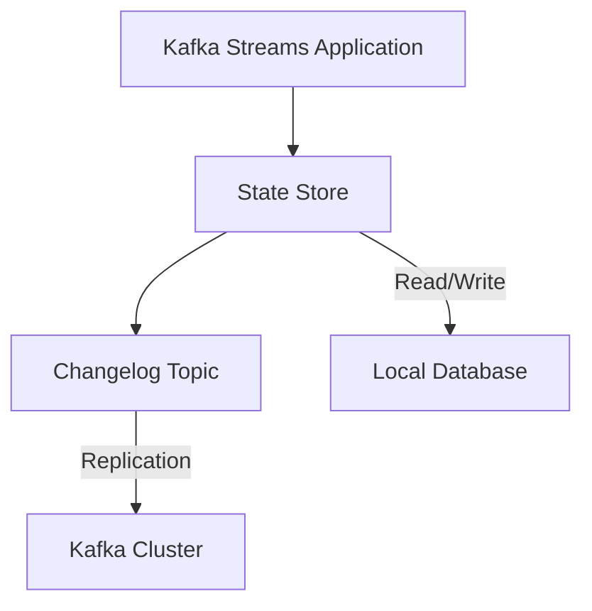

## 1.4.3 Stream Processing Applications

Stream processing applications have become a cornerstone of modern enterprise systems, enabling real-time analytics, data transformation, and reactive decision-making. Apache Kafka, with its robust ecosystem and powerful stream processing capabilities, plays a pivotal role in these applications. This section delves into the intricacies of stream processing with Kafka, exploring its frameworks, tasks, and real-world applications.

### The Role of Kafka Streams and Other Processing Frameworks

Apache Kafka provides a versatile platform for stream processing through its Kafka Streams API, a client library for building applications and microservices. Kafka Streams simplifies the development of real-time applications by abstracting the complexities of distributed processing and state management.

#### Kafka Streams API

The Kafka Streams API is designed to process data in real-time, offering a high-level DSL (Domain Specific Language) for defining stream processing tasks. It supports operations such as filtering, mapping, grouping, and aggregating data streams. Kafka Streams is inherently distributed and fault-tolerant, leveraging Kafka's partitioning and replication mechanisms to ensure scalability and reliability.

**Key Features of Kafka Streams:**

- **Stateful and Stateless Processing**: Kafka Streams supports both stateless operations, like filtering and mapping, and stateful operations, such as aggregations and joins.
- **Exactly-Once Processing Semantics**: Ensures that each record is processed exactly once, even in the presence of failures.
- **Interactive Queries**: Allows querying of state stores in real-time, enabling applications to expose their state as a service.
- **Integration with Kafka Ecosystem**: Seamlessly integrates with other Kafka components, such as Kafka Connect and Schema Registry.

#### Other Stream Processing Frameworks

While Kafka Streams is a powerful tool, other frameworks like Apache Flink, Apache Spark Streaming, and Akka Streams can also be integrated with Kafka for stream processing. These frameworks offer additional features and paradigms, such as complex event processing and batch processing capabilities.

- **Apache Flink**: Known for its low-latency and high-throughput stream processing, Flink supports event-time processing and stateful computations.
- **Apache Spark Streaming**: Provides micro-batch processing capabilities, making it suitable for applications that require both batch and stream processing.
- **Akka Streams**: Built on the Akka toolkit, it offers a reactive stream processing model, ideal for building resilient and responsive applications.

### Stream Processing Tasks

Stream processing involves various tasks that transform and analyze data in motion. These tasks can be broadly categorized into stateless and stateful operations.

#### Stateless Processing

Stateless operations do not require maintaining any state between records. They are simple transformations applied independently to each record.

- **Filtering**: Removing records that do not meet certain criteria.
- **Mapping**: Transforming each record into a new form, such as converting data formats or enriching records with additional information.

**Example in Java:**

```java
StreamsBuilder builder = new StreamsBuilder();
KStream<String, String> source = builder.stream("input-topic");
KStream<String, String> filteredStream = source.filter((key, value) -> value.contains("important"));
filteredStream.to("output-topic");
```

**Example in Scala:**

```scala
val builder = new StreamsBuilder()
val source: KStream[String, String] = builder.stream("input-topic")
val filteredStream = source.filter((key, value) => value.contains("important"))
filteredStream.to("output-topic")
```

#### Stateful Processing

Stateful operations require maintaining state across records, enabling more complex computations like aggregations and joins.

- **Aggregation**: Summarizing data over a window of time, such as calculating the average or sum of values.
- **Joins**: Combining data from multiple streams or tables based on a common key.

**Example in Kotlin:**

```kotlin
val builder = StreamsBuilder()
val source: KStream<String, String> = builder.stream("input-topic")
val aggregatedStream = source
    .groupByKey()
    .windowedBy(TimeWindows.of(Duration.ofMinutes(5)))
    .count()
aggregatedStream.toStream().to("output-topic")
```

**Example in Clojure:**

```clojure
(def builder (StreamsBuilder.))
(def source (.stream builder "input-topic"))
(def aggregated-stream (.count (.windowedBy (.groupByKey source) (TimeWindows/of (Duration/ofMinutes 5)))))
(.to (.toStream aggregated-stream) "output-topic")
```

### Managing Stateful Processing in Kafka

Stateful processing in Kafka Streams is facilitated by state stores, which are local databases that store the state of computations. Kafka Streams provides built-in state stores, such as RocksDB, and allows custom implementations.

#### State Store Management

State stores are automatically managed by Kafka Streams, ensuring that they are fault-tolerant and scalable. They are backed by Kafka topics, which serve as changelogs to recover state in case of failures.

- **Persistent State Stores**: Use disk-based storage, suitable for large state sizes.
- **In-Memory State Stores**: Faster but limited by available memory, suitable for smaller state sizes.

**Diagram: State Store Architecture**



*Caption: The state store architecture in Kafka Streams, showing the interaction between the application, state store, changelog topic, and Kafka cluster.*

### Real-World Applications and Success Stories

Stream processing with Kafka has been successfully implemented across various industries, enabling real-time insights and decision-making.

#### Financial Services

In the financial sector, stream processing applications are used for real-time fraud detection and risk management. By analyzing transaction streams in real-time, financial institutions can identify suspicious activities and mitigate risks promptly.

**Case Study: Real-Time Fraud Detection**

A leading bank implemented a Kafka Streams application to monitor transaction streams for fraud patterns. By leveraging stateful processing and complex event detection, the bank reduced fraud incidents by 30% within the first year.

#### E-commerce

E-commerce platforms use stream processing for personalized recommendations and inventory management. By processing user activity streams, these platforms can offer tailored product suggestions and optimize stock levels.

**Case Study: Personalized Recommendations**

An online retailer integrated Kafka Streams with its recommendation engine to process user clickstreams. The real-time analysis enabled the retailer to increase conversion rates by 15% through personalized product recommendations.

#### Telecommunications

Telecom companies utilize stream processing for network monitoring and customer experience management. By analyzing call data records and network logs, they can proactively address network issues and enhance service quality.

**Case Study: Network Monitoring**

A telecom operator deployed a Kafka Streams application to monitor network performance in real-time. The application provided actionable insights, reducing network downtime by 20% and improving customer satisfaction.

### Best Practices for Stream Processing with Kafka

To maximize the benefits of stream processing with Kafka, consider the following best practices:

- **Optimize State Store Configuration**: Choose the appropriate state store type based on the size and access patterns of your state data.
- **Leverage Exactly-Once Semantics**: Ensure data consistency and reliability by configuring Kafka Streams for exactly-once processing.
- **Monitor and Scale**: Use monitoring tools to track application performance and scale resources dynamically to handle varying workloads.
- **Integrate with Schema Registry**: Use [1.3.3 Schema Registry]( "Schema Registry") to manage data schemas and ensure compatibility across different components.

### Conclusion

Stream processing applications with Apache Kafka empower organizations to harness the full potential of real-time data. By leveraging Kafka Streams and other processing frameworks, enterprises can build scalable, fault-tolerant systems that deliver immediate insights and drive informed decision-making. As you explore the possibilities of stream processing, consider the best practices and real-world examples discussed in this section to guide your implementation.

---

## Test Your Knowledge: Stream Processing Applications with Apache Kafka



### What is the primary role of Kafka Streams in stream processing applications?

- [x] To provide a client library for building real-time applications and microservices.
- [ ] To store large volumes of data for batch processing.
- [ ] To manage distributed transactions across multiple databases.
- [ ] To serve as a message broker for asynchronous communication.

> **Explanation:** Kafka Streams is a client library designed for building real-time applications and microservices, enabling stream processing directly within the Kafka ecosystem.

### Which of the following is a stateless operation in stream processing?

- [x] Filtering
- [ ] Aggregation
- [ ] Joins
- [ ] Windowing

> **Explanation:** Filtering is a stateless operation because it processes each record independently without maintaining any state across records.

### How does Kafka Streams ensure fault tolerance in stateful processing?

- [x] By using changelog topics to back up state stores.
- [ ] By replicating data across multiple brokers.
- [ ] By using in-memory storage for all state data.
- [ ] By implementing a two-phase commit protocol.

> **Explanation:** Kafka Streams uses changelog topics to back up state stores, allowing state recovery in case of failures.

### What is a key advantage of using exactly-once processing semantics in Kafka Streams?

- [x] It ensures data consistency and prevents duplicate processing.
- [ ] It increases processing speed by reducing overhead.
- [ ] It simplifies the configuration of Kafka clusters.
- [ ] It allows for unlimited scalability of stream processing applications.

> **Explanation:** Exactly-once processing semantics ensure that each record is processed exactly once, preventing duplicates and ensuring data consistency.

### Which framework is known for its low-latency and high-throughput stream processing capabilities?

- [ ] Apache Spark Streaming
- [x] Apache Flink
- [ ] Akka Streams
- [ ] Apache Storm

> **Explanation:** Apache Flink is renowned for its low-latency and high-throughput stream processing capabilities, making it suitable for real-time applications.

### In which industry is stream processing commonly used for real-time fraud detection?

- [x] Financial Services
- [ ] E-commerce
- [ ] Telecommunications
- [ ] Healthcare

> **Explanation:** Stream processing is widely used in the financial services industry for real-time fraud detection by analyzing transaction streams.

### What is the purpose of interactive queries in Kafka Streams?

- [x] To allow real-time querying of state stores.
- [ ] To batch process large datasets.
- [ ] To manage Kafka cluster configurations.
- [ ] To synchronize data across multiple regions.

> **Explanation:** Interactive queries in Kafka Streams enable real-time querying of state stores, allowing applications to expose their state as a service.

### Which of the following is a best practice for optimizing state store configuration in Kafka Streams?

- [x] Choose the appropriate state store type based on state size and access patterns.
- [ ] Always use in-memory state stores for faster access.
- [ ] Disable changelog topics to reduce storage costs.
- [ ] Use a single state store for all processing tasks.

> **Explanation:** Optimizing state store configuration involves selecting the appropriate type based on the size and access patterns of state data to balance performance and resource usage.

### How can e-commerce platforms benefit from stream processing applications?

- [x] By providing personalized recommendations and optimizing inventory management.
- [ ] By reducing the need for data storage.
- [ ] By eliminating the need for batch processing.
- [ ] By simplifying payment processing systems.

> **Explanation:** E-commerce platforms use stream processing to analyze user activity streams in real-time, enabling personalized recommendations and efficient inventory management.

### True or False: Kafka Streams can only be used for stateless processing tasks.

- [ ] True
- [x] False

> **Explanation:** Kafka Streams supports both stateless and stateful processing tasks, allowing for complex computations like aggregations and joins.



---
