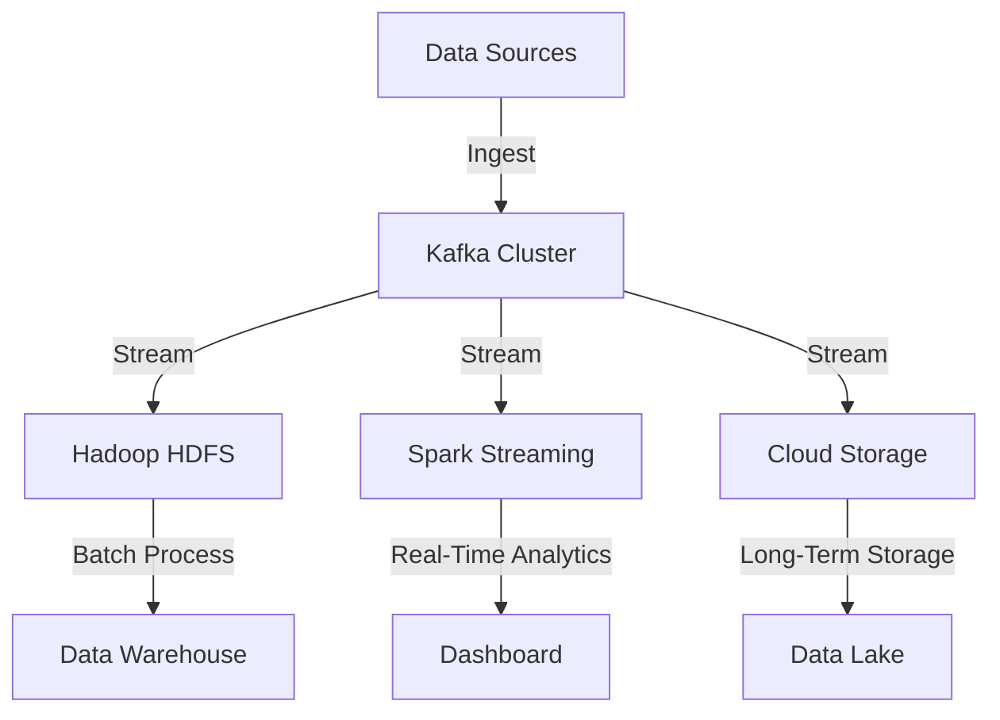

## 1.4.4 Big Data Integration

### Introduction

In the era of big data, organizations are inundated with vast volumes of data generated at unprecedented speeds. The challenge lies not only in storing this data but also in efficiently processing and analyzing it to derive actionable insights. Apache Kafka has emerged as a pivotal technology in this landscape, acting as a robust data backbone that seamlessly integrates with big data platforms. This section explores how Kafka facilitates large-scale data ingestion and distribution, serving as a conduit between data sources and data lakes or warehouses.

### Challenges of Big Data Integration

Integrating big data systems involves several challenges:

1. **Volume and Velocity**: The sheer volume and speed of data generation require systems that can handle high-throughput data streams without bottlenecks.
2. **Variety**: Data comes in various formats and from multiple sources, necessitating a flexible integration framework.
3. **Scalability**: As data grows, the integration system must scale horizontally to accommodate increased loads.
4. **Fault Tolerance**: Ensuring data integrity and availability in the face of failures is critical.
5. **Latency**: Real-time processing demands low-latency data pipelines to deliver timely insights.

### Kafka as a Data Backbone in Big Data Ecosystems

Apache Kafka addresses these challenges by providing a distributed, fault-tolerant, and scalable messaging system. It acts as a central hub for data flow, decoupling data producers and consumers and enabling seamless data integration across diverse systems.

#### Key Features of Kafka for Big Data Integration

- **High Throughput**: Kafka's architecture supports high-throughput data ingestion, making it ideal for handling large-scale data streams.
- **Scalability**: Kafka's partitioning and replication mechanisms allow it to scale horizontally, accommodating growing data volumes.
- **Fault Tolerance**: With built-in replication and distributed architecture, Kafka ensures data availability and resilience.
- **Low Latency**: Kafka's efficient data processing capabilities enable real-time data streaming with minimal latency.
- **Flexibility**: Kafka's support for various data formats and integration with numerous platforms makes it a versatile choice for big data ecosystems.

### Integration with Hadoop, Spark, and Cloud Storage Services

Kafka's integration capabilities extend to popular big data platforms such as Hadoop, Spark, and cloud storage services, enabling seamless data flow across the ecosystem.

#### Integration with Hadoop

Hadoop, a cornerstone of big data processing, benefits from Kafka's ability to ingest and distribute data efficiently. Kafka can feed data into Hadoop's HDFS (Hadoop Distributed File System) for batch processing or real-time analytics.

- **HDFS Integration**: Kafka Connect, a tool for streaming data between Kafka and other systems, can be used to ingest data into HDFS. This integration allows for the continuous flow of data from Kafka topics to HDFS, enabling batch processing and analytics.

```java
// Java example of Kafka Connect configuration for HDFS sink
{
  "name": "hdfs-sink-connector",
  "config": {
    "connector.class": "io.confluent.connect.hdfs.HdfsSinkConnector",
    "tasks.max": "1",
    "topics": "big-data-topic",
    "hdfs.url": "hdfs://namenode:8020",
    "flush.size": "1000"
  }
}
```

#### Integration with Spark

Apache Spark, known for its fast in-memory processing capabilities, integrates seamlessly with Kafka to process streaming data in real-time.

- **Spark Streaming**: Spark Streaming can consume data from Kafka topics, process it in real-time, and output results to various destinations. This integration is ideal for scenarios requiring low-latency processing and analytics.

```scala
// Scala example of Spark Streaming with Kafka
import org.apache.spark.SparkConf
import org.apache.spark.streaming._
import org.apache.spark.streaming.kafka010._

val conf = new SparkConf().setAppName("KafkaSparkIntegration")
val ssc = new StreamingContext(conf, Seconds(10))

val kafkaParams = Map[String, Object](
  "bootstrap.servers" -> "localhost:9092",
  "key.deserializer" -> classOf[StringDeserializer],
  "value.deserializer" -> classOf[StringDeserializer],
  "group.id" -> "spark-streaming-group"
)

val topics = Array("big-data-topic")
val stream = KafkaUtils.createDirectStream[String, String](
  ssc,
  LocationStrategies.PreferConsistent,
  ConsumerStrategies.Subscribe[String, String](topics, kafkaParams)
)

stream.map(record => (record.key, record.value)).print()

ssc.start()
ssc.awaitTermination()
```

#### Integration with Cloud Storage Services

Cloud storage services such as Amazon S3, Google Cloud Storage, and Azure Blob Storage are integral to modern data architectures. Kafka can seamlessly integrate with these services to store and process data.

- **Amazon S3 Integration**: Kafka Connect provides connectors for streaming data to Amazon S3, enabling scalable and cost-effective data storage.

```json
// JSON configuration for Kafka Connect S3 sink
{
  "name": "s3-sink-connector",
  "config": {
    "connector.class": "io.confluent.connect.s3.S3SinkConnector",
    "tasks.max": "1",
    "topics": "big-data-topic",
    "s3.bucket.name": "my-kafka-bucket",
    "s3.region": "us-west-2",
    "flush.size": "1000"
  }
}
```

### Handling High-Throughput Data Streams with Kafka

Kafka's architecture is designed to handle high-throughput data streams, making it an ideal choice for big data integration.

#### Key Strategies for High-Throughput Data Handling

1. **Partitioning**: Distribute data across multiple partitions to parallelize processing and increase throughput.
2. **Replication**: Use replication to ensure data availability and fault tolerance.
3. **Batch Processing**: Aggregate data into batches to optimize network and disk I/O.
4. **Compression**: Enable compression to reduce data size and improve throughput.
5. **Asynchronous Processing**: Use asynchronous producers and consumers to maximize resource utilization.

#### Example: High-Throughput Data Stream Processing

Consider a scenario where a retail company uses Kafka to process transaction data in real-time. The data is ingested from point-of-sale systems and streamed to a Kafka topic. From there, it is consumed by Spark Streaming for real-time analytics and stored in Amazon S3 for long-term storage.

```kotlin
// Kotlin example of Kafka producer for high-throughput data stream
import org.apache.kafka.clients.producer.KafkaProducer
import org.apache.kafka.clients.producer.ProducerConfig
import org.apache.kafka.clients.producer.ProducerRecord
import org.apache.kafka.common.serialization.StringSerializer

val props = Properties().apply {
  put(ProducerConfig.BOOTSTRAP_SERVERS_CONFIG, "localhost:9092")
  put(ProducerConfig.KEY_SERIALIZER_CLASS_CONFIG, StringSerializer::class.java.name)
  put(ProducerConfig.VALUE_SERIALIZER_CLASS_CONFIG, StringSerializer::class.java.name)
  put(ProducerConfig.LINGER_MS_CONFIG, "5")
  put(ProducerConfig.BATCH_SIZE_CONFIG, "16384")
  put(ProducerConfig.COMPRESSION_TYPE_CONFIG, "gzip")
}

val producer = KafkaProducer<String, String>(props)
val topic = "transactions"

for (i in 1..1000) {
  val record = ProducerRecord(topic, "key-$i", "value-$i")
  producer.send(record)
}

producer.close()
```

### Visualizing Kafka's Role in Big Data Integration

To better understand Kafka's role in big data integration, consider the following diagram illustrating a typical data flow in a big data ecosystem.



**Diagram Explanation**: This diagram depicts Kafka as the central hub for data ingestion and distribution. Data from various sources is ingested into the Kafka cluster, which then streams it to Hadoop HDFS for batch processing, Spark Streaming for real-time analytics, and cloud storage for long-term storage.

### Real-World Scenarios

1. **Financial Services**: Banks use Kafka to process transaction data in real-time, detecting fraud and ensuring compliance with regulatory requirements.
2. **Retail**: Retailers leverage Kafka to analyze customer behavior and optimize inventory management through real-time data processing.
3. **Healthcare**: Healthcare providers use Kafka to integrate data from various sources, enabling real-time patient monitoring and predictive analytics.

### Conclusion

Apache Kafka's ability to handle high-throughput data streams, coupled with its seamless integration capabilities, makes it an indispensable tool for big data integration. By serving as a data backbone, Kafka enables organizations to build scalable, fault-tolerant, and real-time data pipelines that drive insights and innovation.

## Test Your Knowledge: Big Data Integration with Apache Kafka



### What is a primary challenge of big data integration?

- [x] Handling high-throughput data streams
- [ ] Managing small data sets
- [ ] Reducing data redundancy
- [ ] Simplifying data formats

> **Explanation:** Big data integration involves managing large volumes of data at high speeds, which requires systems capable of handling high-throughput data streams.

### How does Kafka ensure fault tolerance?

- [x] Through data replication
- [ ] By using a single broker
- [ ] By reducing data volume
- [ ] By simplifying data formats

> **Explanation:** Kafka ensures fault tolerance by replicating data across multiple brokers, ensuring data availability even in the event of failures.

### Which tool is used to stream data between Kafka and other systems?

- [x] Kafka Connect
- [ ] Kafka Streams
- [ ] Zookeeper
- [ ] Spark

> **Explanation:** Kafka Connect is a tool designed to stream data between Kafka and other systems, facilitating integration with various data sources and sinks.

### What is a benefit of integrating Kafka with Spark?

- [x] Real-time data processing
- [ ] Reduced data latency
- [ ] Simplified data storage
- [ ] Increased data redundancy

> **Explanation:** Integrating Kafka with Spark allows for real-time data processing, enabling low-latency analytics and insights.

### Which cloud storage service can Kafka integrate with?

- [x] Amazon S3
- [ ] Google Drive
- [ ] Dropbox
- [ ] OneDrive

> **Explanation:** Kafka can integrate with Amazon S3, a popular cloud storage service, to store and process data at scale.

### What is a key strategy for handling high-throughput data streams in Kafka?

- [x] Partitioning
- [ ] Data duplication
- [ ] Reducing data size
- [ ] Simplifying data formats

> **Explanation:** Partitioning allows Kafka to distribute data across multiple nodes, enabling parallel processing and increased throughput.

### Which diagram element represents real-time analytics in a big data ecosystem?

- [x] Spark Streaming
- [ ] Hadoop HDFS
- [ ] Cloud Storage
- [ ] Data Warehouse

> **Explanation:** Spark Streaming is used for real-time analytics, processing data as it is ingested into the system.

### What is the role of Kafka in a big data ecosystem?

- [x] Central hub for data ingestion and distribution
- [ ] Data storage solution
- [ ] Data visualization tool
- [ ] Data cleaning service

> **Explanation:** Kafka acts as a central hub for data ingestion and distribution, facilitating seamless data flow across various systems.

### Which programming language is NOT shown in the code examples?

- [x] Python
- [ ] Java
- [ ] Scala
- [ ] Kotlin

> **Explanation:** The code examples provided in the article include Java, Scala, and Kotlin, but not Python.

### True or False: Kafka can only handle batch processing.

- [ ] True
- [x] False

> **Explanation:** Kafka is designed to handle both batch and real-time stream processing, making it versatile for various data integration scenarios.



---

By following these guidelines, you will gain a comprehensive understanding of how Apache Kafka integrates with big data platforms, enabling efficient data ingestion and distribution across modern data architectures.
