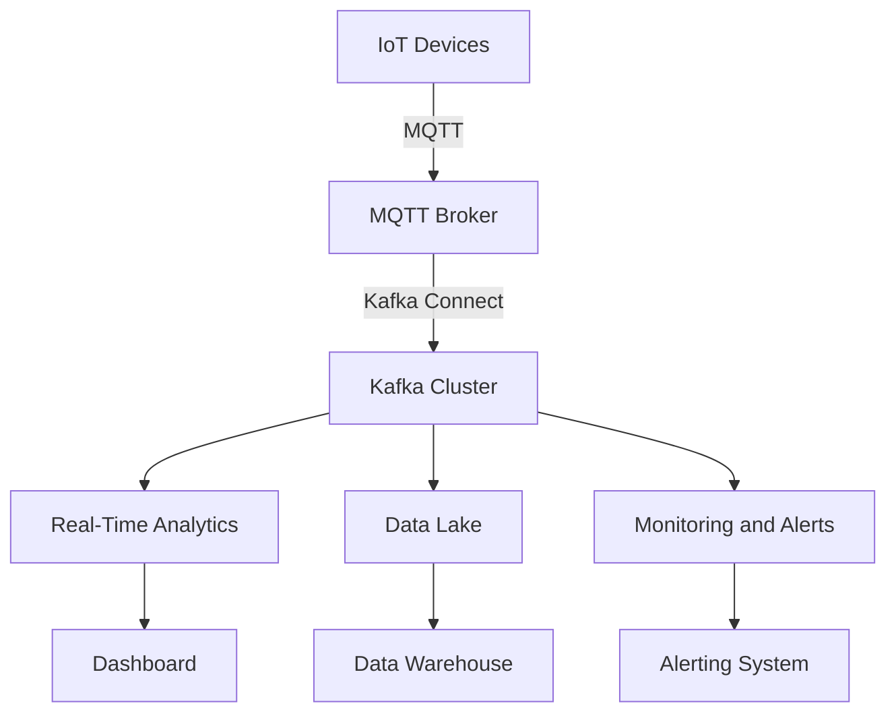

## 1.4.5 Internet of Things (IoT) Applications

The Internet of Things (IoT) represents a paradigm shift in how devices interact with each other and with centralized systems. With billions of devices generating data in real-time, the need for robust, scalable, and efficient data processing systems has never been more critical. Apache Kafka, with its distributed architecture and real-time processing capabilities, is uniquely suited to address the challenges posed by IoT applications. This section delves into the specific requirements of IoT data processing, how Kafka addresses these challenges, and provides real-world examples of IoT use cases such as smart cities and connected vehicles. Additionally, we will explore Kafka's integration with MQTT and considerations for edge computing.

### Specific Requirements of IoT Data Processing

IoT data processing involves several unique challenges and requirements:

- **High Throughput and Low Latency**: IoT systems often involve a large number of devices generating data simultaneously. The system must handle high throughput while maintaining low latency to ensure timely processing and response.
- **Scalability**: As the number of connected devices grows, the data processing system must scale horizontally to accommodate increased data volumes.
- **Fault Tolerance and Reliability**: IoT applications require robust systems that can handle failures gracefully and ensure data reliability and consistency.
- **Real-Time Analytics**: The ability to process and analyze data in real-time is crucial for applications such as predictive maintenance, anomaly detection, and real-time decision-making.
- **Integration with Heterogeneous Devices**: IoT systems involve a wide variety of devices and protocols, necessitating flexible integration capabilities.
- **Security and Privacy**: Ensuring data security and privacy is paramount, especially in applications involving sensitive information.

### How Kafka Addresses IoT Challenges

Apache Kafka is well-equipped to handle the challenges of IoT data processing due to its core features:

- **Distributed Architecture**: Kafka's distributed nature allows it to handle large volumes of data by distributing the load across multiple brokers. This architecture supports horizontal scaling, making it ideal for IoT applications.
- **High Throughput and Low Latency**: Kafka is designed for high throughput and low latency, enabling it to process millions of messages per second with minimal delay.
- **Fault Tolerance**: Kafka's replication mechanism ensures data durability and availability, even in the event of broker failures.
- **Real-Time Processing**: Kafka Streams API and Kafka Connect enable real-time data processing and integration with various data sources and sinks.
- **Integration with MQTT**: Kafka can integrate with MQTT, a lightweight messaging protocol commonly used in IoT, to facilitate communication between devices and the Kafka ecosystem.
- **Security Features**: Kafka provides robust security features, including encryption, authentication, and authorization, to protect sensitive IoT data.

### Real-World IoT Use Cases

#### Smart Cities

Smart cities leverage IoT technologies to enhance urban living by improving infrastructure, reducing energy consumption, and optimizing resource management. Kafka plays a crucial role in smart city applications by enabling real-time data processing and analytics.

- **Traffic Management**: Kafka can ingest data from traffic sensors and cameras to monitor traffic flow, detect congestion, and optimize traffic signals in real-time.
- **Energy Management**: Smart grids use Kafka to process data from smart meters and sensors to balance energy supply and demand, reduce outages, and improve energy efficiency.
- **Public Safety**: Kafka can integrate with surveillance systems and emergency response networks to provide real-time alerts and improve response times.

#### Connected Vehicles

Connected vehicles generate vast amounts of data from sensors, cameras, and onboard systems. Kafka facilitates the real-time processing and analysis of this data to enhance vehicle safety, efficiency, and user experience.

- **Telematics**: Kafka can process data from vehicle sensors to monitor vehicle health, track location, and provide predictive maintenance alerts.
- **Autonomous Driving**: Kafka supports the real-time processing of data from cameras and LIDAR systems to enable autonomous driving features.
- **Infotainment Systems**: Kafka can stream data to vehicle infotainment systems to provide real-time updates and personalized content.

### Integration with MQTT

MQTT (Message Queuing Telemetry Transport) is a lightweight messaging protocol widely used in IoT applications due to its low bandwidth requirements and efficient message delivery. Kafka can integrate with MQTT to facilitate communication between IoT devices and the Kafka ecosystem.

- **Kafka Connect MQTT Source Connector**: This connector allows Kafka to consume messages from MQTT brokers, enabling seamless integration between MQTT devices and Kafka topics.
- **Kafka Connect MQTT Sink Connector**: This connector enables Kafka to publish messages to MQTT brokers, allowing Kafka to act as a bridge between IoT devices and other systems.

### Edge Computing Considerations

Edge computing involves processing data closer to the source, reducing latency and bandwidth usage. Kafka can be deployed at the edge to enable real-time data processing and analytics.

- **Local Data Processing**: Kafka can process data locally at the edge, reducing the need to transmit large volumes of data to centralized systems.
- **Data Aggregation and Filtering**: Kafka can aggregate and filter data at the edge, sending only relevant information to centralized systems for further analysis.
- **Integration with Edge Devices**: Kafka can integrate with edge devices and gateways to facilitate real-time data processing and decision-making.

### Code Examples

To illustrate Kafka's role in IoT applications, let's explore some code examples in Java, Scala, Kotlin, and Clojure.

#### Java Example: Kafka Producer for IoT Sensor Data

```java
import org.apache.kafka.clients.producer.KafkaProducer;
import org.apache.kafka.clients.producer.ProducerRecord;
import java.util.Properties;

public class IoTSensorProducer {
    public static void main(String[] args) {
        Properties props = new Properties();
        props.put("bootstrap.servers", "localhost:9092");
        props.put("key.serializer", "org.apache.kafka.common.serialization.StringSerializer");
        props.put("value.serializer", "org.apache.kafka.common.serialization.StringSerializer");

        KafkaProducer<String, String> producer = new KafkaProducer<>(props);

        for (int i = 0; i < 100; i++) {
            String key = "sensor-" + i;
            String value = "temperature:" + (20 + i);
            ProducerRecord<String, String> record = new ProducerRecord<>("iot-sensor-data", key, value);
            producer.send(record);
        }

        producer.close();
    }
}
```

#### Scala Example: Kafka Consumer for IoT Sensor Data

```scala
import org.apache.kafka.clients.consumer.{ConsumerConfig, KafkaConsumer}
import java.util.Properties
import scala.collection.JavaConverters._

object IoTSensorConsumer extends App {
  val props = new Properties()
  props.put(ConsumerConfig.BOOTSTRAP_SERVERS_CONFIG, "localhost:9092")
  props.put(ConsumerConfig.GROUP_ID_CONFIG, "iot-consumer-group")
  props.put(ConsumerConfig.KEY_DESERIALIZER_CLASS_CONFIG, "org.apache.kafka.common.serialization.StringDeserializer")
  props.put(ConsumerConfig.VALUE_DESERIALIZER_CLASS_CONFIG, "org.apache.kafka.common.serialization.StringDeserializer")

  val consumer = new KafkaConsumer[String, String](props)
  consumer.subscribe(List("iot-sensor-data").asJava)

  while (true) {
    val records = consumer.poll(100)
    for (record <- records.asScala) {
      println(s"Received message: ${record.key()} -> ${record.value()}")
    }
  }
}
```

#### Kotlin Example: Kafka Streams for IoT Data Processing

```kotlin
import org.apache.kafka.streams.KafkaStreams
import org.apache.kafka.streams.StreamsBuilder
import org.apache.kafka.streams.kstream.KStream
import java.util.Properties

fun main() {
    val props = Properties()
    props["bootstrap.servers"] = "localhost:9092"
    props["application.id"] = "iot-streams-app"

    val builder = StreamsBuilder()
    val source: KStream<String, String> = builder.stream("iot-sensor-data")
    source.mapValues { value -> "Processed: $value" }
          .to("processed-iot-data")

    val streams = KafkaStreams(builder.build(), props)
    streams.start()
}
```

#### Clojure Example: Kafka Producer for IoT Sensor Data

```clojure
(ns iot-sensor-producer
  (:import (org.apache.kafka.clients.producer KafkaProducer ProducerRecord)
           (java.util Properties)))

(defn create-producer []
  (let [props (doto (Properties.)
                (.put "bootstrap.servers" "localhost:9092")
                (.put "key.serializer" "org.apache.kafka.common.serialization.StringSerializer")
                (.put "value.serializer" "org.apache.kafka.common.serialization.StringSerializer"))]
    (KafkaProducer. props)))

(defn send-messages [producer]
  (doseq [i (range 100)]
    (let [key (str "sensor-" i)
          value (str "temperature:" (+ 20 i))
          record (ProducerRecord. "iot-sensor-data" key value)]
      (.send producer record))))

(defn -main []
  (let [producer (create-producer)]
    (send-messages producer)
    (.close producer)))
```

### Visualizing Kafka's Role in IoT

To better understand Kafka's role in IoT applications, let's visualize the data flow and architecture using Mermaid.js diagrams.

#### Kafka IoT Architecture Diagram



**Caption**: This diagram illustrates how IoT devices communicate with an MQTT broker, which then integrates with a Kafka cluster using Kafka Connect. The Kafka cluster enables real-time analytics, data storage, and monitoring.

### Knowledge Check

To reinforce your understanding of Kafka's role in IoT applications, consider the following questions and exercises:

- **Exercise**: Modify the Java producer example to simulate data from multiple sensor types (e.g., temperature, humidity, pressure).
- **Question**: How does Kafka's distributed architecture contribute to its scalability in IoT applications?
- **Exercise**: Implement a Kafka Streams application in Scala to filter and aggregate sensor data based on specific criteria.

### Conclusion

Apache Kafka is a powerful tool for managing IoT data, offering scalability, fault tolerance, and real-time processing capabilities. By integrating with protocols like MQTT and supporting edge computing, Kafka enables a wide range of IoT applications, from smart cities to connected vehicles. As IoT continues to evolve, Kafka's role in processing and analyzing real-time data will become increasingly vital.

## Test Your Knowledge: IoT Applications with Apache Kafka Quiz



### What is a primary challenge of IoT data processing that Kafka addresses?

- [x] High throughput and low latency
- [ ] Limited device connectivity
- [ ] Static data storage
- [ ] Manual data processing

> **Explanation:** Kafka is designed to handle high throughput and low latency, making it ideal for processing the large volumes of data generated by IoT devices.

### How does Kafka ensure data reliability in IoT applications?

- [x] Through replication and fault tolerance
- [ ] By using a single broker
- [ ] By storing data in memory
- [ ] By limiting the number of producers

> **Explanation:** Kafka's replication mechanism ensures data durability and availability, even in the event of broker failures.

### Which protocol is commonly used in IoT applications and can be integrated with Kafka?

- [x] MQTT
- [ ] HTTP
- [ ] FTP
- [ ] SMTP

> **Explanation:** MQTT is a lightweight messaging protocol widely used in IoT applications, and Kafka can integrate with it using Kafka Connect.

### What is an example of a smart city application that uses Kafka?

- [x] Traffic management
- [ ] Personal fitness tracking
- [ ] Online shopping
- [ ] Social media analytics

> **Explanation:** Kafka can ingest data from traffic sensors and cameras to monitor traffic flow and optimize traffic signals in real-time.

### In edge computing, what role does Kafka play?

- [x] Local data processing and aggregation
- [ ] Centralized data storage
- [ ] Manual data entry
- [ ] Offline data analysis

> **Explanation:** Kafka can process data locally at the edge, reducing the need to transmit large volumes of data to centralized systems.

### Which Kafka feature supports real-time data processing in IoT applications?

- [x] Kafka Streams API
- [ ] Kafka CLI Tools
- [ ] Kafka MirrorMaker
- [ ] Kafka Log Compaction

> **Explanation:** The Kafka Streams API enables real-time data processing and analytics, making it suitable for IoT applications.

### What is a benefit of integrating Kafka with MQTT in IoT applications?

- [x] Seamless communication between devices and Kafka topics
- [ ] Increased data storage capacity
- [ ] Reduced network bandwidth
- [ ] Simplified user interfaces

> **Explanation:** Integrating Kafka with MQTT allows seamless communication between IoT devices and the Kafka ecosystem.

### How does Kafka support scalability in IoT applications?

- [x] By distributing the load across multiple brokers
- [ ] By using a single broker
- [ ] By limiting the number of consumers
- [ ] By storing data in memory

> **Explanation:** Kafka's distributed architecture allows it to handle large volumes of data by distributing the load across multiple brokers.

### What is a key consideration when deploying Kafka at the edge?

- [x] Local data processing and filtering
- [ ] Centralized data storage
- [ ] Manual data entry
- [ ] Offline data analysis

> **Explanation:** Kafka can process and filter data locally at the edge, reducing the need to transmit large volumes of data to centralized systems.

### True or False: Kafka is not suitable for real-time analytics in IoT applications.

- [ ] True
- [x] False

> **Explanation:** Kafka is well-suited for real-time analytics in IoT applications due to its high throughput, low latency, and real-time processing capabilities.


