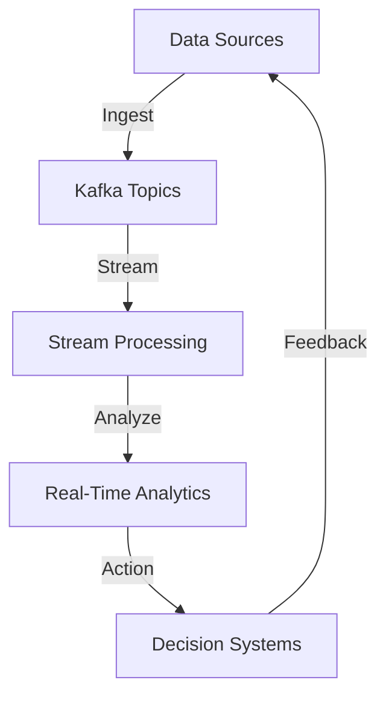

## 1.4 Use Cases for Kafka in Enterprise Systems

Apache Kafka has emerged as a cornerstone technology for modern data architectures, enabling enterprises to handle vast amounts of data in real-time. This section delves into various use cases where Kafka is applied in enterprise settings, demonstrating its versatility in addressing different data processing requirements across industries. By exploring these scenarios, we aim to provide a comprehensive understanding of Kafka's capabilities and the transformative impact it can have on enterprise systems.

### 1.4.1 Event-Driven Microservices

#### Problem Addressed

In traditional monolithic architectures, services are tightly coupled, leading to challenges in scalability, maintainability, and deployment. As enterprises transition to microservices architectures, they face the challenge of ensuring seamless communication between independent services without creating dependencies that negate the benefits of microservices.

#### Kafka's Solution

Kafka serves as a robust backbone for event-driven microservices by decoupling service interactions through asynchronous messaging. It allows services to communicate via events, enabling them to operate independently and scale autonomously. This decoupling fosters a more resilient and scalable architecture.

#### Real-World Example

Consider a large e-commerce platform that handles millions of transactions daily. By adopting Kafka, the platform can decouple its order processing, inventory management, and notification services. When a customer places an order, an event is published to a Kafka topic. The inventory service consumes this event to update stock levels, while the notification service sends order confirmations to the customer.

#### Benefits and Outcomes

- **Scalability**: Services can scale independently based on demand.
- **Resilience**: Failure in one service does not impact others.
- **Flexibility**: New services can be added without disrupting existing ones.

### 1.4.2 Real-Time Data Pipelines

#### Problem Addressed

Enterprises need to process and analyze data in real-time to make informed decisions. Traditional batch processing systems introduce latency, delaying insights and actions.

#### Kafka's Solution

Kafka enables the construction of real-time data pipelines that ingest, process, and analyze data as it arrives. By leveraging Kafka's high-throughput, low-latency capabilities, enterprises can build pipelines that deliver insights in real-time.

#### Real-World Example

A financial services company uses Kafka to build a real-time fraud detection system. Transactions are streamed into Kafka, where they are processed by a stream processing application that applies machine learning models to detect fraudulent activity. Alerts are generated and sent to analysts for immediate action.

#### Benefits and Outcomes

- **Reduced Latency**: Immediate processing of data as it arrives.
- **Improved Decision-Making**: Real-time insights lead to faster and more informed decisions.
- **Enhanced Security**: Quick detection and response to fraudulent activities.

### 1.4.3 Stream Processing Applications

#### Problem Addressed

Many enterprises require the ability to process continuous streams of data to derive insights and drive actions. Traditional systems struggle with the volume and velocity of data streams.

#### Kafka's Solution

Kafka, combined with the Kafka Streams API, provides a powerful platform for building stream processing applications. It allows enterprises to perform complex transformations and aggregations on data streams in real-time.

#### Real-World Example

A telecommunications company uses Kafka Streams to monitor network traffic in real-time. By processing data streams, the company can detect anomalies, optimize network performance, and enhance customer experience.

#### Benefits and Outcomes

- **Real-Time Analytics**: Continuous processing of data streams for immediate insights.
- **Scalability**: Handle large volumes of data with ease.
- **Operational Efficiency**: Automate responses to network conditions.

### 1.4.4 Big Data Integration

#### Problem Addressed

Enterprises often struggle to integrate and process large volumes of data from diverse sources. Traditional ETL (Extract, Transform, Load) processes are not designed for real-time data integration.

#### Kafka's Solution

Kafka acts as a central hub for big data integration, enabling seamless data flow between systems. It supports real-time data ingestion and processing, facilitating the integration of big data platforms like Hadoop and Spark.

#### Real-World Example

A retail company integrates its point-of-sale systems, online store, and customer relationship management (CRM) platform using Kafka. Data from these sources is streamed into a data lake, where it is processed and analyzed to gain insights into customer behavior and optimize marketing strategies.

#### Benefits and Outcomes

- **Unified Data Platform**: Centralized data integration across systems.
- **Real-Time Processing**: Immediate access to data for analysis.
- **Enhanced Insights**: Comprehensive view of customer interactions.

### 1.4.5 Internet of Things (IoT) Applications

#### Problem Addressed

IoT applications generate massive amounts of data from connected devices. Enterprises need to process this data in real-time to derive actionable insights and drive automation.

#### Kafka's Solution

Kafka provides a scalable and reliable platform for ingesting and processing IoT data. It supports high-throughput data streams and integrates with stream processing frameworks to enable real-time analytics and automation.

#### Real-World Example

A smart city initiative uses Kafka to collect data from sensors deployed across the city. This data is processed in real-time to monitor traffic conditions, optimize energy usage, and enhance public safety.

#### Benefits and Outcomes

- **Scalability**: Handle large volumes of IoT data with ease.
- **Real-Time Insights**: Immediate analysis of sensor data for actionable insights.
- **Automation**: Enable automated responses to changing conditions.

### Visualizing Kafka Use Cases

To better understand how Kafka fits into these enterprise use cases, consider the following diagram illustrating Kafka's role in a real-time data pipeline:

**Diagram Explanation**: This diagram represents a typical real-time data pipeline using Kafka. Data from various sources is ingested into Kafka topics. Stream processing applications consume the data, perform analysis, and drive actions in decision systems. Feedback loops ensure continuous improvement and adaptation.

### Conclusion

Apache Kafka's versatility and robustness make it an ideal choice for a wide range of enterprise use cases. From enabling event-driven microservices to powering real-time data pipelines and IoT applications, Kafka provides the foundation for scalable, resilient, and efficient data processing architectures. By leveraging Kafka, enterprises can achieve significant improvements in scalability, resilience, and real-time insights, driving innovation and competitive advantage.

## Test Your Knowledge: Kafka Use Cases in Enterprise Systems



### Which of the following is a primary benefit of using Kafka for event-driven microservices?

- [x] Decoupling service interactions
- [ ] Increasing database transactions
- [ ] Reducing network latency
- [ ] Enhancing user interface design

> **Explanation:** Kafka decouples service interactions by enabling asynchronous messaging, allowing services to operate independently and scale autonomously.

### How does Kafka enable real-time data pipelines?

- [x] By providing high-throughput, low-latency data streaming
- [ ] By storing data in a relational database
- [ ] By using batch processing techniques
- [ ] By reducing data redundancy

> **Explanation:** Kafka's high-throughput, low-latency capabilities allow for the construction of real-time data pipelines that process and analyze data as it arrives.

### What is a key advantage of using Kafka Streams for stream processing applications?

- [x] Real-time analytics
- [ ] Batch processing
- [ ] Manual data entry
- [ ] Static data analysis

> **Explanation:** Kafka Streams enables real-time analytics by continuously processing data streams for immediate insights.

### In what way does Kafka facilitate big data integration?

- [x] By acting as a central hub for data flow
- [ ] By replacing all existing data systems
- [ ] By storing data in spreadsheets
- [ ] By limiting data access

> **Explanation:** Kafka acts as a central hub for big data integration, enabling seamless data flow between systems and supporting real-time data ingestion and processing.

### What role does Kafka play in IoT applications?

- [x] Ingesting and processing IoT data
- [ ] Designing IoT hardware
- [ ] Manufacturing IoT devices
- [ ] Selling IoT products

> **Explanation:** Kafka provides a scalable and reliable platform for ingesting and processing IoT data, supporting high-throughput data streams and enabling real-time analytics and automation.

### Which of the following is NOT a benefit of using Kafka in enterprise systems?

- [ ] Scalability
- [ ] Resilience
- [ ] Real-time insights
- [x] Increased manual data entry

> **Explanation:** Kafka reduces the need for manual data entry by automating data processing and providing real-time insights.

### How does Kafka contribute to the scalability of microservices?

- [x] By allowing services to scale independently
- [ ] By centralizing all service logic
- [ ] By reducing the number of services
- [ ] By increasing service dependencies

> **Explanation:** Kafka allows services to scale independently by decoupling service interactions through asynchronous messaging.

### What is a common use case for Kafka in financial services?

- [x] Real-time fraud detection
- [ ] Manual transaction processing
- [ ] Static report generation
- [ ] Paper-based record keeping

> **Explanation:** Kafka is commonly used in financial services for real-time fraud detection by streaming transactions and applying machine learning models to detect fraudulent activity.

### How does Kafka enhance operational efficiency in telecommunications?

- [x] By automating responses to network conditions
- [ ] By increasing manual network monitoring
- [ ] By reducing network capacity
- [ ] By eliminating network traffic

> **Explanation:** Kafka enhances operational efficiency in telecommunications by automating responses to network conditions through real-time stream processing.

### True or False: Kafka can be used to build data lakes for comprehensive data analysis.

- [x] True
- [ ] False

> **Explanation:** True. Kafka can be used to build data lakes by integrating diverse data sources and enabling real-time data ingestion and processing for comprehensive analysis.



---
