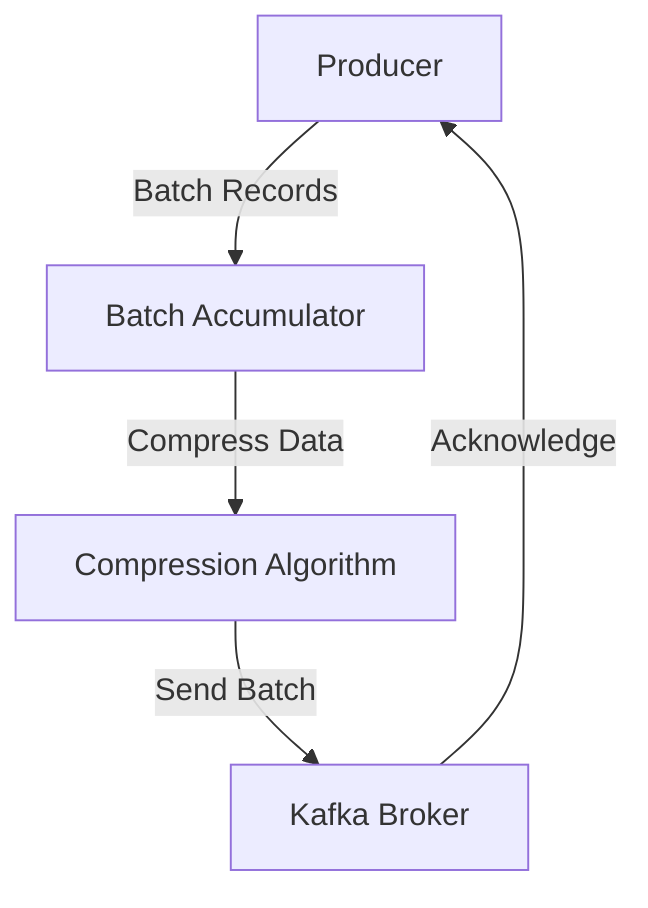

## 10.1.1 Batch Size and Compression Settings

In the realm of Apache Kafka, optimizing producer performance is crucial for building scalable and efficient data pipelines. Two pivotal settings that significantly influence producer throughput and network efficiency are batch size and compression settings. This section delves into these configurations, providing expert insights and practical guidelines for fine-tuning your Kafka producers.

### Understanding Batch Size in Kafka Producers

**Batch Size** refers to the amount of data that a Kafka producer sends to a broker in a single request. By default, Kafka producers accumulate records into batches before sending them to the broker, which can lead to more efficient network usage and increased throughput.

#### How Batch Size Influences Producer Behavior

1. **Throughput Enhancement**: Larger batch sizes can increase throughput by reducing the overhead associated with each network request. When multiple records are sent together, the cost of network latency and request processing is amortized over a larger payload.

2. **Network Efficiency**: Sending data in larger batches reduces the number of network calls, which can significantly decrease network congestion and improve overall system performance.

3. **Latency Considerations**: While larger batches improve throughput, they may introduce additional latency, as the producer waits to accumulate enough records to fill a batch. This trade-off must be carefully managed, especially in low-latency applications.

4. **Memory Utilization**: Larger batch sizes require more memory on the producer side to buffer records before sending. This can impact the memory footprint of the producer application.

#### Benefits and Drawbacks of Increasing Batch Sizes

- **Benefits**:
  - **Higher Throughput**: By reducing the number of requests, larger batches can lead to higher data throughput.
  - **Reduced Network Overhead**: Fewer requests mean less network overhead, which can improve network efficiency.

- **Drawbacks**:
  - **Increased Latency**: Waiting to fill a batch can introduce latency, which may not be acceptable in real-time applications.
  - **Higher Memory Usage**: Larger batches require more memory to buffer records, which can be a constraint in resource-limited environments.

### Configuring Batch Size

To configure the batch size in a Kafka producer, you can use the `batch.size` configuration parameter. This parameter specifies the maximum number of bytes to include in a batch. Here is an example configuration in Java:

```java
Properties props = new Properties();
props.put("bootstrap.servers", "localhost:9092");
props.put("key.serializer", "org.apache.kafka.common.serialization.StringSerializer");
props.put("value.serializer", "org.apache.kafka.common.serialization.StringSerializer");
props.put("batch.size", 16384); // Set batch size to 16 KB

KafkaProducer<String, String> producer = new KafkaProducer<>(props);
```

In this example, the batch size is set to 16 KB. Adjusting this value can help optimize the trade-off between throughput and latency based on your specific use case.

### Exploring Compression Algorithms in Kafka

Compression is another powerful tool for optimizing Kafka producer performance. By compressing data before sending it to the broker, you can reduce the amount of data transmitted over the network, leading to improved throughput and reduced network usage.

#### Supported Compression Algorithms

Kafka supports several compression algorithms, each with its own characteristics:

1. **Gzip**: Offers high compression ratios but can be CPU-intensive. It is suitable for scenarios where network bandwidth is a bottleneck, and CPU resources are available.

2. **Snappy**: Provides fast compression and decompression with moderate compression ratios. It is ideal for applications where CPU usage is a concern, and moderate compression is sufficient.

3. **LZ4**: Known for its high-speed compression and decompression, LZ4 is suitable for low-latency applications where speed is critical.

4. **ZSTD (Zstandard)**: Offers a good balance between compression ratio and speed. It is highly configurable, allowing you to adjust the compression level based on your needs.

#### Selecting Appropriate Compression Types

When choosing a compression algorithm, consider the following factors:

- **Network Bandwidth**: If network bandwidth is limited, opt for algorithms with higher compression ratios like Gzip or ZSTD.
- **CPU Availability**: If CPU resources are constrained, choose faster algorithms like Snappy or LZ4.
- **Latency Requirements**: For low-latency applications, prioritize algorithms with fast compression and decompression speeds, such as LZ4.

### Configuring Compression in Kafka Producers

To enable compression in a Kafka producer, use the `compression.type` configuration parameter. Here is an example configuration in Scala:

```scala
import java.util.Properties
import org.apache.kafka.clients.producer.{KafkaProducer, ProducerConfig}
import org.apache.kafka.common.serialization.StringSerializer

val props = new Properties()
props.put(ProducerConfig.BOOTSTRAP_SERVERS_CONFIG, "localhost:9092")
props.put(ProducerConfig.KEY_SERIALIZER_CLASS_CONFIG, classOf[StringSerializer].getName)
props.put(ProducerConfig.VALUE_SERIALIZER_CLASS_CONFIG, classOf[StringSerializer].getName)
props.put(ProducerConfig.COMPRESSION_TYPE_CONFIG, "lz4") // Use LZ4 compression

val producer = new KafkaProducer[String, String](props)
```

In this example, LZ4 compression is enabled for the producer. Adjust the `compression.type` parameter to switch between different algorithms based on your requirements.

### Practical Scenarios for Batch Size and Compression Optimization

1. **High-Throughput Data Pipelines**: In scenarios where maximizing throughput is critical, such as [1.4.2 Real-Time Data Pipelines]( "Real-Time Data Pipelines"), increasing batch size and enabling compression can significantly enhance performance.

2. **Network-Constrained Environments**: In environments with limited network bandwidth, such as [3.4.1 Designing Cross-Region Architectures]( "Designing Cross-Region Architectures"), using compression can reduce the amount of data transmitted, improving efficiency.

3. **Resource-Limited Systems**: In systems with limited CPU or memory resources, careful tuning of batch size and compression settings can help balance performance and resource utilization.

### Code Examples in Multiple Languages

#### Java

```java
Properties props = new Properties();
props.put("bootstrap.servers", "localhost:9092");
props.put("key.serializer", "org.apache.kafka.common.serialization.StringSerializer");
props.put("value.serializer", "org.apache.kafka.common.serialization.StringSerializer");
props.put("batch.size", 32768); // Set batch size to 32 KB
props.put("compression.type", "gzip"); // Use Gzip compression

KafkaProducer<String, String> producer = new KafkaProducer<>(props);
```

#### Scala

```scala
import java.util.Properties
import org.apache.kafka.clients.producer.{KafkaProducer, ProducerConfig}
import org.apache.kafka.common.serialization.StringSerializer

val props = new Properties()
props.put(ProducerConfig.BOOTSTRAP_SERVERS_CONFIG, "localhost:9092")
props.put(ProducerConfig.KEY_SERIALIZER_CLASS_CONFIG, classOf[StringSerializer].getName)
props.put(ProducerConfig.VALUE_SERIALIZER_CLASS_CONFIG, classOf[StringSerializer].getName)
props.put(ProducerConfig.BATCH_SIZE_CONFIG, "32768") // Set batch size to 32 KB
props.put(ProducerConfig.COMPRESSION_TYPE_CONFIG, "gzip") // Use Gzip compression

val producer = new KafkaProducer[String, String](props)
```

#### Kotlin

```kotlin
import org.apache.kafka.clients.producer.KafkaProducer
import org.apache.kafka.clients.producer.ProducerConfig
import org.apache.kafka.common.serialization.StringSerializer
import java.util.Properties

val props = Properties().apply {
    put(ProducerConfig.BOOTSTRAP_SERVERS_CONFIG, "localhost:9092")
    put(ProducerConfig.KEY_SERIALIZER_CLASS_CONFIG, StringSerializer::class.java.name)
    put(ProducerConfig.VALUE_SERIALIZER_CLASS_CONFIG, StringSerializer::class.java.name)
    put(ProducerConfig.BATCH_SIZE_CONFIG, "32768") // Set batch size to 32 KB
    put(ProducerConfig.COMPRESSION_TYPE_CONFIG, "gzip") // Use Gzip compression
}

val producer = KafkaProducer<String, String>(props)
```

#### Clojure

```clojure
(import '[org.apache.kafka.clients.producer KafkaProducer ProducerConfig]
        '[org.apache.kafka.common.serialization StringSerializer])

(def props
  (doto (java.util.Properties.)
    (.put ProducerConfig/BOOTSTRAP_SERVERS_CONFIG "localhost:9092")
    (.put ProducerConfig/KEY_SERIALIZER_CLASS_CONFIG StringSerializer)
    (.put ProducerConfig/VALUE_SERIALIZER_CLASS_CONFIG StringSerializer)
    (.put ProducerConfig/BATCH_SIZE_CONFIG "32768") ; Set batch size to 32 KB
    (.put ProducerConfig/COMPRESSION_TYPE_CONFIG "gzip"))) ; Use Gzip compression

(def producer (KafkaProducer. props))
```

### Visualizing Batch Size and Compression Impact

To better understand the impact of batch size and compression settings, consider the following diagram illustrating the data flow in a Kafka producer:



**Caption**: This diagram illustrates the flow of data in a Kafka producer, highlighting the role of batch accumulation and compression before sending data to the broker.

### Key Takeaways

- **Batch Size**: Larger batch sizes can improve throughput and network efficiency but may increase latency and memory usage.
- **Compression**: Choosing the right compression algorithm can reduce network usage and improve throughput, with trade-offs in CPU utilization and latency.
- **Configuration**: Fine-tune `batch.size` and `compression.type` based on your specific use case and resource constraints.
- **Practical Application**: Use these optimizations in high-throughput, network-constrained, or resource-limited environments to enhance Kafka producer performance.

## Test Your Knowledge: Kafka Producer Optimization Quiz



### What is the primary benefit of increasing the batch size in Kafka producers?

- [x] Higher throughput and reduced network overhead
- [ ] Lower memory usage
- [ ] Reduced CPU utilization
- [ ] Increased latency

> **Explanation:** Increasing the batch size allows more records to be sent in a single request, reducing network overhead and increasing throughput.

### Which compression algorithm is known for its high-speed compression and decompression?

- [ ] Gzip
- [ ] Snappy
- [x] LZ4
- [ ] ZSTD

> **Explanation:** LZ4 is known for its high-speed compression and decompression, making it suitable for low-latency applications.

### What is a potential drawback of using larger batch sizes?

- [ ] Increased network overhead
- [x] Increased latency
- [ ] Reduced throughput
- [ ] Lower memory usage

> **Explanation:** Larger batch sizes can introduce additional latency as the producer waits to accumulate enough records to fill a batch.

### Which compression algorithm offers the highest compression ratio but is CPU-intensive?

- [x] Gzip
- [ ] Snappy
- [ ] LZ4
- [ ] ZSTD

> **Explanation:** Gzip offers high compression ratios but can be CPU-intensive, making it suitable for scenarios where network bandwidth is a bottleneck.

### How can you configure the batch size in a Kafka producer?

- [x] Using the `batch.size` configuration parameter
- [ ] Using the `compression.type` configuration parameter
- [ ] Using the `linger.ms` configuration parameter
- [ ] Using the `acks` configuration parameter

> **Explanation:** The `batch.size` configuration parameter specifies the maximum number of bytes to include in a batch.

### Which compression algorithm provides a good balance between compression ratio and speed?

- [ ] Gzip
- [ ] Snappy
- [ ] LZ4
- [x] ZSTD

> **Explanation:** ZSTD offers a good balance between compression ratio and speed, making it highly configurable for various needs.

### In which scenario is using compression most beneficial?

- [x] Network-constrained environments
- [ ] CPU-constrained environments
- [ ] Memory-constrained environments
- [ ] Low-latency applications

> **Explanation:** Compression is most beneficial in network-constrained environments as it reduces the amount of data transmitted over the network.

### What is the effect of enabling compression in Kafka producers?

- [x] Reduced network usage
- [ ] Increased memory usage
- [ ] Increased network overhead
- [ ] Reduced throughput

> **Explanation:** Enabling compression reduces the amount of data transmitted over the network, improving network efficiency.

### Which configuration parameter is used to enable compression in Kafka producers?

- [ ] `batch.size`
- [x] `compression.type`
- [ ] `linger.ms`
- [ ] `acks`

> **Explanation:** The `compression.type` configuration parameter is used to enable and specify the compression algorithm in Kafka producers.

### True or False: Larger batch sizes always lead to lower latency.

- [ ] True
- [x] False

> **Explanation:** Larger batch sizes can increase latency as the producer waits to accumulate enough records to fill a batch.



By understanding and optimizing batch size and compression settings, you can significantly enhance the performance of your Kafka producers, ensuring efficient data transmission and processing across your distributed systems.
