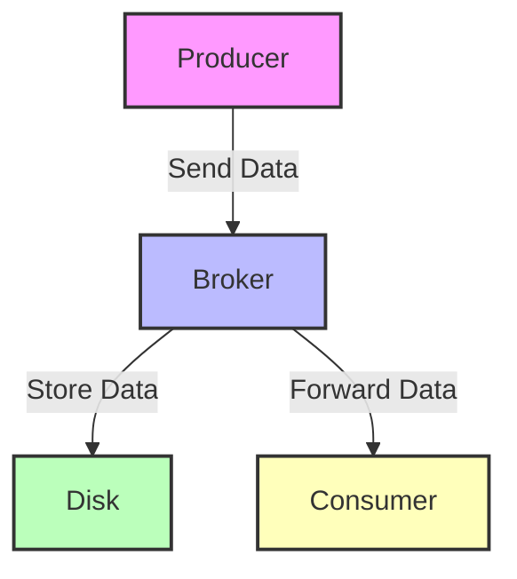

## 10.1.3 Network and I/O Optimization

In the realm of Apache Kafka, optimizing network and I/O parameters is crucial for achieving high performance, particularly in terms of reducing latency and increasing throughput for Kafka clients. This section delves into the intricacies of network configuration, I/O settings, and advanced techniques such as Zero-Copy transfer, providing expert guidance for software engineers and enterprise architects.

### Impact of Network Configuration on Client Performance

Network configuration plays a pivotal role in the performance of Kafka clients. The efficiency of data transmission between producers, brokers, and consumers can significantly affect the overall system throughput and latency. Key network parameters include buffer sizes, linger times, and TCP settings, all of which can be fine-tuned to optimize performance.

#### Key Network Settings

1. **`linger.ms`**: This setting controls the amount of time a producer will wait before sending a batch of messages. By increasing `linger.ms`, you allow more messages to accumulate in a batch, which can improve throughput at the cost of increased latency.

2. **`receive.buffer.bytes` and `send.buffer.bytes`**: These settings define the size of the TCP receive and send buffers. Larger buffer sizes can accommodate more data, reducing the likelihood of network congestion and improving throughput.

3. **TCP Settings**: Optimizing TCP settings such as `tcp_nodelay`, `tcp_window_scaling`, and `tcp_rmem` can enhance data transmission efficiency. Disabling `tcp_nodelay` can reduce latency by allowing small packets to be sent immediately, while enabling window scaling can improve throughput over high-latency networks.

### Configuring I/O Threads and Selectors

Kafka's architecture relies heavily on I/O operations, making the configuration of I/O threads and selectors critical for performance optimization.

#### I/O Threads

- **Producer and Consumer I/O Threads**: Adjusting the number of I/O threads can help balance the load and prevent bottlenecks. More threads can handle more concurrent connections, but excessive threads may lead to context switching overhead.

- **Broker I/O Threads**: Brokers also benefit from optimized I/O thread settings. Increasing the number of network threads (`num.network.threads`) and I/O threads (`num.io.threads`) can improve the broker's ability to handle high volumes of data.

#### Selectors

- **Selector Configuration**: Kafka uses selectors to manage I/O operations. Fine-tuning selector configurations can enhance performance by reducing the time spent waiting for I/O operations to complete.

### Optimizing TCP Settings

TCP settings are fundamental to network performance. Properly configured TCP parameters can significantly reduce latency and increase throughput.

#### Key TCP Parameters

- **`tcp_nodelay`**: This parameter disables Nagle's algorithm, allowing small packets to be sent immediately without delay. This is beneficial for low-latency applications.

- **`tcp_window_scaling`**: Enabling window scaling allows for larger TCP window sizes, which can improve throughput over high-latency networks.

- **`tcp_rmem` and `tcp_wmem`**: These parameters define the minimum, default, and maximum sizes of the TCP read and write buffers. Increasing these values can enhance performance by allowing more data to be buffered.

### Leveraging Zero-Copy Transfer

Zero-Copy transfer is an advanced technique that can significantly improve I/O performance by reducing CPU overhead and memory usage.

#### Understanding Zero-Copy

Zero-Copy allows data to be transferred directly from disk to network without being copied into application memory. This reduces CPU usage and speeds up data transfer, making it ideal for high-throughput applications.

#### Implementing Zero-Copy in Kafka

Kafka supports Zero-Copy transfer through its use of the `sendfile` system call. By enabling Zero-Copy, Kafka can achieve higher throughput and lower latency, particularly for large message sizes.

### Practical Examples and Configurations

To illustrate the impact of different configurations, let's explore some practical examples in various programming languages.

#### Java Example

```java
import org.apache.kafka.clients.producer.KafkaProducer;
import org.apache.kafka.clients.producer.ProducerConfig;
import org.apache.kafka.common.serialization.StringSerializer;

import java.util.Properties;

public class KafkaProducerExample {
    public static void main(String[] args) {
        Properties props = new Properties();
        props.put(ProducerConfig.BOOTSTRAP_SERVERS_CONFIG, "localhost:9092");
        props.put(ProducerConfig.KEY_SERIALIZER_CLASS_CONFIG, StringSerializer.class.getName());
        props.put(ProducerConfig.VALUE_SERIALIZER_CLASS_CONFIG, StringSerializer.class.getName());
        props.put(ProducerConfig.LINGER_MS_CONFIG, 10); // Increase linger.ms for better throughput
        props.put(ProducerConfig.SEND_BUFFER_CONFIG, 128 * 1024); // Increase send buffer size

        KafkaProducer<String, String> producer = new KafkaProducer<>(props);
        // Produce messages...
    }
}
```

#### Scala Example

```scala
import org.apache.kafka.clients.producer.{KafkaProducer, ProducerConfig}
import org.apache.kafka.common.serialization.StringSerializer

import java.util.Properties

object KafkaProducerExample {
  def main(args: Array[String]): Unit = {
    val props = new Properties()
    props.put(ProducerConfig.BOOTSTRAP_SERVERS_CONFIG, "localhost:9092")
    props.put(ProducerConfig.KEY_SERIALIZER_CLASS_CONFIG, classOf[StringSerializer].getName)
    props.put(ProducerConfig.VALUE_SERIALIZER_CLASS_CONFIG, classOf[StringSerializer].getName)
    props.put(ProducerConfig.LINGER_MS_CONFIG, "10") // Increase linger.ms for better throughput
    props.put(ProducerConfig.SEND_BUFFER_CONFIG, (128 * 1024).toString) // Increase send buffer size

    val producer = new KafkaProducer[String, String](props)
    // Produce messages...
  }
}
```

#### Kotlin Example

```kotlin
import org.apache.kafka.clients.producer.KafkaProducer
import org.apache.kafka.clients.producer.ProducerConfig
import org.apache.kafka.common.serialization.StringSerializer
import java.util.Properties

fun main() {
    val props = Properties().apply {
        put(ProducerConfig.BOOTSTRAP_SERVERS_CONFIG, "localhost:9092")
        put(ProducerConfig.KEY_SERIALIZER_CLASS_CONFIG, StringSerializer::class.java.name)
        put(ProducerConfig.VALUE_SERIALIZER_CLASS_CONFIG, StringSerializer::class.java.name)
        put(ProducerConfig.LINGER_MS_CONFIG, 10) // Increase linger.ms for better throughput
        put(ProducerConfig.SEND_BUFFER_CONFIG, 128 * 1024) // Increase send buffer size
    }

    val producer = KafkaProducer<String, String>(props)
    // Produce messages...
}
```

#### Clojure Example

```clojure
(require '[clojure.java.io :as io])
(import '[org.apache.kafka.clients.producer KafkaProducer ProducerConfig]
        '[org.apache.kafka.common.serialization StringSerializer])

(defn create-producer []
  (let [props (doto (java.util.Properties.)
                (.put ProducerConfig/BOOTSTRAP_SERVERS_CONFIG "localhost:9092")
                (.put ProducerConfig/KEY_SERIALIZER_CLASS_CONFIG (StringSerializer.))
                (.put ProducerConfig/VALUE_SERIALIZER_CLASS_CONFIG (StringSerializer.))
                (.put ProducerConfig/LINGER_MS_CONFIG 10) ; Increase linger.ms for better throughput
                (.put ProducerConfig/SEND_BUFFER_CONFIG (* 128 1024)))] ; Increase send buffer size
    (KafkaProducer. props)))

(def producer (create-producer))
;; Produce messages...
```

### Visualizing Kafka's Network and I/O Architecture

To better understand the flow of data and the role of network and I/O optimization, consider the following diagram:



**Diagram Explanation**: This diagram illustrates the data flow in a Kafka system, highlighting the role of producers, brokers, and consumers. Network and I/O optimization can enhance the efficiency of data transmission between these components.

### Strategies for Optimizing Network and I/O

1. **Batching and Compression**: Use batching and compression to reduce the number of network calls and the amount of data transmitted. This can significantly improve throughput.

2. **Asynchronous Processing**: Implement asynchronous processing to allow producers and consumers to handle multiple requests concurrently, reducing latency.

3. **Network Segmentation**: Segment your network to isolate Kafka traffic, reducing interference and improving performance.

4. **Load Balancing**: Use load balancing to distribute traffic evenly across brokers, preventing any single broker from becoming a bottleneck.

5. **Monitoring and Tuning**: Continuously monitor network performance and adjust configurations as needed to maintain optimal performance.

### Knowledge Check

To reinforce your understanding of network and I/O optimization in Kafka, consider the following questions:

1. What is the impact of increasing `linger.ms` on message latency and throughput?
2. How can Zero-Copy transfer improve Kafka performance?
3. Why is it important to configure TCP settings for Kafka clients?
4. What role do I/O threads play in Kafka's architecture?
5. How can batching and compression enhance network performance?

### Summary

Optimizing network and I/O parameters is essential for achieving high performance in Apache Kafka systems. By fine-tuning settings such as `linger.ms`, buffer sizes, and TCP parameters, you can significantly reduce latency and increase throughput. Implementing advanced techniques like Zero-Copy transfer and asynchronous processing further enhances performance, ensuring your Kafka clients operate efficiently in real-world scenarios.

## Test Your Knowledge: Network and I/O Optimization in Apache Kafka



### What is the primary benefit of increasing `linger.ms` in Kafka producers?

- [x] It allows more messages to accumulate in a batch, improving throughput.
- [ ] It reduces the memory usage of the producer.
- [ ] It decreases the latency of message delivery.
- [ ] It increases the number of network connections.

> **Explanation:** Increasing `linger.ms` allows more messages to accumulate in a batch before being sent, which can improve throughput but may increase latency.

### How does Zero-Copy transfer enhance Kafka performance?

- [x] By reducing CPU overhead and memory usage.
- [ ] By increasing the number of network connections.
- [ ] By compressing data before sending.
- [ ] By encrypting data in transit.

> **Explanation:** Zero-Copy transfer reduces CPU overhead and memory usage by allowing data to be transferred directly from disk to network without being copied into application memory.

### Which TCP setting can help reduce latency in Kafka applications?

- [x] `tcp_nodelay`
- [ ] `tcp_window_scaling`
- [ ] `tcp_rmem`
- [ ] `tcp_wmem`

> **Explanation:** Disabling `tcp_nodelay` allows small packets to be sent immediately without delay, reducing latency.

### What is the effect of increasing the number of I/O threads in Kafka?

- [x] It can handle more concurrent connections, improving throughput.
- [ ] It reduces the memory usage of the broker.
- [ ] It decreases the latency of message delivery.
- [ ] It increases the number of network connections.

> **Explanation:** Increasing the number of I/O threads allows Kafka to handle more concurrent connections, improving throughput.

### Why is it important to configure TCP window scaling for Kafka clients?

- [x] It allows for larger TCP window sizes, improving throughput over high-latency networks.
- [ ] It reduces the memory usage of the client.
- [ ] It decreases the latency of message delivery.
- [ ] It increases the number of network connections.

> **Explanation:** Enabling TCP window scaling allows for larger TCP window sizes, which can improve throughput over high-latency networks.

### What is the role of selectors in Kafka's architecture?

- [x] They manage I/O operations, reducing the time spent waiting for I/O operations to complete.
- [ ] They compress data before sending.
- [ ] They encrypt data in transit.
- [ ] They increase the number of network connections.

> **Explanation:** Selectors manage I/O operations, reducing the time spent waiting for I/O operations to complete, which can enhance performance.

### How can batching and compression improve network performance in Kafka?

- [x] By reducing the number of network calls and the amount of data transmitted.
- [ ] By increasing the number of network connections.
- [ ] By decreasing the latency of message delivery.
- [ ] By reducing the memory usage of the client.

> **Explanation:** Batching and compression reduce the number of network calls and the amount of data transmitted, which can significantly improve throughput.

### What is the impact of network segmentation on Kafka performance?

- [x] It isolates Kafka traffic, reducing interference and improving performance.
- [ ] It increases the number of network connections.
- [ ] It decreases the latency of message delivery.
- [ ] It reduces the memory usage of the client.

> **Explanation:** Network segmentation isolates Kafka traffic, reducing interference from other network activities and improving performance.

### Why is continuous monitoring important for network performance in Kafka?

- [x] To adjust configurations as needed to maintain optimal performance.
- [ ] To increase the number of network connections.
- [ ] To decrease the latency of message delivery.
- [ ] To reduce the memory usage of the client.

> **Explanation:** Continuous monitoring allows you to adjust configurations as needed to maintain optimal performance and address any issues that arise.

### True or False: Increasing `send.buffer.bytes` always reduces latency in Kafka.

- [ ] True
- [x] False

> **Explanation:** Increasing `send.buffer.bytes` can improve throughput by allowing more data to be buffered, but it does not necessarily reduce latency and may even increase it in some cases.


