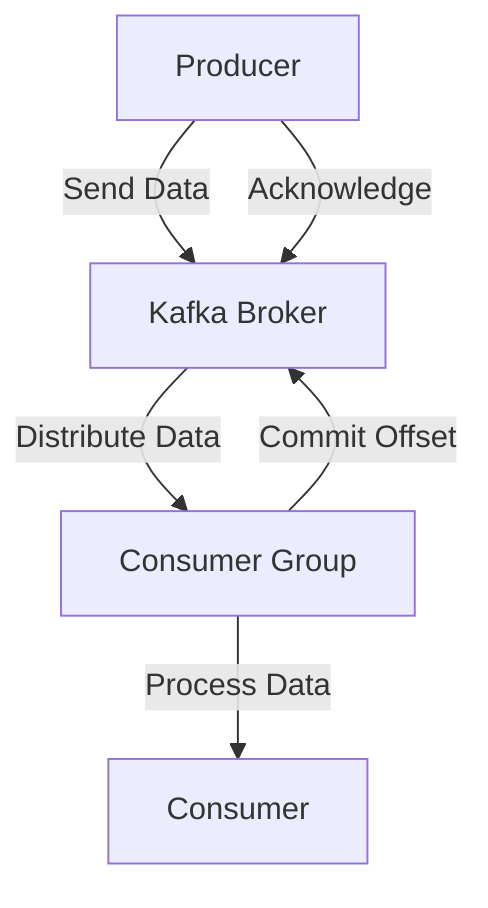

## 10.1 Producer and Consumer Performance Tuning

### Introduction

In the realm of real-time data processing, optimizing the performance of Apache Kafka producers and consumers is crucial for building scalable and efficient systems. Performance tuning involves adjusting configuration settings to enhance throughput, reduce latency, and optimize resource utilization. This section provides a comprehensive guide to fine-tuning Kafka producers and consumers, offering practical examples and recommendations tailored to various scenarios.

### Importance of Performance Tuning

Performance tuning is essential for several reasons:

- **Maximizing Throughput**: Ensures that Kafka can handle high volumes of data efficiently.
- **Reducing Latency**: Critical for applications requiring near-instantaneous data processing.
- **Optimizing Resource Utilization**: Balances CPU, memory, and network usage to prevent bottlenecks.
- **Meeting SLAs**: Helps in adhering to service level agreements by maintaining consistent performance.

### Producer Performance Tuning

Kafka producers are responsible for sending data to Kafka topics. The performance of producers can significantly impact the overall system efficiency. Key configuration settings and strategies for optimizing producer performance include:

#### 1. Batch Size and Compression Settings

- **Batch Size**: Increasing the batch size can improve throughput by reducing the number of requests sent to the broker. However, larger batch sizes may increase latency.

    ```java
    Properties props = new Properties();
    props.put("batch.size", 16384); // Default is 16384 bytes
    ```

- **Compression**: Using compression (e.g., `gzip`, `snappy`, `lz4`) can reduce the amount of data sent over the network, improving throughput at the cost of increased CPU usage.

    ```java
    props.put("compression.type", "gzip");
    ```

#### 2. Memory and Threading Configurations

- **Buffer Memory**: Adjusting the buffer memory size allows the producer to store records before sending them to the broker, which can enhance throughput.

    ```java
    props.put("buffer.memory", 33554432); // Default is 32 MB
    ```

- **Threads**: Increasing the number of threads can improve parallelism and throughput, especially in multi-core environments.

    ```java
    props.put("num.io.threads", 8);
    ```

#### 3. Acknowledgment and Retry Settings

- **Acknowledgments**: Setting the `acks` configuration to `all` ensures that all replicas acknowledge the message, providing stronger durability guarantees at the cost of increased latency.

    ```java
    props.put("acks", "all");
    ```

- **Retries**: Configuring retries can help handle transient errors, but excessive retries can lead to duplicate messages.

    ```java
    props.put("retries", 3);
    ```

#### 4. Asynchronous vs. Synchronous Sending

- **Asynchronous Sending**: Allows the producer to send messages without waiting for an acknowledgment, improving throughput but potentially increasing latency.

    ```java
    producer.send(record, new Callback() {
        public void onCompletion(RecordMetadata metadata, Exception e) {
            if (e != null) e.printStackTrace();
            System.out.println("Sent message to " + metadata.topic());
        }
    });
    ```

#### Practical Example: Java Producer Configuration

```java
import org.apache.kafka.clients.producer.KafkaProducer;
import org.apache.kafka.clients.producer.ProducerRecord;
import org.apache.kafka.clients.producer.ProducerConfig;
import org.apache.kafka.clients.producer.Callback;
import org.apache.kafka.clients.producer.RecordMetadata;

import java.util.Properties;

public class ProducerExample {
    public static void main(String[] args) {
        Properties props = new Properties();
        props.put(ProducerConfig.BOOTSTRAP_SERVERS_CONFIG, "localhost:9092");
        props.put(ProducerConfig.KEY_SERIALIZER_CLASS_CONFIG, "org.apache.kafka.common.serialization.StringSerializer");
        props.put(ProducerConfig.VALUE_SERIALIZER_CLASS_CONFIG, "org.apache.kafka.common.serialization.StringSerializer");
        props.put(ProducerConfig.BATCH_SIZE_CONFIG, 16384);
        props.put(ProducerConfig.LINGER_MS_CONFIG, 1);
        props.put(ProducerConfig.BUFFER_MEMORY_CONFIG, 33554432);
        props.put(ProducerConfig.COMPRESSION_TYPE_CONFIG, "gzip");
        props.put(ProducerConfig.ACKS_CONFIG, "all");
        props.put(ProducerConfig.RETRIES_CONFIG, 3);

        KafkaProducer<String, String> producer = new KafkaProducer<>(props);
        for (int i = 0; i < 100; i++) {
            ProducerRecord<String, String> record = new ProducerRecord<>("my-topic", Integer.toString(i), Integer.toString(i));
            producer.send(record, new Callback() {
                public void onCompletion(RecordMetadata metadata, Exception e) {
                    if (e != null) e.printStackTrace();
                    System.out.println("Sent message to " + metadata.topic());
                }
            });
        }
        producer.close();
    }
}
```

### Consumer Performance Tuning

Kafka consumers read data from Kafka topics. Optimizing consumer performance is crucial for maintaining low latency and high throughput. Key configuration settings and strategies include:

#### 1. Fetch Size and Max Poll Records

- **Fetch Size**: Increasing the fetch size allows the consumer to retrieve more data in a single request, improving throughput but potentially increasing memory usage.

    ```java
    props.put("fetch.min.bytes", 1024); // Default is 1 KB
    ```

- **Max Poll Records**: Controls the maximum number of records returned in a single poll, affecting throughput and latency.

    ```java
    props.put("max.poll.records", 500);
    ```

#### 2. Consumer Group and Load Balancing

- **Consumer Groups**: Distributing consumers across multiple instances can improve load balancing and throughput.

    ```java
    props.put("group.id", "my-consumer-group");
    ```

- **Rebalancing**: Efficient rebalancing strategies can minimize downtime and improve performance.

#### 3. Offset Management and Commit Strategies

- **Manual Offset Control**: Allows precise control over when offsets are committed, reducing the risk of data loss.

    ```java
    consumer.commitSync();
    ```

- **Auto Commit**: Enables automatic offset commits, simplifying management but increasing the risk of data loss.

    ```java
    props.put("enable.auto.commit", "true");
    ```

#### 4. Threading and Parallelism

- **Consumer Threads**: Increasing the number of consumer threads can enhance parallelism and throughput.

    ```java
    props.put("num.consumer.fetchers", 4);
    ```

#### Practical Example: Java Consumer Configuration

```java
import org.apache.kafka.clients.consumer.KafkaConsumer;
import org.apache.kafka.clients.consumer.ConsumerRecords;
import org.apache.kafka.clients.consumer.ConsumerRecord;
import org.apache.kafka.clients.consumer.ConsumerConfig;

import java.util.Properties;
import java.util.Collections;

public class ConsumerExample {
    public static void main(String[] args) {
        Properties props = new Properties();
        props.put(ConsumerConfig.BOOTSTRAP_SERVERS_CONFIG, "localhost:9092");
        props.put(ConsumerConfig.GROUP_ID_CONFIG, "my-consumer-group");
        props.put(ConsumerConfig.KEY_DESERIALIZER_CLASS_CONFIG, "org.apache.kafka.common.serialization.StringDeserializer");
        props.put(ConsumerConfig.VALUE_DESERIALIZER_CLASS_CONFIG, "org.apache.kafka.common.serialization.StringDeserializer");
        props.put(ConsumerConfig.FETCH_MIN_BYTES_CONFIG, 1024);
        props.put(ConsumerConfig.MAX_POLL_RECORDS_CONFIG, 500);
        props.put(ConsumerConfig.ENABLE_AUTO_COMMIT_CONFIG, "true");

        KafkaConsumer<String, String> consumer = new KafkaConsumer<>(props);
        consumer.subscribe(Collections.singletonList("my-topic"));

        while (true) {
            ConsumerRecords<String, String> records = consumer.poll(100);
            for (ConsumerRecord<String, String> record : records) {
                System.out.printf("offset = %d, key = %s, value = %s%n", record.offset(), record.key(), record.value());
            }
            consumer.commitSync();
        }
    }
}
```

### Considerations for Different Scenarios

#### High-Throughput Requirements

- **Increase Batch Size**: Larger batch sizes can improve throughput.
- **Use Compression**: Reduces data size, improving network efficiency.
- **Optimize Threads**: Increase the number of producer and consumer threads.

#### Low-Latency Requirements

- **Reduce Batch Size**: Smaller batch sizes can reduce latency.
- **Minimize Acknowledgments**: Use `acks=1` for faster acknowledgments.
- **Optimize Fetch Size**: Smaller fetch sizes can reduce latency.

### Trade-offs and Best Practices

- **Throughput vs. Latency**: Larger batch sizes and fetch sizes improve throughput but may increase latency.
- **Durability vs. Performance**: Stronger acknowledgment settings improve durability but can reduce performance.
- **Resource Utilization**: Balancing CPU, memory, and network usage is crucial for optimal performance.

### Visualizing Kafka Producer and Consumer Performance



**Diagram**: This diagram illustrates the data flow between Kafka producers, brokers, and consumers, highlighting key interactions such as data sending, acknowledgment, and offset committing.

### Conclusion

Optimizing the performance of Kafka producers and consumers is a critical aspect of building efficient real-time data processing systems. By carefully tuning configuration settings, developers can achieve the desired balance between throughput, latency, and resource utilization. Understanding the trade-offs and applying best practices ensures that Kafka deployments meet the specific needs of various applications.

### References and Further Reading

- [Apache Kafka Documentation](https://kafka.apache.org/documentation/)
- [Confluent Documentation](https://docs.confluent.io/)
- [Kafka Improvement Proposals (KIPs)](https://cwiki.apache.org/confluence/display/KAFKA/Kafka+Improvement+Proposals)

## Test Your Knowledge: Kafka Producer and Consumer Performance Tuning Quiz



### What is the primary benefit of increasing the batch size in Kafka producers?

- [x] It improves throughput by reducing the number of requests sent to the broker.
- [ ] It decreases latency by sending smaller batches.
- [ ] It reduces CPU usage by compressing data.
- [ ] It increases memory usage by storing more data.

> **Explanation:** Increasing the batch size allows the producer to send larger batches of data, reducing the number of requests and improving throughput.

### Which compression type is recommended for reducing network usage in Kafka?

- [x] gzip
- [ ] none
- [ ] snappy
- [ ] lz4

> **Explanation:** Compression types like `gzip` reduce the amount of data sent over the network, improving throughput at the cost of increased CPU usage.

### How does setting `acks=all` affect Kafka producer performance?

- [x] It provides stronger durability guarantees but increases latency.
- [ ] It reduces latency by acknowledging fewer replicas.
- [ ] It decreases throughput by sending smaller batches.
- [ ] It increases CPU usage by compressing data.

> **Explanation:** Setting `acks=all` ensures that all replicas acknowledge the message, providing stronger durability guarantees but increasing latency.

### What is the effect of increasing the fetch size in Kafka consumers?

- [x] It improves throughput by retrieving more data in a single request.
- [ ] It decreases latency by fetching smaller amounts of data.
- [ ] It reduces memory usage by storing less data.
- [ ] It increases CPU usage by processing more data.

> **Explanation:** Increasing the fetch size allows the consumer to retrieve more data in a single request, improving throughput.

### Which setting controls the maximum number of records returned in a single poll for Kafka consumers?

- [x] max.poll.records
- [ ] fetch.min.bytes
- [ ] batch.size
- [ ] buffer.memory

> **Explanation:** The `max.poll.records` setting controls the maximum number of records returned in a single poll, affecting throughput and latency.

### What is the trade-off of using asynchronous sending in Kafka producers?

- [x] It improves throughput but may increase latency.
- [ ] It decreases latency but reduces throughput.
- [ ] It increases CPU usage but reduces memory usage.
- [ ] It provides stronger durability guarantees but increases latency.

> **Explanation:** Asynchronous sending allows the producer to send messages without waiting for an acknowledgment, improving throughput but potentially increasing latency.

### How does increasing the number of consumer threads affect Kafka performance?

- [x] It enhances parallelism and throughput.
- [ ] It decreases latency by processing fewer records.
- [ ] It reduces CPU usage by using fewer threads.
- [ ] It increases memory usage by storing more data.

> **Explanation:** Increasing the number of consumer threads can enhance parallelism and throughput, especially in multi-core environments.

### What is the impact of enabling auto commit for Kafka consumers?

- [x] It simplifies offset management but increases the risk of data loss.
- [ ] It provides stronger durability guarantees but reduces performance.
- [ ] It decreases latency by committing offsets more frequently.
- [ ] It increases throughput by processing more records.

> **Explanation:** Enabling auto commit simplifies offset management but increases the risk of data loss, as offsets are committed automatically.

### Which configuration setting allows precise control over when offsets are committed in Kafka consumers?

- [x] Manual Offset Control
- [ ] Auto Commit
- [ ] Fetch Size
- [ ] Batch Size

> **Explanation:** Manual offset control allows precise control over when offsets are committed, reducing the risk of data loss.

### True or False: Larger batch sizes in Kafka producers always result in lower latency.

- [ ] True
- [x] False

> **Explanation:** Larger batch sizes can improve throughput but may increase latency, as more data is accumulated before sending.



By mastering these performance tuning techniques, expert software engineers and enterprise architects can ensure that their Kafka deployments are optimized for the specific needs of their applications, whether they require high throughput, low latency, or a balance of both.
