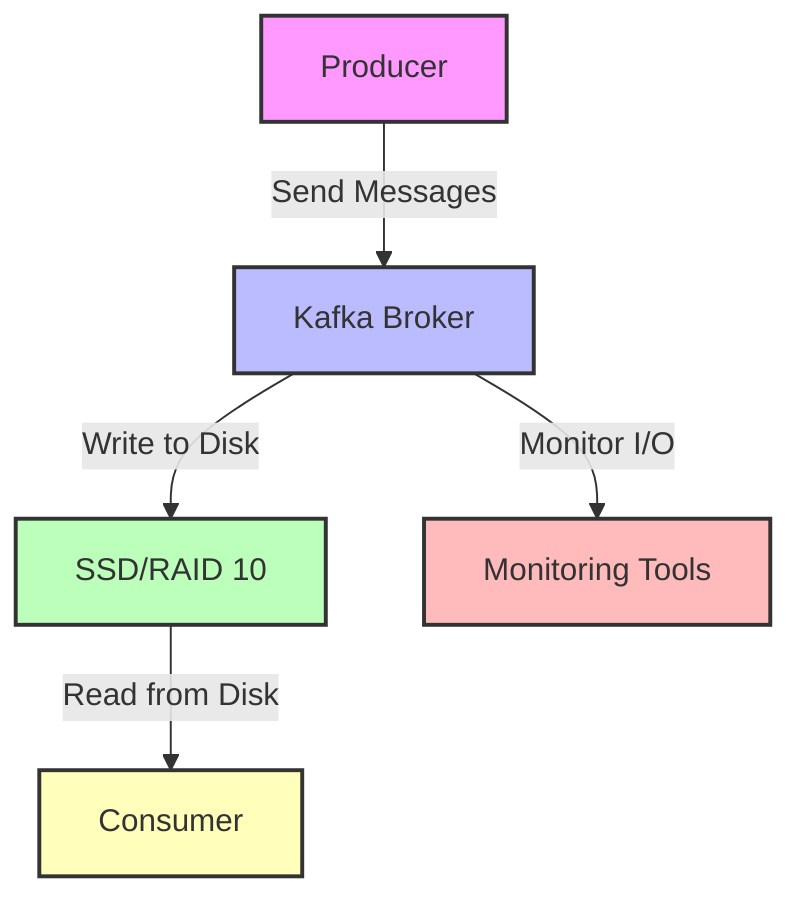

## 10.2.1 Disk I/O Optimization

### Introduction

Disk I/O optimization is a critical aspect of enhancing the performance of Apache Kafka brokers. As Kafka brokers are responsible for persisting message logs, the efficiency of disk I/O operations directly impacts the throughput and latency of the entire Kafka ecosystem. This section delves into various strategies to optimize disk I/O, ensuring that Kafka brokers can handle high-throughput data streams effectively.

### Impact of Disk I/O on Broker Performance

Disk I/O performance is crucial for Kafka brokers because it affects how quickly messages can be written to and read from disk. In a Kafka cluster, brokers handle a continuous flow of data, and any bottleneck in disk I/O can lead to increased latency, reduced throughput, and potential data loss. Optimizing disk I/O ensures that brokers can sustain high write and read rates, which is essential for real-time data processing applications.

### SSDs vs. HDDs: Choosing the Right Storage

#### Benefits of SSDs

Solid State Drives (SSDs) offer significant advantages over Hard Disk Drives (HDDs) in terms of speed and reliability. SSDs provide faster data access times and higher IOPS (Input/Output Operations Per Second), which are crucial for applications like Kafka that require rapid data ingestion and retrieval.

- **Speed**: SSDs have no moving parts, allowing for faster data access compared to HDDs, which rely on spinning disks.
- **Reliability**: The lack of mechanical components in SSDs reduces the risk of failure, making them more reliable for critical data storage.
- **Latency**: SSDs offer lower latency, which is beneficial for reducing the time it takes to write and read data.

#### Considerations for HDDs

While SSDs are generally preferred for Kafka brokers due to their performance benefits, HDDs can still be used in scenarios where cost is a significant factor. HDDs offer larger storage capacities at a lower cost per gigabyte, which can be advantageous for storing large volumes of data that do not require frequent access.

### Disk Configuration Recommendations

#### RAID Levels

RAID (Redundant Array of Independent Disks) configurations can enhance the performance and reliability of disk storage. For Kafka brokers, RAID 10 is often recommended due to its balance of performance and redundancy.

- **RAID 10**: Combines striping and mirroring, providing high performance and fault tolerance. It is ideal for write-intensive applications like Kafka.
- **RAID 5/6**: Offers good read performance and data redundancy but may suffer from slower write speeds due to parity calculations.

#### File Systems

Choosing the right file system is essential for optimizing disk I/O. Ext4 and XFS are popular choices for Kafka brokers.

- **Ext4**: A widely used file system that offers good performance and reliability. It is suitable for general-purpose use.
- **XFS**: Known for its scalability and high-performance capabilities, XFS is ideal for large-scale Kafka deployments.

### Using `log.dirs` for Data Distribution

The `log.dirs` configuration in Kafka allows you to specify multiple directories for storing log data. Distributing data across multiple disks can improve I/O performance by balancing the load.

- **Configuration**: Set `log.dirs` to include multiple directories located on different physical disks.
- **Load Balancing**: Kafka will distribute partitions across the specified directories, helping to balance the I/O load and reduce bottlenecks.

### OS-Level Optimizations

Operating system-level optimizations can further enhance disk I/O performance. Consider the following settings:

- **Page Cache**: Adjust the page cache settings to ensure that frequently accessed data is kept in memory, reducing the need for disk reads.
- **I/O Scheduler**: Choose an appropriate I/O scheduler (e.g., `noop`, `deadline`, or `cfq`) based on your workload characteristics.
- **Swappiness**: Set the swappiness value to a low number to minimize swapping and keep more data in RAM.

### Best Practices for Monitoring and Managing Disk Usage

Effective monitoring and management of disk usage are vital for maintaining optimal performance. Implement the following best practices:

- **Monitoring Tools**: Use tools like Prometheus and Grafana to monitor disk I/O metrics, such as read/write throughput and latency.
- **Alerting**: Set up alerts for disk usage thresholds to prevent issues like disk full errors.
- **Regular Maintenance**: Perform regular disk checks and maintenance to ensure the health and performance of your storage devices.

### Practical Applications and Real-World Scenarios

In real-world scenarios, optimizing disk I/O can lead to significant improvements in Kafka performance. For example, a financial services company processing real-time market data can achieve lower latency and higher throughput by implementing SSDs and RAID 10 configurations. Similarly, an IoT application collecting sensor data can benefit from distributed log directories and OS-level optimizations to handle large volumes of data efficiently.

### Code Examples

To illustrate the concepts discussed, let's look at some code examples for configuring Kafka brokers with optimized disk I/O settings.

#### Java Example

```java
import org.apache.kafka.clients.producer.KafkaProducer;
import org.apache.kafka.clients.producer.ProducerConfig;
import org.apache.kafka.clients.producer.ProducerRecord;
import org.apache.kafka.common.serialization.StringSerializer;

import java.util.Properties;

public class KafkaProducerExample {
    public static void main(String[] args) {
        Properties props = new Properties();
        props.put(ProducerConfig.BOOTSTRAP_SERVERS_CONFIG, "localhost:9092");
        props.put(ProducerConfig.KEY_SERIALIZER_CLASS_CONFIG, StringSerializer.class.getName());
        props.put(ProducerConfig.VALUE_SERIALIZER_CLASS_CONFIG, StringSerializer.class.getName());
        props.put(ProducerConfig.ACKS_CONFIG, "all");
        props.put(ProducerConfig.BUFFER_MEMORY_CONFIG, 33554432); // 32 MB
        props.put(ProducerConfig.LINGER_MS_CONFIG, 10);

        KafkaProducer<String, String> producer = new KafkaProducer<>(props);
        for (int i = 0; i < 100; i++) {
            producer.send(new ProducerRecord<>("my-topic", Integer.toString(i), "message-" + i));
        }
        producer.close();
    }
}
```

#### Scala Example

```scala
import org.apache.kafka.clients.producer.{KafkaProducer, ProducerConfig, ProducerRecord}
import org.apache.kafka.common.serialization.StringSerializer

import java.util.Properties

object KafkaProducerExample extends App {
  val props = new Properties()
  props.put(ProducerConfig.BOOTSTRAP_SERVERS_CONFIG, "localhost:9092")
  props.put(ProducerConfig.KEY_SERIALIZER_CLASS_CONFIG, classOf[StringSerializer].getName)
  props.put(ProducerConfig.VALUE_SERIALIZER_CLASS_CONFIG, classOf[StringSerializer].getName)
  props.put(ProducerConfig.ACKS_CONFIG, "all")
  props.put(ProducerConfig.BUFFER_MEMORY_CONFIG, "33554432") // 32 MB
  props.put(ProducerConfig.LINGER_MS_CONFIG, "10")

  val producer = new KafkaProducer[String, String](props)
  for (i <- 0 until 100) {
    producer.send(new ProducerRecord[String, String]("my-topic", i.toString, s"message-$i"))
  }
  producer.close()
}
```

#### Kotlin Example

```kotlin
import org.apache.kafka.clients.producer.KafkaProducer
import org.apache.kafka.clients.producer.ProducerConfig
import org.apache.kafka.clients.producer.ProducerRecord
import org.apache.kafka.common.serialization.StringSerializer

fun main() {
    val props = Properties().apply {
        put(ProducerConfig.BOOTSTRAP_SERVERS_CONFIG, "localhost:9092")
        put(ProducerConfig.KEY_SERIALIZER_CLASS_CONFIG, StringSerializer::class.java.name)
        put(ProducerConfig.VALUE_SERIALIZER_CLASS_CONFIG, StringSerializer::class.java.name)
        put(ProducerConfig.ACKS_CONFIG, "all")
        put(ProducerConfig.BUFFER_MEMORY_CONFIG, 33554432) // 32 MB
        put(ProducerConfig.LINGER_MS_CONFIG, 10)
    }

    KafkaProducer<String, String>(props).use { producer ->
        for (i in 0 until 100) {
            producer.send(ProducerRecord("my-topic", i.toString(), "message-$i"))
        }
    }
}
```

#### Clojure Example

```clojure
(ns kafka-producer-example
  (:import (org.apache.kafka.clients.producer KafkaProducer ProducerConfig ProducerRecord)
           (org.apache.kafka.common.serialization StringSerializer))
  (:require [clojure.java.io :as io]))

(defn create-producer []
  (let [props (doto (java.util.Properties.)
                (.put ProducerConfig/BOOTSTRAP_SERVERS_CONFIG "localhost:9092")
                (.put ProducerConfig/KEY_SERIALIZER_CLASS_CONFIG (.getName StringSerializer))
                (.put ProducerConfig/VALUE_SERIALIZER_CLASS_CONFIG (.getName StringSerializer))
                (.put ProducerConfig/ACKS_CONFIG "all")
                (.put ProducerConfig/BUFFER_MEMORY_CONFIG (str 33554432)) ; 32 MB
                (.put ProducerConfig/LINGER_MS_CONFIG (str 10)))]
    (KafkaProducer. props)))

(defn send-messages [producer]
  (doseq [i (range 100)]
    (.send producer (ProducerRecord. "my-topic" (str i) (str "message-" i)))))

(defn -main []
  (let [producer (create-producer)]
    (send-messages producer)
    (.close producer)))
```

### Visualizing Disk I/O Optimization

To better understand the impact of disk I/O optimization, consider the following diagram illustrating the flow of data in a Kafka broker with optimized disk configurations.



**Caption**: This diagram illustrates the data flow in a Kafka broker with optimized disk I/O, highlighting the role of SSDs/RAID 10 in enhancing performance.

### Conclusion

Optimizing disk I/O is a vital component of ensuring high performance and reliability in Apache Kafka brokers. By choosing the right storage solutions, configuring disks appropriately, and implementing OS-level optimizations, you can significantly enhance the throughput and latency of your Kafka deployments. Regular monitoring and maintenance further ensure that your system remains efficient and resilient.

### Knowledge Check

To reinforce your understanding of disk I/O optimization in Kafka, consider the following questions and challenges.

## Test Your Knowledge: Disk I/O Optimization in Kafka



### How does disk I/O impact Kafka broker performance?

- [x] It affects the speed at which messages are written to and read from disk.
- [ ] It determines the number of partitions a broker can handle.
- [ ] It influences the broker's ability to manage consumer offsets.
- [ ] It affects the broker's network throughput.

> **Explanation:** Disk I/O impacts the speed at which messages are written to and read from disk, directly affecting broker performance.

### What is a key advantage of using SSDs over HDDs for Kafka brokers?

- [x] Faster data access times
- [ ] Lower cost per gigabyte
- [ ] Higher storage capacity
- [ ] Easier to configure

> **Explanation:** SSDs offer faster data access times compared to HDDs, which is crucial for high-performance Kafka brokers.

### Which RAID level is often recommended for Kafka brokers?

- [x] RAID 10
- [ ] RAID 0
- [ ] RAID 5
- [ ] RAID 1

> **Explanation:** RAID 10 is recommended for Kafka brokers due to its balance of performance and redundancy.

### What is the purpose of the `log.dirs` configuration in Kafka?

- [x] To specify multiple directories for storing log data
- [ ] To configure the number of partitions per topic
- [ ] To set the retention policy for log data
- [ ] To define the replication factor for topics

> **Explanation:** The `log.dirs` configuration specifies multiple directories for storing log data, helping to distribute the I/O load.

### Which file system is known for its scalability and high-performance capabilities?

- [x] XFS
- [ ] NTFS
- [ ] FAT32
- [ ] HFS+

> **Explanation:** XFS is known for its scalability and high-performance capabilities, making it suitable for large-scale Kafka deployments.

### What is the benefit of adjusting page cache settings at the OS level?

- [x] It reduces the need for disk reads by keeping frequently accessed data in memory.
- [ ] It increases the number of partitions a broker can handle.
- [ ] It improves network throughput.
- [ ] It enhances the broker's ability to manage consumer offsets.

> **Explanation:** Adjusting page cache settings reduces the need for disk reads by keeping frequently accessed data in memory.

### Which I/O scheduler might be appropriate for a workload with high random access?

- [x] noop
- [ ] cfq
- [ ] deadline
- [ ] anticipatory

> **Explanation:** The `noop` scheduler can be appropriate for workloads with high random access, as it minimizes scheduling overhead.

### Why is monitoring disk I/O metrics important for Kafka brokers?

- [x] To prevent issues like disk full errors and ensure optimal performance
- [ ] To increase the number of consumer groups
- [ ] To enhance the broker's network capabilities
- [ ] To improve the broker's ability to handle large messages

> **Explanation:** Monitoring disk I/O metrics helps prevent issues like disk full errors and ensures optimal performance.

### What is a potential drawback of using RAID 5 for Kafka brokers?

- [x] Slower write speeds due to parity calculations
- [ ] Lack of data redundancy
- [ ] High cost
- [ ] Limited storage capacity

> **Explanation:** RAID 5 may suffer from slower write speeds due to parity calculations, which can impact Kafka performance.

### True or False: SSDs have moving parts that can lead to mechanical failures.

- [ ] True
- [x] False

> **Explanation:** SSDs have no moving parts, reducing the risk of mechanical failures compared to HDDs.


