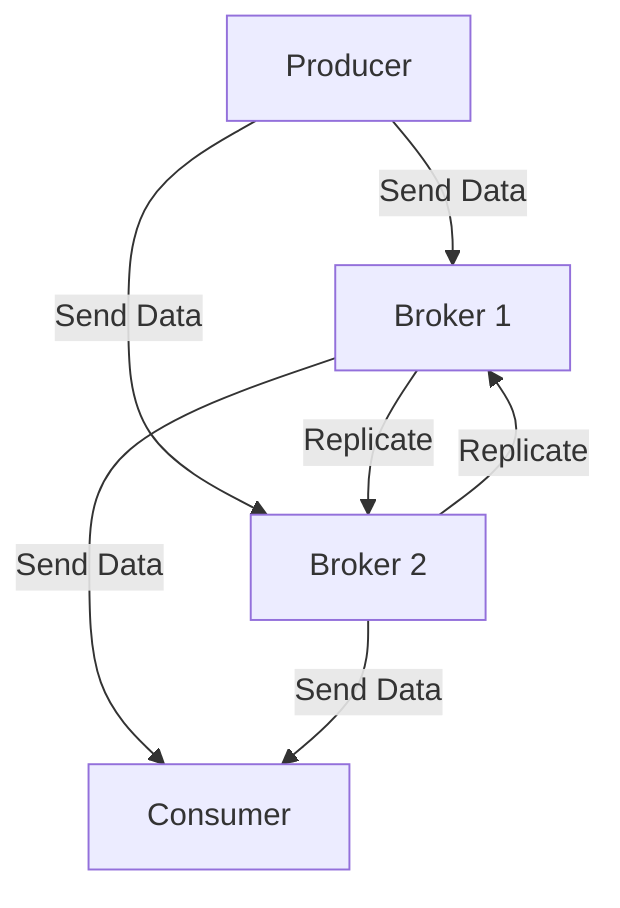

## 10.2.2 Network Configuration

In the realm of Apache Kafka, network configuration plays a pivotal role in ensuring optimal broker performance and resource management. As Kafka is a distributed streaming platform, it relies heavily on network communication between its components, including producers, brokers, and consumers. This section delves into the intricacies of network settings and configurations that can enhance broker communication efficiency, reduce latency, and prevent bottlenecks.

### Importance of Network Bandwidth and Latency

Network bandwidth and latency are critical factors that influence the performance of Kafka brokers. Bandwidth refers to the maximum rate of data transfer across a network path, while latency is the time it takes for a data packet to travel from source to destination. In a Kafka setup, high bandwidth ensures that large volumes of data can be transmitted quickly, while low latency minimizes the delay in data processing and delivery.

#### Key Considerations:

- **Bandwidth Utilization**: Ensure that the network infrastructure can handle the peak data loads generated by Kafka producers and consumers. Overloading the network can lead to increased latency and packet loss.
- **Latency Sensitivity**: Kafka's real-time processing capabilities are highly sensitive to latency. Even small delays can impact the overall throughput and performance of the system.

### Network Interface Tuning

Network Interface Cards (NICs) are the hardware components that connect a computer to a network. Proper tuning of NICs can significantly enhance network performance.

#### NIC Bonding

NIC bonding, also known as link aggregation, combines multiple network interfaces into a single logical interface. This increases bandwidth and provides redundancy in case of a NIC failure.

- **Implementation**: Use tools like `ifenslave` on Linux to bond interfaces.
- **Modes**: Consider using modes like `balance-rr` for round-robin transmission or `802.3ad` for dynamic link aggregation.

#### MTU Settings

The Maximum Transmission Unit (MTU) defines the largest packet size that can be sent over a network. Increasing the MTU can reduce the overhead of packet headers, thus improving throughput.

- **Recommendation**: Set the MTU to 9000 bytes (jumbo frames) if supported by the network infrastructure.
- **Consideration**: Ensure all network devices along the path support the configured MTU to prevent fragmentation.

### Optimizing Network Buffer Sizes and TCP Settings

Network buffers and TCP settings are crucial for managing data flow and preventing congestion.

#### Network Buffer Sizes

Adjusting the buffer sizes can help accommodate bursty traffic and prevent packet loss.

- **Receive Buffers**: Increase the size of receive buffers to handle large volumes of incoming data.
- **Transmit Buffers**: Ensure transmit buffers are adequately sized to prevent bottlenecks during data transmission.

#### TCP Settings

TCP settings can be fine-tuned to optimize data transfer rates and reduce latency.

- **TCP Window Scaling**: Enable window scaling to allow for larger TCP window sizes, which can improve throughput on high-latency networks.
- **TCP Congestion Control**: Use congestion control algorithms like BBR (Bottleneck Bandwidth and Round-trip propagation time) for better performance in high-bandwidth environments.

### Configuring Kafka's Network Threads

Kafka brokers use network threads to handle incoming and outgoing data. Proper configuration of these threads is essential for maintaining high throughput and low latency.

#### Recommendations:

- **Thread Count**: Increase the number of network threads (`num.network.threads`) to handle more concurrent connections.
- **I/O Threads**: Adjust the number of I/O threads (`num.io.threads`) based on the expected workload and hardware capabilities.

### Strategies for Mitigating Network Congestion

Network congestion can severely impact Kafka's performance. Implementing strategies to mitigate congestion is crucial for maintaining a stable and efficient system.

#### Load Balancing

Distribute network traffic evenly across multiple brokers to prevent any single broker from becoming a bottleneck.

- **DNS Round Robin**: Use DNS round-robin techniques to distribute client connections across brokers.
- **Load Balancers**: Deploy hardware or software load balancers to manage traffic distribution.

#### Quality of Service (QoS)

Implement QoS policies to prioritize Kafka traffic over less critical network traffic.

- **Traffic Shaping**: Use traffic shaping techniques to control the flow of data and prevent congestion.
- **Priority Queuing**: Assign higher priority to Kafka packets to ensure timely delivery.

### Practical Applications and Real-World Scenarios

In real-world scenarios, optimizing network configuration can lead to significant improvements in Kafka performance. For instance, a financial services company streaming real-time market data can benefit from reduced latency and increased throughput by implementing the strategies discussed above.

### Code Examples

Below are code examples demonstrating how to configure network settings for Kafka in various programming languages.

#### Java

```java
import org.apache.kafka.clients.producer.ProducerConfig;
import java.util.Properties;

public class KafkaNetworkConfig {
    public static Properties configureProducer() {
        Properties props = new Properties();
        props.put(ProducerConfig.BOOTSTRAP_SERVERS_CONFIG, "broker1:9092,broker2:9092");
        props.put(ProducerConfig.LINGER_MS_CONFIG, 5); // Reduce latency
        props.put(ProducerConfig.BATCH_SIZE_CONFIG, 16384); // Increase throughput
        return props;
    }
}
```

#### Scala

```scala
import org.apache.kafka.clients.producer.ProducerConfig
import java.util.Properties

object KafkaNetworkConfig {
  def configureProducer(): Properties = {
    val props = new Properties()
    props.put(ProducerConfig.BOOTSTRAP_SERVERS_CONFIG, "broker1:9092,broker2:9092")
    props.put(ProducerConfig.LINGER_MS_CONFIG, "5") // Reduce latency
    props.put(ProducerConfig.BATCH_SIZE_CONFIG, "16384") // Increase throughput
    props
  }
}
```

#### Kotlin

```kotlin
import org.apache.kafka.clients.producer.ProducerConfig
import java.util.Properties

fun configureProducer(): Properties {
    val props = Properties()
    props[ProducerConfig.BOOTSTRAP_SERVERS_CONFIG] = "broker1:9092,broker2:9092"
    props[ProducerConfig.LINGER_MS_CONFIG] = 5 // Reduce latency
    props[ProducerConfig.BATCH_SIZE_CONFIG] = 16384 // Increase throughput
    return props
}
```

#### Clojure

```clojure
(defn configure-producer []
  (let [props (java.util.Properties.)]
    (.put props "bootstrap.servers" "broker1:9092,broker2:9092")
    (.put props "linger.ms" "5") ; Reduce latency
    (.put props "batch.size" "16384") ; Increase throughput
    props))
```

### Diagrams

#### Kafka Network Architecture



**Caption**: This diagram illustrates the network flow between producers, brokers, and consumers in a Kafka cluster.

### Knowledge Check

To reinforce your understanding of network configuration in Kafka, consider the following questions:

- How does increasing the MTU size affect network performance?
- What are the benefits of NIC bonding in a Kafka setup?
- How can TCP window scaling improve data transfer rates?

### Summary

Optimizing network configuration is a critical aspect of enhancing Kafka broker performance. By understanding and implementing the strategies discussed in this section, you can achieve higher throughput, lower latency, and a more robust Kafka deployment. Remember to continuously monitor network performance and adjust configurations as needed to accommodate changing workloads and network conditions.

## Test Your Knowledge: Advanced Kafka Network Configuration Quiz



### What is the primary benefit of NIC bonding in a Kafka setup?

- [x] Increased bandwidth and redundancy
- [ ] Reduced latency
- [ ] Simplified configuration
- [ ] Improved security

> **Explanation:** NIC bonding combines multiple network interfaces to increase bandwidth and provide redundancy, enhancing network performance and reliability.

### How does increasing the MTU size affect network performance?

- [x] Reduces packet header overhead
- [ ] Increases latency
- [ ] Decreases throughput
- [ ] Simplifies network configuration

> **Explanation:** Increasing the MTU size reduces the overhead of packet headers, which can improve throughput by allowing larger packets to be transmitted.

### Which TCP setting can improve throughput on high-latency networks?

- [x] TCP Window Scaling
- [ ] TCP Fast Open
- [ ] TCP Keepalive
- [ ] TCP Delayed Acknowledgment

> **Explanation:** TCP Window Scaling allows for larger TCP window sizes, which can improve throughput on high-latency networks by enabling more data to be in transit before requiring an acknowledgment.

### What role do network buffers play in Kafka's performance?

- [x] Accommodate bursty traffic and prevent packet loss
- [ ] Reduce latency
- [ ] Simplify configuration
- [ ] Enhance security

> **Explanation:** Network buffers help accommodate bursty traffic and prevent packet loss by providing temporary storage for incoming and outgoing data.

### What is a key strategy for mitigating network congestion in Kafka?

- [x] Load balancing
- [ ] Increasing MTU size
- [ ] Reducing buffer sizes
- [ ] Disabling QoS

> **Explanation:** Load balancing distributes network traffic evenly across multiple brokers, preventing any single broker from becoming a bottleneck and mitigating network congestion.

### Which congestion control algorithm is recommended for high-bandwidth environments?

- [x] BBR (Bottleneck Bandwidth and Round-trip propagation time)
- [ ] Reno
- [ ] CUBIC
- [ ] Vegas

> **Explanation:** BBR is designed to optimize performance in high-bandwidth environments by estimating the available bandwidth and round-trip time.

### How can QoS policies benefit Kafka traffic?

- [x] Prioritize Kafka traffic over less critical network traffic
- [ ] Increase latency
- [ ] Decrease throughput
- [ ] Simplify configuration

> **Explanation:** QoS policies can prioritize Kafka traffic, ensuring timely delivery and reducing the impact of congestion on critical data streams.

### What is the purpose of configuring Kafka's network threads?

- [x] Handle more concurrent connections
- [ ] Reduce latency
- [ ] Simplify configuration
- [ ] Enhance security

> **Explanation:** Configuring Kafka's network threads allows the system to handle more concurrent connections, improving throughput and performance.

### What is the effect of enabling TCP Window Scaling?

- [x] Allows for larger TCP window sizes
- [ ] Reduces latency
- [ ] Increases packet loss
- [ ] Simplifies configuration

> **Explanation:** Enabling TCP Window Scaling allows for larger TCP window sizes, which can improve throughput by enabling more data to be in transit before requiring an acknowledgment.

### True or False: Increasing the number of network threads in Kafka can help handle more concurrent connections.

- [x] True
- [ ] False

> **Explanation:** Increasing the number of network threads in Kafka allows the system to handle more concurrent connections, improving throughput and performance.


