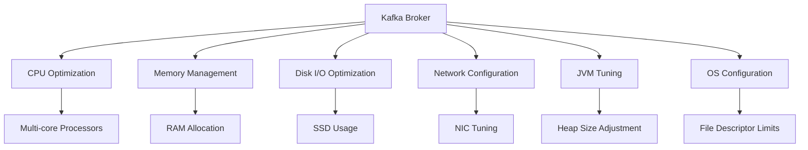

## 10.2 Broker Performance and Resource Management

### Introduction

In the realm of Apache Kafka, brokers are the backbone of the distributed messaging system, responsible for handling data streams and ensuring reliable message delivery. Optimizing broker performance is crucial for maintaining high throughput and low latency, especially in large-scale deployments. This section delves into the intricacies of broker performance and resource management, providing expert guidance on optimizing hardware resources, disk I/O, network settings, JVM configurations, and operating system parameters.

### The Role of Brokers in Kafka Performance

Brokers are the central components in a Kafka cluster, acting as intermediaries between producers and consumers. They store data, manage partitions, and handle replication, making their performance pivotal to the overall efficiency of the Kafka ecosystem. Poorly configured brokers can lead to bottlenecks, increased latency, and reduced throughput, affecting the entire data pipeline.

### Hardware Resources and Their Impact

#### CPU and Memory

- **CPU**: Brokers require sufficient CPU resources to handle message serialization, compression, and network I/O. Multi-core processors are recommended to parallelize these tasks effectively.
- **Memory**: Adequate memory allocation is essential for caching data and reducing disk I/O. The operating system's page cache plays a significant role in Kafka's performance, so ensure that brokers have enough RAM to accommodate active data sets.

#### Disk I/O

Disk I/O is often the primary bottleneck in Kafka broker performance. High-speed SSDs are preferred over traditional HDDs due to their superior read/write speeds and lower latency. Consider the following strategies for optimizing disk I/O:

- **Log Segmentation and Compaction**: Configure log segment sizes and compaction settings to balance between disk usage and performance. Refer to [2.4.1 Log Segmentation and Compaction]( "Log Segmentation and Compaction") for detailed guidance.
- **Disk Throughput**: Ensure that disk throughput is sufficient to handle peak loads. Use RAID configurations to enhance performance and reliability.

#### Network Settings

Network bandwidth and latency are critical factors in broker performance. Optimize network settings to ensure efficient data transfer:

- **Network Interface Cards (NICs)**: Use high-performance NICs with support for offloading features like TCP segmentation offload (TSO) and large receive offload (LRO) to reduce CPU load.
- **Network Configuration**: Tune network buffers and TCP settings to accommodate high-throughput data streams. Consider using multiple NICs for redundancy and load balancing.

### JVM Tuning

Kafka brokers run on the Java Virtual Machine (JVM), making JVM tuning an essential aspect of performance optimization. Key areas to focus on include:

- **Heap Size**: Allocate sufficient heap memory to prevent frequent garbage collection (GC) pauses. Monitor GC activity and adjust heap size accordingly.
- **Garbage Collection**: Choose an appropriate GC algorithm based on workload characteristics. The G1 Garbage Collector is often recommended for its balance between throughput and pause times.
- **JVM Flags**: Use JVM flags to fine-tune performance. For example, `-XX:+UseG1GC` enables the G1 Garbage Collector, while `-XX:MaxGCPauseMillis` sets the target maximum pause time.

### Operating System Configuration

The operating system (OS) plays a vital role in broker performance. Optimize OS settings to support high-throughput operations:

- **File Descriptors**: Increase the number of file descriptors to accommodate a large number of open files and network connections.
- **Swappiness**: Set the swappiness parameter to a low value (e.g., 1) to minimize swapping and prioritize RAM usage.
- **I/O Scheduler**: Choose an appropriate I/O scheduler for your disk type. The `noop` or `deadline` scheduler is often recommended for SSDs.

### Best Practices for Resource Allocation and Monitoring

- **Resource Allocation**: Allocate resources based on workload requirements and expected traffic patterns. Use capacity planning tools to forecast future needs.
- **Monitoring**: Implement comprehensive monitoring solutions to track broker performance metrics such as CPU usage, memory consumption, disk I/O, and network throughput. Tools like Prometheus and Grafana can provide real-time insights and alerting capabilities.

### Balancing Resources

Balancing different resources is crucial for maintaining optimal broker performance. Avoid over-provisioning one resource at the expense of others, as this can lead to inefficiencies and increased costs. Regularly review and adjust resource allocations based on monitoring data and changing workload demands.

### Practical Applications and Real-World Scenarios

Consider a scenario where a financial services company uses Kafka to process real-time market data. By optimizing broker performance, the company can ensure low-latency data delivery to trading systems, enabling faster decision-making and improved competitiveness.

### Code Examples

Below are code snippets demonstrating how to configure Kafka brokers for optimal performance in various programming languages.

#### Java

```java
// Java code to configure Kafka broker settings
Properties props = new Properties();
props.put("log.segment.bytes", 1073741824); // 1 GB
props.put("log.retention.hours", 168); // 1 week
props.put("num.network.threads", 3);
props.put("num.io.threads", 8);
props.put("socket.send.buffer.bytes", 102400);
props.put("socket.receive.buffer.bytes", 102400);
props.put("socket.request.max.bytes", 104857600); // 100 MB
```

#### Scala

```scala
// Scala code to configure Kafka broker settings
val props = new Properties()
props.put("log.segment.bytes", "1073741824") // 1 GB
props.put("log.retention.hours", "168") // 1 week
props.put("num.network.threads", "3")
props.put("num.io.threads", "8")
props.put("socket.send.buffer.bytes", "102400")
props.put("socket.receive.buffer.bytes", "102400")
props.put("socket.request.max.bytes", "104857600") // 100 MB
```

#### Kotlin

```kotlin
// Kotlin code to configure Kafka broker settings
val props = Properties().apply {
    put("log.segment.bytes", 1073741824) // 1 GB
    put("log.retention.hours", 168) // 1 week
    put("num.network.threads", 3)
    put("num.io.threads", 8)
    put("socket.send.buffer.bytes", 102400)
    put("socket.receive.buffer.bytes", 102400)
    put("socket.request.max.bytes", 104857600) // 100 MB
}
```

#### Clojure

```clojure
;; Clojure code to configure Kafka broker settings
(def props
  {"log.segment.bytes" 1073741824 ; 1 GB
   "log.retention.hours" 168 ; 1 week
   "num.network.threads" 3
   "num.io.threads" 8
   "socket.send.buffer.bytes" 102400
   "socket.receive.buffer.bytes" 102400
   "socket.request.max.bytes" 104857600}) ; 100 MB
```

### Visualizing Broker Performance Optimization

Below is a diagram illustrating the key components and interactions involved in optimizing Kafka broker performance.



**Diagram Description**: This diagram depicts the various components involved in optimizing Kafka broker performance, including CPU, memory, disk I/O, network, JVM, and OS settings.

### References and Further Reading

- [Apache Kafka Documentation](https://kafka.apache.org/documentation/)
- [Confluent Documentation](https://docs.confluent.io/)
- [Prometheus Monitoring](https://prometheus.io/)
- [Grafana Visualization](https://grafana.com/)

## Test Your Knowledge: Kafka Broker Performance Optimization Quiz



### What is the primary role of Kafka brokers in a cluster?

- [x] To act as intermediaries between producers and consumers
- [ ] To manage consumer offsets
- [ ] To provide a user interface for monitoring
- [ ] To handle schema validation

> **Explanation:** Kafka brokers are responsible for storing data, managing partitions, and handling replication, acting as intermediaries between producers and consumers.

### Which hardware component is often the primary bottleneck in Kafka broker performance?

- [ ] CPU
- [ ] Memory
- [x] Disk I/O
- [ ] Network

> **Explanation:** Disk I/O is often the primary bottleneck due to the high volume of read/write operations required by Kafka brokers.

### What is the recommended type of disk for Kafka brokers to enhance performance?

- [ ] HDD
- [x] SSD
- [ ] Tape Drive
- [ ] Optical Disk

> **Explanation:** SSDs are recommended for Kafka brokers due to their superior read/write speeds and lower latency compared to HDDs.

### Which JVM garbage collector is often recommended for Kafka brokers?

- [ ] Serial GC
- [ ] Parallel GC
- [x] G1 Garbage Collector
- [ ] CMS

> **Explanation:** The G1 Garbage Collector is recommended for Kafka brokers as it provides a good balance between throughput and pause times.

### What is the purpose of setting the swappiness parameter to a low value?

- [x] To minimize swapping and prioritize RAM usage
- [ ] To increase disk usage
- [ ] To enhance network performance
- [ ] To reduce CPU load

> **Explanation:** Setting the swappiness parameter to a low value minimizes swapping, ensuring that RAM is prioritized for active data sets.

### Which tool can be used for real-time monitoring of Kafka broker performance?

- [ ] Apache Hadoop
- [x] Prometheus
- [ ] Apache Spark
- [ ] Apache Flink

> **Explanation:** Prometheus is a popular tool for real-time monitoring of Kafka broker performance, providing insights into various metrics.

### What is the benefit of using multiple NICs in Kafka brokers?

- [x] Redundancy and load balancing
- [ ] Increased disk space
- [ ] Enhanced JVM performance
- [ ] Reduced memory usage

> **Explanation:** Using multiple NICs provides redundancy and load balancing, improving network throughput and reliability.

### Why is it important to balance different resources in Kafka brokers?

- [x] To avoid inefficiencies and increased costs
- [ ] To reduce the number of brokers
- [ ] To increase the number of partitions
- [ ] To enhance schema validation

> **Explanation:** Balancing different resources ensures that no single resource is over-provisioned at the expense of others, avoiding inefficiencies and increased costs.

### Which configuration setting is used to adjust the number of file descriptors in the OS?

- [x] File Descriptor Limits
- [ ] Heap Size
- [ ] Network Buffers
- [ ] Log Segment Size

> **Explanation:** The file descriptor limits setting is used to adjust the number of file descriptors, accommodating a large number of open files and network connections.

### True or False: JVM tuning is not necessary for optimizing Kafka broker performance.

- [ ] True
- [x] False

> **Explanation:** JVM tuning is essential for optimizing Kafka broker performance, as it affects heap size, garbage collection, and overall efficiency.



---

By following these guidelines and best practices, you can ensure that your Kafka brokers are optimized for high performance, reliability, and scalability. Regular monitoring and tuning will help maintain optimal performance as workloads and traffic patterns evolve.
