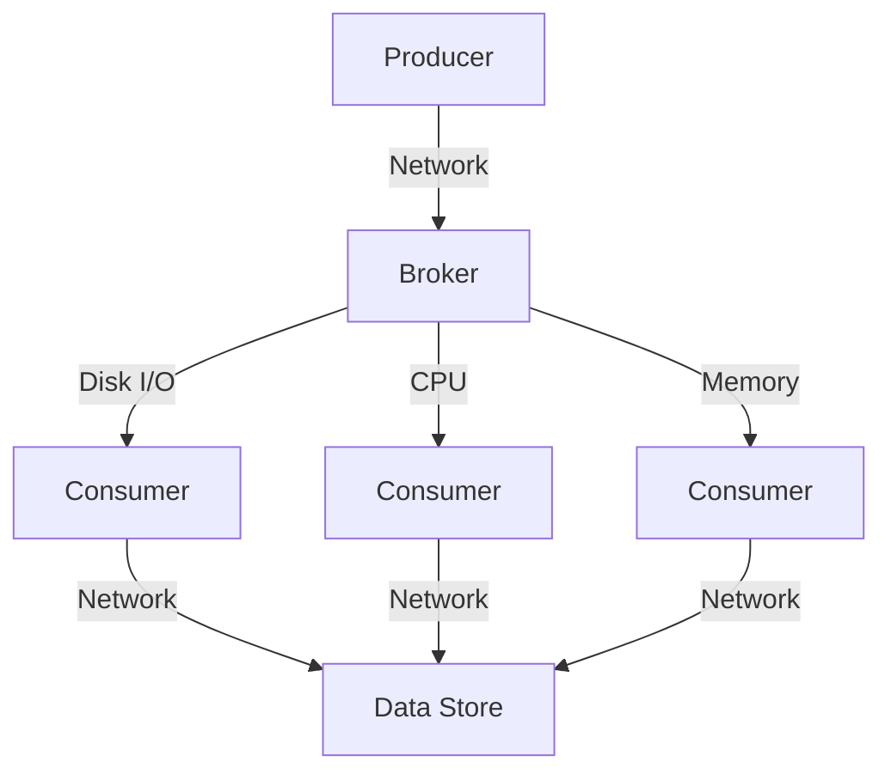

## 10.3.1 Identifying Bottlenecks

Performance bottlenecks in Apache Kafka systems can significantly impact the efficiency and reliability of data processing pipelines. Identifying and resolving these bottlenecks is crucial for maintaining optimal performance and ensuring that Kafka can handle the demands of real-time data processing. This section provides a comprehensive guide to detecting bottlenecks at various levels of a Kafka system, including brokers, producers, and consumers. It also offers methodologies for diagnosing issues, examples of symptoms and causes, and proactive monitoring techniques to prevent bottlenecks from affecting performance.

### Common Types of Bottlenecks

Understanding the common types of bottlenecks in Kafka systems is the first step in identifying and resolving them. The primary bottlenecks include:

- **CPU Bottlenecks**: Occur when the CPU is overutilized, leading to increased processing times and latency.
- **Memory Bottlenecks**: Result from insufficient memory allocation, causing increased garbage collection and potential out-of-memory errors.
- **Disk I/O Bottlenecks**: Arise when disk read/write operations are slow, affecting data throughput and latency.
- **Network Bottlenecks**: Happen when network bandwidth is insufficient, leading to increased latency and potential data loss.

### Methodologies for Diagnosing Bottlenecks

Diagnosing bottlenecks in Kafka systems requires a systematic approach to monitoring and profiling. Here are some methodologies to consider:

1. **Monitoring Key Metrics**: Utilize tools like Prometheus and Grafana to monitor key Kafka metrics such as CPU usage, memory consumption, disk I/O, and network throughput. Refer to [10.3.2 Tools: Prometheus, Grafana, Cruise Control]( "Tools: Prometheus, Grafana, Cruise Control") for more details.

2. **Profiling Kafka Components**: Use profiling tools to analyze the performance of Kafka brokers, producers, and consumers. This helps identify specific areas where bottlenecks occur.

3. **Analyzing Logs**: Examine Kafka logs for error messages or warnings that may indicate performance issues.

4. **Conducting Load Tests**: Perform load testing to simulate high-traffic scenarios and identify potential bottlenecks under stress.

5. **Using Distributed Tracing**: Implement distributed tracing to track the flow of messages through the Kafka system and pinpoint areas of latency.

### Symptoms and Corresponding Causes

Identifying symptoms of bottlenecks can help diagnose the underlying causes. Here are some common symptoms and their potential causes:

- **High Latency**: Often caused by CPU or network bottlenecks. Check CPU utilization and network bandwidth.

- **Increased Error Rates**: May result from memory bottlenecks or misconfigured producers/consumers. Verify memory allocation and configuration settings.

- **Slow Throughput**: Typically due to disk I/O bottlenecks. Monitor disk read/write speeds and optimize disk usage.

- **Frequent Consumer Rebalances**: Can indicate network bottlenecks or inefficient consumer group configurations. Analyze network traffic and consumer group settings.

### Step-by-Step Approaches to Isolate and Resolve Issues

To effectively isolate and resolve bottlenecks, follow these step-by-step approaches:

1. **Identify the Affected Component**: Determine whether the bottleneck is occurring at the broker, producer, or consumer level.

2. **Monitor Relevant Metrics**: Use monitoring tools to track metrics specific to the affected component.

3. **Analyze Logs and Traces**: Review logs and distributed traces to gather additional insights into the issue.

4. **Optimize Configuration**: Adjust configuration settings such as batch size, compression, and memory allocation to improve performance.

5. **Scale Resources**: If necessary, scale up resources such as CPU, memory, or network bandwidth to alleviate the bottleneck.

6. **Test and Validate**: After making changes, conduct tests to ensure the bottleneck is resolved and performance is improved.

### Proactive Monitoring to Prevent Bottlenecks

Proactive monitoring is essential to prevent bottlenecks from impacting Kafka performance. Here are some best practices:

- **Set Up Alerts**: Configure alerts for key metrics to receive notifications when thresholds are exceeded.

- **Regularly Review Metrics**: Schedule regular reviews of Kafka metrics to identify trends and potential issues.

- **Implement Capacity Planning**: Use capacity planning tools to forecast resource needs and ensure sufficient capacity for future growth.

- **Conduct Regular Load Testing**: Periodically perform load tests to assess system performance under different conditions.

- **Optimize Resource Allocation**: Continuously evaluate and optimize resource allocation to prevent bottlenecks.

### Code Examples

To illustrate the concepts discussed, here are code examples in Java, Scala, Kotlin, and Clojure for monitoring Kafka metrics using Prometheus:

#### Java

```java
import io.prometheus.client.Counter;
import io.prometheus.client.exporter.HTTPServer;
import io.prometheus.client.hotspot.DefaultExports;

public class KafkaMetricsMonitor {
    static final Counter requests = Counter.build()
        .name("requests_total")
        .help("Total requests.")
        .register();

    public static void main(String[] args) throws Exception {
        DefaultExports.initialize();
        HTTPServer server = new HTTPServer(1234);
        while (true) {
            requests.inc();
            Thread.sleep(1000);
        }
    }
}
```

#### Scala

```scala
import io.prometheus.client.Counter
import io.prometheus.client.exporter.HTTPServer
import io.prometheus.client.hotspot.DefaultExports

object KafkaMetricsMonitor extends App {
  val requests: Counter = Counter.build()
    .name("requests_total")
    .help("Total requests.")
    .register()

  DefaultExports.initialize()
  val server = new HTTPServer(1234)

  while (true) {
    requests.inc()
    Thread.sleep(1000)
  }
}
```

#### Kotlin

```kotlin
import io.prometheus.client.Counter
import io.prometheus.client.exporter.HTTPServer
import io.prometheus.client.hotspot.DefaultExports

fun main() {
    val requests = Counter.build()
        .name("requests_total")
        .help("Total requests.")
        .register()

    DefaultExports.initialize()
    val server = HTTPServer(1234)

    while (true) {
        requests.inc()
        Thread.sleep(1000)
    }
}
```

#### Clojure

```clojure
(ns kafka-metrics-monitor
  (:import [io.prometheus.client Counter]
           [io.prometheus.client.exporter HTTPServer]
           [io.prometheus.client.hotspot DefaultExports]))

(def requests (doto (Counter/build)
                (.name "requests_total")
                (.help "Total requests.")
                (.register)))

(DefaultExports/initialize)
(def server (HTTPServer. 1234))

(while true
  (.inc requests)
  (Thread/sleep 1000))
```

### Visualizing Bottlenecks

To enhance understanding, here is a diagram illustrating the flow of data and potential bottlenecks in a Kafka system:



**Diagram Caption**: This diagram shows the flow of data from producers to consumers in a Kafka system, highlighting potential bottlenecks at the network, disk I/O, CPU, and memory levels.

### References and Links

- [Apache Kafka Documentation](https://kafka.apache.org/documentation/)
- [Confluent Documentation](https://docs.confluent.io/)
- [Prometheus Monitoring](https://prometheus.io/docs/introduction/overview/)
- [Grafana Visualization](https://grafana.com/docs/grafana/latest/getting-started/)

### Knowledge Check

To reinforce your understanding of identifying bottlenecks in Kafka systems, complete the following quiz:

## Test Your Knowledge: Identifying Bottlenecks in Kafka Systems



### What is a common symptom of a CPU bottleneck in Kafka?

- [x] High latency
- [ ] Increased error rates
- [ ] Slow throughput
- [ ] Frequent consumer rebalances

> **Explanation:** High latency is often a symptom of a CPU bottleneck, as the CPU is unable to process requests quickly enough.

### Which tool can be used for monitoring Kafka metrics?

- [x] Prometheus
- [ ] Hadoop
- [ ] Apache Beam
- [ ] Spark

> **Explanation:** Prometheus is a popular tool for monitoring Kafka metrics and other system performance indicators.

### What is a potential cause of increased error rates in Kafka?

- [x] Memory bottlenecks
- [ ] Disk I/O bottlenecks
- [ ] Network bottlenecks
- [ ] CPU bottlenecks

> **Explanation:** Memory bottlenecks can lead to increased error rates due to insufficient memory allocation and increased garbage collection.

### How can disk I/O bottlenecks be identified?

- [x] Monitoring disk read/write speeds
- [ ] Analyzing CPU usage
- [ ] Checking network bandwidth
- [ ] Reviewing memory allocation

> **Explanation:** Disk I/O bottlenecks can be identified by monitoring disk read/write speeds to ensure they are within acceptable limits.

### What is a step in resolving network bottlenecks?

- [x] Scaling network bandwidth
- [ ] Increasing CPU resources
- [ ] Reducing memory allocation
- [ ] Decreasing disk usage

> **Explanation:** Scaling network bandwidth can help resolve network bottlenecks by providing more capacity for data transfer.

### Which of the following is a proactive monitoring technique?

- [x] Setting up alerts for key metrics
- [ ] Conducting post-mortem analysis
- [ ] Performing manual checks
- [ ] Ignoring minor issues

> **Explanation:** Setting up alerts for key metrics is a proactive monitoring technique that helps detect issues before they impact performance.

### What is the purpose of distributed tracing in Kafka?

- [x] Tracking the flow of messages
- [ ] Monitoring disk usage
- [ ] Analyzing memory allocation
- [ ] Checking CPU utilization

> **Explanation:** Distributed tracing is used to track the flow of messages through the Kafka system and identify areas of latency.

### What should be done after resolving a bottleneck?

- [x] Test and validate performance improvements
- [ ] Ignore further monitoring
- [ ] Reduce system resources
- [ ] Disable alerts

> **Explanation:** After resolving a bottleneck, it is important to test and validate performance improvements to ensure the issue is fully addressed.

### Which metric is crucial for identifying memory bottlenecks?

- [x] Garbage collection frequency
- [ ] Disk read/write speed
- [ ] Network latency
- [ ] CPU utilization

> **Explanation:** Garbage collection frequency is a crucial metric for identifying memory bottlenecks, as frequent garbage collection can indicate insufficient memory.

### True or False: Load testing is only necessary during initial deployment.

- [ ] True
- [x] False

> **Explanation:** False. Load testing should be conducted periodically to assess system performance under different conditions and prevent bottlenecks.



By following the methodologies and techniques outlined in this section, you can effectively identify and resolve bottlenecks in your Kafka systems, ensuring optimal performance and reliability.
