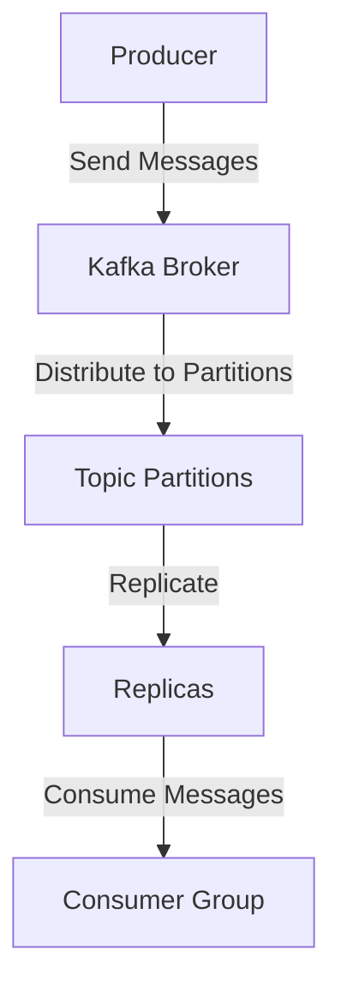

## 10.3.5 Forecasting Growth and Scaling Needs

In the dynamic world of real-time data processing, understanding and anticipating the growth and scaling needs of your Apache Kafka infrastructure is crucial. This section delves into advanced strategies for predicting future data volume and system load, enabling proactive scaling of Kafka clusters. By leveraging historical metrics and analyzing data usage trends, you can create effective scaling roadmaps that align with business objectives and avoid the pitfalls of over-provisioning or under-provisioning.

### Analyzing Trends in Data Usage

To forecast growth effectively, begin by analyzing current data usage patterns. This involves examining the volume, velocity, and variety of data flowing through your Kafka clusters. Consider the following steps:

1. **Collect Historical Data**: Gather metrics on data throughput, message size, and partition usage over time. Tools like Prometheus and Grafana can be instrumental in visualizing these metrics.

2. **Identify Patterns**: Look for recurring patterns or trends in data usage. For instance, you might notice increased traffic during specific times of the day or week, or seasonal spikes in data volume.

3. **Segment Data Sources**: Different data sources may have distinct growth trajectories. Segment your analysis by data source to identify which ones are driving growth.

4. **Use Statistical Models**: Employ statistical models such as time series analysis to predict future data trends. Techniques like ARIMA (AutoRegressive Integrated Moving Average) can be useful for this purpose.

5. **Consider Business Factors**: Align your analysis with business objectives and upcoming initiatives. For example, a planned marketing campaign might lead to a temporary spike in data volume.

### Using Historical Metrics for Forecasting

Historical metrics provide a foundation for forecasting future growth. By analyzing past performance, you can make informed predictions about future needs. Here's how to leverage historical data:

1. **Baseline Performance**: Establish a baseline of current performance metrics, including throughput, latency, and resource utilization.

2. **Trend Analysis**: Use historical data to identify long-term trends. Are data volumes increasing steadily, or are there periods of rapid growth?

3. **Predictive Modeling**: Apply predictive modeling techniques to forecast future resource needs. Machine learning models can be particularly effective for complex datasets.

4. **Scenario Planning**: Develop scenarios based on different growth assumptions. Consider best-case, worst-case, and most likely growth scenarios to prepare for various outcomes.

5. **Feedback Loops**: Continuously refine your forecasts by incorporating new data and feedback from system performance.

### Creating Scaling Roadmaps

A scaling roadmap outlines the steps needed to accommodate future growth. It should be a living document that evolves with your organization's needs. Consider the following elements:

1. **Capacity Planning**: Determine the additional resources required to handle projected growth. This includes hardware, network bandwidth, and storage capacity.

2. **Timeline**: Establish a timeline for scaling activities. Prioritize actions based on urgency and impact.

3. **Budgeting**: Align scaling plans with budget constraints. Consider cost-effective solutions such as cloud-based scaling or containerization.

4. **Risk Management**: Identify potential risks associated with scaling, such as downtime or data loss, and develop mitigation strategies.

5. **Stakeholder Engagement**: Involve key stakeholders in the planning process to ensure alignment with business goals.

### Impact of Business Factors on Scaling Needs

Business factors play a significant role in determining scaling needs. Consider the following influences:

1. **Market Expansion**: Entering new markets or launching new products can lead to increased data volumes.

2. **Regulatory Changes**: Compliance with new regulations may require additional data processing capabilities.

3. **Technological Advancements**: Adoption of new technologies, such as IoT or AI, can drive data growth.

4. **Customer Behavior**: Changes in customer behavior, such as increased online activity, can impact data usage.

5. **Competitive Pressure**: Responding to competitive pressures may necessitate rapid scaling to maintain service levels.

### Recommendations for Avoiding Over-Provisioning or Under-Provisioning

Balancing resource allocation is critical to avoid over-provisioning or under-provisioning. Here are some best practices:

1. **Elastic Scaling**: Implement elastic scaling solutions that allow you to adjust resources dynamically based on demand.

2. **Monitoring and Alerts**: Set up monitoring and alerting systems to detect when resources are nearing capacity or underutilized.

3. **Regular Reviews**: Conduct regular reviews of resource utilization and adjust scaling plans as needed.

4. **Cost-Benefit Analysis**: Perform cost-benefit analyses to determine the optimal level of resource allocation.

5. **Pilot Testing**: Test scaling strategies in a controlled environment before full implementation.

### Code Examples

To illustrate these concepts, let's explore code examples in Java, Scala, Kotlin, and Clojure for monitoring Kafka metrics and forecasting growth.

#### Java Example

```java
import org.apache.kafka.clients.admin.AdminClient;
import org.apache.kafka.clients.admin.AdminClientConfig;
import org.apache.kafka.clients.admin.DescribeClusterResult;

import java.util.Properties;

public class KafkaMetricsMonitor {
    public static void main(String[] args) {
        Properties props = new Properties();
        props.put(AdminClientConfig.BOOTSTRAP_SERVERS_CONFIG, "localhost:9092");

        try (AdminClient adminClient = AdminClient.create(props)) {
            DescribeClusterResult clusterResult = adminClient.describeCluster();
            System.out.println("Cluster ID: " + clusterResult.clusterId().get());
            System.out.println("Nodes: " + clusterResult.nodes().get());
        } catch (Exception e) {
            e.printStackTrace();
        }
    }
}
```

#### Scala Example

```scala
import org.apache.kafka.clients.admin.{AdminClient, AdminClientConfig}

object KafkaMetricsMonitor extends App {
  val props = new java.util.Properties()
  props.put(AdminClientConfig.BOOTSTRAP_SERVERS_CONFIG, "localhost:9092")

  val adminClient = AdminClient.create(props)
  val clusterResult = adminClient.describeCluster()

  println(s"Cluster ID: ${clusterResult.clusterId().get()}")
  println(s"Nodes: ${clusterResult.nodes().get()}")
  
  adminClient.close()
}
```

#### Kotlin Example

```kotlin
import org.apache.kafka.clients.admin.AdminClient
import org.apache.kafka.clients.admin.AdminClientConfig

fun main() {
    val props = Properties()
    props[AdminClientConfig.BOOTSTRAP_SERVERS_CONFIG] = "localhost:9092"

    AdminClient.create(props).use { adminClient ->
        val clusterResult = adminClient.describeCluster()
        println("Cluster ID: ${clusterResult.clusterId().get()}")
        println("Nodes: ${clusterResult.nodes().get()}")
    }
}
```

#### Clojure Example

```clojure
(ns kafka-metrics-monitor
  (:import [org.apache.kafka.clients.admin AdminClient AdminClientConfig]))

(defn -main []
  (let [props (doto (java.util.Properties.)
                (.put AdminClientConfig/BOOTSTRAP_SERVERS_CONFIG "localhost:9092"))
        admin-client (AdminClient/create props)]
    (try
      (let [cluster-result (.describeCluster admin-client)]
        (println "Cluster ID:" (.get (.clusterId cluster-result)))
        (println "Nodes:" (.get (.nodes cluster-result))))
      (finally
        (.close admin-client)))))
```

### Visualizing Kafka Metrics

To enhance understanding, let's visualize Kafka's architecture and data flow using a Mermaid.js diagram.



**Diagram Description**: This diagram illustrates the flow of data from producers to Kafka brokers, where messages are distributed to topic partitions and replicated for fault tolerance. Consumer groups then consume the messages.

### Knowledge Check

To reinforce your understanding, consider the following questions:

- How can historical metrics be used to forecast future growth in Kafka?
- What are the key components of a scaling roadmap?
- How do business factors influence scaling needs in Kafka?
- What strategies can be employed to avoid over-provisioning or under-provisioning?

### Conclusion

Forecasting growth and scaling needs in Apache Kafka is a critical aspect of maintaining optimal performance and resource allocation. By analyzing data usage trends, leveraging historical metrics, and considering business factors, you can create effective scaling roadmaps that align with organizational goals. Implementing best practices for monitoring and scaling ensures that your Kafka infrastructure remains robust and responsive to changing demands.

## Test Your Knowledge: Forecasting Growth and Scaling Needs in Kafka



### Which tool can be used to visualize Kafka metrics?

- [x] Grafana
- [ ] Eclipse
- [ ] IntelliJ IDEA
- [ ] NetBeans

> **Explanation:** Grafana is a popular tool for visualizing metrics, including those from Kafka.

### What statistical model is useful for predicting future data trends?

- [x] ARIMA
- [ ] Linear Regression
- [ ] Decision Trees
- [ ] K-Means Clustering

> **Explanation:** ARIMA (AutoRegressive Integrated Moving Average) is a statistical model used for time series analysis and forecasting.

### What is a key component of a scaling roadmap?

- [x] Capacity Planning
- [ ] Code Refactoring
- [ ] UI Design
- [ ] Marketing Strategy

> **Explanation:** Capacity planning is essential for determining the resources needed to handle projected growth.

### How can business factors impact Kafka scaling needs?

- [x] Market Expansion
- [ ] Code Quality
- [ ] UI Design
- [ ] Database Schema

> **Explanation:** Business factors such as market expansion can lead to increased data volumes, impacting scaling needs.

### What is a benefit of elastic scaling?

- [x] Dynamic resource adjustment
- [ ] Increased code complexity
- [ ] Higher latency
- [ ] Reduced security

> **Explanation:** Elastic scaling allows for dynamic adjustment of resources based on demand, optimizing performance and cost.

### Which of the following is a method for avoiding over-provisioning?

- [x] Regular Reviews
- [ ] Ignoring Metrics
- [ ] Hardcoding Values
- [ ] Disabling Alerts

> **Explanation:** Regular reviews of resource utilization help ensure that resources are allocated efficiently.

### What is the purpose of scenario planning in forecasting?

- [x] Developing different growth assumptions
- [ ] Writing test cases
- [ ] Designing UI components
- [ ] Refactoring code

> **Explanation:** Scenario planning involves developing different growth assumptions to prepare for various outcomes.

### What role do feedback loops play in forecasting?

- [x] Refining forecasts with new data
- [ ] Increasing latency
- [ ] Reducing security
- [ ] Simplifying code

> **Explanation:** Feedback loops help refine forecasts by incorporating new data and system performance feedback.

### What is a potential risk associated with scaling?

- [x] Downtime
- [ ] Improved performance
- [ ] Increased security
- [ ] Simplified architecture

> **Explanation:** Scaling can introduce risks such as downtime, which need to be managed with mitigation strategies.

### True or False: Over-provisioning always leads to cost savings.

- [ ] True
- [x] False

> **Explanation:** Over-provisioning can lead to unnecessary costs due to unused resources, contrary to cost savings.


