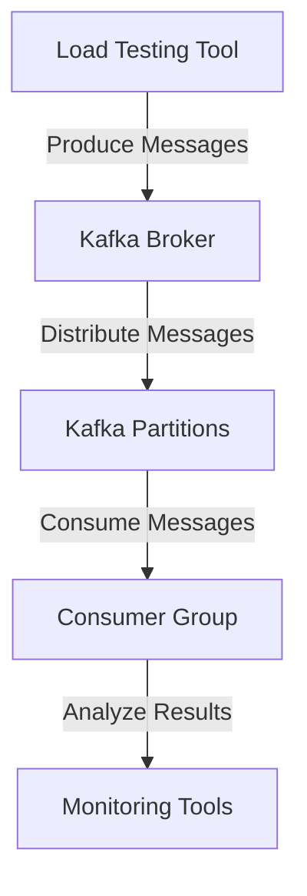

## 10.4.1 Load Testing Strategies

Load testing is a critical component in the lifecycle of any distributed system, especially for Apache Kafka, which is often the backbone of real-time data processing architectures. Understanding how your Kafka applications perform under various loads is essential to ensure they can handle peak traffic, scale efficiently, and maintain low latency. This section delves into the importance of load testing, introduces tools like Apache JMeter and Gatling, and provides guidance on designing effective load tests that simulate real-world scenarios.

### Importance of Load Testing

Load testing is crucial for identifying the limits of your Kafka deployment and ensuring that it can handle expected and unexpected traffic spikes. It helps in:

- **Identifying Bottlenecks**: Load testing reveals the weakest links in your Kafka setup, whether they are in the brokers, producers, or consumers.
- **Ensuring Scalability**: By simulating high loads, you can determine how well your system scales and what adjustments are necessary.
- **Validating Performance**: It ensures that your Kafka applications meet performance requirements, such as throughput and latency.
- **Preventing Downtime**: By understanding how your system behaves under stress, you can prevent outages during peak loads.

### Tools for Load Testing Kafka

Several tools can be used for load testing Kafka applications, each with its strengths and use cases. Here, we focus on Apache JMeter and Gatling, two popular tools for performance testing.

#### Apache JMeter

Apache JMeter is a versatile open-source tool designed for load testing and measuring performance. It supports testing on a variety of protocols, including HTTP, FTP, and Kafka.

- **Features**: JMeter provides a graphical interface, making it easy to configure tests. It supports distributed testing, allowing you to simulate large loads by distributing the test across multiple machines.
- **Kafka Support**: JMeter includes a Kafka plugin that allows you to produce and consume messages, making it suitable for testing Kafka applications.

#### Gatling

Gatling is another open-source load testing tool known for its high performance and ease of use. It is particularly well-suited for testing applications that require high concurrency.

- **Features**: Gatling provides a DSL (Domain-Specific Language) for writing tests, making them easy to read and maintain. It also offers detailed reports and real-time metrics.
- **Kafka Support**: While Gatling does not natively support Kafka, it can be extended with custom scripts to test Kafka applications.

### Designing Load Tests for Kafka

Designing effective load tests involves simulating real-world scenarios that your Kafka applications are likely to encounter. Here are some key considerations:

#### Define Test Objectives

Before designing a load test, clearly define what you want to achieve. Objectives might include:

- **Throughput Testing**: Determine the maximum number of messages your Kafka cluster can handle per second.
- **Latency Testing**: Measure the time taken for a message to travel from producer to consumer.
- **Scalability Testing**: Assess how performance changes as you add more producers or consumers.

#### Simulate Real-World Scenarios

To make your load tests realistic, simulate scenarios that reflect actual usage patterns:

- **Peak Load Simulation**: Test how your system performs during peak traffic periods.
- **Continuous Load Simulation**: Assess performance under a steady load over an extended period.
- **Burst Load Simulation**: Evaluate how your system handles sudden spikes in traffic.

#### Configure Test Parameters

When configuring your load tests, consider the following parameters:

- **Message Size**: Use realistic message sizes that your application typically handles.
- **Producer and Consumer Count**: Simulate the number of producers and consumers that will be active in your production environment.
- **Partition Count**: Ensure your tests reflect the partitioning strategy used in your Kafka setup.

### Interpreting Test Results

Once your load tests are complete, interpreting the results is crucial to understanding your system's performance and identifying areas for improvement.

#### Key Metrics

Focus on the following metrics when analyzing load test results:

- **Throughput**: The number of messages processed per second. High throughput indicates efficient message handling.
- **Latency**: The time taken for a message to be processed from producer to consumer. Low latency is critical for real-time applications.
- **Error Rate**: The percentage of messages that failed to be processed. A high error rate indicates potential issues in your Kafka setup.

#### Analyzing Bottlenecks

Identify bottlenecks by examining where performance degrades under load. Common bottlenecks include:

- **Network Bandwidth**: Ensure your network can handle the data volume.
- **Disk I/O**: Kafka relies heavily on disk operations; ensure your disks are not a bottleneck.
- **CPU Usage**: High CPU usage can indicate inefficient processing.

### Best Practices for Testing in Production-Like Environments

Testing in environments that closely resemble production is essential for accurate results. Here are some best practices:

- **Use Production Data**: If possible, use anonymized production data to ensure your tests reflect real-world scenarios.
- **Isolate Test Environment**: Ensure your test environment is isolated from production to prevent interference.
- **Monitor System Resources**: Continuously monitor CPU, memory, disk, and network usage during tests to identify resource constraints.

### Code Examples

Below are code examples demonstrating how to set up a simple Kafka producer and consumer for load testing using Java, Scala, Kotlin, and Clojure.

#### Java

```java
import org.apache.kafka.clients.producer.KafkaProducer;
import org.apache.kafka.clients.producer.ProducerRecord;
import java.util.Properties;

public class KafkaLoadTestProducer {
    public static void main(String[] args) {
        Properties props = new Properties();
        props.put("bootstrap.servers", "localhost:9092");
        props.put("key.serializer", "org.apache.kafka.common.serialization.StringSerializer");
        props.put("value.serializer", "org.apache.kafka.common.serialization.StringSerializer");

        KafkaProducer<String, String> producer = new KafkaProducer<>(props);
        for (int i = 0; i < 1000; i++) {
            producer.send(new ProducerRecord<>("test-topic", Integer.toString(i), "message-" + i));
        }
        producer.close();
    }
}
```

#### Scala

```scala
import org.apache.kafka.clients.producer.{KafkaProducer, ProducerRecord}
import java.util.Properties

object KafkaLoadTestProducer extends App {
  val props = new Properties()
  props.put("bootstrap.servers", "localhost:9092")
  props.put("key.serializer", "org.apache.kafka.common.serialization.StringSerializer")
  props.put("value.serializer", "org.apache.kafka.common.serialization.StringSerializer")

  val producer = new KafkaProducer[String, String](props)
  for (i <- 0 until 1000) {
    producer.send(new ProducerRecord[String, String]("test-topic", i.toString, s"message-$i"))
  }
  producer.close()
}
```

#### Kotlin

```kotlin
import org.apache.kafka.clients.producer.KafkaProducer
import org.apache.kafka.clients.producer.ProducerRecord
import java.util.Properties

fun main() {
    val props = Properties()
    props["bootstrap.servers"] = "localhost:9092"
    props["key.serializer"] = "org.apache.kafka.common.serialization.StringSerializer"
    props["value.serializer"] = "org.apache.kafka.common.serialization.StringSerializer"

    val producer = KafkaProducer<String, String>(props)
    for (i in 0 until 1000) {
        producer.send(ProducerRecord("test-topic", i.toString(), "message-$i"))
    }
    producer.close()
}
```

#### Clojure

```clojure
(require '[clojure.java.io :as io])
(import '[org.apache.kafka.clients.producer KafkaProducer ProducerRecord])

(defn kafka-producer []
  (let [props (doto (java.util.Properties.)
                (.put "bootstrap.servers" "localhost:9092")
                (.put "key.serializer" "org.apache.kafka.common.serialization.StringSerializer")
                (.put "value.serializer" "org.apache.kafka.common.serialization.StringSerializer"))
        producer (KafkaProducer. props)]
    (doseq [i (range 1000)]
      (.send producer (ProducerRecord. "test-topic" (str i) (str "message-" i))))
    (.close producer)))

(kafka-producer)
```

### Visualizing Kafka Load Testing

To better understand the flow of data during load testing, consider the following diagram illustrating a typical Kafka load testing setup:



**Caption**: This diagram shows the flow of messages from a load testing tool to Kafka brokers, through partitions, and finally to consumer groups for analysis.

### References and Links

- [Apache Kafka Documentation](https://kafka.apache.org/documentation/)
- [Apache JMeter](https://jmeter.apache.org/)
- [Gatling](https://gatling.io/)

### Knowledge Check

To reinforce your understanding of load testing strategies for Kafka, consider the following questions and challenges.

## Test Your Knowledge: Load Testing Strategies for Apache Kafka



### What is the primary purpose of load testing in Kafka applications?

- [x] To identify performance bottlenecks and ensure scalability.
- [ ] To enhance security features.
- [ ] To improve user interface design.
- [ ] To reduce development time.

> **Explanation:** Load testing helps identify performance bottlenecks and ensures that Kafka applications can scale effectively under various loads.

### Which tool is known for its high concurrency support in load testing?

- [ ] Apache JMeter
- [x] Gatling
- [ ] Apache Maven
- [ ] Gradle

> **Explanation:** Gatling is known for its high concurrency support, making it suitable for load testing applications that require handling many simultaneous users.

### What is a key metric to focus on when analyzing load test results?

- [ ] User satisfaction
- [ ] Code complexity
- [x] Throughput
- [ ] Color scheme

> **Explanation:** Throughput, which measures the number of messages processed per second, is a critical metric for assessing the performance of Kafka applications.

### What is the benefit of using production data in load testing?

- [x] It ensures tests reflect real-world scenarios.
- [ ] It reduces testing time.
- [ ] It simplifies test configuration.
- [ ] It enhances security.

> **Explanation:** Using production data in load testing ensures that the tests accurately reflect real-world scenarios, leading to more reliable results.

### Which of the following is a common bottleneck in Kafka load testing?

- [x] Disk I/O
- [ ] User interface
- [ ] Color scheme
- [ ] Code comments

> **Explanation:** Disk I/O is a common bottleneck in Kafka load testing due to Kafka's reliance on disk operations for message storage and retrieval.

### What is the purpose of simulating burst load in Kafka testing?

- [x] To evaluate how the system handles sudden spikes in traffic.
- [ ] To improve user interface design.
- [ ] To reduce code complexity.
- [ ] To enhance security features.

> **Explanation:** Simulating burst load helps evaluate how the system handles sudden spikes in traffic, ensuring it can maintain performance during unexpected load increases.

### Which of the following is a best practice for testing in production-like environments?

- [x] Isolate the test environment from production.
- [ ] Use the same environment for testing and production.
- [ ] Avoid monitoring system resources.
- [ ] Use synthetic data only.

> **Explanation:** Isolating the test environment from production ensures that tests do not interfere with live systems and that results are accurate.

### What is a common use case for load testing Kafka applications?

- [x] Validating performance under peak load conditions.
- [ ] Enhancing user interface design.
- [ ] Reducing code complexity.
- [ ] Improving security features.

> **Explanation:** Load testing is commonly used to validate performance under peak load conditions, ensuring that Kafka applications can handle high traffic volumes.

### Which tool provides a graphical interface for configuring load tests?

- [x] Apache JMeter
- [ ] Gatling
- [ ] Apache Maven
- [ ] Gradle

> **Explanation:** Apache JMeter provides a graphical interface, making it easy to configure and run load tests.

### True or False: Load testing can help prevent downtime during peak loads.

- [x] True
- [ ] False

> **Explanation:** Load testing helps identify potential issues and bottlenecks, allowing you to address them before they cause downtime during peak loads.



By following these strategies and best practices, you can ensure that your Kafka applications are robust, scalable, and capable of handling the demands of real-world usage.
