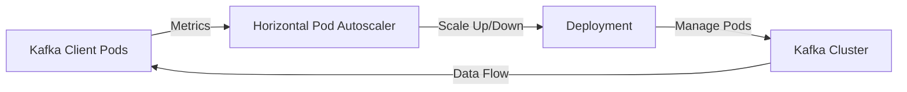

## 10.4.2 Dynamic Scaling in Containerized Environments

Dynamic scaling in containerized environments is a critical aspect of modern software architecture, particularly when dealing with distributed systems like Apache Kafka. This section delves into the benefits of containerization for scaling, the use of Kubernetes Horizontal Pod Autoscaler (HPA) for scaling Kafka clients, setting up resource requests and limits, handling stateful components, and considerations for networking and service discovery.

### Benefits of Containerization for Scaling

Containerization offers several advantages that make it an ideal choice for deploying and scaling Apache Kafka clients:

- **Isolation**: Containers provide process isolation, ensuring that each Kafka client runs in its own environment without interference from other processes.
- **Portability**: Containers can run consistently across different environments, from development to production, ensuring that scaling strategies are reliable and predictable.
- **Resource Efficiency**: Containers share the host OS kernel, which reduces overhead compared to virtual machines, allowing for more efficient use of resources.
- **Scalability**: Container orchestration platforms like Kubernetes provide built-in mechanisms for scaling applications up or down based on demand.

### Using Kubernetes Horizontal Pod Autoscaler (HPA)

The Kubernetes Horizontal Pod Autoscaler (HPA) is a powerful tool for dynamically scaling the number of pods in a deployment based on observed CPU utilization or other select metrics. This is particularly useful for Kafka clients, which may need to scale in response to varying workloads.

#### Setting Up HPA for Kafka Clients

To set up HPA for Kafka clients, follow these steps:

1. **Define Resource Requests and Limits**: Ensure that your Kafka client pods have defined CPU and memory requests and limits. This is crucial for HPA to function correctly, as it uses these metrics to determine when to scale.

    ```yaml
    apiVersion: apps/v1
    kind: Deployment
    metadata:
      name: kafka-consumer
    spec:
      replicas: 1
      template:
        spec:
          containers:
          - name: kafka-consumer
            image: my-kafka-consumer:latest
            resources:
              requests:
                memory: "512Mi"
                cpu: "500m"
              limits:
                memory: "1Gi"
                cpu: "1"
    ```

2. **Configure HPA**: Create an HPA resource that specifies the target CPU utilization and the minimum and maximum number of replicas.

    ```yaml
    apiVersion: autoscaling/v2beta2
    kind: HorizontalPodAutoscaler
    metadata:
      name: kafka-consumer-hpa
    spec:
      scaleTargetRef:
        apiVersion: apps/v1
        kind: Deployment
        name: kafka-consumer
      minReplicas: 1
      maxReplicas: 10
      metrics:
      - type: Resource
        resource:
          name: cpu
          target:
            type: Utilization
            averageUtilization: 50
    ```

3. **Monitor and Adjust**: Continuously monitor the performance of your Kafka clients and adjust the HPA configuration as needed to ensure optimal scaling.

### Strategies for Handling Stateful Components

While Kafka clients are typically stateless, there are scenarios where stateful components are involved, such as when using Kafka Streams. Handling stateful components in a containerized environment requires careful consideration:

- **StatefulSets**: Use Kubernetes StatefulSets for managing stateful applications. StatefulSets provide stable, unique network identifiers and persistent storage, which are essential for stateful Kafka applications.
  
- **Persistent Volumes**: Ensure that stateful components have access to persistent storage. Use Kubernetes Persistent Volumes (PVs) and Persistent Volume Claims (PVCs) to manage storage needs.

- **Backup and Recovery**: Implement robust backup and recovery strategies to protect stateful data. Regularly back up stateful data and test recovery procedures to ensure data integrity.

### Considerations for Networking and Service Discovery

Networking and service discovery are critical components of a containerized Kafka deployment. Here are some considerations to keep in mind:

- **Service Mesh**: Consider using a service mesh like Istio or Linkerd to manage service-to-service communication. Service meshes provide advanced networking features such as traffic management, security, and observability.

- **DNS and Load Balancing**: Use Kubernetes Services to provide DNS and load balancing for Kafka clients. Ensure that services are configured to handle the expected load and provide high availability.

- **Network Policies**: Implement network policies to control traffic flow between pods. Use Kubernetes Network Policies to define rules for ingress and egress traffic, enhancing security and performance.

### Code Examples

Below are code examples demonstrating dynamic scaling in containerized environments using Java, Scala, Kotlin, and Clojure.

#### Java Example

```java
import org.apache.kafka.clients.consumer.KafkaConsumer;
import org.apache.kafka.clients.consumer.ConsumerConfig;
import org.apache.kafka.clients.consumer.ConsumerRecords;
import org.apache.kafka.clients.consumer.ConsumerRecord;

import java.util.Properties;
import java.util.Collections;

public class KafkaConsumerExample {
    public static void main(String[] args) {
        Properties props = new Properties();
        props.put(ConsumerConfig.BOOTSTRAP_SERVERS_CONFIG, "localhost:9092");
        props.put(ConsumerConfig.GROUP_ID_CONFIG, "example-group");
        props.put(ConsumerConfig.KEY_DESERIALIZER_CLASS_CONFIG, "org.apache.kafka.common.serialization.StringDeserializer");
        props.put(ConsumerConfig.VALUE_DESERIALIZER_CLASS_CONFIG, "org.apache.kafka.common.serialization.StringDeserializer");

        KafkaConsumer<String, String> consumer = new KafkaConsumer<>(props);
        consumer.subscribe(Collections.singletonList("example-topic"));

        while (true) {
            ConsumerRecords<String, String> records = consumer.poll(100);
            for (ConsumerRecord<String, String> record : records) {
                System.out.printf("offset = %d, key = %s, value = %s%n", record.offset(), record.key(), record.value());
            }
        }
    }
}
```

#### Scala Example

```scala
import org.apache.kafka.clients.consumer.{KafkaConsumer, ConsumerConfig, ConsumerRecords}
import java.util.Properties
import scala.collection.JavaConverters._

object KafkaConsumerExample extends App {
  val props = new Properties()
  props.put(ConsumerConfig.BOOTSTRAP_SERVERS_CONFIG, "localhost:9092")
  props.put(ConsumerConfig.GROUP_ID_CONFIG, "example-group")
  props.put(ConsumerConfig.KEY_DESERIALIZER_CLASS_CONFIG, "org.apache.kafka.common.serialization.StringDeserializer")
  props.put(ConsumerConfig.VALUE_DESERIALIZER_CLASS_CONFIG, "org.apache.kafka.common.serialization.StringDeserializer")

  val consumer = new KafkaConsumer[String, String](props)
  consumer.subscribe(List("example-topic").asJava)

  while (true) {
    val records: ConsumerRecords[String, String] = consumer.poll(100)
    records.asScala.foreach { record =>
      println(s"offset = ${record.offset()}, key = ${record.key()}, value = ${record.value()}")
    }
  }
}
```

#### Kotlin Example

```kotlin
import org.apache.kafka.clients.consumer.KafkaConsumer
import org.apache.kafka.clients.consumer.ConsumerConfig
import org.apache.kafka.clients.consumer.ConsumerRecords
import java.util.Properties

fun main() {
    val props = Properties()
    props[ConsumerConfig.BOOTSTRAP_SERVERS_CONFIG] = "localhost:9092"
    props[ConsumerConfig.GROUP_ID_CONFIG] = "example-group"
    props[ConsumerConfig.KEY_DESERIALIZER_CLASS_CONFIG] = "org.apache.kafka.common.serialization.StringDeserializer"
    props[ConsumerConfig.VALUE_DESERIALIZER_CLASS_CONFIG] = "org.apache.kafka.common.serialization.StringDeserializer"

    val consumer = KafkaConsumer<String, String>(props)
    consumer.subscribe(listOf("example-topic"))

    while (true) {
        val records: ConsumerRecords<String, String> = consumer.poll(100)
        for (record in records) {
            println("offset = ${record.offset()}, key = ${record.key()}, value = ${record.value()}")
        }
    }
}
```

#### Clojure Example

```clojure
(ns kafka-consumer-example
  (:import [org.apache.kafka.clients.consumer KafkaConsumer ConsumerConfig ConsumerRecords]
           [java.util Properties Collections]))

(defn -main []
  (let [props (doto (Properties.)
                (.put ConsumerConfig/BOOTSTRAP_SERVERS_CONFIG "localhost:9092")
                (.put ConsumerConfig/GROUP_ID_CONFIG "example-group")
                (.put ConsumerConfig/KEY_DESERIALIZER_CLASS_CONFIG "org.apache.kafka.common.serialization.StringDeserializer")
                (.put ConsumerConfig/VALUE_DESERIALIZER_CLASS_CONFIG "org.apache.kafka.common.serialization.StringDeserializer"))
        consumer (KafkaConsumer. props)]
    (.subscribe consumer (Collections/singletonList "example-topic"))
    (while true
      (let [records (.poll consumer 100)]
        (doseq [record records]
          (println (format "offset = %d, key = %s, value = %s" (.offset record) (.key record) (.value record))))))))
```

### Visualizing Dynamic Scaling

To better understand the dynamic scaling process, consider the following diagram illustrating the interaction between Kafka clients, Kubernetes, and the Horizontal Pod Autoscaler.



**Diagram Caption**: This diagram shows how Kafka client pods interact with the Kubernetes Horizontal Pod Autoscaler to dynamically scale based on workload metrics.

### Knowledge Check

- **What are the benefits of using containers for scaling Kafka clients?**
- **How does the Kubernetes Horizontal Pod Autoscaler work?**
- **What are the key considerations when handling stateful components in a containerized environment?**
- **How can service meshes enhance networking for Kafka deployments?**

### Conclusion

Dynamic scaling in containerized environments is a powerful technique for optimizing the performance and resource utilization of Apache Kafka deployments. By leveraging Kubernetes and its Horizontal Pod Autoscaler, you can ensure that your Kafka clients scale efficiently in response to changing workloads. Remember to consider the unique challenges posed by stateful components and to implement robust networking and service discovery strategies.

For further reading, explore the [Apache Kafka Documentation](https://kafka.apache.org/documentation/) and the [Kubernetes Documentation](https://kubernetes.io/docs/home/).

## Test Your Knowledge: Dynamic Scaling in Containerized Environments Quiz



### What is the primary benefit of using containers for scaling Kafka clients?

- [x] Isolation and resource efficiency
- [ ] Increased security
- [ ] Simplified networking
- [ ] Enhanced logging capabilities

> **Explanation:** Containers provide isolation and resource efficiency, making them ideal for scaling applications like Kafka clients.

### How does the Kubernetes Horizontal Pod Autoscaler determine when to scale?

- [x] By monitoring CPU utilization and other metrics
- [ ] By checking the number of active connections
- [ ] By analyzing network traffic
- [ ] By evaluating disk usage

> **Explanation:** The HPA uses metrics such as CPU utilization to decide when to scale pods up or down.

### Which Kubernetes resource is essential for managing stateful applications?

- [x] StatefulSets
- [ ] Deployments
- [ ] ConfigMaps
- [ ] Secrets

> **Explanation:** StatefulSets provide stable network identities and persistent storage, crucial for stateful applications.

### What role does a service mesh play in a containerized Kafka deployment?

- [x] It manages service-to-service communication
- [ ] It provides persistent storage
- [ ] It handles pod scheduling
- [ ] It manages container images

> **Explanation:** A service mesh manages communication between services, offering features like traffic management and security.

### Which of the following is a key consideration for networking in containerized environments?

- [x] DNS and load balancing
- [ ] Disk I/O optimization
- [ ] Memory allocation
- [ ] Logging configuration

> **Explanation:** DNS and load balancing are critical for ensuring reliable service discovery and traffic distribution.

### What is the purpose of setting resource requests and limits for Kafka client pods?

- [x] To enable the Horizontal Pod Autoscaler to function correctly
- [ ] To improve network performance
- [ ] To enhance security
- [ ] To simplify deployment

> **Explanation:** Resource requests and limits are necessary for the HPA to make informed scaling decisions.

### How can persistent volumes be used in a containerized Kafka deployment?

- [x] To provide storage for stateful components
- [ ] To manage network traffic
- [ ] To store container images
- [ ] To enhance CPU performance

> **Explanation:** Persistent volumes offer storage solutions for stateful components, ensuring data persistence.

### What is a common strategy for handling stateful components in Kubernetes?

- [x] Using StatefulSets and Persistent Volumes
- [ ] Deploying as stateless pods
- [ ] Utilizing ConfigMaps
- [ ] Implementing Secrets

> **Explanation:** StatefulSets and Persistent Volumes are used to manage stateful components effectively.

### Which tool can be used to monitor and adjust the performance of Kafka clients in Kubernetes?

- [x] Horizontal Pod Autoscaler
- [ ] ConfigMap
- [ ] Secret
- [ ] Persistent Volume

> **Explanation:** The Horizontal Pod Autoscaler monitors metrics and adjusts the number of pods accordingly.

### True or False: Service meshes can provide traffic management and security features for Kafka deployments.

- [x] True
- [ ] False

> **Explanation:** Service meshes like Istio offer advanced features for managing service communication, including traffic management and security.


