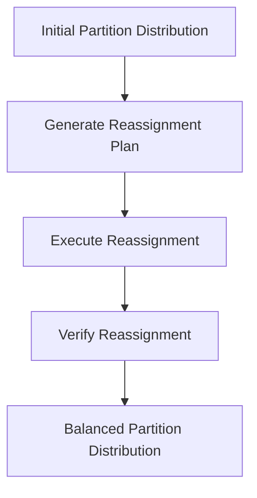

## 10.4.3 Partition Reassignment and Balancing

Partition reassignment and balancing are critical processes in Apache Kafka that ensure efficient resource utilization and optimal performance in distributed systems. As Kafka clusters grow and evolve, the need to redistribute partitions across brokers becomes inevitable. This section delves into the reasons for partition reassignment, the tools and techniques available for executing it, and best practices to minimize disruption during the process.

### Why Partition Reassignment is Necessary

Partition reassignment is essential for several reasons:

1. **Cluster Expansion**: When new brokers are added to a Kafka cluster, partitions need to be redistributed to utilize the new resources effectively.

2. **Load Balancing**: Over time, certain brokers may become overloaded due to uneven partition distribution. Rebalancing helps distribute the load evenly across all brokers.

3. **Performance Optimization**: By redistributing partitions, you can optimize the performance of your Kafka cluster, ensuring that no single broker becomes a bottleneck.

4. **Fault Tolerance**: Reassigning partitions can improve fault tolerance by ensuring that replicas are distributed across different brokers, reducing the risk of data loss.

5. **Maintenance and Upgrades**: During maintenance or upgrades, partitions may need to be temporarily reassigned to ensure continuous availability.

### Using Kafka's Partition Reassignment Tool

Kafka provides a built-in tool for partition reassignment, which can be used to manually or automatically redistribute partitions across brokers. The tool operates in several steps:

1. **Generate a Reassignment Plan**: This involves creating a JSON file that specifies the desired partition distribution across brokers.

2. **Execute the Reassignment**: The reassignment tool reads the JSON file and moves the partitions accordingly.

3. **Verify the Reassignment**: After execution, it's crucial to verify that the partitions have been reassigned as intended.

#### Example: Generating a Reassignment Plan

To generate a reassignment plan, you can use the `kafka-reassign-partitions.sh` script. Here's an example command:

```bash
bin/kafka-reassign-partitions.sh --zookeeper localhost:2181 --generate --topics-to-move-json-file topics-to-move.json --broker-list "1,2,3"
```

- **topics-to-move.json**: A JSON file listing the topics and partitions to be reassigned.
- **broker-list**: A comma-separated list of broker IDs to which partitions will be reassigned.

#### Example: Executing the Reassignment

Once the plan is generated, execute it with the following command:

```bash
bin/kafka-reassign-partitions.sh --zookeeper localhost:2181 --execute --reassignment-json-file reassignment-plan.json
```

- **reassignment-plan.json**: The JSON file containing the reassignment plan.

#### Example: Verifying the Reassignment

To verify the reassignment, use the following command:

```bash
bin/kafka-reassign-partitions.sh --zookeeper localhost:2181 --verify --reassignment-json-file reassignment-plan.json
```

### Impact of Partitioning on Consumer Scaling

Partitioning directly affects consumer scaling in Kafka. Each partition can be consumed by only one consumer within a consumer group at a time. Therefore, the number of partitions determines the maximum parallelism achievable by consumers. Proper partitioning ensures that:

- **Scalability**: More partitions allow for more consumers, increasing the throughput of your Kafka consumers.
- **Load Distribution**: Even distribution of partitions across consumers prevents any single consumer from becoming a bottleneck.
- **Fault Tolerance**: With more partitions, the failure of a single consumer affects a smaller portion of the data stream.

### Best Practices for Minimizing Disruption During Reassignment

Partition reassignment can be disruptive if not handled carefully. Here are some best practices to minimize disruption:

1. **Plan During Low Traffic**: Schedule reassignments during periods of low traffic to reduce the impact on production workloads.

2. **Incremental Reassignment**: Reassign partitions in small batches to avoid overwhelming the cluster.

3. **Monitor Performance**: Use monitoring tools to track the performance of the cluster during reassignment and adjust the process as needed.

4. **Use Throttling**: Apply throttling to limit the rate of data movement during reassignment, preventing network saturation.

5. **Test in Staging**: Before executing in production, test the reassignment process in a staging environment to identify potential issues.

### Tools for Partition Management

Several tools can assist with partition management and reassignment in Kafka:

- **Cruise Control**: An open-source tool that automates partition reassignment and balancing. It provides a user-friendly interface and advanced features like anomaly detection and self-healing.

- **Confluent Control Center**: Part of the Confluent Platform, this tool offers a graphical interface for managing Kafka clusters, including partition reassignment.

- **Kafka Manager**: A web-based tool for managing Kafka clusters, including partition reassignment and monitoring.

#### Example: Using Cruise Control for Reassignment

Cruise Control simplifies partition reassignment with its automated balancing features. Here's how you can use it:

1. **Install Cruise Control**: Follow the installation instructions on the [Cruise Control GitHub page](https://github.com/linkedin/cruise-control).

2. **Configure Cruise Control**: Set up the configuration files to connect to your Kafka cluster.

3. **Run a Rebalance**: Use the Cruise Control API to trigger a rebalance:

```bash
curl -X POST "http://localhost:9090/kafkacruisecontrol/rebalance?dryrun=false"
```

- **dryrun=false**: Executes the rebalance; set to `true` to simulate without making changes.

### Visualizing Partition Reassignment

To better understand the partition reassignment process, consider the following diagram:



**Caption**: This diagram illustrates the steps involved in partition reassignment, from generating a plan to achieving a balanced distribution.

### Conclusion

Partition reassignment and balancing are vital for maintaining the performance and reliability of Kafka clusters. By understanding the tools and techniques available, and following best practices, you can ensure that your Kafka deployment remains efficient and resilient.

### Key Takeaways

- Partition reassignment is necessary for cluster expansion, load balancing, performance optimization, and fault tolerance.
- Kafka's partition reassignment tool provides a structured approach to redistributing partitions.
- Proper partitioning is crucial for consumer scaling and load distribution.
- Best practices, such as incremental reassignment and monitoring, help minimize disruption.
- Tools like Cruise Control and Confluent Control Center simplify partition management.

### References and Further Reading

- [Apache Kafka Documentation](https://kafka.apache.org/documentation/)
- [Cruise Control GitHub Repository](https://github.com/linkedin/cruise-control)
- [Confluent Control Center](https://docs.confluent.io/platform/current/control-center/index.html)

---

## Test Your Knowledge: Partition Reassignment and Balancing in Kafka



### Why is partition reassignment necessary in a Kafka cluster?

- [x] To utilize new broker resources effectively
- [ ] To increase the number of topics
- [ ] To reduce the number of partitions
- [ ] To decrease consumer lag

> **Explanation:** Partition reassignment is necessary to utilize new broker resources effectively, balance load, and optimize performance.

### What is the first step in using Kafka's partition reassignment tool?

- [x] Generate a reassignment plan
- [ ] Execute the reassignment
- [ ] Verify the reassignment
- [ ] Monitor the cluster

> **Explanation:** The first step is to generate a reassignment plan, which outlines the desired partition distribution.

### How does partitioning affect consumer scaling in Kafka?

- [x] It determines the maximum parallelism achievable by consumers
- [ ] It increases the number of brokers
- [ ] It reduces the number of topics
- [ ] It decreases network traffic

> **Explanation:** Partitioning determines the maximum parallelism achievable by consumers, as each partition can be consumed by only one consumer within a group.

### Which tool can automate partition reassignment and balancing in Kafka?

- [x] Cruise Control
- [ ] Kafka Manager
- [ ] Zookeeper
- [ ] Kafka Connect

> **Explanation:** Cruise Control is an open-source tool that automates partition reassignment and balancing.

### What is a best practice for minimizing disruption during partition reassignment?

- [x] Schedule reassignments during low traffic periods
- [ ] Reassign all partitions at once
- [ ] Ignore monitoring tools
- [ ] Increase network saturation

> **Explanation:** Scheduling reassignments during low traffic periods helps minimize disruption to production workloads.

### What command is used to execute a partition reassignment in Kafka?

- [x] `kafka-reassign-partitions.sh --execute`
- [ ] `kafka-topics.sh --create`
- [ ] `kafka-consumer-groups.sh --describe`
- [ ] `kafka-producer-perf-test.sh`

> **Explanation:** The `kafka-reassign-partitions.sh --execute` command is used to execute a partition reassignment.

### What is the role of throttling during partition reassignment?

- [x] To limit the rate of data movement
- [ ] To increase the number of partitions
- [ ] To decrease broker count
- [ ] To reduce consumer lag

> **Explanation:** Throttling limits the rate of data movement during reassignment, preventing network saturation.

### Which file format is used to specify a reassignment plan in Kafka?

- [x] JSON
- [ ] XML
- [ ] YAML
- [ ] CSV

> **Explanation:** A JSON file is used to specify a reassignment plan in Kafka.

### What is the benefit of using incremental reassignment?

- [x] It avoids overwhelming the cluster
- [ ] It increases the number of brokers
- [ ] It reduces the number of topics
- [ ] It decreases consumer lag

> **Explanation:** Incremental reassignment avoids overwhelming the cluster by redistributing partitions in small batches.

### True or False: Partition reassignment can improve fault tolerance in Kafka.

- [x] True
- [ ] False

> **Explanation:** True. Partition reassignment can improve fault tolerance by ensuring replicas are distributed across different brokers.



---
