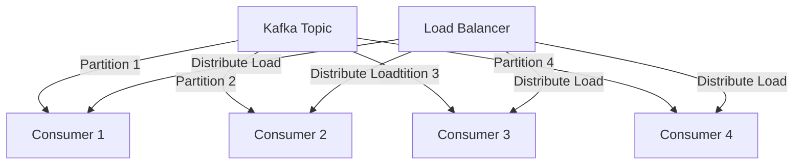
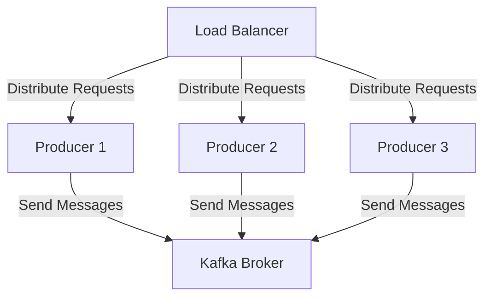

## 10.4 Scaling Consumers and Producers

Scaling consumers and producers in Apache Kafka is crucial for maintaining performance and reliability as workloads increase. This section delves into the challenges and strategies for scaling Kafka clients, focusing on both horizontal and vertical scaling approaches. We will explore best practices for scaling in cloud and container environments, ensuring that your Kafka deployment can handle growing demands efficiently.

### Challenges of Scaling Kafka Clients

Scaling Kafka clients involves several challenges that need to be addressed to maintain system performance and reliability:

1. **Load Balancing**: Distributing the load evenly across consumers and producers is essential to prevent bottlenecks and ensure efficient resource utilization.

2. **Consumer Group Coordination**: As the number of consumers increases, managing consumer group coordination and rebalancing becomes more complex.

3. **Data Consistency**: Ensuring data consistency and maintaining the order of messages across scaled consumers can be challenging.

4. **Resource Management**: Efficiently managing resources such as CPU, memory, and network bandwidth is critical to avoid resource contention and degradation of performance.

5. **Latency and Throughput**: Balancing latency and throughput is crucial when scaling clients to ensure timely processing of messages without overwhelming the system.

### Horizontal and Vertical Scaling Approaches

#### Horizontal Scaling

Horizontal scaling involves adding more instances of consumers or producers to distribute the load. This approach is often preferred for its flexibility and ability to handle large-scale workloads.

- **Consumer Scaling**: Increase the number of consumers in a consumer group to parallelize message processing. This is particularly effective when dealing with high-throughput topics.

- **Producer Scaling**: Deploy multiple producer instances to distribute the message production load. This can help in scenarios where a single producer cannot handle the required throughput.

- **Load Balancing**: Use load balancers to distribute incoming requests across multiple producer instances, ensuring even distribution of traffic.

- **Stateless Design**: Design consumers and producers to be stateless, allowing them to be easily scaled horizontally without complex state management.

#### Vertical Scaling

Vertical scaling involves increasing the resources (CPU, memory, etc.) of existing consumer or producer instances. This approach is suitable for scenarios where horizontal scaling is not feasible or cost-effective.

- **Resource Allocation**: Allocate more resources to existing instances to handle increased load. This can be done by resizing virtual machines or containers.

- **Performance Tuning**: Optimize the configuration of Kafka clients to make better use of available resources. This includes tuning batch sizes, buffer sizes, and compression settings.

- **Single Instance Optimization**: Focus on optimizing a single instance to handle more load, which can be beneficial in environments with limited scaling capabilities.

### Best Practices for Scaling in Cloud and Container Environments

Scaling Kafka clients in cloud and container environments introduces additional considerations and opportunities for optimization:

1. **Containerization**: Use containerization technologies like Docker to package and deploy Kafka clients. This allows for easy scaling and management of instances.

2. **Orchestration**: Leverage orchestration tools like Kubernetes to automate the scaling and management of Kafka clients. Kubernetes can dynamically adjust the number of instances based on load.

3. **Auto-Scaling**: Implement auto-scaling policies to automatically adjust the number of consumer and producer instances based on predefined metrics such as CPU usage or message lag.

4. **Resource Quotas**: Set resource quotas to prevent any single consumer or producer from consuming excessive resources, ensuring fair resource allocation across instances.

5. **Monitoring and Alerts**: Use monitoring tools to track the performance of Kafka clients and set up alerts for critical metrics such as message lag, CPU usage, and memory consumption.

6. **Network Optimization**: Optimize network configurations to reduce latency and improve throughput. This includes tuning network buffers and using high-performance network interfaces.

### Considerations for Maintaining Performance and Reliability

To maintain performance and reliability while scaling Kafka clients, consider the following:

- **Partitioning Strategy**: Design an effective partitioning strategy to ensure even distribution of messages across consumers. This can help prevent hotspots and ensure balanced load.

- **Consumer Group Rebalancing**: Understand the implications of consumer group rebalancing and implement strategies to minimize its impact on performance. This includes using static group membership and optimizing session timeouts.

- **Data Consistency**: Implement strategies to ensure data consistency across scaled consumers. This may involve using idempotent consumers and handling duplicate messages.

- **Fault Tolerance**: Design Kafka clients to be fault-tolerant, with mechanisms for automatic recovery from failures. This includes implementing retries and fallback strategies.

- **Testing and Validation**: Conduct thorough testing and validation of scaling strategies to ensure they meet performance and reliability requirements. This includes load testing and failure simulations.

### Code Examples

Below are code examples demonstrating how to scale Kafka consumers and producers in different programming languages.

#### Java

```java
import org.apache.kafka.clients.consumer.KafkaConsumer;
import org.apache.kafka.clients.producer.KafkaProducer;
import org.apache.kafka.clients.producer.ProducerRecord;
import java.util.Properties;

public class KafkaScalingExample {

    public static void main(String[] args) {
        // Producer configuration
        Properties producerProps = new Properties();
        producerProps.put("bootstrap.servers", "localhost:9092");
        producerProps.put("key.serializer", "org.apache.kafka.common.serialization.StringSerializer");
        producerProps.put("value.serializer", "org.apache.kafka.common.serialization.StringSerializer");

        KafkaProducer<String, String> producer = new KafkaProducer<>(producerProps);

        // Send messages in a loop
        for (int i = 0; i < 100; i++) {
            producer.send(new ProducerRecord<>("my-topic", Integer.toString(i), "Message " + i));
        }

        producer.close();

        // Consumer configuration
        Properties consumerProps = new Properties();
        consumerProps.put("bootstrap.servers", "localhost:9092");
        consumerProps.put("group.id", "my-group");
        consumerProps.put("key.deserializer", "org.apache.kafka.common.serialization.StringDeserializer");
        consumerProps.put("value.deserializer", "org.apache.kafka.common.serialization.StringDeserializer");

        KafkaConsumer<String, String> consumer = new KafkaConsumer<>(consumerProps);
        consumer.subscribe(List.of("my-topic"));

        // Poll messages in a loop
        while (true) {
            consumer.poll(Duration.ofMillis(100)).forEach(record -> {
                System.out.printf("Consumed message: key = %s, value = %s%n", record.key(), record.value());
            });
        }
    }
}
```

#### Scala

```scala
import org.apache.kafka.clients.consumer.KafkaConsumer
import org.apache.kafka.clients.producer.{KafkaProducer, ProducerRecord}
import java.util.Properties
import scala.collection.JavaConverters._

object KafkaScalingExample extends App {

  // Producer configuration
  val producerProps = new Properties()
  producerProps.put("bootstrap.servers", "localhost:9092")
  producerProps.put("key.serializer", "org.apache.kafka.common.serialization.StringSerializer")
  producerProps.put("value.serializer", "org.apache.kafka.common.serialization.StringSerializer")

  val producer = new KafkaProducer[String, String](producerProps)

  // Send messages in a loop
  for (i <- 0 until 100) {
    producer.send(new ProducerRecord[String, String]("my-topic", i.toString, s"Message $i"))
  }

  producer.close()

  // Consumer configuration
  val consumerProps = new Properties()
  consumerProps.put("bootstrap.servers", "localhost:9092")
  consumerProps.put("group.id", "my-group")
  consumerProps.put("key.deserializer", "org.apache.kafka.common.serialization.StringDeserializer")
  consumerProps.put("value.deserializer", "org.apache.kafka.common.serialization.StringDeserializer")

  val consumer = new KafkaConsumer[String, String](consumerProps)
  consumer.subscribe(List("my-topic").asJava)

  // Poll messages in a loop
  while (true) {
    val records = consumer.poll(java.time.Duration.ofMillis(100))
    records.asScala.foreach { record =>
      println(s"Consumed message: key = ${record.key()}, value = ${record.value()}")
    }
  }
}
```

#### Kotlin

```kotlin
import org.apache.kafka.clients.consumer.KafkaConsumer
import org.apache.kafka.clients.producer.KafkaProducer
import org.apache.kafka.clients.producer.ProducerRecord
import java.time.Duration
import java.util.Properties

fun main() {
    // Producer configuration
    val producerProps = Properties().apply {
        put("bootstrap.servers", "localhost:9092")
        put("key.serializer", "org.apache.kafka.common.serialization.StringSerializer")
        put("value.serializer", "org.apache.kafka.common.serialization.StringSerializer")
    }

    val producer = KafkaProducer<String, String>(producerProps)

    // Send messages in a loop
    for (i in 0 until 100) {
        producer.send(ProducerRecord("my-topic", i.toString(), "Message $i"))
    }

    producer.close()

    // Consumer configuration
    val consumerProps = Properties().apply {
        put("bootstrap.servers", "localhost:9092")
        put("group.id", "my-group")
        put("key.deserializer", "org.apache.kafka.common.serialization.StringDeserializer")
        put("value.deserializer", "org.apache.kafka.common.serialization.StringDeserializer")
    }

    val consumer = KafkaConsumer<String, String>(consumerProps)
    consumer.subscribe(listOf("my-topic"))

    // Poll messages in a loop
    while (true) {
        val records = consumer.poll(Duration.ofMillis(100))
        for (record in records) {
            println("Consumed message: key = ${record.key()}, value = ${record.value()}")
        }
    }
}
```

#### Clojure

```clojure
(require '[clojure.java.io :as io])
(import '[org.apache.kafka.clients.consumer KafkaConsumer]
        '[org.apache.kafka.clients.producer KafkaProducer ProducerRecord]
        '[java.util Properties])

(defn create-producer []
  (let [props (doto (Properties.)
                (.put "bootstrap.servers" "localhost:9092")
                (.put "key.serializer" "org.apache.kafka.common.serialization.StringSerializer")
                (.put "value.serializer" "org.apache.kafka.common.serialization.StringSerializer"))]
    (KafkaProducer. props)))

(defn create-consumer []
  (let [props (doto (Properties.)
                (.put "bootstrap.servers" "localhost:9092")
                (.put "group.id" "my-group")
                (.put "key.deserializer" "org.apache.kafka.common.serialization.StringDeserializer")
                (.put "value.deserializer" "org.apache.kafka.common.serialization.StringDeserializer"))]
    (KafkaConsumer. props)))

(defn -main []
  ;; Producer example
  (let [producer (create-producer)]
    (doseq [i (range 100)]
      (.send producer (ProducerRecord. "my-topic" (str i) (str "Message " i))))
    (.close producer))

  ;; Consumer example
  (let [consumer (create-consumer)]
    (.subscribe consumer ["my-topic"])
    (while true
      (let [records (.poll consumer 100)]
        (doseq [record records]
          (println (format "Consumed message: key = %s, value = %s" (.key record) (.value record))))))))
```

### Visualizing Kafka Scaling

To better understand the scaling of Kafka consumers and producers, consider the following diagrams:

#### Kafka Consumer Group Scaling



*Caption*: This diagram illustrates a Kafka consumer group with multiple consumers, each consuming from different partitions of a topic. A load balancer distributes the load across consumers.

#### Kafka Producer Scaling



*Caption*: This diagram shows multiple Kafka producers sending messages to a Kafka broker. A load balancer ensures even distribution of requests across producers.

### References and Links

- [Apache Kafka Documentation](https://kafka.apache.org/documentation/)
- [Confluent Documentation](https://docs.confluent.io/)
- [1.4.4 Big Data Integration]( "Big Data Integration")
- [3.2.2 Kubernetes Deployment Strategies]( "Kubernetes Deployment Strategies")
- [5.6.3 Best Practices for Concurrency]( "Best Practices for Concurrency")

### Knowledge Check

To reinforce your understanding of scaling Kafka consumers and producers, consider the following questions and exercises:

1. **What are the key challenges of scaling Kafka clients, and how can they be addressed?**

2. **Explain the difference between horizontal and vertical scaling. Provide examples of when each approach is appropriate.**

3. **Describe best practices for scaling Kafka clients in cloud and container environments.**

4. **How can you ensure data consistency and reliability when scaling Kafka consumers?**

5. **Experiment with the provided code examples by modifying the number of producer and consumer instances. Observe the impact on performance and resource utilization.**

### Summary

Scaling Kafka consumers and producers is essential for handling increasing workloads and maintaining system performance. By understanding the challenges and employing effective scaling strategies, you can ensure that your Kafka deployment remains reliable and efficient. Whether through horizontal or vertical scaling, or leveraging cloud and container technologies, the key is to balance resource utilization, data consistency, and system reliability.

## Test Your Knowledge: Scaling Kafka Consumers and Producers



### What is a primary challenge when scaling Kafka consumers?

- [x] Managing consumer group coordination and rebalancing
- [ ] Increasing the number of partitions
- [ ] Reducing message size
- [ ] Optimizing network latency

> **Explanation:** As the number of consumers increases, managing consumer group coordination and rebalancing becomes more complex.

### Which scaling approach involves adding more instances of consumers or producers?

- [x] Horizontal scaling
- [ ] Vertical scaling
- [ ] Diagonal scaling
- [ ] Linear scaling

> **Explanation:** Horizontal scaling involves adding more instances of consumers or producers to distribute the load.

### What is a benefit of using containerization for Kafka clients?

- [x] Easy scaling and management of instances
- [ ] Increased message size
- [ ] Reduced network latency
- [ ] Improved data consistency

> **Explanation:** Containerization allows for easy scaling and management of Kafka client instances.

### How can auto-scaling be implemented for Kafka clients?

- [x] By setting up auto-scaling policies based on predefined metrics
- [ ] By manually adjusting the number of instances
- [ ] By increasing the number of partitions
- [ ] By reducing message size

> **Explanation:** Auto-scaling can be implemented by setting up policies that automatically adjust the number of instances based on metrics like CPU usage or message lag.

### What is a key consideration for maintaining data consistency when scaling consumers?

- [x] Implementing idempotent consumers
- [ ] Increasing message size
- [ ] Reducing the number of partitions
- [ ] Optimizing network latency

> **Explanation:** Implementing idempotent consumers helps ensure data consistency across scaled consumers.

### Which tool can be used for orchestrating Kafka client scaling?

- [x] Kubernetes
- [ ] Docker
- [ ] Apache Zookeeper
- [ ] Prometheus

> **Explanation:** Kubernetes is an orchestration tool that can automate the scaling and management of Kafka clients.

### What is a consequence of not setting resource quotas for Kafka clients?

- [x] Excessive resource consumption by a single client
- [ ] Reduced message size
- [ ] Improved data consistency
- [ ] Increased network latency

> **Explanation:** Without resource quotas, a single Kafka client could consume excessive resources, affecting other clients.

### How can network optimization improve Kafka client performance?

- [x] By reducing latency and improving throughput
- [ ] By increasing message size
- [ ] By reducing the number of partitions
- [ ] By optimizing consumer group rebalancing

> **Explanation:** Network optimization can reduce latency and improve throughput, enhancing Kafka client performance.

### What is a potential drawback of vertical scaling?

- [x] Limited by the maximum resources of a single instance
- [ ] Requires more instances
- [ ] Increases message size
- [ ] Reduces data consistency

> **Explanation:** Vertical scaling is limited by the maximum resources that can be allocated to a single instance.

### True or False: Horizontal scaling is always more cost-effective than vertical scaling.

- [ ] True
- [x] False

> **Explanation:** Horizontal scaling is not always more cost-effective; the choice depends on the specific use case and resource availability.


