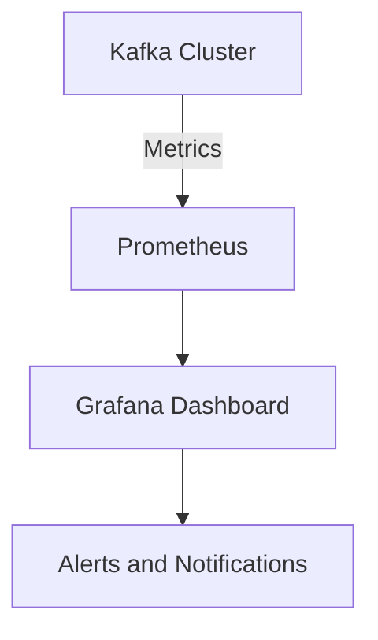

## 10.5.3 Monitoring for Performance Degradation

Monitoring for performance degradation in Apache Kafka is crucial for maintaining high throughput and low latency in real-time data processing systems. This section explores the signs of performance degradation, how to set up alerts and thresholds, and strategies for proactive maintenance. It also includes examples of trend analysis and anomaly detection to help you ensure consistent service levels.

### Understanding Performance Degradation

Performance degradation in Kafka can manifest in various ways, including increased latency, reduced throughput, and higher error rates. Identifying these signs early is essential to prevent them from impacting your system's performance and reliability.

#### Signs of Performance Degradation

1. **Increased Latency**: A noticeable delay in message processing or delivery can indicate bottlenecks in the system.
2. **Reduced Throughput**: A decrease in the number of messages processed per second may suggest resource constraints or configuration issues.
3. **Higher Error Rates**: An uptick in errors, such as failed message deliveries or consumer timeouts, can signal underlying problems.
4. **Resource Utilization Spikes**: Sudden increases in CPU, memory, or disk usage can indicate performance issues.
5. **Lag in Consumer Groups**: A growing lag in consumer groups may suggest that consumers are unable to keep up with the rate of message production.

### Setting Up Alerts and Thresholds

To effectively monitor Kafka, it's important to set up alerts and thresholds that notify you of potential performance issues before they become critical.

#### Key Metrics to Monitor

- **Producer Metrics**: Monitor request latency, batch size, and error rates.
- **Consumer Metrics**: Track lag, fetch latency, and commit rates.
- **Broker Metrics**: Observe request rates, network I/O, and disk usage.
- **Cluster Metrics**: Keep an eye on partition distribution, leader election rates, and replication status.

#### Configuring Alerts

1. **Define Thresholds**: Establish baseline performance metrics and set thresholds for acceptable deviations.
2. **Use Monitoring Tools**: Implement tools like Prometheus and Grafana to visualize metrics and set up alerts.
3. **Automate Notifications**: Configure alerts to trigger notifications via email, SMS, or chat applications when thresholds are breached.

### Strategies for Proactive Maintenance

Proactive maintenance involves regular checks and optimizations to prevent performance degradation.

#### Regular System Audits

- **Configuration Reviews**: Periodically review and optimize Kafka configurations for producers, consumers, and brokers.
- **Resource Allocation**: Ensure adequate resource allocation for Kafka components to handle peak loads.
- **Data Retention Policies**: Regularly review and adjust data retention policies to manage disk usage effectively.

#### Capacity Planning

- **Forecasting**: Use historical data to forecast future resource needs and scale your infrastructure accordingly.
- **Load Testing**: Conduct regular load tests to identify potential bottlenecks and optimize system performance.

### Trend Analysis and Anomaly Detection

Trend analysis and anomaly detection can help identify patterns and deviations in Kafka performance metrics.

#### Implementing Trend Analysis

- **Historical Data Analysis**: Use historical performance data to identify trends and predict future behavior.
- **Visualization Tools**: Employ tools like Grafana to create dashboards that visualize performance trends over time.

#### Anomaly Detection Techniques

- **Statistical Methods**: Use statistical methods to detect anomalies in performance metrics.
- **Machine Learning Models**: Implement machine learning models to identify unusual patterns in data that may indicate performance issues.

### Code Examples

Below are code examples in Java, Scala, Kotlin, and Clojure for setting up a basic Kafka producer and consumer, which can be monitored for performance metrics.

#### Java

```java
import org.apache.kafka.clients.producer.KafkaProducer;
import org.apache.kafka.clients.producer.ProducerRecord;
import java.util.Properties;

public class KafkaProducerExample {
    public static void main(String[] args) {
        Properties props = new Properties();
        props.put("bootstrap.servers", "localhost:9092");
        props.put("key.serializer", "org.apache.kafka.common.serialization.StringSerializer");
        props.put("value.serializer", "org.apache.kafka.common.serialization.StringSerializer");

        KafkaProducer<String, String> producer = new KafkaProducer<>(props);
        for (int i = 0; i < 100; i++) {
            producer.send(new ProducerRecord<>("my-topic", Integer.toString(i), Integer.toString(i)));
        }
        producer.close();
    }
}
```

#### Scala

```scala
import org.apache.kafka.clients.producer.{KafkaProducer, ProducerRecord}
import java.util.Properties

object KafkaProducerExample extends App {
  val props = new Properties()
  props.put("bootstrap.servers", "localhost:9092")
  props.put("key.serializer", "org.apache.kafka.common.serialization.StringSerializer")
  props.put("value.serializer", "org.apache.kafka.common.serialization.StringSerializer")

  val producer = new KafkaProducer[String, String](props)
  for (i <- 0 until 100) {
    producer.send(new ProducerRecord[String, String]("my-topic", i.toString, i.toString))
  }
  producer.close()
}
```

#### Kotlin

```kotlin
import org.apache.kafka.clients.producer.KafkaProducer
import org.apache.kafka.clients.producer.ProducerRecord
import java.util.Properties

fun main() {
    val props = Properties()
    props["bootstrap.servers"] = "localhost:9092"
    props["key.serializer"] = "org.apache.kafka.common.serialization.StringSerializer"
    props["value.serializer"] = "org.apache.kafka.common.serialization.StringSerializer"

    val producer = KafkaProducer<String, String>(props)
    for (i in 0..99) {
        producer.send(ProducerRecord("my-topic", i.toString(), i.toString()))
    }
    producer.close()
}
```

#### Clojure

```clojure
(require '[clojure.java.io :as io])
(import '[org.apache.kafka.clients.producer KafkaProducer ProducerRecord])

(defn kafka-producer-example []
  (let [props (doto (java.util.Properties.)
                (.put "bootstrap.servers" "localhost:9092")
                (.put "key.serializer" "org.apache.kafka.common.serialization.StringSerializer")
                (.put "value.serializer" "org.apache.kafka.common.serialization.StringSerializer"))
        producer (KafkaProducer. props)]
    (doseq [i (range 100)]
      (.send producer (ProducerRecord. "my-topic" (str i) (str i))))
    (.close producer)))
```

### Visualizing Kafka Performance

To effectively monitor Kafka performance, consider using visualization tools that provide real-time insights into system metrics.

#### Example Dashboard



**Caption**: This diagram illustrates a typical setup for monitoring Kafka performance using Prometheus and Grafana. Metrics are collected from the Kafka cluster and visualized in Grafana, with alerts configured for threshold breaches.

### References and Further Reading

- [Apache Kafka Documentation](https://kafka.apache.org/documentation/)
- [Confluent Documentation](https://docs.confluent.io/)
- [Prometheus Monitoring](https://prometheus.io/docs/introduction/overview/)
- [Grafana Visualization](https://grafana.com/docs/grafana/latest/getting-started/introduction/)

### Knowledge Check

To reinforce your understanding of monitoring for performance degradation in Kafka, consider the following questions and exercises.

## Test Your Knowledge: Monitoring Kafka Performance Degradation



### What is a common sign of performance degradation in Kafka?

- [x] Increased latency
- [ ] Decreased disk space
- [ ] Lower CPU usage
- [ ] Reduced network bandwidth

> **Explanation:** Increased latency is a common sign of performance degradation, indicating potential bottlenecks in the system.

### Which tool is commonly used for visualizing Kafka performance metrics?

- [x] Grafana
- [ ] Apache Spark
- [ ] Hadoop
- [ ] Kubernetes

> **Explanation:** Grafana is widely used for visualizing performance metrics, providing real-time insights into system behavior.

### What is the purpose of setting up alerts in Kafka monitoring?

- [x] To notify administrators of potential performance issues
- [ ] To increase system throughput
- [ ] To reduce disk usage
- [ ] To optimize network bandwidth

> **Explanation:** Alerts are set up to notify administrators of potential performance issues, allowing for timely intervention.

### Which metric is important for monitoring Kafka consumer performance?

- [x] Consumer lag
- [ ] Disk I/O
- [ ] Network latency
- [ ] CPU usage

> **Explanation:** Consumer lag is crucial for monitoring consumer performance, indicating whether consumers can keep up with message production.

### What strategy can help prevent performance degradation in Kafka?

- [x] Regular system audits
- [ ] Increasing disk space
- [ ] Reducing network bandwidth
- [ ] Lowering CPU usage

> **Explanation:** Regular system audits help identify and address potential issues before they impact performance.

### Which of the following is a proactive maintenance strategy for Kafka?

- [x] Capacity planning
- [ ] Reducing memory allocation
- [ ] Decreasing network speed
- [ ] Limiting disk usage

> **Explanation:** Capacity planning involves forecasting future resource needs and scaling infrastructure accordingly.

### How can trend analysis benefit Kafka performance monitoring?

- [x] By identifying patterns and predicting future behavior
- [ ] By reducing system throughput
- [ ] By increasing disk usage
- [ ] By lowering CPU consumption

> **Explanation:** Trend analysis helps identify patterns in performance metrics, allowing for predictive maintenance.

### What is a key benefit of using machine learning models for anomaly detection in Kafka?

- [x] Identifying unusual patterns in data
- [ ] Increasing system latency
- [ ] Reducing network bandwidth
- [ ] Lowering disk usage

> **Explanation:** Machine learning models can identify unusual patterns in data, indicating potential performance issues.

### Which of the following is NOT a sign of performance degradation in Kafka?

- [x] Lower CPU usage
- [ ] Increased latency
- [ ] Reduced throughput
- [ ] Higher error rates

> **Explanation:** Lower CPU usage is not typically a sign of performance degradation; increased latency, reduced throughput, and higher error rates are more indicative.

### True or False: Monitoring Kafka performance is only necessary during peak usage times.

- [ ] True
- [x] False

> **Explanation:** Monitoring Kafka performance is essential at all times to ensure consistent service levels and prevent unexpected issues.



By following these guidelines and implementing the strategies discussed, you can effectively monitor and maintain the performance of your Kafka systems, ensuring they continue to deliver high throughput and low latency.
