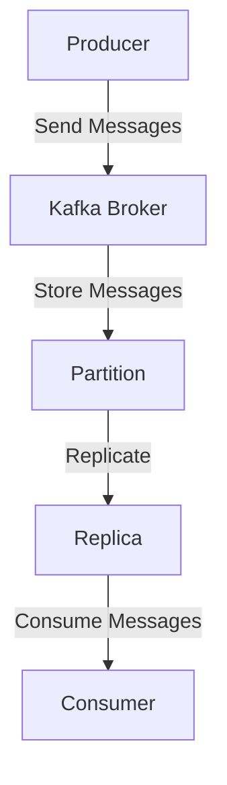

## 10.5 Best Practices for High Throughput and Low Latency

Achieving high throughput and low latency in Apache Kafka is crucial for building efficient, real-time data processing systems. This section provides expert guidance on optimizing Kafka clusters and clients, balancing throughput and latency, and maintaining optimal performance across the entire system.

### Understanding Throughput and Latency

**Throughput** refers to the amount of data processed by the system in a given time period, typically measured in messages per second or bytes per second. **Latency** is the time taken for a message to travel from the producer to the consumer, measured in milliseconds. Optimizing for both requires a careful balance, as increasing throughput can sometimes lead to higher latency and vice versa.

### Actionable Recommendations for Hardware and Software Configurations

#### Hardware Considerations

1. **Disk Configuration**: Use SSDs for Kafka brokers to reduce I/O wait times and improve read/write speeds. Ensure disks are dedicated to Kafka to avoid contention with other applications.

2. **Network Setup**: Deploy Kafka brokers in a high-bandwidth, low-latency network environment. Consider using 10GbE or higher network interfaces to handle large volumes of data efficiently.

3. **Memory Allocation**: Allocate sufficient RAM to Kafka brokers to cache frequently accessed data and reduce disk I/O. This is particularly important for high-throughput scenarios.

4. **CPU Resources**: Ensure that Kafka brokers have adequate CPU resources. Multi-core processors can help handle concurrent requests and improve overall throughput.

#### Software Configurations

1. **Batch Size and Compression**: Configure producers to use larger batch sizes and enable compression (e.g., Snappy or LZ4) to reduce the number of requests and improve throughput. However, be mindful of the trade-off with latency, as larger batches may increase the time messages spend in the producer buffer.

    ```java
    Properties props = new Properties();
    props.put("batch.size", 32768); // 32 KB
    props.put("compression.type", "snappy");
    ```

2. **Acknowledge Settings**: Set the `acks` configuration to `1` or `all` based on the required durability. While `acks=1` can improve throughput, `acks=all` ensures higher durability at the cost of increased latency.

3. **Replication Factor**: Use an appropriate replication factor to balance between fault tolerance and performance. A higher replication factor increases durability but can impact throughput and latency.

4. **Partitioning Strategy**: Design topics with an optimal number of partitions to parallelize processing and improve throughput. Ensure that the number of partitions aligns with the number of consumer threads.

5. **Consumer Fetch Size**: Increase the `fetch.min.bytes` and `fetch.max.wait.ms` settings to allow consumers to fetch larger batches of messages, reducing the number of fetch requests and improving throughput.

    ```java
    Properties props = new Properties();
    props.put("fetch.min.bytes", 1024); // 1 KB
    props.put("fetch.max.wait.ms", 500); // 500 ms
    ```

### Trade-offs Between Throughput and Latency

Balancing throughput and latency involves understanding the trade-offs and making informed decisions based on application requirements:

- **Batch Processing vs. Real-Time Processing**: Larger batch sizes can improve throughput but may increase latency. For real-time applications, prioritize lower latency by reducing batch sizes.

- **Compression**: While compression reduces the amount of data transferred, it introduces additional CPU overhead, potentially increasing latency.

- **Replication**: Higher replication factors enhance data durability but can increase write latency due to the need for data to be replicated across multiple brokers.

### Monitoring and Maintaining Optimal Performance

1. **Metrics Collection**: Use tools like Prometheus and Grafana to collect and visualize Kafka metrics. Key metrics include request latency, throughput, and consumer lag.

2. **Alerting**: Set up alerts for critical metrics to detect performance degradation early. For example, alert on high consumer lag or increased request latency.

3. **Capacity Planning**: Regularly review and adjust resource allocations based on workload changes. Use historical data to forecast future capacity needs.

4. **Load Testing**: Conduct regular load tests to identify bottlenecks and validate performance optimizations. Tools like Apache JMeter and Gatling can simulate high-load scenarios.

### Holistic Optimization Across the Entire System

Achieving high throughput and low latency requires a holistic approach, considering all components of the data pipeline:

- **Producer Optimization**: Tune producer configurations for optimal batch size, compression, and acknowledgment settings.

- **Broker Configuration**: Ensure brokers are configured for efficient resource utilization, including disk, network, and memory settings.

- **Consumer Tuning**: Optimize consumer fetch sizes and parallelism to match the throughput of producers and brokers.

- **Network and Infrastructure**: Deploy Kafka in a robust network environment with sufficient bandwidth and low latency.

- **Application Design**: Design applications to handle backpressure and gracefully degrade performance under high load conditions.

### Practical Applications and Real-World Scenarios

Consider a financial trading platform that requires real-time processing of market data. High throughput is essential to handle the large volume of trades, while low latency is critical to ensure timely execution. By optimizing Kafka configurations, the platform can achieve the necessary performance to meet business requirements.

### Code Examples

#### Java Example

```java
import org.apache.kafka.clients.producer.*;

import java.util.Properties;

public class HighThroughputProducer {
    public static void main(String[] args) {
        Properties props = new Properties();
        props.put("bootstrap.servers", "localhost:9092");
        props.put("acks", "all");
        props.put("batch.size", 32768);
        props.put("linger.ms", 5);
        props.put("compression.type", "snappy");
        props.put("key.serializer", "org.apache.kafka.common.serialization.StringSerializer");
        props.put("value.serializer", "org.apache.kafka.common.serialization.StringSerializer");

        Producer<String, String> producer = new KafkaProducer<>(props);

        for (int i = 0; i < 1000; i++) {
            producer.send(new ProducerRecord<>("my-topic", Integer.toString(i), Integer.toString(i)));
        }

        producer.close();
    }
}
```

#### Scala Example

```scala
import org.apache.kafka.clients.producer.{KafkaProducer, ProducerRecord}
import java.util.Properties

object HighThroughputProducer {
  def main(args: Array[String]): Unit = {
    val props = new Properties()
    props.put("bootstrap.servers", "localhost:9092")
    props.put("acks", "all")
    props.put("batch.size", "32768")
    props.put("linger.ms", "5")
    props.put("compression.type", "snappy")
    props.put("key.serializer", "org.apache.kafka.common.serialization.StringSerializer")
    props.put("value.serializer", "org.apache.kafka.common.serialization.StringSerializer")

    val producer = new KafkaProducer[String, String](props)

    for (i <- 0 until 1000) {
      producer.send(new ProducerRecord[String, String]("my-topic", i.toString, i.toString))
    }

    producer.close()
  }
}
```

#### Kotlin Example

```kotlin
import org.apache.kafka.clients.producer.KafkaProducer
import org.apache.kafka.clients.producer.ProducerRecord
import java.util.Properties

fun main() {
    val props = Properties().apply {
        put("bootstrap.servers", "localhost:9092")
        put("acks", "all")
        put("batch.size", 32768)
        put("linger.ms", 5)
        put("compression.type", "snappy")
        put("key.serializer", "org.apache.kafka.common.serialization.StringSerializer")
        put("value.serializer", "org.apache.kafka.common.serialization.StringSerializer")
    }

    val producer = KafkaProducer<String, String>(props)

    for (i in 0 until 1000) {
        producer.send(ProducerRecord("my-topic", i.toString(), i.toString()))
    }

    producer.close()
}
```

#### Clojure Example

```clojure
(require '[clojure.java.io :as io])
(import '[org.apache.kafka.clients.producer KafkaProducer ProducerRecord])

(defn high-throughput-producer []
  (let [props (doto (java.util.Properties.)
                (.put "bootstrap.servers" "localhost:9092")
                (.put "acks" "all")
                (.put "batch.size" "32768")
                (.put "linger.ms" "5")
                (.put "compression.type" "snappy")
                (.put "key.serializer" "org.apache.kafka.common.serialization.StringSerializer")
                (.put "value.serializer" "org.apache.kafka.common.serialization.StringSerializer"))
        producer (KafkaProducer. props)]
    (doseq [i (range 1000)]
      (.send producer (ProducerRecord. "my-topic" (str i) (str i))))
    (.close producer)))

(high-throughput-producer)
```

### Visualizing Kafka's Architecture and Data Flow

To better understand how Kafka's architecture supports high throughput and low latency, consider the following diagram illustrating the data flow within a Kafka cluster:



**Caption**: This diagram shows the flow of messages from producers to consumers within a Kafka cluster, highlighting the role of brokers and partitions in managing data.

### Key Takeaways

- **Optimize Hardware and Software**: Use SSDs, high-bandwidth networks, and configure Kafka settings for optimal performance.
- **Balance Throughput and Latency**: Understand the trade-offs and adjust configurations based on application requirements.
- **Monitor and Maintain**: Use monitoring tools to track performance metrics and set up alerts for early detection of issues.
- **Holistic Approach**: Consider the entire data pipeline, from producers to consumers, for comprehensive optimization.

### Knowledge Check

To reinforce your understanding of high throughput and low latency best practices in Kafka, consider the following questions:

## Test Your Knowledge: High Throughput and Low Latency in Kafka



### What is the primary benefit of using SSDs for Kafka brokers?

- [x] Reduced I/O wait times and improved read/write speeds.
- [ ] Increased storage capacity.
- [ ] Lower cost compared to HDDs.
- [ ] Enhanced data durability.

> **Explanation:** SSDs provide faster read/write speeds and lower I/O wait times, which are crucial for achieving high throughput and low latency in Kafka.

### Which configuration can help improve producer throughput?

- [x] Increasing batch size.
- [ ] Decreasing batch size.
- [ ] Disabling compression.
- [ ] Setting acks to 0.

> **Explanation:** Increasing the batch size allows producers to send more messages in a single request, improving throughput.

### What is a potential trade-off of using larger batch sizes?

- [x] Increased latency.
- [ ] Reduced throughput.
- [ ] Higher CPU usage.
- [ ] Lower network bandwidth.

> **Explanation:** Larger batch sizes can increase the time messages spend in the producer buffer, leading to higher latency.

### How can you reduce consumer fetch requests?

- [x] Increase fetch.min.bytes and fetch.max.wait.ms.
- [ ] Decrease fetch.min.bytes and fetch.max.wait.ms.
- [ ] Enable compression.
- [ ] Set acks to all.

> **Explanation:** Increasing fetch.min.bytes and fetch.max.wait.ms allows consumers to fetch larger batches of messages, reducing the number of fetch requests.

### What is the impact of a higher replication factor on performance?

- [x] Increased durability but potentially higher latency.
- [ ] Reduced durability and lower latency.
- [ ] Improved throughput and lower latency.
- [ ] No impact on performance.

> **Explanation:** A higher replication factor enhances data durability but can increase write latency due to the need for data replication across multiple brokers.

### Which tool can be used for load testing Kafka clusters?

- [x] Apache JMeter.
- [ ] Prometheus.
- [ ] Grafana.
- [ ] Kafka Connect.

> **Explanation:** Apache JMeter is a tool that can simulate high-load scenarios for load testing Kafka clusters.

### What is a key metric to monitor for Kafka performance?

- [x] Consumer lag.
- [ ] Disk space usage.
- [ ] Number of topics.
- [ ] Number of partitions.

> **Explanation:** Consumer lag is a critical metric to monitor as it indicates how far behind consumers are in processing messages.

### Which network setup is recommended for Kafka brokers?

- [x] High-bandwidth, low-latency network environment.
- [ ] Low-bandwidth, high-latency network environment.
- [ ] Shared network with other applications.
- [ ] Wireless network.

> **Explanation:** A high-bandwidth, low-latency network environment is recommended to efficiently handle large volumes of data.

### What is the role of Prometheus in Kafka monitoring?

- [x] Collecting and visualizing Kafka metrics.
- [ ] Configuring Kafka brokers.
- [ ] Managing Kafka topics.
- [ ] Replicating Kafka data.

> **Explanation:** Prometheus is used for collecting and visualizing Kafka metrics, helping to monitor performance.

### True or False: Increasing the number of partitions always improves throughput.

- [x] True
- [ ] False

> **Explanation:** Increasing the number of partitions can improve throughput by allowing more parallel processing, but it must be balanced with the number of consumer threads.



By following these best practices, you can optimize your Kafka deployment for high throughput and low latency, ensuring efficient and reliable data processing in real-time applications.
