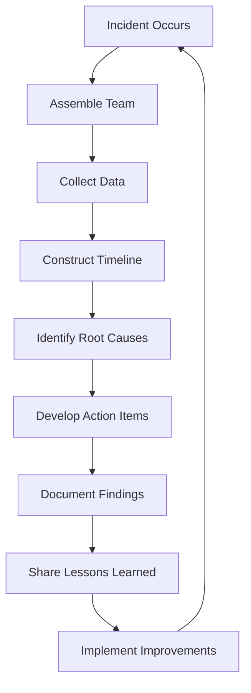

## 11.10 Post-Mortem Analysis and Learning

In the realm of distributed systems and real-time data processing, incidents are inevitable. Whether it's a Kafka broker failure, a network partition, or a misconfigured consumer group, understanding and learning from these events is crucial for building resilient systems. Post-mortem analysis serves as a cornerstone for continuous improvement, enabling teams to identify root causes, implement corrective actions, and prevent future occurrences. This section delves into the goals, processes, and best practices for conducting effective post-mortem analyses within Apache Kafka environments.

### Goals of a Post-Mortem

The primary objective of a post-mortem is to transform incidents into learning opportunities. By systematically analyzing what went wrong, teams can uncover underlying issues and develop strategies to mitigate them. Key goals include:

- **Root Cause Identification**: Determine the fundamental reasons behind an incident, beyond superficial symptoms.
- **Continuous Improvement**: Implement changes that enhance system reliability and prevent recurrence.
- **Knowledge Sharing**: Disseminate insights and lessons learned across teams to foster a culture of learning.
- **Blameless Culture**: Encourage open and honest discussions without fear of retribution, focusing on systemic improvements rather than individual fault.

### Steps for Conducting Effective Post-Mortem Analyses

Conducting a thorough post-mortem involves several structured steps, each designed to extract maximum value from the incident analysis process.

#### 1. Assemble the Right Team

Gather a diverse group of stakeholders, including engineers, operations staff, and product managers, who were involved in or affected by the incident. This ensures a comprehensive understanding of the event from multiple perspectives.

#### 2. Establish a Blameless Environment

Foster an atmosphere where team members feel safe to share their insights and experiences without fear of blame. Emphasize that the goal is to improve processes and systems, not to assign fault.

#### 3. Collect Data and Evidence

Gather all relevant data, logs, and metrics related to the incident. This includes Kafka logs, monitoring dashboards, and any alerts that were triggered. Use this data to construct a timeline of events.

#### 4. Construct a Detailed Timeline

Create a chronological account of the incident, detailing what happened, when it happened, and who was involved. This timeline serves as the foundation for identifying causal relationships and understanding the sequence of events.

#### 5. Identify Root Causes

Utilize techniques such as the "Five Whys" or Fishbone Diagrams to drill down into the root causes of the incident. Focus on systemic issues rather than individual errors.

#### 6. Develop Actionable Insights

Based on the root cause analysis, identify actionable items that can prevent similar incidents in the future. These may include changes to system architecture, process improvements, or additional training for team members.

#### 7. Document Findings and Action Items

Create a comprehensive post-mortem report that includes the timeline, root causes, and action items. Ensure that this document is accessible to all relevant stakeholders and serves as a reference for future incidents.

#### 8. Share Lessons Learned

Conduct a review meeting to share the findings and lessons learned with the broader team. Encourage open discussion and feedback to ensure that insights are fully understood and integrated into future practices.

### Fostering a Blameless Culture

A blameless culture is essential for effective post-mortem analyses. It encourages transparency, accountability, and continuous learning. Here are some strategies to cultivate such a culture:

- **Leadership Support**: Ensure that leadership actively supports and models a blameless approach.
- **Focus on Systems, Not People**: Emphasize that incidents are often the result of systemic issues rather than individual mistakes.
- **Encourage Open Communication**: Create channels for team members to share concerns and insights without fear of retribution.
- **Celebrate Learning**: Recognize and reward teams for identifying and implementing improvements.

### Documenting Findings and Action Items

Effective documentation is critical for capturing the insights gained from a post-mortem. A well-structured report should include:

- **Incident Overview**: A brief summary of the incident, including its impact and duration.
- **Timeline of Events**: A detailed chronological account of what transpired.
- **Root Cause Analysis**: An in-depth exploration of the underlying causes of the incident.
- **Action Items**: Specific, measurable actions that will be taken to prevent recurrence.
- **Lessons Learned**: Key takeaways and insights that can be applied to future incidents.

### Best Practices for Sharing Lessons Learned

Sharing lessons learned is vital for ensuring that the entire organization benefits from the post-mortem process. Consider the following best practices:

- **Regular Review Meetings**: Schedule regular meetings to discuss recent incidents and share insights.
- **Cross-Team Collaboration**: Encourage collaboration between different teams to share knowledge and best practices.
- **Accessible Documentation**: Ensure that post-mortem reports are easily accessible and searchable by all team members.
- **Continuous Feedback Loop**: Establish mechanisms for ongoing feedback and improvement based on lessons learned.

### Real-World Scenarios and Practical Applications

To illustrate the practical application of post-mortem analyses, consider the following scenarios:

#### Scenario 1: Kafka Broker Failure

A Kafka broker failure results in delayed message processing and data loss. The post-mortem reveals that the failure was due to insufficient disk space, exacerbated by a lack of monitoring alerts. Action items include implementing disk usage alerts and increasing disk capacity.

#### Scenario 2: Consumer Group Lag

A consumer group experiences significant lag, impacting downstream applications. The analysis identifies a misconfigured consumer that was unable to keep up with the message rate. The team decides to optimize consumer configurations and conduct regular performance reviews.

### Code Examples and Diagrams

To further illustrate the concepts discussed, consider the following code examples and diagrams.

#### Java Example: Logging and Monitoring

```java
import org.apache.kafka.clients.consumer.KafkaConsumer;
import org.apache.kafka.clients.consumer.ConsumerRecords;
import org.apache.kafka.clients.consumer.ConsumerConfig;
import org.apache.kafka.common.serialization.StringDeserializer;
import java.util.Properties;
import java.util.Collections;

public class KafkaConsumerExample {
    public static void main(String[] args) {
        Properties props = new Properties();
        props.put(ConsumerConfig.BOOTSTRAP_SERVERS_CONFIG, "localhost:9092");
        props.put(ConsumerConfig.GROUP_ID_CONFIG, "example-group");
        props.put(ConsumerConfig.KEY_DESERIALIZER_CLASS_CONFIG, StringDeserializer.class.getName());
        props.put(ConsumerConfig.VALUE_DESERIALIZER_CLASS_CONFIG, StringDeserializer.class.getName());
        props.put(ConsumerConfig.ENABLE_AUTO_COMMIT_CONFIG, "true");
        props.put(ConsumerConfig.AUTO_COMMIT_INTERVAL_MS_CONFIG, "1000");

        KafkaConsumer<String, String> consumer = new KafkaConsumer<>(props);
        consumer.subscribe(Collections.singletonList("example-topic"));

        while (true) {
            ConsumerRecords<String, String> records = consumer.poll(100);
            records.forEach(record -> {
                System.out.printf("offset = %d, key = %s, value = %s%n", record.offset(), record.key(), record.value());
            });
        }
    }
}
```

#### Scala Example: Monitoring with Metrics

```scala
import org.apache.kafka.clients.consumer.KafkaConsumer
import org.apache.kafka.clients.consumer.ConsumerConfig
import org.apache.kafka.common.serialization.StringDeserializer
import java.util.Properties
import scala.collection.JavaConverters._

object KafkaConsumerExample extends App {
  val props = new Properties()
  props.put(ConsumerConfig.BOOTSTRAP_SERVERS_CONFIG, "localhost:9092")
  props.put(ConsumerConfig.GROUP_ID_CONFIG, "example-group")
  props.put(ConsumerConfig.KEY_DESERIALIZER_CLASS_CONFIG, classOf[StringDeserializer].getName)
  props.put(ConsumerConfig.VALUE_DESERIALIZER_CLASS_CONFIG, classOf[StringDeserializer].getName)
  props.put(ConsumerConfig.ENABLE_AUTO_COMMIT_CONFIG, "true")
  props.put(ConsumerConfig.AUTO_COMMIT_INTERVAL_MS_CONFIG, "1000")

  val consumer = new KafkaConsumer[String, String](props)
  consumer.subscribe(List("example-topic").asJava)

  while (true) {
    val records = consumer.poll(100).asScala
    for (record <- records) {
      println(s"offset = ${record.offset()}, key = ${record.key()}, value = ${record.value()}")
    }
  }
}
```

#### Diagram: Post-Mortem Process Flow



*Caption*: This diagram illustrates the cyclical nature of the post-mortem process, emphasizing continuous improvement and learning.

### Knowledge Check

To reinforce the concepts covered in this section, consider the following questions and exercises:

- **Question**: What are the key components of a blameless culture, and why are they important for post-mortem analyses?
- **Exercise**: Conduct a mock post-mortem for a hypothetical Kafka incident, focusing on root cause analysis and action item development.
- **Question**: How can teams ensure that lessons learned from post-mortems are effectively shared across the organization?

### Conclusion

Post-mortem analysis is a powerful tool for enhancing the resilience and reliability of Apache Kafka systems. By systematically examining incidents, identifying root causes, and implementing improvements, teams can transform challenges into opportunities for growth and learning. Embracing a blameless culture and fostering open communication are key to maximizing the value of post-mortems and driving continuous improvement.

## Test Your Knowledge: Post-Mortem Analysis and Learning in Apache Kafka



### What is the primary goal of a post-mortem analysis?

- [x] To identify root causes and implement improvements
- [ ] To assign blame for the incident
- [ ] To document the incident for legal purposes
- [ ] To evaluate team performance

> **Explanation:** The primary goal of a post-mortem analysis is to identify root causes and implement improvements to prevent future incidents.

### Which of the following is a key component of a blameless culture?

- [x] Encouraging open communication
- [ ] Assigning fault to individuals
- [ ] Focusing on individual performance
- [ ] Limiting access to post-mortem reports

> **Explanation:** A blameless culture encourages open communication and focuses on systemic improvements rather than assigning fault to individuals.

### What is the purpose of constructing a detailed timeline during a post-mortem?

- [x] To understand the sequence of events and identify causal relationships
- [ ] To assign blame to specific team members
- [ ] To create a legal record of the incident
- [ ] To evaluate the performance of monitoring tools

> **Explanation:** Constructing a detailed timeline helps understand the sequence of events and identify causal relationships, which is crucial for root cause analysis.

### How can teams ensure that lessons learned from post-mortems are effectively shared?

- [x] By conducting regular review meetings and encouraging cross-team collaboration
- [ ] By limiting access to post-mortem reports
- [ ] By focusing solely on individual performance improvements
- [ ] By keeping post-mortem findings confidential

> **Explanation:** Conducting regular review meetings and encouraging cross-team collaboration ensures that lessons learned are effectively shared across the organization.

### What technique can be used to identify root causes during a post-mortem?

- [x] The "Five Whys" technique
- [ ] The "Blame Game" technique
- [ ] The "Performance Evaluation" technique
- [ ] The "Incident Documentation" technique

> **Explanation:** The "Five Whys" technique is a method used to drill down into the root causes of an incident by repeatedly asking "why" until the fundamental issue is identified.

### What should be included in a comprehensive post-mortem report?

- [x] Incident overview, timeline, root cause analysis, action items, and lessons learned
- [ ] Only the timeline and root cause analysis
- [ ] A list of individuals responsible for the incident
- [ ] Only the action items and lessons learned

> **Explanation:** A comprehensive post-mortem report should include an incident overview, timeline, root cause analysis, action items, and lessons learned to provide a complete understanding of the incident and its resolution.

### Why is leadership support important for fostering a blameless culture?

- [x] It ensures that the blameless approach is actively supported and modeled throughout the organization
- [ ] It allows leadership to assign blame more effectively
- [ ] It focuses on individual performance evaluations
- [ ] It limits the dissemination of post-mortem findings

> **Explanation:** Leadership support is crucial for fostering a blameless culture as it ensures that the approach is actively supported and modeled throughout the organization, encouraging open communication and systemic improvements.

### What is the benefit of sharing post-mortem findings across teams?

- [x] It fosters a culture of learning and continuous improvement
- [ ] It assigns blame to specific teams
- [ ] It limits the scope of future incidents
- [ ] It focuses on individual performance improvements

> **Explanation:** Sharing post-mortem findings across teams fosters a culture of learning and continuous improvement, helping to prevent similar incidents in the future.

### How can teams create a continuous feedback loop based on post-mortem findings?

- [x] By establishing mechanisms for ongoing feedback and improvement
- [ ] By keeping post-mortem findings confidential
- [ ] By focusing solely on individual performance improvements
- [ ] By limiting access to post-mortem reports

> **Explanation:** Establishing mechanisms for ongoing feedback and improvement creates a continuous feedback loop based on post-mortem findings, driving systemic improvements.

### True or False: The primary focus of a post-mortem is to assign blame for the incident.

- [ ] True
- [x] False

> **Explanation:** False. The primary focus of a post-mortem is to identify root causes and implement improvements, not to assign blame for the incident.


