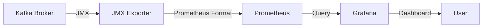

## 11.2 Metrics Collection and Analysis

In the realm of distributed systems, observability is paramount. Apache Kafka, a cornerstone of modern data architectures, provides a wealth of metrics that can be harnessed to monitor and optimize performance. This section delves into the intricacies of collecting, storing, and analyzing metrics from Kafka clusters and applications, empowering teams to make informed decisions and maintain system health.

### Understanding Kafka Metrics

Kafka's architecture inherently generates a plethora of metrics across its components: brokers, producers, and consumers. These metrics offer insights into system performance, resource utilization, and potential bottlenecks. Key metrics include:

- **Broker Metrics**: Reflect the health and performance of Kafka brokers, including request rates, queue sizes, and disk usage.
- **Producer Metrics**: Provide information on message throughput, latency, and error rates.
- **Consumer Metrics**: Indicate consumer lag, processing rates, and partition assignment.

### Collecting Metrics from Kafka Brokers

#### Java Management Extensions (JMX)

Kafka exposes its metrics via Java Management Extensions (JMX), a Java technology that supplies tools for managing and monitoring applications. JMX is the primary mechanism for accessing Kafka metrics.

- **Enable JMX**: Configure Kafka brokers to expose JMX metrics by setting the `KAFKA_OPTS` environment variable with the appropriate JMX port.
  
  ```bash
  export KAFKA_OPTS="-Dcom.sun.management.jmxremote.port=9999 -Dcom.sun.management.jmxremote.authenticate=false -Dcom.sun.management.jmxremote.ssl=false"
  ```

- **JMX Exporters**: Use JMX exporters to scrape metrics from Kafka and expose them in a format suitable for monitoring systems like Prometheus.

#### Prometheus JMX Exporter

Prometheus, a popular open-source monitoring solution, can collect metrics from Kafka using the JMX exporter. This exporter acts as a bridge, converting JMX metrics into Prometheus' format.

- **Setup**: Deploy the JMX exporter alongside Kafka brokers. Configure it to specify which JMX metrics to expose.

  ```yaml
  # Example JMX exporter configuration
  jmxUrl: service:jmx:rmi:///jndi/rmi://localhost:9999/jmxrmi
  rules:
    - pattern: kafka.server<type=(.+), name=(.+)><>(Count|Value)
      name: kafka_$1_$2
      type: GAUGE
  ```

- **Integration with Prometheus**: Configure Prometheus to scrape metrics from the JMX exporter endpoint.

  ```yaml
  # Prometheus scrape configuration
  scrape_configs:
    - job_name: 'kafka'
      static_configs:
        - targets: ['localhost:9090']
  ```

### Collecting Metrics from Producers and Consumers

Producers and consumers in Kafka also expose metrics via JMX. However, integrating these metrics into a centralized monitoring system requires additional configuration.

- **Producer and Consumer JMX Configuration**: Similar to brokers, enable JMX on producers and consumers by setting the `KAFKA_OPTS` environment variable.

- **Custom Metric Reporters**: Implement custom metric reporters to push metrics to external systems. Kafka's `metrics.reporters` configuration allows for custom implementations.

### Selecting Metrics Storage Solutions

Choosing the right storage solution for Kafka metrics is crucial for effective monitoring and analysis. Prometheus is a widely adopted choice due to its robust querying capabilities and integration with visualization tools like Grafana.

- **Prometheus**: Offers a time-series database optimized for real-time monitoring. Its powerful query language, PromQL, enables complex queries and aggregations.

- **Alternative Solutions**: Consider other storage solutions like InfluxDB or Elasticsearch based on specific requirements such as scalability, query complexity, and integration needs.

### Key Metrics to Monitor

Monitoring the right metrics is essential for maintaining Kafka's performance and reliability. Here are some critical metrics to focus on:

- **Broker Metrics**:
  - `kafka.server:type=BrokerTopicMetrics,name=MessagesInPerSec`: Tracks the rate of incoming messages.
  - `kafka.network:type=RequestMetrics,name=RequestsPerSec,request=Produce`: Monitors the rate of produce requests.

- **Producer Metrics**:
  - `record-send-rate`: Measures the rate at which records are sent.
  - `record-error-rate`: Indicates the rate of errors encountered during record sending.

- **Consumer Metrics**:
  - `records-consumed-rate`: Tracks the rate of records consumed.
  - `consumer-lag`: Measures the lag between the consumer's current position and the latest offset.

### Analyzing Metrics for Decision-Making

Analyzing Kafka metrics involves interpreting data to identify trends, anomalies, and potential issues. This analysis informs decisions related to scaling, optimization, and troubleshooting.

- **Trend Analysis**: Use historical data to identify patterns and predict future behavior. For instance, increasing consumer lag might indicate a need for additional consumer instances.

- **Anomaly Detection**: Set up alerts for deviations from expected behavior. Sudden spikes in error rates or request latencies can signal underlying problems.

- **Capacity Planning**: Leverage metrics to plan for future capacity needs. Monitor resource utilization to ensure that Kafka clusters can handle anticipated load increases.

### Practical Applications and Real-World Scenarios

In practice, metrics collection and analysis enable organizations to optimize Kafka deployments, ensuring high availability and performance. Consider the following scenarios:

- **Scaling Kafka Clusters**: Use metrics to determine when to add or remove broker nodes, ensuring optimal resource utilization and cost efficiency.

- **Troubleshooting Performance Issues**: Analyze metrics to pinpoint bottlenecks, such as network congestion or disk I/O limitations, and implement targeted solutions.

- **Enhancing Security and Compliance**: Monitor access patterns and data flows to detect unauthorized access or data breaches, aligning with security and compliance requirements.

### Code Examples

To illustrate the concepts discussed, let's explore code examples in Java, Scala, Kotlin, and Clojure for collecting and analyzing Kafka metrics.

#### Java Example

```java
import org.apache.kafka.clients.producer.KafkaProducer;
import org.apache.kafka.clients.producer.ProducerConfig;
import org.apache.kafka.clients.producer.ProducerRecord;
import org.apache.kafka.common.serialization.StringSerializer;

import java.util.Properties;

public class KafkaMetricsExample {
    public static void main(String[] args) {
        Properties props = new Properties();
        props.put(ProducerConfig.BOOTSTRAP_SERVERS_CONFIG, "localhost:9092");
        props.put(ProducerConfig.KEY_SERIALIZER_CLASS_CONFIG, StringSerializer.class.getName());
        props.put(ProducerConfig.VALUE_SERIALIZER_CLASS_CONFIG, StringSerializer.class.getName());

        KafkaProducer<String, String> producer = new KafkaProducer<>(props);

        // Send a message and collect metrics
        ProducerRecord<String, String> record = new ProducerRecord<>("my-topic", "key", "value");
        producer.send(record, (metadata, exception) -> {
            if (exception == null) {
                System.out.println("Sent message to " + metadata.topic() + " partition " + metadata.partition());
            } else {
                exception.printStackTrace();
            }
        });

        // Access producer metrics
        producer.metrics().forEach((name, metric) -> {
            System.out.println(name.name() + ": " + metric.metricValue());
        });

        producer.close();
    }
}
```

#### Scala Example

```scala
import org.apache.kafka.clients.producer.{KafkaProducer, ProducerConfig, ProducerRecord}
import org.apache.kafka.common.serialization.StringSerializer

import java.util.Properties

object KafkaMetricsExample extends App {
  val props = new Properties()
  props.put(ProducerConfig.BOOTSTRAP_SERVERS_CONFIG, "localhost:9092")
  props.put(ProducerConfig.KEY_SERIALIZER_CLASS_CONFIG, classOf[StringSerializer].getName)
  props.put(ProducerConfig.VALUE_SERIALIZER_CLASS_CONFIG, classOf[StringSerializer].getName)

  val producer = new KafkaProducer[String, String](props)

  // Send a message and collect metrics
  val record = new ProducerRecord[String, String]("my-topic", "key", "value")
  producer.send(record, (metadata, exception) => {
    if (exception == null) {
      println(s"Sent message to ${metadata.topic()} partition ${metadata.partition()}")
    } else {
      exception.printStackTrace()
    }
  })

  // Access producer metrics
  producer.metrics().forEach { case (name, metric) =>
    println(s"${name.name()}: ${metric.metricValue()}")
  }

  producer.close()
}
```

#### Kotlin Example

```kotlin
import org.apache.kafka.clients.producer.KafkaProducer
import org.apache.kafka.clients.producer.ProducerConfig
import org.apache.kafka.clients.producer.ProducerRecord
import org.apache.kafka.common.serialization.StringSerializer
import java.util.Properties

fun main() {
    val props = Properties().apply {
        put(ProducerConfig.BOOTSTRAP_SERVERS_CONFIG, "localhost:9092")
        put(ProducerConfig.KEY_SERIALIZER_CLASS_CONFIG, StringSerializer::class.java.name)
        put(ProducerConfig.VALUE_SERIALIZER_CLASS_CONFIG, StringSerializer::class.java.name)
    }

    val producer = KafkaProducer<String, String>(props)

    // Send a message and collect metrics
    val record = ProducerRecord("my-topic", "key", "value")
    producer.send(record) { metadata, exception ->
        if (exception == null) {
            println("Sent message to ${metadata.topic()} partition ${metadata.partition()}")
        } else {
            exception.printStackTrace()
        }
    }

    // Access producer metrics
    producer.metrics().forEach { (name, metric) ->
        println("${name.name()}: ${metric.metricValue()}")
    }

    producer.close()
}
```

#### Clojure Example

```clojure
(ns kafka-metrics-example
  (:import (org.apache.kafka.clients.producer KafkaProducer ProducerConfig ProducerRecord)
           (org.apache.kafka.common.serialization StringSerializer)))

(defn -main []
  (let [props (doto (java.util.Properties.)
                (.put ProducerConfig/BOOTSTRAP_SERVERS_CONFIG "localhost:9092")
                (.put ProducerConfig/KEY_SERIALIZER_CLASS_CONFIG (.getName StringSerializer))
                (.put ProducerConfig/VALUE_SERIALIZER_CLASS_CONFIG (.getName StringSerializer)))
        producer (KafkaProducer. props)]

    ;; Send a message and collect metrics
    (let [record (ProducerRecord. "my-topic" "key" "value")]
      (.send producer record
             (reify org.apache.kafka.clients.producer.Callback
               (onCompletion [_ metadata exception]
                 (if exception
                   (.printStackTrace exception)
                   (println (str "Sent message to " (.topic metadata) " partition " (.partition metadata))))))))

    ;; Access producer metrics
    (doseq [[name metric] (.metrics producer)]
      (println (str (.name name) ": " (.metricValue metric))))

    (.close producer)))
```

### Visualizing Metrics

Visualization tools like Grafana can transform raw metrics into intuitive dashboards, aiding in real-time monitoring and analysis.



*Caption*: This diagram illustrates the flow of metrics from Kafka brokers through JMX exporters to Prometheus, and finally to Grafana for visualization.

### Best Practices for Metrics Collection and Analysis

- **Automate Metric Collection**: Use tools like Prometheus to automate the collection and storage of metrics, reducing manual intervention.
- **Focus on Key Metrics**: Prioritize monitoring metrics that directly impact performance and reliability.
- **Set Thresholds and Alerts**: Define thresholds for critical metrics and set up alerts to proactively address issues.
- **Regularly Review Dashboards**: Continuously review and update dashboards to reflect changing system dynamics and business needs.

### Conclusion

Effective metrics collection and analysis are pivotal for maintaining the health and performance of Kafka clusters. By leveraging tools like JMX exporters and Prometheus, teams can gain deep insights into system behavior, enabling proactive management and optimization.

## Test Your Knowledge: Advanced Kafka Metrics Collection and Analysis Quiz



### What is the primary mechanism for accessing Kafka metrics?

- [x] JMX (Java Management Extensions)
- [ ] SNMP (Simple Network Management Protocol)
- [ ] HTTP (Hypertext Transfer Protocol)
- [ ] SSH (Secure Shell)

> **Explanation:** Kafka exposes its metrics via Java Management Extensions (JMX), which is the primary mechanism for accessing these metrics.

### Which tool is commonly used to scrape Kafka metrics for Prometheus?

- [x] JMX Exporter
- [ ] Logstash
- [ ] Fluentd
- [ ] Telegraf

> **Explanation:** The JMX Exporter is commonly used to scrape Kafka metrics and expose them in a format suitable for Prometheus.

### Which of the following is a key metric for monitoring Kafka producers?

- [x] record-send-rate
- [ ] consumer-lag
- [ ] disk-usage
- [ ] network-traffic

> **Explanation:** The `record-send-rate` is a key metric for monitoring the rate at which Kafka producers send records.

### What is the purpose of setting up alerts for Kafka metrics?

- [x] To proactively address issues
- [ ] To increase system load
- [ ] To reduce network traffic
- [ ] To disable monitoring

> **Explanation:** Setting up alerts for Kafka metrics allows teams to proactively address issues before they impact system performance.

### Which visualization tool is often used with Prometheus for Kafka metrics?

- [x] Grafana
- [ ] Tableau
- [ ] Power BI
- [ ] Kibana

> **Explanation:** Grafana is often used with Prometheus to visualize Kafka metrics and create intuitive dashboards.

### What is a common use case for analyzing Kafka metrics?

- [x] Capacity Planning
- [ ] Code Refactoring
- [ ] UI Design
- [ ] Database Normalization

> **Explanation:** Analyzing Kafka metrics is commonly used for capacity planning to ensure that Kafka clusters can handle anticipated load increases.

### Which metric indicates the lag between a consumer's current position and the latest offset?

- [x] consumer-lag
- [ ] record-error-rate
- [ ] request-latency
- [ ] disk-usage

> **Explanation:** The `consumer-lag` metric indicates the lag between a consumer's current position and the latest offset.

### What is the benefit of using Prometheus for Kafka metrics?

- [x] Real-time monitoring and powerful querying capabilities
- [ ] Increased system latency
- [ ] Reduced data accuracy
- [ ] Limited integration options

> **Explanation:** Prometheus offers real-time monitoring and powerful querying capabilities, making it a popular choice for Kafka metrics.

### How can Kafka metrics help in troubleshooting performance issues?

- [x] By pinpointing bottlenecks
- [ ] By increasing error rates
- [ ] By reducing system visibility
- [ ] By disabling monitoring

> **Explanation:** Kafka metrics can help in troubleshooting performance issues by pinpointing bottlenecks such as network congestion or disk I/O limitations.

### True or False: Kafka metrics can be used to enhance security and compliance.

- [x] True
- [ ] False

> **Explanation:** Kafka metrics can be used to monitor access patterns and data flows, helping to detect unauthorized access or data breaches and enhance security and compliance.


