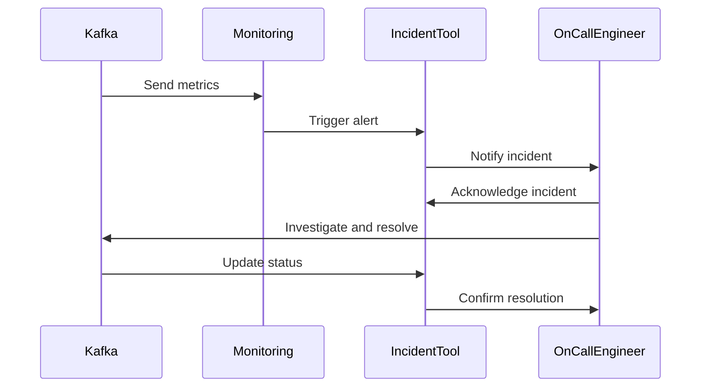

## 11.6 Alerting and Incident Management

### Introduction

In the realm of distributed systems and real-time data processing, the ability to swiftly detect and respond to incidents is crucial. Apache Kafka, as a cornerstone of modern data architectures, demands robust alerting and incident management strategies to ensure system reliability and performance. This section delves into the intricacies of setting up effective alerting mechanisms and managing incidents to minimize downtime and service impact.

### Importance of Timely Alerting

Timely alerting is the linchpin of effective incident management. In a Kafka ecosystem, where data flows continuously and systems are highly interconnected, the ability to detect anomalies or failures promptly can prevent cascading issues and data loss. Alerts serve as the first line of defense, notifying teams of potential problems before they escalate.

#### Key Benefits of Timely Alerting

- **Proactive Issue Resolution**: Early detection allows teams to address issues before they impact end-users or business operations.
- **Reduced Downtime**: Quick responses to alerts can significantly reduce system downtime, maintaining service availability.
- **Improved Reliability**: Consistent monitoring and alerting enhance the overall reliability of Kafka deployments.
- **Cost Efficiency**: Preventing incidents from escalating reduces the costs associated with downtime and recovery efforts.

### Defining Alert Thresholds and Conditions

Setting appropriate alert thresholds and conditions is critical to ensuring that alerts are meaningful and actionable. This involves understanding the normal operating parameters of your Kafka deployment and identifying deviations that indicate potential issues.

#### Steps to Define Effective Alert Thresholds

1. **Baseline Metrics**: Establish baseline metrics for key performance indicators (KPIs) such as throughput, latency, and error rates. Use historical data to understand typical patterns and variations.

2. **Identify Critical Metrics**: Focus on metrics that directly impact system performance and user experience. For Kafka, this might include broker health, consumer lag, and partition availability.

3. **Set Dynamic Thresholds**: Implement dynamic thresholds that adjust based on historical trends and current conditions. This helps in reducing false positives and ensures alerts are triggered only when necessary.

4. **Use Anomaly Detection**: Leverage machine learning algorithms to detect anomalies in real-time. This approach can identify subtle deviations that static thresholds might miss.

5. **Regularly Review and Adjust**: Continuously review alert thresholds and conditions to adapt to changes in system behavior or architecture.

### Integration with Incident Management Tools

Integrating alerting systems with incident management tools streamlines the response process, ensuring that alerts are routed to the right teams and actions are taken promptly.

#### Popular Incident Management Tools

- **PagerDuty**: Offers robust incident response capabilities, including on-call scheduling, escalation policies, and real-time collaboration.
- **Opsgenie**: Provides flexible alerting and incident management features, with integrations for various monitoring tools.
- **VictorOps**: Focuses on collaborative incident response, enabling teams to resolve issues faster through integrated communication tools.

#### Steps for Integration

1. **Select Appropriate Tools**: Choose incident management tools that align with your organization's workflow and technology stack.

2. **Configure Alert Routing**: Set up alert routing rules to ensure alerts reach the appropriate teams or individuals based on severity and type.

3. **Implement Escalation Policies**: Define escalation policies to ensure that unresolved alerts are escalated to higher-level support or management.

4. **Enable Real-Time Collaboration**: Use integrated communication features to facilitate real-time collaboration during incident resolution.

5. **Automate Incident Creation**: Automate the creation of incidents in your management tool based on predefined alert conditions.

### Best Practices for Avoiding Alert Fatigue

Alert fatigue occurs when teams are overwhelmed by a high volume of alerts, leading to desensitization and potential oversight of critical issues. Implementing best practices can help mitigate this risk.

#### Strategies to Prevent Alert Fatigue

- **Prioritize Alerts**: Classify alerts based on severity and impact, ensuring that critical alerts are prioritized over informational ones.

- **Reduce Noise**: Fine-tune alert conditions to minimize false positives. Use suppression rules to prevent duplicate alerts.

- **Consolidate Alerts**: Group related alerts into a single notification to reduce the volume and improve clarity.

- **Provide Context**: Include detailed information and context in alerts to help teams quickly understand the issue and take appropriate action.

- **Regularly Review Alert Policies**: Conduct periodic reviews of alert policies and thresholds to ensure they remain relevant and effective.

### Strategies for Incident Escalation and Communication

Effective incident escalation and communication are vital for resolving issues swiftly and minimizing impact. Establishing clear protocols and communication channels ensures that incidents are handled efficiently.

#### Incident Escalation Process

1. **Initial Triage**: Upon receiving an alert, perform an initial triage to assess the severity and impact of the incident.

2. **Assign Ownership**: Assign a primary owner responsible for managing the incident and coordinating the response.

3. **Escalate as Needed**: If the incident cannot be resolved at the initial level, escalate it to higher-level support or management based on predefined criteria.

4. **Document Actions**: Maintain detailed documentation of actions taken during the incident, including timelines and decisions.

5. **Post-Incident Review**: Conduct a post-incident review to identify root causes and implement preventive measures.

#### Communication Best Practices

- **Establish Clear Channels**: Use dedicated communication channels for incident management to ensure timely and effective information sharing.

- **Provide Regular Updates**: Keep stakeholders informed with regular updates on incident status and resolution progress.

- **Use Templates**: Develop communication templates for common incident scenarios to streamline the process and ensure consistency.

- **Encourage Collaboration**: Foster a culture of collaboration and open communication among teams involved in incident management.

### Code Examples for Alerting and Incident Management

To illustrate the concepts discussed, let's explore code examples in Java, Scala, Kotlin, and Clojure for setting up alerts and integrating with incident management tools.

#### Java Example: Setting Up Alerts with Prometheus

```java
import io.prometheus.client.Counter;
import io.prometheus.client.exporter.HTTPServer;
import io.prometheus.client.hotspot.DefaultExports;

public class KafkaAlertingExample {
    static final Counter requestCount = Counter.build()
        .name("kafka_request_count")
        .help("Total requests processed by Kafka.")
        .register();

    public static void main(String[] args) throws Exception {
        // Initialize Prometheus metrics
        DefaultExports.initialize();
        HTTPServer server = new HTTPServer(1234);

        // Simulate Kafka request processing
        while (true) {
            processRequest();
            Thread.sleep(1000);
        }
    }

    private static void processRequest() {
        // Increment request count
        requestCount.inc();
        // Logic for processing Kafka requests
    }
}
```

#### Scala Example: Integrating with PagerDuty

```scala
import scalaj.http._

object PagerDutyIntegration {
  val apiKey = "YOUR_PAGERDUTY_API_KEY"
  val incidentUrl = "https://api.pagerduty.com/incidents"

  def createIncident(summary: String): Unit = {
    val response = Http(incidentUrl)
      .postData(s"""{
        "incident": {
          "type": "incident",
          "title": "$summary",
          "service": {
            "id": "YOUR_SERVICE_ID",
            "type": "service_reference"
          }
        }
      }""")
      .header("Content-Type", "application/json")
      .header("Authorization", s"Token token=$apiKey")
      .asString

    println(s"PagerDuty response: ${response.body}")
  }

  def main(args: Array[String]): Unit = {
    createIncident("Kafka broker down")
  }
}
```

#### Kotlin Example: Configuring Alert Conditions

```kotlin
fun configureAlertConditions() {
    val alertConditions = mapOf(
        "brokerHealth" to { health: Double -> health < 0.8 },
        "consumerLag" to { lag: Long -> lag > 1000 }
    )

    alertConditions.forEach { (name, condition) ->
        if (condition.invoke(getMetricValue(name))) {
            println("Alert triggered for $name")
        }
    }
}

fun getMetricValue(metricName: String): Double {
    // Simulate fetching metric value
    return Math.random()
}

fun main() {
    configureAlertConditions()
}
```

#### Clojure Example: Handling Alerts with Opsgenie

```clojure
(ns kafka-alerting.core
  (:require [clj-http.client :as client]))

(def api-key "YOUR_OPSGENIE_API_KEY")
(def opsgenie-url "https://api.opsgenie.com/v2/alerts")

(defn create-alert [message]
  (client/post opsgenie-url
               {:headers {"Authorization" (str "GenieKey " api-key)}
                :body (json/write-str {:message message
                                       :priority "P1"})}))

(defn -main []
  (create-alert "Kafka partition unavailable"))
```

### Visualizing Alerting and Incident Management

To further enhance understanding, let's visualize the alerting and incident management process using a sequence diagram.



*Caption*: This sequence diagram illustrates the flow of alerting and incident management, from metric collection to incident resolution.

### Knowledge Check

To reinforce your understanding of alerting and incident management in Apache Kafka, consider the following questions:

1. What are the key benefits of timely alerting in a Kafka ecosystem?
2. How can dynamic thresholds improve alert accuracy?
3. Why is it important to integrate alerting systems with incident management tools?
4. What strategies can help prevent alert fatigue?
5. How does effective incident escalation contribute to faster resolution?

### Conclusion

Alerting and incident management are critical components of maintaining a robust and reliable Apache Kafka deployment. By implementing effective alerting strategies, integrating with incident management tools, and fostering a culture of proactive incident response, organizations can minimize downtime and ensure seamless data processing.

For further reading and resources, consider exploring the [Apache Kafka Documentation](https://kafka.apache.org/documentation/) and [Confluent Documentation](https://docs.confluent.io/).

## Test Your Knowledge: Advanced Alerting and Incident Management Quiz



### What is the primary benefit of timely alerting in a Kafka ecosystem?

- [x] Proactive issue resolution
- [ ] Increased data throughput
- [ ] Simplified system architecture
- [ ] Reduced hardware costs

> **Explanation:** Timely alerting allows teams to address issues before they impact end-users or business operations, ensuring proactive issue resolution.

### Which tool is commonly used for incident management in Kafka environments?

- [x] PagerDuty
- [ ] Jenkins
- [ ] Prometheus
- [ ] Grafana

> **Explanation:** PagerDuty is a popular incident management tool that integrates with monitoring systems to streamline alerting and response processes.

### How can dynamic thresholds benefit alerting systems?

- [x] By reducing false positives
- [ ] By increasing alert volume
- [ ] By simplifying configuration
- [ ] By eliminating the need for monitoring

> **Explanation:** Dynamic thresholds adjust based on historical trends and current conditions, reducing false positives and ensuring alerts are triggered only when necessary.

### What is a common strategy to prevent alert fatigue?

- [x] Prioritizing alerts
- [ ] Increasing alert volume
- [ ] Disabling notifications
- [ ] Ignoring low-severity alerts

> **Explanation:** Prioritizing alerts ensures that critical alerts are addressed promptly, helping to prevent alert fatigue.

### Why is it important to provide context in alerts?

- [x] To help teams quickly understand the issue
- [ ] To increase alert volume
- [ ] To simplify alert configuration
- [ ] To reduce monitoring costs

> **Explanation:** Providing context in alerts helps teams quickly understand the issue and take appropriate action, improving response times.

### What is the first step in the incident escalation process?

- [x] Initial triage
- [ ] Assign ownership
- [ ] Escalate to management
- [ ] Document actions

> **Explanation:** Initial triage involves assessing the severity and impact of the incident, which is the first step in the escalation process.

### How can real-time collaboration tools aid in incident management?

- [x] By facilitating communication during incident resolution
- [ ] By increasing alert volume
- [ ] By reducing monitoring costs
- [ ] By simplifying system architecture

> **Explanation:** Real-time collaboration tools facilitate communication among teams, aiding in faster incident resolution.

### What is a key benefit of integrating alerting systems with incident management tools?

- [x] Streamlined response process
- [ ] Increased alert volume
- [ ] Simplified system architecture
- [ ] Reduced hardware costs

> **Explanation:** Integrating alerting systems with incident management tools streamlines the response process, ensuring alerts are routed to the right teams promptly.

### Which of the following is a best practice for incident communication?

- [x] Providing regular updates
- [ ] Increasing alert volume
- [ ] Disabling notifications
- [ ] Ignoring low-severity alerts

> **Explanation:** Providing regular updates keeps stakeholders informed about incident status and resolution progress.

### True or False: Alert fatigue can be mitigated by reducing alert volume and prioritizing critical alerts.

- [x] True
- [ ] False

> **Explanation:** Reducing alert volume and prioritizing critical alerts are effective strategies for mitigating alert fatigue.


