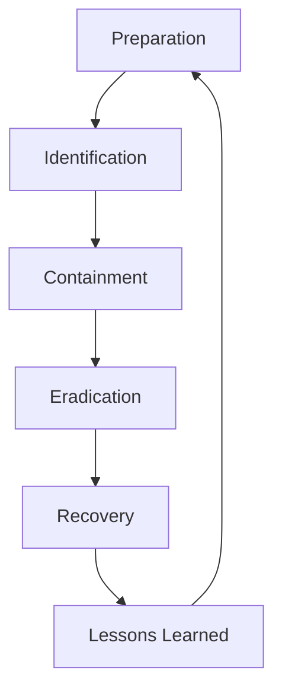

## 11.9 Incident Response Planning

In the realm of distributed systems and real-time data processing, Apache Kafka stands as a cornerstone technology. However, even the most robust systems are not immune to incidents. An effective incident response plan is crucial for minimizing downtime and ensuring business continuity. This section delves into the components of an incident response plan tailored for Kafka deployments, guiding you through defining roles, establishing communication protocols, and maintaining readiness through regular drills.

### Components of an Incident Response Plan

An incident response plan (IRP) is a structured approach to addressing and managing the aftermath of a security breach or cyberattack. For Apache Kafka, this involves several key components:

1. **Preparation**: Establish policies, tools, and resources necessary for incident response.
2. **Identification**: Detect and determine the nature of the incident.
3. **Containment**: Limit the impact of the incident.
4. **Eradication**: Remove the cause of the incident.
5. **Recovery**: Restore systems to normal operations.
6. **Lessons Learned**: Analyze the incident to improve future responses.

#### Preparation

Preparation is the foundation of an effective IRP. It involves:

- **Developing Policies**: Define what constitutes an incident and the criteria for escalation.
- **Tool Selection**: Choose monitoring and alerting tools that integrate with Kafka, such as Prometheus and Grafana.
- **Training**: Conduct regular training sessions for the incident response team.

#### Identification

The identification phase involves:

- **Monitoring**: Use Kafka's built-in metrics and external tools to monitor system health.
- **Alerting**: Set up alerts for anomalies, such as unusual consumer lag or broker failures.
- **Diagnosis**: Quickly determine the nature and scope of the incident.

#### Containment

Containment strategies include:

- **Isolation**: Temporarily isolate affected components to prevent further damage.
- **Rate Limiting**: Apply rate limiting to control the flow of data and prevent overloads.

#### Eradication

Eradication involves:

- **Root Cause Analysis**: Identify and eliminate the root cause of the incident.
- **Patch Management**: Apply necessary patches or updates to prevent recurrence.

#### Recovery

Recovery focuses on:

- **Data Restoration**: Use backups and replication to restore lost data.
- **System Validation**: Ensure all systems are functioning correctly before resuming operations.

#### Lessons Learned

Post-incident analysis is crucial:

- **Documentation**: Record the incident details, response actions, and outcomes.
- **Review Meetings**: Conduct meetings to discuss what went well and what could be improved.
- **Plan Updates**: Update the IRP based on lessons learned.

### Defining Roles and Responsibilities

Clear roles and responsibilities are essential for an effective incident response. Key roles include:

- **Incident Commander**: Oversees the response effort and makes critical decisions.
- **Technical Lead**: Provides technical expertise and guidance.
- **Communications Officer**: Manages internal and external communications.
- **Security Analyst**: Investigates the incident and ensures compliance with security policies.

Each role should have a backup to ensure continuity in case of absence.

### Communication Protocols During Incidents

Effective communication is vital during an incident. Protocols should include:

- **Internal Communication**: Use secure channels for team communication, such as Slack or Microsoft Teams.
- **External Communication**: Prepare templates for communicating with stakeholders and the public.
- **Regular Updates**: Provide regular updates to all stakeholders to keep them informed of progress.

### Templates and Checklists for Incident Response

Templates and checklists can streamline the incident response process. Consider the following:

- **Incident Report Template**: Document the incident details, including time, date, and nature of the incident.
- **Response Checklist**: A step-by-step guide for responding to incidents, tailored to your organization's needs.
- **Post-Incident Review Template**: Capture lessons learned and action items for improvement.

### Importance of Regular Drills and Updates

Regular drills and updates are crucial for maintaining readiness:

- **Simulated Incidents**: Conduct regular drills to test the IRP and identify weaknesses.
- **Plan Reviews**: Regularly review and update the IRP to reflect changes in the environment or organization.
- **Continuous Improvement**: Use feedback from drills and real incidents to improve the IRP.

### Practical Applications and Real-World Scenarios

Consider the following scenarios where an effective IRP is crucial:

- **Broker Failure**: A broker goes down, causing a disruption in message flow. The IRP guides the team in isolating the broker, rerouting traffic, and restoring service.
- **Data Breach**: Unauthorized access to Kafka data is detected. The IRP outlines steps for containment, investigation, and communication with affected parties.
- **Network Partition**: A network partition causes a split-brain scenario. The IRP provides guidance on resolving the partition and restoring normal operations.

### Code Examples

To illustrate the concepts discussed, consider the following code examples for setting up monitoring and alerting in Kafka environments.

#### Java Example: Setting Up a Simple Kafka Monitoring Tool

```java
import org.apache.kafka.clients.consumer.KafkaConsumer;
import org.apache.kafka.clients.consumer.ConsumerConfig;
import org.apache.kafka.common.serialization.StringDeserializer;

import java.util.Properties;

public class KafkaMonitoringTool {
    public static void main(String[] args) {
        Properties props = new Properties();
        props.put(ConsumerConfig.BOOTSTRAP_SERVERS_CONFIG, "localhost:9092");
        props.put(ConsumerConfig.GROUP_ID_CONFIG, "monitoring-group");
        props.put(ConsumerConfig.KEY_DESERIALIZER_CLASS_CONFIG, StringDeserializer.class.getName());
        props.put(ConsumerConfig.VALUE_DESERIALIZER_CLASS_CONFIG, StringDeserializer.class.getName());

        KafkaConsumer<String, String> consumer = new KafkaConsumer<>(props);
        // Add logic to monitor consumer lag and other metrics
    }
}
```

#### Scala Example: Kafka Monitoring with Akka Streams

```scala
import akka.actor.ActorSystem
import akka.kafka.scaladsl.Consumer
import akka.kafka.{ConsumerSettings, Subscriptions}
import org.apache.kafka.clients.consumer.ConsumerConfig
import org.apache.kafka.common.serialization.StringDeserializer

object KafkaMonitoringTool extends App {
  implicit val system: ActorSystem = ActorSystem("kafka-monitoring")

  val consumerSettings = ConsumerSettings(system, new StringDeserializer, new StringDeserializer)
    .withBootstrapServers("localhost:9092")
    .withGroupId("monitoring-group")
    .withProperty(ConsumerConfig.AUTO_OFFSET_RESET_CONFIG, "earliest")

  Consumer.plainSource(consumerSettings, Subscriptions.topics("monitoring-topic"))
    .runForeach(record => println(s"Received: ${record.value()}"))
}
```

#### Kotlin Example: Kafka Monitoring with Ktor

```kotlin
import io.ktor.application.*
import io.ktor.response.*
import io.ktor.routing.*
import io.ktor.server.engine.*
import io.ktor.server.netty.*
import org.apache.kafka.clients.consumer.KafkaConsumer
import java.util.*

fun main() {
    val consumerProps = Properties().apply {
        put("bootstrap.servers", "localhost:9092")
        put("group.id", "monitoring-group")
        put("key.deserializer", "org.apache.kafka.common.serialization.StringDeserializer")
        put("value.deserializer", "org.apache.kafka.common.serialization.StringDeserializer")
    }

    val consumer = KafkaConsumer<String, String>(consumerProps)

    embeddedServer(Netty, port = 8080) {
        routing {
            get("/monitor") {
                // Add logic to fetch and display Kafka metrics
                call.respondText("Kafka Monitoring Endpoint")
            }
        }
    }.start(wait = true)
}
```

#### Clojure Example: Kafka Monitoring with clj-kafka

```clojure
(ns kafka-monitoring.core
  (:require [clj-kafka.consumer :as consumer]))

(defn start-monitoring []
  (let [config {:zookeeper.connect "localhost:2181"
                :group.id "monitoring-group"
                :auto.offset.reset "smallest"}
        consumer (consumer/consumer config)]
    ;; Add logic to monitor Kafka metrics
    ))

(start-monitoring)
```

### Visualizing Kafka Incident Response

To better understand the incident response process, consider the following flowchart illustrating the key steps:



**Caption**: This flowchart represents the iterative process of incident response, emphasizing continuous improvement through lessons learned.

### References and Links

- [Apache Kafka Documentation](https://kafka.apache.org/documentation/)
- [Confluent Documentation](https://docs.confluent.io/)
- [Prometheus Monitoring](https://prometheus.io/)
- [Grafana Visualization](https://grafana.com/)

### Knowledge Check

To reinforce your understanding of incident response planning for Kafka, consider the following questions:

## Test Your Knowledge: Incident Response Planning for Apache Kafka



### What is the first step in an incident response plan?

- [x] Preparation
- [ ] Identification
- [ ] Containment
- [ ] Recovery

> **Explanation:** Preparation is the first step, involving the establishment of policies, tools, and training necessary for effective incident response.

### Which role is responsible for overseeing the incident response effort?

- [x] Incident Commander
- [ ] Technical Lead
- [ ] Communications Officer
- [ ] Security Analyst

> **Explanation:** The Incident Commander oversees the response effort and makes critical decisions.

### What is the primary goal of the containment phase?

- [x] Limit the impact of the incident
- [ ] Restore systems to normal operations
- [ ] Remove the cause of the incident
- [ ] Analyze the incident for future improvements

> **Explanation:** Containment aims to limit the impact of the incident to prevent further damage.

### Why are regular drills important in incident response planning?

- [x] To test the IRP and identify weaknesses
- [ ] To increase the workload of the team
- [ ] To ensure compliance with regulations
- [ ] To document incidents

> **Explanation:** Regular drills test the IRP and help identify areas for improvement.

### What should be included in a post-incident review?

- [x] Lessons learned and action items
- [ ] Only the incident details
- [ ] A list of all team members
- [ ] The cost of the incident

> **Explanation:** A post-incident review should include lessons learned and action items for improvement.

### Which tool can be used for monitoring Kafka metrics?

- [x] Prometheus
- [ ] Jenkins
- [ ] Docker
- [ ] Ansible

> **Explanation:** Prometheus is commonly used for monitoring Kafka metrics.

### What is the purpose of the eradication phase?

- [x] Remove the cause of the incident
- [ ] Limit the impact of the incident
- [ ] Restore systems to normal operations
- [ ] Provide regular updates to stakeholders

> **Explanation:** Eradication involves removing the cause of the incident to prevent recurrence.

### Which communication protocol is recommended for internal incident communication?

- [x] Secure channels like Slack or Microsoft Teams
- [ ] Email
- [ ] Public forums
- [ ] Social media

> **Explanation:** Secure channels like Slack or Microsoft Teams are recommended for internal communication.

### What is the role of the Technical Lead during an incident?

- [x] Provide technical expertise and guidance
- [ ] Manage internal and external communications
- [ ] Oversee the response effort
- [ ] Investigate the incident

> **Explanation:** The Technical Lead provides technical expertise and guidance during an incident.

### True or False: An incident response plan should be static and not updated frequently.

- [ ] True
- [x] False

> **Explanation:** An incident response plan should be regularly reviewed and updated to reflect changes in the environment or organization.



By implementing a comprehensive incident response plan, organizations can ensure that they are prepared to handle incidents effectively, minimizing downtime and maintaining business continuity.
