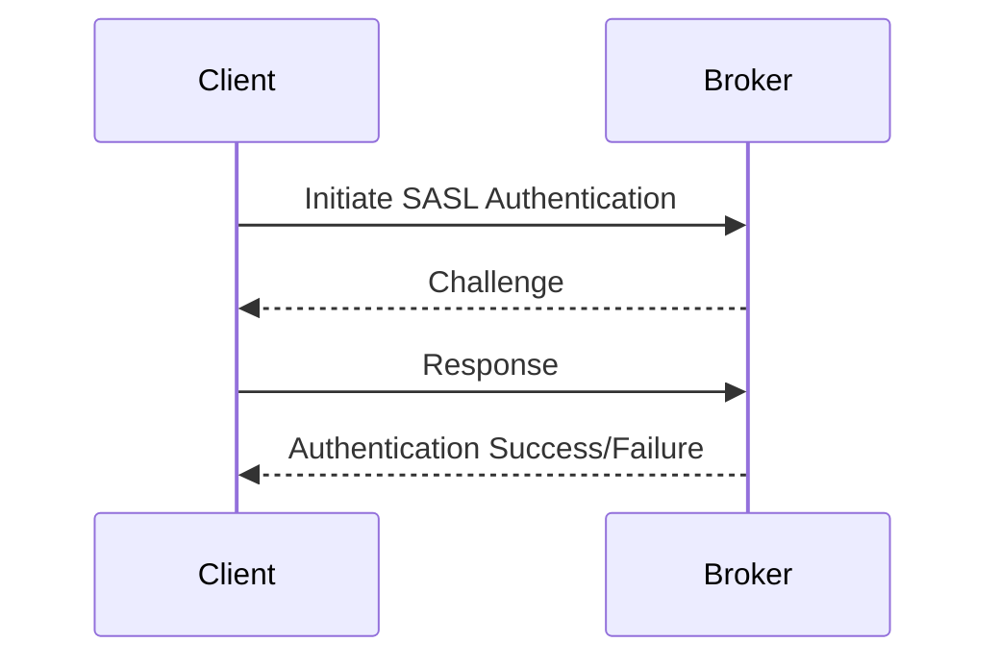

## 12.1.2 SASL Authentication

### Introduction

Apache Kafka, a distributed event streaming platform, is widely used for building real-time data pipelines and streaming applications. As Kafka becomes a critical component in enterprise architectures, securing Kafka clusters against unauthorized access is paramount. One of the key mechanisms for securing Kafka is through authentication, and the Simple Authentication and Security Layer (SASL) provides a robust framework for this purpose.

SASL is a framework that decouples authentication mechanisms from application protocols, allowing for flexible and secure authentication. Kafka supports several SASL mechanisms, including SCRAM, GSSAPI (Kerberos), and PLAIN. This section explores these mechanisms, providing detailed guidance on their configuration and usage in Kafka environments.

### SASL Mechanisms Supported by Kafka

#### 1. SCRAM (Salted Challenge Response Authentication Mechanism)

SCRAM is a password-based authentication mechanism that provides a secure way to authenticate clients and brokers. It is designed to be resistant to replay attacks and does not transmit passwords in plain text.

- **SCRAM-SHA-256** and **SCRAM-SHA-512** are the two variants supported by Kafka, offering different levels of cryptographic strength.

#### 2. GSSAPI (Generic Security Services Application Program Interface)

GSSAPI, commonly associated with Kerberos, is a network authentication protocol designed to provide strong authentication for client-server applications.

- **Kerberos** is a widely used protocol in enterprise environments, providing mutual authentication between clients and servers.

#### 3. PLAIN

PLAIN is a simple username/password authentication mechanism. While it is easy to set up, it is not secure unless used over a secure transport layer like SSL/TLS.

### Setting Up SASL Authentication

#### Configuring Kafka for SASL

To enable SASL authentication in Kafka, you need to configure both the Kafka brokers and the clients. The configuration involves setting up the appropriate SASL mechanism and configuring the necessary properties.

##### Broker Configuration

1. **Enable SASL on the Broker**

   Add the following properties to the `server.properties` file of your Kafka broker:

   ```properties
   # Enable SASL authentication
   security.inter.broker.protocol=SASL_PLAINTEXT
   sasl.mechanism.inter.broker.protocol=SCRAM-SHA-256

   # Configure listeners
   listeners=SASL_PLAINTEXT://:9092
   advertised.listeners=SASL_PLAINTEXT://your.kafka.broker:9092

   # Specify the SASL mechanism
   sasl.enabled.mechanisms=SCRAM-SHA-256
   ```

2. **Configure JAAS for the Broker**

   Create a JAAS configuration file (`kafka_server_jaas.conf`) with the following content:

   ```plaintext
   KafkaServer {
       org.apache.kafka.common.security.scram.ScramLoginModule required
       username="broker"
       password="broker-password";
   };
   ```

   Set the `KAFKA_OPTS` environment variable to point to this JAAS file:

   ```bash
   export KAFKA_OPTS="-Djava.security.auth.login.config=/path/to/kafka_server_jaas.conf"
   ```

##### Client Configuration

1. **Configure JAAS for the Client**

   Create a JAAS configuration file (`kafka_client_jaas.conf`) with the following content:

   ```plaintext
   KafkaClient {
       org.apache.kafka.common.security.scram.ScramLoginModule required
       username="client"
       password="client-password";
   };
   ```

2. **Set Client Properties**

   Configure the Kafka client properties to use SASL:

   ```properties
   security.protocol=SASL_PLAINTEXT
   sasl.mechanism=SCRAM-SHA-256
   ```

3. **Set the JAAS Configuration**

   Set the `KAFKA_OPTS` environment variable for the client:

   ```bash
   export KAFKA_OPTS="-Djava.security.auth.login.config=/path/to/kafka_client_jaas.conf"
   ```

### When to Use Each SASL Mechanism

- **SCRAM**: Use SCRAM when you need a secure, password-based authentication mechanism that is easy to manage and does not require a complex infrastructure like Kerberos.

- **GSSAPI (Kerberos)**: Choose Kerberos when you are in an enterprise environment that already uses Kerberos for authentication. It provides strong security and is well-suited for environments requiring mutual authentication.

- **PLAIN**: Use PLAIN only in environments where you have a secure transport layer (e.g., SSL/TLS) and need a simple authentication mechanism.

### Best Practices for Secure Password Storage and Transmission

1. **Use Strong Passwords**: Ensure that all passwords used in SASL configurations are strong and complex.

2. **Encrypt Passwords**: Store passwords in encrypted form wherever possible. Use tools like HashiCorp Vault or AWS Secrets Manager for secure storage.

3. **Use SSL/TLS**: Always use SSL/TLS in conjunction with PLAIN to encrypt the communication channel and protect passwords in transit.

4. **Regularly Rotate Passwords**: Implement a policy for regular password rotation to minimize the risk of compromised credentials.

### Integration with Directory Services or Identity Providers

Integrating Kafka with directory services or identity providers can streamline authentication and enhance security. Here are some common integration scenarios:

- **LDAP Integration**: Use LDAP to authenticate users against a centralized directory service. This can be achieved by configuring the SASL/PLAIN mechanism to use LDAP for authentication.

- **Kerberos Integration**: Leverage existing Kerberos infrastructure for authenticating Kafka clients and brokers. This is particularly useful in environments with a strong reliance on Kerberos for authentication.

- **OAuth2 and OpenID Connect**: Integrate with OAuth2 or OpenID Connect providers for modern authentication workflows. This approach is beneficial for web-based applications and microservices architectures.

### Code Examples

#### Java Example: Configuring a Kafka Producer with SASL

```java
import org.apache.kafka.clients.producer.KafkaProducer;
import org.apache.kafka.clients.producer.ProducerConfig;
import org.apache.kafka.clients.producer.ProducerRecord;
import org.apache.kafka.common.serialization.StringSerializer;

import java.util.Properties;

public class SaslProducerExample {
    public static void main(String[] args) {
        Properties props = new Properties();
        props.put(ProducerConfig.BOOTSTRAP_SERVERS_CONFIG, "your.kafka.broker:9092");
        props.put(ProducerConfig.KEY_SERIALIZER_CLASS_CONFIG, StringSerializer.class.getName());
        props.put(ProducerConfig.VALUE_SERIALIZER_CLASS_CONFIG, StringSerializer.class.getName());
        props.put("security.protocol", "SASL_PLAINTEXT");
        props.put("sasl.mechanism", "SCRAM-SHA-256");

        KafkaProducer<String, String> producer = new KafkaProducer<>(props);
        ProducerRecord<String, String> record = new ProducerRecord<>("your-topic", "key", "value");

        producer.send(record, (metadata, exception) -> {
            if (exception != null) {
                exception.printStackTrace();
            } else {
                System.out.printf("Sent record to partition %d with offset %d%n", metadata.partition(), metadata.offset());
            }
        });

        producer.close();
    }
}
```

#### Scala Example: Configuring a Kafka Consumer with SASL

```scala
import org.apache.kafka.clients.consumer.{ConsumerConfig, KafkaConsumer}
import org.apache.kafka.common.serialization.StringDeserializer

import java.util.Properties
import scala.collection.JavaConverters._

object SaslConsumerExample extends App {
  val props = new Properties()
  props.put(ConsumerConfig.BOOTSTRAP_SERVERS_CONFIG, "your.kafka.broker:9092")
  props.put(ConsumerConfig.KEY_DESERIALIZER_CLASS_CONFIG, classOf[StringDeserializer].getName)
  props.put(ConsumerConfig.VALUE_DESERIALIZER_CLASS_CONFIG, classOf[StringDeserializer].getName)
  props.put(ConsumerConfig.GROUP_ID_CONFIG, "your-group-id")
  props.put("security.protocol", "SASL_PLAINTEXT")
  props.put("sasl.mechanism", "SCRAM-SHA-256")

  val consumer = new KafkaConsumer[String, String](props)
  consumer.subscribe(List("your-topic").asJava)

  while (true) {
    val records = consumer.poll(1000)
    for (record <- records.asScala) {
      println(s"Consumed record with key ${record.key()} and value ${record.value()}")
    }
  }
}
```

#### Kotlin Example: Configuring a Kafka Producer with SASL

```kotlin
import org.apache.kafka.clients.producer.KafkaProducer
import org.apache.kafka.clients.producer.ProducerConfig
import org.apache.kafka.clients.producer.ProducerRecord
import org.apache.kafka.common.serialization.StringSerializer
import java.util.Properties

fun main() {
    val props = Properties().apply {
        put(ProducerConfig.BOOTSTRAP_SERVERS_CONFIG, "your.kafka.broker:9092")
        put(ProducerConfig.KEY_SERIALIZER_CLASS_CONFIG, StringSerializer::class.java.name)
        put(ProducerConfig.VALUE_SERIALIZER_CLASS_CONFIG, StringSerializer::class.java.name)
        put("security.protocol", "SASL_PLAINTEXT")
        put("sasl.mechanism", "SCRAM-SHA-256")
    }

    val producer = KafkaProducer<String, String>(props)
    val record = ProducerRecord("your-topic", "key", "value")

    producer.send(record) { metadata, exception ->
        if (exception != null) {
            exception.printStackTrace()
        } else {
            println("Sent record to partition ${metadata.partition()} with offset ${metadata.offset()}")
        }
    }

    producer.close()
}
```

#### Clojure Example: Configuring a Kafka Consumer with SASL

```clojure
(ns sasl-consumer-example
  (:import (org.apache.kafka.clients.consumer KafkaConsumer ConsumerConfig)
           (org.apache.kafka.common.serialization StringDeserializer))
  (:require [clojure.java.io :as io]))

(defn create-consumer []
  (let [props (doto (java.util.Properties.)
                (.put ConsumerConfig/BOOTSTRAP_SERVERS_CONFIG "your.kafka.broker:9092")
                (.put ConsumerConfig/KEY_DESERIALIZER_CLASS_CONFIG StringDeserializer)
                (.put ConsumerConfig/VALUE_DESERIALIZER_CLASS_CONFIG StringDeserializer)
                (.put ConsumerConfig/GROUP_ID_CONFIG "your-group-id")
                (.put "security.protocol" "SASL_PLAINTEXT")
                (.put "sasl.mechanism" "SCRAM-SHA-256"))]
    (KafkaConsumer. props)))

(defn consume-messages []
  (let [consumer (create-consumer)]
    (.subscribe consumer ["your-topic"])
    (while true
      (let [records (.poll consumer 1000)]
        (doseq [record records]
          (println (str "Consumed record with key " (.key record) " and value " (.value record))))))))

(consume-messages)
```

### Visualizing SASL Authentication in Kafka

To better understand the flow of SASL authentication in Kafka, consider the following sequence diagram:



**Caption**: This diagram illustrates the SASL authentication process between a Kafka client and broker. The client initiates the authentication, the broker challenges the client, and the client responds with the necessary credentials. The broker then confirms the authentication success or failure.

### Best Practices and Considerations

1. **Choose the Right Mechanism**: Select the SASL mechanism that best fits your security requirements and infrastructure capabilities.

2. **Secure Configuration Files**: Ensure that JAAS configuration files are secured and not accessible to unauthorized users.

3. **Monitor Authentication Attempts**: Implement monitoring and alerting for failed authentication attempts to detect potential security threats.

4. **Integrate with Existing Security Infrastructure**: Leverage existing directory services and identity providers to streamline authentication and enhance security.

5. **Regularly Update and Patch**: Keep your Kafka and security libraries up to date to protect against vulnerabilities.

### Knowledge Check

To reinforce your understanding of SASL authentication in Kafka, consider the following questions and exercises:

- **Question**: What are the key differences between SCRAM and GSSAPI mechanisms?
- **Exercise**: Configure a Kafka cluster with SASL/PLAIN and SSL/TLS, and test the authentication process.
- **Question**: How can you integrate Kafka with an LDAP directory for authentication?
- **Exercise**: Implement a monitoring solution to track authentication attempts and alert on failures.

### Conclusion

SASL authentication is a powerful tool for securing Kafka clusters, providing flexibility and robust security. By understanding and implementing the appropriate SASL mechanisms, you can ensure that your Kafka environment is protected against unauthorized access. Remember to follow best practices for secure configuration and integration with existing security infrastructure to maximize the benefits of SASL authentication.

## Test Your Knowledge: Advanced SASL Authentication in Kafka Quiz



### Which SASL mechanism is most suitable for environments with existing Kerberos infrastructure?

- [ ] SCRAM
- [x] GSSAPI
- [ ] PLAIN
- [ ] OAuth2

> **Explanation:** GSSAPI, commonly associated with Kerberos, is ideal for environments that already use Kerberos for authentication.

### What is a key advantage of using SCRAM over PLAIN?

- [x] SCRAM does not transmit passwords in plain text.
- [ ] SCRAM is easier to set up.
- [ ] SCRAM requires less configuration.
- [ ] SCRAM is less secure.

> **Explanation:** SCRAM provides a secure way to authenticate without transmitting passwords in plain text, unlike PLAIN.

### What should you always use with SASL/PLAIN to ensure security?

- [ ] Kerberos
- [ ] OAuth2
- [x] SSL/TLS
- [ ] LDAP

> **Explanation:** SSL/TLS should be used with SASL/PLAIN to encrypt the communication channel and protect passwords in transit.

### How can you securely store passwords for SASL configurations?

- [ ] In plain text files
- [ ] In the codebase
- [x] In encrypted form using tools like Vault
- [ ] In environment variables

> **Explanation:** Passwords should be stored in encrypted form using secure tools like HashiCorp Vault to prevent unauthorized access.

### Which SASL mechanism provides mutual authentication?

- [x] GSSAPI
- [ ] SCRAM
- [ ] PLAIN
- [ ] OAuth2

> **Explanation:** GSSAPI, through Kerberos, provides mutual authentication between clients and servers.

### What is the primary role of JAAS in SASL configuration?

- [ ] To encrypt data
- [x] To specify authentication credentials
- [ ] To manage network connections
- [ ] To configure SSL/TLS

> **Explanation:** JAAS is used to specify authentication credentials for SASL mechanisms in Kafka.

### What is a common integration scenario for SASL in enterprise environments?

- [ ] Integration with OAuth2
- [x] Integration with LDAP
- [ ] Integration with REST APIs
- [ ] Integration with MQTT

> **Explanation:** Integrating SASL with LDAP is common in enterprise environments for centralized user authentication.

### What is a best practice for managing SASL configuration files?

- [ ] Store them in the codebase
- [ ] Share them publicly
- [x] Secure them and restrict access
- [ ] Ignore them

> **Explanation:** SASL configuration files should be secured and access should be restricted to prevent unauthorized access.

### Which of the following is a benefit of using SASL in Kafka?

- [x] Enhanced security through authentication
- [ ] Reduced network latency
- [ ] Simplified configuration
- [ ] Increased data throughput

> **Explanation:** SASL enhances security by providing robust authentication mechanisms for Kafka clients and brokers.

### True or False: SASL/PLAIN is secure without SSL/TLS.

- [ ] True
- [x] False

> **Explanation:** SASL/PLAIN is not secure without SSL/TLS, as it transmits passwords in plain text.


