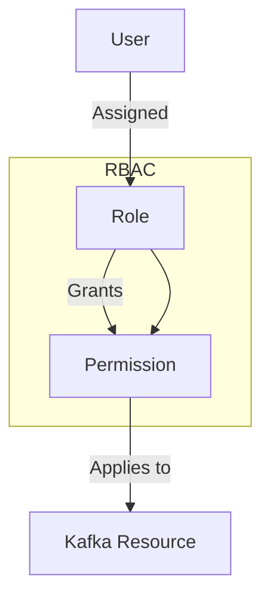

## 12.2.2 Role-Based Access Control

### Introduction to Role-Based Access Control (RBAC)

Role-Based Access Control (RBAC) is a security paradigm that restricts system access to authorized users based on their roles within an organization. In the context of Apache Kafka, RBAC is used to manage permissions for accessing Kafka resources such as topics, consumer groups, and configurations. By assigning roles to users and mapping these roles to specific permissions, organizations can streamline security management and ensure that users have access only to the resources necessary for their roles.

#### Advantages of RBAC

- **Simplified Administration**: By grouping permissions into roles, administrators can easily manage user access rights. This reduces the complexity of managing individual permissions for each user.
- **Enhanced Security**: RBAC minimizes the risk of unauthorized access by ensuring that users have only the permissions necessary for their roles.
- **Scalability**: As organizations grow, RBAC allows for efficient scaling of access control policies by simply assigning roles to new users.
- **Compliance and Auditing**: RBAC facilitates compliance with regulatory requirements by providing a clear framework for access control and making it easier to audit user permissions.

### Implementing RBAC in Kafka

Implementing RBAC in Kafka involves defining roles, mapping these roles to permissions, and assigning roles to users. Kafka's security model supports RBAC through the use of Access Control Lists (ACLs) and integration with external identity management systems.

#### Mapping Roles to Permissions

In Kafka, roles are mapped to permissions using ACLs. An ACL specifies the operations that a user or group of users can perform on a Kafka resource. The following are common permissions that can be assigned to roles:

- **Read**: Allows a user to consume messages from a topic.
- **Write**: Allows a user to produce messages to a topic.
- **Create**: Allows a user to create new topics or consumer groups.
- **Delete**: Allows a user to delete topics or consumer groups.
- **Alter**: Allows a user to modify configurations of topics or consumer groups.
- **Describe**: Allows a user to view metadata about topics or consumer groups.

#### Defining Roles for Common Use Cases

When defining roles in Kafka, consider the specific needs and responsibilities of different user groups within your organization. Here are examples of roles and their associated permissions:

- **Producer Role**: This role is responsible for producing messages to Kafka topics. Permissions include Write and Describe on specific topics.
- **Consumer Role**: This role is responsible for consuming messages from Kafka topics. Permissions include Read and Describe on specific topics.
- **Administrator Role**: This role manages Kafka configurations and resources. Permissions include Create, Delete, Alter, and Describe on all topics and consumer groups.

### Integration with External Identity Management Systems

Integrating Kafka with external identity management systems, such as LDAP or Kerberos, enhances RBAC by centralizing user authentication and authorization. This integration allows organizations to leverage existing user directories and authentication mechanisms, simplifying user management and improving security.

#### Steps for Integration

1. **Configure Kafka for SASL Authentication**: Set up Kafka to use SASL (Simple Authentication and Security Layer) for authentication. This involves configuring Kafka brokers and clients to use SASL mechanisms such as GSSAPI (Kerberos) or PLAIN (LDAP).

2. **Set Up External Identity Provider**: Configure your identity management system to authenticate users and provide role information. This may involve setting up Kerberos key distribution centers (KDCs) or LDAP servers.

3. **Map External Roles to Kafka Roles**: Define mappings between roles in your identity management system and roles in Kafka. This ensures that users are granted the appropriate permissions based on their roles.

4. **Test and Validate Integration**: Verify that users can authenticate to Kafka using their credentials from the identity management system and that they have the correct permissions based on their roles.

### Best Practices for Maintaining and Auditing Roles

To ensure the effectiveness of RBAC in Kafka, follow these best practices:

- **Regularly Review Roles and Permissions**: Periodically review roles and their associated permissions to ensure they align with current organizational needs and security policies.
- **Implement Least Privilege Principle**: Assign users the minimum permissions necessary to perform their job functions. This reduces the risk of unauthorized access and potential security breaches.
- **Automate Role Assignment**: Use automation tools to assign roles to users based on predefined criteria, such as job title or department. This reduces the risk of human error and ensures consistency in role assignments.
- **Conduct Regular Audits**: Perform regular audits of user roles and permissions to identify and address any discrepancies or potential security risks.
- **Document Role Definitions and Changes**: Maintain clear documentation of role definitions, permissions, and any changes made to roles. This facilitates auditing and compliance efforts.

### Code Examples

Below are code examples demonstrating how to implement RBAC in Kafka using different programming languages.

#### Java Example

```java
import org.apache.kafka.clients.admin.AdminClient;
import org.apache.kafka.clients.admin.AdminClientConfig;
import org.apache.kafka.common.acl.AclBinding;
import org.apache.kafka.common.acl.AclOperation;
import org.apache.kafka.common.acl.AclPermissionType;
import org.apache.kafka.common.resource.ResourcePattern;
import org.apache.kafka.common.resource.ResourceType;

import java.util.Collections;
import java.util.Properties;

public class KafkaRBACExample {
    public static void main(String[] args) {
        Properties config = new Properties();
        config.put(AdminClientConfig.BOOTSTRAP_SERVERS_CONFIG, "localhost:9092");
        AdminClient adminClient = AdminClient.create(config);

        AclBinding aclBinding = new AclBinding(
            new ResourcePattern(ResourceType.TOPIC, "example-topic", ResourcePattern.WildcardType.LITERAL),
            new org.apache.kafka.common.acl.AccessControlEntry(
                "User:producer", "*", AclOperation.WRITE, AclPermissionType.ALLOW)
        );

        adminClient.createAcls(Collections.singletonList(aclBinding)).all().whenComplete((result, exception) -> {
            if (exception != null) {
                System.out.println("Failed to create ACL: " + exception.getMessage());
            } else {
                System.out.println("ACL created successfully.");
            }
            adminClient.close();
        });
    }
}
```

#### Scala Example

```scala
import org.apache.kafka.clients.admin.{AdminClient, AdminClientConfig}
import org.apache.kafka.common.acl.{AclBinding, AclOperation, AclPermissionType}
import org.apache.kafka.common.resource.{ResourcePattern, ResourceType}

import java.util.Properties
import scala.jdk.CollectionConverters._

object KafkaRBACExample extends App {
  val config = new Properties()
  config.put(AdminClientConfig.BOOTSTRAP_SERVERS_CONFIG, "localhost:9092")
  val adminClient = AdminClient.create(config)

  val aclBinding = new AclBinding(
    new ResourcePattern(ResourceType.TOPIC, "example-topic", ResourcePattern.WildcardType.LITERAL),
    new org.apache.kafka.common.acl.AccessControlEntry(
      "User:producer", "*", AclOperation.WRITE, AclPermissionType.ALLOW)
  )

  adminClient.createAcls(List(aclBinding).asJava).all().whenComplete { (result, exception) =>
    if (exception != null) {
      println(s"Failed to create ACL: ${exception.getMessage}")
    } else {
      println("ACL created successfully.")
    }
    adminClient.close()
  }
}
```

#### Kotlin Example

```kotlin
import org.apache.kafka.clients.admin.AdminClient
import org.apache.kafka.clients.admin.AdminClientConfig
import org.apache.kafka.common.acl.AclBinding
import org.apache.kafka.common.acl.AclOperation
import org.apache.kafka.common.acl.AclPermissionType
import org.apache.kafka.common.resource.ResourcePattern
import org.apache.kafka.common.resource.ResourceType

fun main() {
    val config = Properties().apply {
        put(AdminClientConfig.BOOTSTRAP_SERVERS_CONFIG, "localhost:9092")
    }
    val adminClient = AdminClient.create(config)

    val aclBinding = AclBinding(
        ResourcePattern(ResourceType.TOPIC, "example-topic", ResourcePattern.WildcardType.LITERAL),
        org.apache.kafka.common.acl.AccessControlEntry(
            "User:producer", "*", AclOperation.WRITE, AclPermissionType.ALLOW)
    )

    adminClient.createAcls(listOf(aclBinding)).all().whenComplete { _, exception ->
        if (exception != null) {
            println("Failed to create ACL: ${exception.message}")
        } else {
            println("ACL created successfully.")
        }
        adminClient.close()
    }
}
```

#### Clojure Example

```clojure
(ns kafka-rbac-example
  (:import [org.apache.kafka.clients.admin AdminClient AdminClientConfig]
           [org.apache.kafka.common.acl AclBinding AclOperation AclPermissionType]
           [org.apache.kafka.common.resource ResourcePattern ResourceType]))

(defn create-acl []
  (let [config (doto (java.util.Properties.)
                 (.put AdminClientConfig/BOOTSTRAP_SERVERS_CONFIG "localhost:9092"))
        admin-client (AdminClient/create config)
        acl-binding (AclBinding.
                      (ResourcePattern. ResourceType/TOPIC "example-topic" ResourcePattern$WildcardType/LITERAL)
                      (org.apache.kafka.common.acl.AccessControlEntry.
                        "User:producer" "*" AclOperation/WRITE AclPermissionType/ALLOW))]
    (-> (.createAcls admin-client [acl-binding])
        (.all)
        (.whenComplete (fn [result exception]
                         (if exception
                           (println "Failed to create ACL:" (.getMessage exception))
                           (println "ACL created successfully."))
                         (.close admin-client))))))
```

### Visualizing RBAC in Kafka

To better understand how RBAC is implemented in Kafka, consider the following diagram illustrating the relationship between users, roles, and permissions.



**Diagram Description**: This diagram shows how users are assigned roles, which in turn grant permissions that apply to Kafka resources. The RBAC model simplifies access control by abstracting permissions into roles that can be easily managed and audited.

### Conclusion

Implementing Role-Based Access Control (RBAC) in Apache Kafka is a powerful way to enhance security, simplify administration, and ensure compliance with organizational policies. By defining roles, mapping them to permissions, and integrating with external identity management systems, organizations can effectively manage access to Kafka resources. Regularly reviewing and auditing roles and permissions is crucial to maintaining a secure and efficient RBAC implementation.

## Test Your Knowledge: Role-Based Access Control in Apache Kafka



### What is the primary advantage of using Role-Based Access Control (RBAC) in Kafka?

- [x] Simplifies administration by grouping permissions into roles.
- [ ] Increases the number of permissions needed.
- [ ] Requires more complex configurations.
- [ ] Reduces the need for authentication.

> **Explanation:** RBAC simplifies administration by allowing permissions to be grouped into roles, making it easier to manage user access rights.

### Which of the following is NOT a common permission that can be assigned to roles in Kafka?

- [ ] Read
- [ ] Write
- [x] Execute
- [ ] Describe

> **Explanation:** Execute is not a common permission in Kafka. Common permissions include Read, Write, and Describe.

### How does integrating Kafka with external identity management systems enhance RBAC?

- [x] By centralizing user authentication and authorization.
- [ ] By increasing the number of roles needed.
- [ ] By making it harder to manage user credentials.
- [ ] By reducing the need for encryption.

> **Explanation:** Integrating with external identity management systems centralizes user authentication and authorization, enhancing RBAC.

### What is the least privilege principle in the context of RBAC?

- [x] Assigning users the minimum permissions necessary to perform their job functions.
- [ ] Assigning users all possible permissions.
- [ ] Assigning users permissions based on their preferences.
- [ ] Assigning users permissions randomly.

> **Explanation:** The least privilege principle involves assigning users only the permissions necessary to perform their job functions, reducing security risks.

### Which of the following roles would typically have the Write permission on a Kafka topic?

- [x] Producer Role
- [ ] Consumer Role
- [ ] Administrator Role
- [ ] Viewer Role

> **Explanation:** The Producer Role typically has the Write permission to produce messages to a Kafka topic.

### What is a key benefit of automating role assignment in RBAC?

- [x] Reduces the risk of human error and ensures consistency.
- [ ] Increases the complexity of role management.
- [ ] Requires manual intervention for each user.
- [ ] Decreases the number of roles available.

> **Explanation:** Automating role assignment reduces the risk of human error and ensures consistency in role assignments.

### What should be regularly audited to maintain an effective RBAC implementation?

- [x] User roles and permissions
- [ ] Network configurations
- [ ] Hardware specifications
- [ ] Software licenses

> **Explanation:** Regularly auditing user roles and permissions helps maintain an effective RBAC implementation by identifying discrepancies and potential security risks.

### In the context of Kafka, what does an ACL specify?

- [x] The operations a user or group can perform on a Kafka resource.
- [ ] The network settings for Kafka brokers.
- [ ] The hardware requirements for Kafka clusters.
- [ ] The software dependencies for Kafka clients.

> **Explanation:** An ACL specifies the operations a user or group can perform on a Kafka resource, such as topics or consumer groups.

### True or False: RBAC in Kafka can be implemented without using ACLs.

- [ ] True
- [x] False

> **Explanation:** False. RBAC in Kafka relies on ACLs to map roles to permissions and control access to resources.

### Which of the following is a best practice for maintaining RBAC in Kafka?

- [x] Regularly review roles and permissions.
- [ ] Assign all users the same role.
- [ ] Avoid using external identity management systems.
- [ ] Grant all permissions to every user.

> **Explanation:** Regularly reviewing roles and permissions is a best practice for maintaining RBAC, ensuring that access rights align with organizational needs and security policies.


