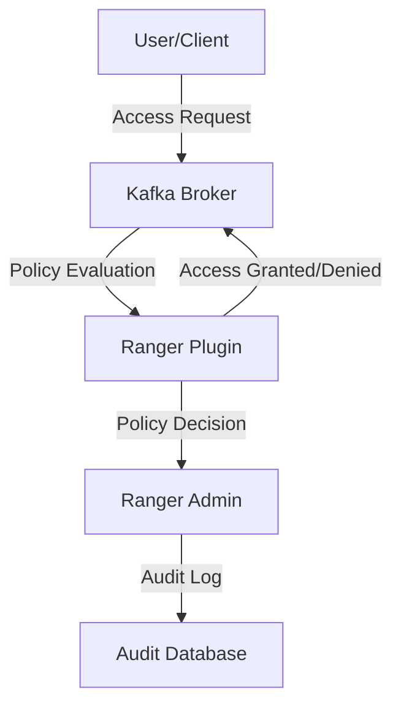

## 12.2.3 Fine-Grained Access Control with Apache Ranger

**Description**: This section introduces Apache Ranger as a tool for enforcing fine-grained access control policies in Kafka, providing centralized policy management and auditing capabilities.

### Introduction to Apache Ranger

Apache Ranger is a powerful framework designed to enable, monitor, and manage comprehensive data security across the Hadoop ecosystem. It provides a centralized platform for defining, administering, and auditing security policies consistently across various Hadoop components, including Apache Kafka. Ranger's integration with Kafka allows organizations to enforce fine-grained access control, ensuring that only authorized users and applications can access specific Kafka resources.

### Features of Apache Ranger Relevant to Kafka

Apache Ranger offers several features that are particularly beneficial for managing access control in Kafka environments:

- **Centralized Policy Management**: Ranger provides a unified interface for managing access control policies across multiple Hadoop components, including Kafka. This centralization simplifies policy administration and ensures consistency.

- **Fine-Grained Access Control**: With Ranger, you can define detailed access control policies that specify which users or groups can perform specific actions (e.g., read, write, delete) on Kafka topics.

- **Dynamic Policy Updates**: Ranger allows for dynamic updates to access control policies without requiring a restart of Kafka services, ensuring minimal disruption to operations.

- **Audit and Reporting**: Ranger's auditing capabilities provide detailed logs of access requests, policy changes, and other security-related events, facilitating compliance and security monitoring.

- **Integration with External Authentication Systems**: Ranger can integrate with LDAP, Active Directory, and other authentication systems to leverage existing user and group information.

### Installing and Configuring Apache Ranger for Kafka Integration

To leverage Apache Ranger for fine-grained access control in Kafka, you need to install and configure Ranger and its Kafka plugin. Below are the steps to achieve this integration:

#### Prerequisites

- Ensure that Apache Kafka is installed and running.
- Java Development Kit (JDK) is installed on the system.
- Access to a database (e.g., MySQL, PostgreSQL) for Ranger's metadata storage.

#### Installation Steps

1. **Download Apache Ranger**: Obtain the latest version of Apache Ranger from the [Apache Ranger website](https://ranger.apache.org/).

2. **Set Up the Ranger Admin Server**:
   - Extract the downloaded Ranger package.
   - Configure the database connection by editing the `install.properties` file to point to your database.
   - Run the setup script to initialize the Ranger Admin server.

3. **Install the Ranger Kafka Plugin**:
   - Navigate to the `ranger-kafka-plugin` directory within the Ranger package.
   - Configure the plugin by editing the `install.properties` file to specify Kafka broker details and the Ranger Admin server URL.
   - Execute the installation script to deploy the plugin to your Kafka brokers.

4. **Verify the Installation**:
   - Start the Ranger Admin server and access the Ranger web UI.
   - Ensure that the Kafka service is listed in the Ranger UI, indicating successful plugin installation.

### Creating and Applying Policies in Apache Ranger

Once Ranger is installed and configured, you can begin creating and applying access control policies for Kafka. Here's how to define a policy:

#### Step-by-Step Policy Creation

1. **Log into the Ranger Admin UI**: Use your credentials to access the Ranger web interface.

2. **Navigate to the Kafka Service**: Select the Kafka service from the list of available services.

3. **Create a New Policy**:
   - Click on "Add New Policy" to start defining a new access control policy.
   - Specify the policy name and description for easy identification.

4. **Define Resource Access**:
   - Select the Kafka resources (e.g., topics, consumer groups) that the policy will apply to.
   - Specify the access type (e.g., read, write, delete) and the users or groups that will be granted or denied access.

5. **Set Policy Conditions**:
   - Optionally, define conditions under which the policy is applicable, such as time-based restrictions or IP address filters.

6. **Save and Apply the Policy**: Once the policy is defined, save it to apply the access control rules to the specified Kafka resources.

### Auditing and Reporting Considerations

Apache Ranger's auditing capabilities are crucial for maintaining security and compliance in Kafka environments. Here are some key considerations:

- **Enable Auditing**: Ensure that auditing is enabled in Ranger to capture detailed logs of access requests, policy changes, and other security events.

- **Review Audit Logs Regularly**: Regularly review audit logs to identify unauthorized access attempts or policy violations.

- **Integrate with SIEM Tools**: Consider integrating Ranger's audit logs with Security Information and Event Management (SIEM) tools for enhanced monitoring and alerting.

- **Generate Compliance Reports**: Use Ranger's reporting features to generate compliance reports that demonstrate adherence to security policies and regulations.

### Practical Applications and Real-World Scenarios

Apache Ranger's fine-grained access control capabilities are particularly beneficial in the following scenarios:

- **Multi-Tenant Environments**: In environments where multiple teams or departments share a Kafka cluster, Ranger can enforce tenant-specific access control policies to ensure data isolation and security.

- **Regulatory Compliance**: Organizations subject to data protection regulations (e.g., GDPR, HIPAA) can use Ranger to enforce access control policies that comply with legal requirements.

- **Data Governance**: Ranger's centralized policy management and auditing features support robust data governance practices, ensuring that data access is controlled and traceable.

### Code Examples

To illustrate the integration of Apache Ranger with Kafka, let's explore some code examples in Java, Scala, Kotlin, and Clojure that demonstrate how to interact with Kafka under Ranger's access control policies.

#### Java Example

```java
import org.apache.kafka.clients.producer.KafkaProducer;
import org.apache.kafka.clients.producer.ProducerRecord;
import java.util.Properties;

public class KafkaProducerExample {
    public static void main(String[] args) {
        Properties props = new Properties();
        props.put("bootstrap.servers", "localhost:9092");
        props.put("key.serializer", "org.apache.kafka.common.serialization.StringSerializer");
        props.put("value.serializer", "org.apache.kafka.common.serialization.StringSerializer");

        KafkaProducer<String, String> producer = new KafkaProducer<>(props);
        try {
            ProducerRecord<String, String> record = new ProducerRecord<>("my-topic", "key", "value");
            producer.send(record);
        } finally {
            producer.close();
        }
    }
}
```

#### Scala Example

```scala
import org.apache.kafka.clients.producer.{KafkaProducer, ProducerRecord}
import java.util.Properties

object KafkaProducerExample extends App {
  val props = new Properties()
  props.put("bootstrap.servers", "localhost:9092")
  props.put("key.serializer", "org.apache.kafka.common.serialization.StringSerializer")
  props.put("value.serializer", "org.apache.kafka.common.serialization.StringSerializer")

  val producer = new KafkaProducer[String, String](props)
  try {
    val record = new ProducerRecord[String, String]("my-topic", "key", "value")
    producer.send(record)
  } finally {
    producer.close()
  }
}
```

#### Kotlin Example

```kotlin
import org.apache.kafka.clients.producer.KafkaProducer
import org.apache.kafka.clients.producer.ProducerRecord
import java.util.Properties

fun main() {
    val props = Properties().apply {
        put("bootstrap.servers", "localhost:9092")
        put("key.serializer", "org.apache.kafka.common.serialization.StringSerializer")
        put("value.serializer", "org.apache.kafka.common.serialization.StringSerializer")
    }

    val producer = KafkaProducer<String, String>(props)
    try {
        val record = ProducerRecord("my-topic", "key", "value")
        producer.send(record)
    } finally {
        producer.close()
    }
}
```

#### Clojure Example

```clojure
(require '[clojure.java.io :as io])
(import '[org.apache.kafka.clients.producer KafkaProducer ProducerRecord])

(defn kafka-producer-example []
  (let [props (doto (java.util.Properties.)
                (.put "bootstrap.servers" "localhost:9092")
                (.put "key.serializer" "org.apache.kafka.common.serialization.StringSerializer")
                (.put "value.serializer" "org.apache.kafka.common.serialization.StringSerializer"))
        producer (KafkaProducer. props)]
    (try
      (.send producer (ProducerRecord. "my-topic" "key" "value"))
      (finally
        (.close producer)))))
```

### Visualizing Apache Ranger's Integration with Kafka

To better understand how Apache Ranger integrates with Kafka, consider the following diagram that illustrates the architecture and data flow:



**Diagram Description**: This diagram shows the interaction between a user/client, Kafka broker, Ranger plugin, Ranger admin, and audit database. The Ranger plugin evaluates access requests against defined policies and logs the events for auditing.

### Key Takeaways

- Apache Ranger provides centralized, fine-grained access control for Kafka, enhancing security and compliance.
- Ranger's dynamic policy updates and auditing capabilities are crucial for maintaining secure and compliant Kafka environments.
- Integrating Ranger with Kafka involves installing the Ranger Admin server and Kafka plugin, followed by defining and applying access control policies.
- Real-world applications of Ranger include multi-tenant environments, regulatory compliance, and data governance.

## Test Your Knowledge: Fine-Grained Access Control with Apache Ranger Quiz



### What is the primary role of Apache Ranger in a Kafka environment?

- [x] To provide centralized policy management and fine-grained access control.
- [ ] To enhance Kafka's message throughput.
- [ ] To replace Kafka's built-in security features.
- [ ] To manage Kafka's cluster resources.

> **Explanation:** Apache Ranger is primarily used for centralized policy management and fine-grained access control in Kafka environments.

### Which feature of Apache Ranger allows for dynamic updates to access control policies?

- [x] Dynamic Policy Updates
- [ ] Static Policy Configuration
- [ ] Manual Policy Reloading
- [ ] Policy Caching

> **Explanation:** Apache Ranger supports dynamic policy updates, allowing changes to be made without restarting Kafka services.

### How does Apache Ranger enhance auditing capabilities in Kafka?

- [x] By providing detailed logs of access requests and policy changes.
- [ ] By increasing Kafka's message retention period.
- [ ] By encrypting Kafka's audit logs.
- [ ] By integrating with Kafka's built-in logging system.

> **Explanation:** Ranger enhances auditing by logging detailed access requests and policy changes, which aids in compliance and security monitoring.

### What is a key benefit of integrating Apache Ranger with external authentication systems?

- [x] Leveraging existing user and group information for access control.
- [ ] Increasing Kafka's processing speed.
- [ ] Reducing the need for Kafka's built-in security features.
- [ ] Simplifying Kafka's configuration files.

> **Explanation:** Integrating Ranger with external authentication systems allows it to leverage existing user and group information for access control.

### In which scenario is Apache Ranger particularly beneficial?

- [x] Multi-Tenant Environments
- [ ] Single-User Development Environments
- [ ] Isolated Test Clusters
- [ ] Standalone Kafka Brokers

> **Explanation:** Apache Ranger is particularly beneficial in multi-tenant environments where data isolation and security are critical.

### What is the first step in installing Apache Ranger for Kafka integration?

- [x] Download Apache Ranger from the official website.
- [ ] Configure Kafka's security settings.
- [ ] Install the Kafka broker.
- [ ] Set up a SIEM tool.

> **Explanation:** The first step is to download Apache Ranger from the official website to begin the installation process.

### Which component of Apache Ranger evaluates access requests against defined policies?

- [x] Ranger Plugin
- [ ] Ranger Admin
- [ ] Kafka Broker
- [ ] Audit Database

> **Explanation:** The Ranger Plugin evaluates access requests against defined policies to determine access decisions.

### What is a key consideration for auditing and reporting with Apache Ranger?

- [x] Regularly reviewing audit logs to identify unauthorized access attempts.
- [ ] Increasing Kafka's log retention period.
- [ ] Disabling audit logs to improve performance.
- [ ] Using Kafka's built-in logging system exclusively.

> **Explanation:** Regularly reviewing audit logs is crucial for identifying unauthorized access attempts and ensuring compliance.

### Which tool can be integrated with Ranger's audit logs for enhanced monitoring?

- [x] SIEM Tools
- [ ] Kafka Connect
- [ ] Apache Zookeeper
- [ ] Kafka Streams

> **Explanation:** SIEM tools can be integrated with Ranger's audit logs for enhanced monitoring and alerting capabilities.

### True or False: Apache Ranger can only manage access control for Kafka.

- [ ] True
- [x] False

> **Explanation:** False. Apache Ranger can manage access control for various Hadoop components, not just Kafka.



By following these guidelines and examples, you can effectively implement fine-grained access control in your Kafka environment using Apache Ranger, ensuring robust security and compliance. For more information, visit the [Apache Ranger](https://ranger.apache.org/) website.
