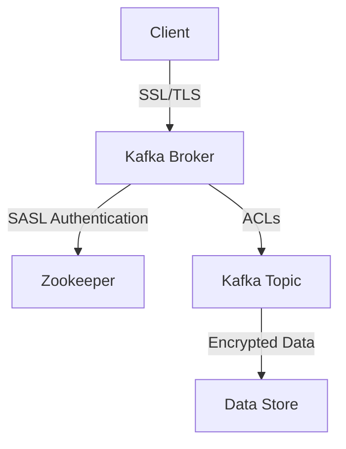

## 12.3.4 Compliance with Industry Standards (PCI DSS, HIPAA)

In the realm of data processing, compliance with industry standards such as the Payment Card Industry Data Security Standard (PCI DSS) and the Health Insurance Portability and Accountability Act (HIPAA) is crucial for organizations handling sensitive information. Apache Kafka, as a distributed streaming platform, must be configured to meet these stringent requirements. This section provides a comprehensive guide on configuring Kafka deployments to comply with PCI DSS and HIPAA standards, focusing on data encryption, logging, and secure data handling.

### Understanding PCI DSS and HIPAA

#### PCI DSS Overview

**PCI DSS** is a set of security standards designed to ensure that all companies that accept, process, store, or transmit credit card information maintain a secure environment. Key requirements include:

- **Build and Maintain a Secure Network**: Install and maintain a firewall configuration to protect cardholder data.
- **Protect Cardholder Data**: Encrypt transmission of cardholder data across open, public networks.
- **Maintain a Vulnerability Management Program**: Use and regularly update anti-virus software.
- **Implement Strong Access Control Measures**: Restrict access to cardholder data by business need-to-know.
- **Regularly Monitor and Test Networks**: Track and monitor all access to network resources and cardholder data.
- **Maintain an Information Security Policy**: Maintain a policy that addresses information security for employees and contractors.

#### HIPAA Overview

**HIPAA** is a US law designed to provide privacy standards to protect patients' medical records and other health information provided to health plans, doctors, hospitals, and other healthcare providers. Key requirements include:

- **Ensure the Confidentiality, Integrity, and Availability of All e-PHI**: Protect against any reasonably anticipated threats or hazards.
- **Protect Against Any Reasonably Anticipated Uses or Disclosures**: Ensure compliance by the workforce.
- **Implement Administrative, Physical, and Technical Safeguards**: Control access to e-PHI.
- **Conduct Risk Analysis and Management**: Identify potential risks and vulnerabilities to the confidentiality, integrity, and availability of e-PHI.

### Configuring Kafka for PCI DSS Compliance

#### Network Security

1. **Firewall Configuration**: Ensure Kafka brokers are behind a firewall. Limit access to Kafka ports (default 9092) to trusted IP addresses only.

2. **Network Segmentation**: Use network segmentation to isolate Kafka clusters from other parts of the network, minimizing the risk of unauthorized access.

#### Data Protection

1. **Data Encryption**: Enable SSL/TLS encryption for data in transit. Configure Kafka to use SSL for both client-broker and broker-broker communication.

    ```java
    // Example Kafka broker configuration for SSL
    ssl.keystore.location=/var/private/ssl/kafka.server.keystore.jks
    ssl.keystore.password=your_keystore_password
    ssl.key.password=your_key_password
    ssl.truststore.location=/var/private/ssl/kafka.server.truststore.jks
    ssl.truststore.password=your_truststore_password
    security.inter.broker.protocol=SSL
    ```

2. **Data Masking**: Implement data masking techniques to protect sensitive information in Kafka topics.

#### Access Control

1. **Authentication and Authorization**: Use SASL (Simple Authentication and Security Layer) for authentication and configure Access Control Lists (ACLs) to restrict access to Kafka resources.

    ```java
    // Example Kafka broker configuration for SASL
    sasl.enabled.mechanisms=PLAIN
    sasl.mechanism.inter.broker.protocol=PLAIN
    ```

2. **Role-Based Access Control (RBAC)**: Implement RBAC to ensure that only authorized users have access to sensitive data.

#### Monitoring and Logging

1. **Audit Logs**: Enable audit logging to track access to Kafka resources and monitor for unauthorized access attempts.

2. **Log Retention Policies**: Configure log retention policies to ensure that logs are retained for a sufficient period to meet compliance requirements.

### Configuring Kafka for HIPAA Compliance

#### Data Encryption and Integrity

1. **Encrypt Data at Rest**: Use disk encryption to protect data stored on Kafka brokers.

2. **Message Integrity**: Implement message integrity checks to ensure that data has not been altered in transit.

#### Access Control and Authentication

1. **Strong Authentication Mechanisms**: Use SSL/TLS and SASL for secure authentication of clients and brokers.

2. **Access Control Policies**: Define and enforce access control policies to limit access to e-PHI.

#### Risk Management

1. **Regular Security Audits**: Conduct regular security audits and vulnerability assessments to identify and mitigate risks.

2. **Incident Response Plan**: Develop and maintain an incident response plan to address potential security breaches.

### Practical Applications and Real-World Scenarios

#### Example: Financial Institution

A financial institution using Kafka to process credit card transactions must comply with PCI DSS. By implementing SSL/TLS encryption, network segmentation, and strict access controls, the institution can ensure that cardholder data is protected throughout the data processing lifecycle.

#### Example: Healthcare Provider

A healthcare provider using Kafka to manage patient records must comply with HIPAA. By encrypting data at rest and in transit, implementing strong authentication mechanisms, and conducting regular security audits, the provider can protect patient information and maintain compliance.

### Policies and Procedures

#### Data Handling Policies

- **Data Classification**: Classify data based on sensitivity and apply appropriate security controls.
- **Data Retention**: Define data retention policies to ensure that data is retained only as long as necessary.

#### Logging and Monitoring Procedures

- **Log Management**: Implement centralized log management to collect and analyze logs from Kafka brokers.
- **Monitoring Tools**: Use monitoring tools to detect and respond to security incidents in real-time.

### Code Examples

#### Java Example: Configuring SSL/TLS

```java
Properties props = new Properties();
props.put("bootstrap.servers", "localhost:9092");
props.put("security.protocol", "SSL");
props.put("ssl.truststore.location", "/var/private/ssl/kafka.client.truststore.jks");
props.put("ssl.truststore.password", "your_truststore_password");
props.put("ssl.keystore.location", "/var/private/ssl/kafka.client.keystore.jks");
props.put("ssl.keystore.password", "your_keystore_password");
props.put("ssl.key.password", "your_key_password");

KafkaProducer<String, String> producer = new KafkaProducer<>(props);
```

#### Scala Example: Configuring SASL

```scala
import java.util.Properties
import org.apache.kafka.clients.producer.{KafkaProducer, ProducerRecord}

val props = new Properties()
props.put("bootstrap.servers", "localhost:9092")
props.put("security.protocol", "SASL_SSL")
props.put("sasl.mechanism", "PLAIN")
props.put("sasl.jaas.config", "org.apache.kafka.common.security.plain.PlainLoginModule required username='user' password='password';")

val producer = new KafkaProducer[String, String](props)
val record = new ProducerRecord[String, String]("topic", "key", "value")
producer.send(record)
```

#### Kotlin Example: Configuring ACLs

```kotlin
val props = Properties().apply {
    put("bootstrap.servers", "localhost:9092")
    put("security.protocol", "SASL_SSL")
    put("sasl.mechanism", "PLAIN")
    put("sasl.jaas.config", "org.apache.kafka.common.security.plain.PlainLoginModule required username='user' password='password';")
}

val producer = KafkaProducer<String, String>(props)
val record = ProducerRecord<String, String>("topic", "key", "value")
producer.send(record)
```

#### Clojure Example: Configuring Encryption

```clojure
(def props
  {"bootstrap.servers" "localhost:9092"
   "security.protocol" "SSL"
   "ssl.truststore.location" "/var/private/ssl/kafka.client.truststore.jks"
   "ssl.truststore.password" "your_truststore_password"
   "ssl.keystore.location" "/var/private/ssl/kafka.client.keystore.jks"
   "ssl.keystore.password" "your_keystore_password"
   "ssl.key.password" "your_key_password"})

(def producer (KafkaProducer. props))
(def record (ProducerRecord. "topic" "key" "value"))
(.send producer record)
```

### Visualizing Kafka Security Architecture



*Caption*: This diagram illustrates the security architecture of a Kafka deployment configured for PCI DSS and HIPAA compliance, highlighting the use of SSL/TLS, SASL authentication, and ACLs.

### Key Takeaways

- **Compliance with PCI DSS and HIPAA** requires a comprehensive approach to security, including encryption, access control, and monitoring.
- **Configuring Kafka** for compliance involves enabling SSL/TLS, setting up SASL authentication, and implementing ACLs.
- **Regular audits and risk assessments** are essential to maintaining compliance and addressing potential vulnerabilities.

## Test Your Knowledge: Kafka Compliance with PCI DSS and HIPAA



### What is the primary purpose of PCI DSS?

- [x] To ensure the security of credit card information.
- [ ] To protect patient health information.
- [ ] To manage network resources.
- [ ] To encrypt data at rest.

> **Explanation:** PCI DSS is designed to ensure that companies handling credit card information maintain a secure environment.

### Which encryption protocol is recommended for securing data in transit in Kafka?

- [x] SSL/TLS
- [ ] AES
- [ ] RSA
- [ ] SHA-256

> **Explanation:** SSL/TLS is recommended for encrypting data in transit to secure communication between Kafka clients and brokers.

### What is a key requirement of HIPAA?

- [x] Protect against reasonably anticipated threats to e-PHI.
- [ ] Encrypt all data at rest.
- [ ] Use only open-source software.
- [ ] Implement a firewall.

> **Explanation:** HIPAA requires protecting against reasonably anticipated threats to the confidentiality, integrity, and availability of e-PHI.

### How can Kafka ensure message integrity?

- [x] Implement message integrity checks.
- [ ] Use only plaintext messages.
- [ ] Disable encryption.
- [ ] Allow anonymous access.

> **Explanation:** Implementing message integrity checks ensures that data has not been altered in transit.

### What is the role of ACLs in Kafka?

- [x] To restrict access to Kafka resources.
- [ ] To encrypt data at rest.
- [ ] To manage network traffic.
- [ ] To perform data masking.

> **Explanation:** ACLs (Access Control Lists) are used to restrict access to Kafka resources, ensuring that only authorized users can access sensitive data.

### Which of the following is a best practice for logging in a PCI DSS-compliant Kafka deployment?

- [x] Enable audit logging to track access.
- [ ] Disable logging to save resources.
- [ ] Log only error messages.
- [ ] Use plaintext logs.

> **Explanation:** Enabling audit logging to track access is a best practice for maintaining compliance with PCI DSS.

### What is the purpose of network segmentation in a PCI DSS-compliant Kafka deployment?

- [x] To isolate Kafka clusters from other network parts.
- [ ] To increase network speed.
- [ ] To reduce encryption overhead.
- [ ] To allow anonymous access.

> **Explanation:** Network segmentation isolates Kafka clusters from other network parts, minimizing the risk of unauthorized access.

### How often should security audits be conducted for HIPAA compliance?

- [x] Regularly, as part of a risk management program.
- [ ] Only once during initial setup.
- [ ] Every five years.
- [ ] Never, if encryption is used.

> **Explanation:** Regular security audits are essential for identifying and mitigating risks as part of a HIPAA-compliant risk management program.

### What is the benefit of using SASL in Kafka?

- [x] It provides secure authentication for clients and brokers.
- [ ] It encrypts data at rest.
- [ ] It manages network resources.
- [ ] It performs data masking.

> **Explanation:** SASL (Simple Authentication and Security Layer) provides secure authentication for clients and brokers in Kafka.

### True or False: PCI DSS requires encryption of data both at rest and in transit.

- [x] True
- [ ] False

> **Explanation:** PCI DSS requires encryption of cardholder data both at rest and in transit to protect against unauthorized access.


