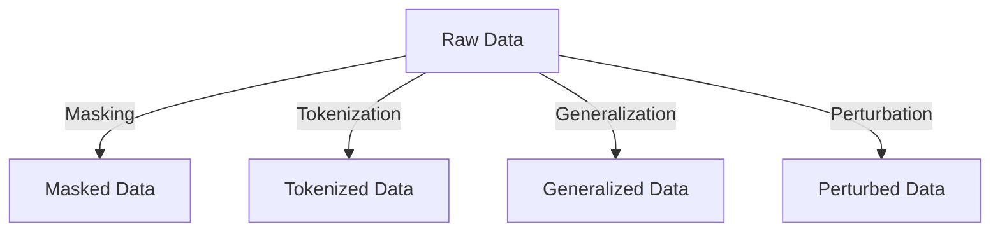

## 12.4.1 Data Privacy and Anonymization Techniques

In the era of big data and real-time processing, ensuring data privacy is paramount. Apache Kafka, a leading platform for building real-time data pipelines and streaming applications, is often at the heart of data-driven architectures. This section delves into the techniques for anonymizing and pseudonymizing data streams within Kafka, ensuring compliance with privacy laws and ethical standards while maintaining data utility.

### Understanding Data Privacy in Kafka

Data privacy involves protecting personal information from unauthorized access and ensuring that individuals' data is used ethically and legally. In Kafka, data privacy is crucial as it often handles sensitive information across distributed systems. The primary methods for achieving data privacy are anonymization and pseudonymization.

#### Anonymization vs. Pseudonymization

- **Anonymization**: This process involves removing personally identifiable information (PII) from data sets, making it impossible to identify individuals. Once data is anonymized, it cannot be reversed to identify the original data subjects.

- **Pseudonymization**: This technique replaces private identifiers with fake identifiers or pseudonyms. Unlike anonymization, pseudonymization allows data to be re-identified with additional information, which is kept separately and securely.

### Techniques for Data Anonymization and Pseudonymization

#### 1. Data Masking

Data masking involves hiding original data with modified content. It is commonly used to protect sensitive data in non-production environments.

- **Static Data Masking**: This technique permanently masks data in a database or data set.
- **Dynamic Data Masking**: This masks data in real-time as it is accessed by unauthorized users.

**Example in Kafka Streams**:

```java
import org.apache.kafka.streams.KafkaStreams;
import org.apache.kafka.streams.StreamsBuilder;
import org.apache.kafka.streams.kstream.KStream;

public class DataMaskingExample {
    public static void main(String[] args) {
        StreamsBuilder builder = new StreamsBuilder();
        KStream<String, String> sourceStream = builder.stream("input-topic");

        KStream<String, String> maskedStream = sourceStream.mapValues(value -> {
            // Mask sensitive data, e.g., replace digits with '*'
            return value.replaceAll("\\d", "*");
        });

        maskedStream.to("output-topic");

        KafkaStreams streams = new KafkaStreams(builder.build(), new Properties());
        streams.start();
    }
}
```

#### 2. Tokenization

Tokenization replaces sensitive data with unique identification symbols (tokens) that retain essential information without compromising security.

- **Use Case**: Tokenization is ideal for credit card numbers and other financial data.

**Example in Kafka Streams**:

```scala
import org.apache.kafka.streams.scala._
import org.apache.kafka.streams.scala.kstream._

object TokenizationExample extends App {
  val builder = new StreamsBuilder()
  val sourceStream: KStream[String, String] = builder.stream[String, String]("input-topic")

  val tokenizedStream: KStream[String, String] = sourceStream.mapValues(value => {
    // Replace sensitive data with tokens
    tokenize(value)
  })

  tokenizedStream.to("output-topic")

  val streams = new KafkaStreams(builder.build(), new Properties())
  streams.start()

  def tokenize(data: String): String = {
    // Implement tokenization logic
    data.replaceAll("\\d", "X")
  }
}
```

#### 3. Generalization

Generalization reduces the precision of data to make it less identifiable. For example, replacing exact ages with age ranges.

- **Use Case**: Useful in healthcare data to protect patient identities.

**Example in Kafka Streams**:

```kotlin
import org.apache.kafka.streams.KafkaStreams
import org.apache.kafka.streams.StreamsBuilder
import org.apache.kafka.streams.kstream.KStream

fun main() {
    val builder = StreamsBuilder()
    val sourceStream: KStream<String, String> = builder.stream("input-topic")

    val generalizedStream: KStream<String, String> = sourceStream.mapValues { value ->
        // Generalize data, e.g., convert age to age range
        generalize(value)
    }

    generalizedStream.to("output-topic")

    val streams = KafkaStreams(builder.build(), Properties())
    streams.start()
}

fun generalize(data: String): String {
    // Implement generalization logic
    return data.replace(Regex("\\d+"), "20-30")
}
```

#### 4. Data Perturbation

Data perturbation involves adding noise to data to prevent exact identification. This technique is often used in statistical databases.

- **Use Case**: Suitable for anonymizing salary data in employee records.

**Example in Kafka Streams**:

```clojure
(ns kafka-streams-example
  (:require [org.apache.kafka.streams :as ks]))

(defn perturb [data]
  ;; Add noise to the data
  (str (Integer/parseInt data) (+ (rand-int 5) -2)))

(defn -main []
  (let [builder (ks/StreamsBuilder.)
        source-stream (.stream builder "input-topic")]

    (-> source-stream
        (.mapValues perturb)
        (.to "output-topic"))

    (let [streams (ks/KafkaStreams. (.build builder) (java.util.Properties.))]
      (.start streams))))
```

### Trade-offs Between Utility and Privacy

When implementing data privacy techniques, there is often a trade-off between data utility and privacy:

- **Utility**: The usefulness of data for analysis and decision-making.
- **Privacy**: The degree to which data is protected from re-identification.

Balancing these two aspects is crucial. Over-anonymization can render data useless, while under-anonymization can lead to privacy breaches.

### Considerations for Re-identification Risks

Re-identification occurs when anonymized data is matched with external data to identify individuals. To mitigate this risk:

- **Assess Data Sensitivity**: Evaluate the sensitivity of the data being processed.
- **Implement Access Controls**: Restrict access to sensitive data.
- **Regular Audits**: Conduct regular audits to ensure compliance with privacy standards.
- **Use Advanced Techniques**: Employ differential privacy and k-anonymity to enhance data protection.

### Practical Applications and Real-World Scenarios

1. **Healthcare**: Anonymizing patient data for research while complying with HIPAA regulations.
2. **Finance**: Tokenizing credit card information to prevent fraud.
3. **Retail**: Generalizing customer data to analyze purchasing trends without compromising privacy.

### Visualizing Data Privacy Techniques



*Caption*: This diagram illustrates the flow of raw data through various privacy techniques, resulting in anonymized or pseudonymized data.

### Conclusion

Implementing data privacy and anonymization techniques in Apache Kafka is essential for protecting individual privacy and ensuring compliance with legal and ethical standards. By understanding and applying these techniques, organizations can safeguard sensitive information while maintaining the utility of their data streams.

## Test Your Knowledge: Data Privacy and Anonymization Techniques Quiz



### What is the primary goal of data anonymization?

- [x] To remove personally identifiable information from data sets.
- [ ] To replace identifiers with pseudonyms.
- [ ] To encrypt data for secure storage.
- [ ] To compress data for efficient transmission.

> **Explanation:** Data anonymization aims to remove personally identifiable information, making it impossible to identify individuals.

### Which technique involves replacing sensitive data with unique identification symbols?

- [ ] Data Masking
- [x] Tokenization
- [ ] Generalization
- [ ] Perturbation

> **Explanation:** Tokenization replaces sensitive data with unique identification symbols (tokens).

### What is a potential risk of pseudonymization?

- [x] Re-identification with additional information.
- [ ] Data loss during processing.
- [ ] Increased data size.
- [ ] Reduced data accuracy.

> **Explanation:** Pseudonymization allows data to be re-identified with additional information, posing a re-identification risk.

### Which technique is suitable for anonymizing salary data?

- [ ] Data Masking
- [ ] Tokenization
- [ ] Generalization
- [x] Perturbation

> **Explanation:** Data perturbation is suitable for anonymizing salary data by adding noise to prevent exact identification.

### What is the trade-off when implementing data privacy techniques?

- [x] Utility vs. Privacy
- [ ] Speed vs. Accuracy
- [ ] Cost vs. Performance
- [ ] Complexity vs. Simplicity

> **Explanation:** The trade-off is between data utility and privacy, balancing usefulness and protection.

### Which technique is often used in healthcare to protect patient identities?

- [ ] Data Masking
- [ ] Tokenization
- [x] Generalization
- [ ] Perturbation

> **Explanation:** Generalization is used in healthcare to protect patient identities by reducing data precision.

### What is the purpose of dynamic data masking?

- [x] To mask data in real-time as it is accessed.
- [ ] To permanently mask data in a database.
- [ ] To encrypt data for secure storage.
- [ ] To compress data for efficient transmission.

> **Explanation:** Dynamic data masking masks data in real-time as it is accessed by unauthorized users.

### Which privacy technique involves adding noise to data?

- [ ] Data Masking
- [ ] Tokenization
- [ ] Generalization
- [x] Perturbation

> **Explanation:** Data perturbation involves adding noise to data to prevent exact identification.

### What is a key consideration when using anonymization techniques?

- [x] Re-identification risks
- [ ] Data compression
- [ ] Encryption strength
- [ ] Data redundancy

> **Explanation:** Re-identification risks must be considered when using anonymization techniques to ensure data privacy.

### True or False: Anonymized data can be easily re-identified.

- [ ] True
- [x] False

> **Explanation:** Anonymized data is designed to prevent re-identification, making it impossible to identify individuals.



By mastering these techniques, you can ensure that your Kafka-based systems are not only efficient but also compliant with the highest standards of data privacy and security.

---
