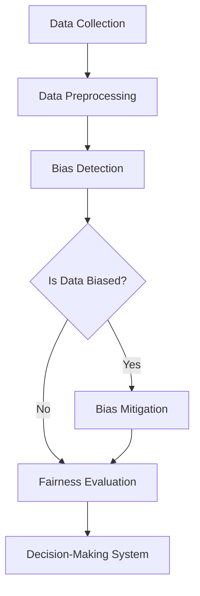

## 12.4.2 Bias and Fairness in Data Streams

In the era of big data and real-time analytics, Apache Kafka has emerged as a pivotal technology for processing streaming data. However, as organizations increasingly rely on data-driven decision-making, the ethical implications of bias in data streams have become a critical concern. This section delves into the nature of bias, its sources, and its impact on decision-making systems. We will explore strategies for detecting and mitigating bias, and discuss fairness metrics and evaluation methods to ensure ethical and responsible data processing.

### Understanding Bias in Data Streams

#### Defining Bias

Bias in data streams refers to systematic errors or prejudices in data collection, processing, or interpretation that lead to unfair or inaccurate outcomes. Bias can manifest in various forms, including:

- **Selection Bias**: Occurs when the data collected is not representative of the population intended to be analyzed.
- **Measurement Bias**: Arises from inaccuracies in data collection methods or tools.
- **Algorithmic Bias**: Results from the design or implementation of algorithms that produce biased outcomes.

#### Sources of Bias

Bias can originate from multiple sources within the data pipeline:

1. **Data Collection**: Incomplete or non-representative data can introduce selection bias. For instance, if a streaming application only collects data from a specific demographic, the resulting insights may not be applicable to a broader audience.

2. **Data Preprocessing**: Decisions made during data cleaning and transformation can inadvertently introduce bias. For example, removing outliers without understanding their context may skew results.

3. **Algorithm Design**: Algorithms trained on biased data can perpetuate and even amplify existing biases. This is particularly concerning in machine learning models that rely on historical data.

4. **Feedback Loops**: In streaming systems, feedback loops can reinforce bias. For example, a recommendation system that favors popular items may continue to promote them, ignoring less popular but potentially relevant options.

### Impacts of Biased Data on Decision-Making Systems

Biased data can have far-reaching consequences on decision-making systems, leading to:

- **Unfair Treatment**: Biased algorithms can result in unfair treatment of individuals or groups, particularly in sensitive areas like hiring, lending, and law enforcement.
- **Loss of Trust**: Stakeholders may lose trust in systems perceived as biased, affecting user engagement and brand reputation.
- **Regulatory Risks**: Organizations may face legal and regulatory challenges if their systems are found to be biased, particularly in jurisdictions with strict data protection laws.

### Strategies for Detecting and Mitigating Bias

#### Bias Detection Techniques

1. **Data Auditing**: Regularly audit data streams to identify potential sources of bias. This involves examining data collection methods, preprocessing steps, and algorithmic outputs.

2. **Fairness Metrics**: Utilize fairness metrics to evaluate the impact of bias. Common metrics include demographic parity, equalized odds, and disparate impact.

3. **Algorithmic Transparency**: Implement transparency measures to understand how algorithms make decisions. This includes logging decision-making processes and providing explanations for outcomes.

#### Bias Mitigation Strategies

1. **Diverse Data Collection**: Ensure data streams are representative of the population by collecting data from diverse sources and demographics.

2. **Preprocessing Adjustments**: Apply techniques such as reweighting, resampling, or data augmentation to address imbalances in the data.

3. **Algorithmic Fairness**: Design algorithms with fairness constraints to ensure equitable outcomes. This may involve modifying objective functions or incorporating fairness-aware learning techniques.

4. **Continuous Monitoring**: Implement continuous monitoring of data streams and algorithmic outputs to detect and address bias in real-time.

### Fairness Metrics and Evaluation Methods

#### Common Fairness Metrics

1. **Demographic Parity**: Ensures that the decision rate is the same across different demographic groups.

2. **Equalized Odds**: Requires that the true positive rate and false positive rate are equal across groups.

3. **Disparate Impact**: Measures the ratio of favorable outcomes between groups, ensuring no group is disproportionately affected.

#### Evaluation Methods

1. **Cross-Validation**: Use cross-validation techniques to assess the fairness of models across different subsets of data.

2. **A/B Testing**: Conduct A/B tests to compare the performance and fairness of different models or algorithms.

3. **Simulation**: Simulate various scenarios to evaluate how models perform under different conditions and identify potential biases.

### Practical Applications and Real-World Scenarios

#### Case Study: Fairness in Credit Scoring

Consider a financial institution using Kafka to process streaming data for credit scoring. Bias in the data could lead to unfair lending practices. By implementing fairness metrics and bias mitigation strategies, the institution can ensure equitable credit decisions.

#### Example: Real-Time Monitoring in Healthcare

In healthcare, real-time monitoring systems powered by Kafka can inadvertently introduce bias if data streams are not representative of diverse patient populations. By auditing data streams and applying fairness-aware algorithms, healthcare providers can deliver more equitable care.

### Code Examples

To illustrate bias detection and mitigation, let's explore code examples in Java, Scala, Kotlin, and Clojure.

#### Java Example

```java
import org.apache.kafka.clients.consumer.ConsumerRecord;
import org.apache.kafka.clients.consumer.KafkaConsumer;
import org.apache.kafka.clients.producer.KafkaProducer;
import org.apache.kafka.clients.producer.ProducerRecord;

import java.util.Properties;

public class BiasDetection {
    public static void main(String[] args) {
        Properties props = new Properties();
        props.put("bootstrap.servers", "localhost:9092");
        props.put("key.deserializer", "org.apache.kafka.common.serialization.StringDeserializer");
        props.put("value.deserializer", "org.apache.kafka.common.serialization.StringDeserializer");
        props.put("group.id", "bias-detection-group");

        KafkaConsumer<String, String> consumer = new KafkaConsumer<>(props);
        consumer.subscribe(List.of("input-topic"));

        while (true) {
            for (ConsumerRecord<String, String> record : consumer.poll(Duration.ofMillis(100))) {
                // Detect bias in the data
                if (isBiased(record.value())) {
                    // Handle biased data
                    System.out.println("Biased data detected: " + record.value());
                }
            }
        }
    }

    private static boolean isBiased(String data) {
        // Implement bias detection logic
        return data.contains("unfair");
    }
}
```

#### Scala Example

```scala
import org.apache.kafka.clients.consumer.KafkaConsumer
import java.util.Properties
import scala.collection.JavaConverters._

object BiasDetection {
  def main(args: Array[String]): Unit = {
    val props = new Properties()
    props.put("bootstrap.servers", "localhost:9092")
    props.put("key.deserializer", "org.apache.kafka.common.serialization.StringDeserializer")
    props.put("value.deserializer", "org.apache.kafka.common.serialization.StringDeserializer")
    props.put("group.id", "bias-detection-group")

    val consumer = new KafkaConsumer[String, String](props)
    consumer.subscribe(List("input-topic").asJava)

    while (true) {
      val records = consumer.poll(java.time.Duration.ofMillis(100)).asScala
      for (record <- records) {
        if (isBiased(record.value())) {
          println(s"Biased data detected: ${record.value()}")
        }
      }
    }
  }

  def isBiased(data: String): Boolean = {
    // Implement bias detection logic
    data.contains("unfair")
  }
}
```

#### Kotlin Example

```kotlin
import org.apache.kafka.clients.consumer.KafkaConsumer
import java.time.Duration
import java.util.*

fun main() {
    val props = Properties()
    props["bootstrap.servers"] = "localhost:9092"
    props["key.deserializer"] = "org.apache.kafka.common.serialization.StringDeserializer"
    props["value.deserializer"] = "org.apache.kafka.common.serialization.StringDeserializer"
    props["group.id"] = "bias-detection-group"

    val consumer = KafkaConsumer<String, String>(props)
    consumer.subscribe(listOf("input-topic"))

    while (true) {
        val records = consumer.poll(Duration.ofMillis(100))
        for (record in records) {
            if (isBiased(record.value())) {
                println("Biased data detected: ${record.value()}")
            }
        }
    }
}

fun isBiased(data: String): Boolean {
    // Implement bias detection logic
    return data.contains("unfair")
}
```

#### Clojure Example

```clojure
(ns bias-detection
  (:import [org.apache.kafka.clients.consumer KafkaConsumer]
           [java.util Properties]))

(defn is-biased [data]
  ;; Implement bias detection logic
  (.contains data "unfair"))

(defn -main []
  (let [props (doto (Properties.)
                (.put "bootstrap.servers" "localhost:9092")
                (.put "key.deserializer" "org.apache.kafka.common.serialization.StringDeserializer")
                (.put "value.deserializer" "org.apache.kafka.common.serialization.StringDeserializer")
                (.put "group.id" "bias-detection-group"))
        consumer (KafkaConsumer. props)]
    (.subscribe consumer ["input-topic"])
    (while true
      (let [records (.poll consumer (java.time.Duration/ofMillis 100))]
        (doseq [record records]
          (when (is-biased (.value record))
            (println "Biased data detected:" (.value record))))))))
```

### Visualizing Bias Detection and Mitigation

To better understand the process of bias detection and mitigation in data streams, consider the following diagram:



**Caption**: This diagram illustrates the flow of data from collection through preprocessing, bias detection, mitigation, and fairness evaluation before being used in decision-making systems.

### Conclusion

Ensuring bias and fairness in data streams is crucial for ethical and responsible data processing. By understanding the sources and impacts of bias, implementing detection and mitigation strategies, and utilizing fairness metrics, organizations can build more equitable systems. As Apache Kafka continues to play a central role in real-time data processing, addressing bias and fairness will remain a key consideration for developers and architects.

## Test Your Knowledge: Bias and Fairness in Data Streams Quiz



### What is a common source of bias in data streams?

- [x] Selection bias
- [ ] Data encryption
- [ ] Network latency
- [ ] Data compression

> **Explanation:** Selection bias occurs when the data collected is not representative of the intended population, leading to skewed results.

### Which fairness metric ensures that decision rates are the same across different demographic groups?

- [x] Demographic parity
- [ ] Equalized odds
- [ ] Disparate impact
- [ ] Precision

> **Explanation:** Demographic parity ensures that the decision rate is consistent across different groups, promoting fairness.

### What is a key strategy for mitigating bias in data streams?

- [x] Diverse data collection
- [ ] Data encryption
- [ ] Increasing data volume
- [ ] Reducing data latency

> **Explanation:** Collecting data from diverse sources helps ensure that the data is representative and reduces the risk of bias.

### How can feedback loops contribute to bias in streaming systems?

- [x] By reinforcing existing biases
- [ ] By reducing data volume
- [ ] By improving data accuracy
- [ ] By enhancing data security

> **Explanation:** Feedback loops can reinforce existing biases by continuously promoting certain outcomes, leading to skewed results.

### Which method involves modifying algorithms to ensure equitable outcomes?

- [x] Algorithmic fairness
- [ ] Data encryption
- [ ] Data compression
- [ ] Network optimization

> **Explanation:** Algorithmic fairness involves designing algorithms with fairness constraints to ensure equitable outcomes.

### What is the purpose of using fairness metrics in data streams?

- [x] To evaluate the impact of bias
- [ ] To increase data volume
- [ ] To reduce network latency
- [ ] To enhance data security

> **Explanation:** Fairness metrics are used to evaluate the impact of bias and ensure that systems are fair and equitable.

### Which of the following is a bias detection technique?

- [x] Data auditing
- [ ] Data encryption
- [ ] Network optimization
- [ ] Data compression

> **Explanation:** Data auditing involves examining data collection methods and preprocessing steps to identify potential sources of bias.

### What is the impact of biased data on decision-making systems?

- [x] Unfair treatment
- [ ] Increased data volume
- [ ] Reduced network latency
- [ ] Enhanced data security

> **Explanation:** Biased data can lead to unfair treatment of individuals or groups, particularly in sensitive areas like hiring and lending.

### Which programming language is NOT used in the provided code examples?

- [x] Python
- [ ] Java
- [ ] Scala
- [ ] Kotlin

> **Explanation:** The code examples provided are in Java, Scala, Kotlin, and Clojure, but not Python.

### True or False: Continuous monitoring is essential for detecting and addressing bias in real-time.

- [x] True
- [ ] False

> **Explanation:** Continuous monitoring is crucial for detecting and addressing bias in real-time, ensuring that systems remain fair and equitable.


