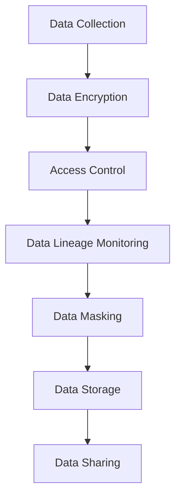

## 12.4.4 Legal Implications and Data Ownership

In the realm of Apache Kafka and real-time data processing, understanding the legal implications and data ownership is crucial for expert software engineers and enterprise architects. This section delves into the complexities of data ownership, custodianship, and the legal frameworks that govern data use, providing insights into how these considerations impact the deployment and management of Kafka systems.

### Understanding Data Ownership and Custodianship

**Data Ownership** refers to the legal rights and complete control over a dataset. The owner of the data has the authority to determine how data is used, shared, and managed. In contrast, **Data Custodianship** involves the responsibility of managing and safeguarding data on behalf of the owner. Custodians may not have ownership rights but are tasked with ensuring data integrity, security, and compliance with relevant regulations.

#### Key Concepts

- **Ownership Rights**: The legal entitlements that allow an entity to control data usage, distribution, and modification.
- **Custodianship Responsibilities**: The duties of managing data securely and ensuring compliance with legal and organizational policies.
- **Data Stewardship**: Often used interchangeably with custodianship, emphasizing the ethical and responsible management of data.

### Legal Frameworks Governing Data Use

Data use is governed by a myriad of legal frameworks that vary by jurisdiction. These frameworks establish the rules for data collection, processing, storage, and sharing. Understanding these laws is essential for ensuring compliance and mitigating legal risks.

#### Major Legal Frameworks

1. **General Data Protection Regulation (GDPR)**: A comprehensive data protection law in the European Union that emphasizes user consent, data protection by design, and the right to be forgotten.
2. **California Consumer Privacy Act (CCPA)**: A state statute intended to enhance privacy rights and consumer protection for residents of California, USA.
3. **Health Insurance Portability and Accountability Act (HIPAA)**: A US law designed to provide privacy standards to protect patients' medical records and other health information.
4. **Personal Data Protection Act (PDPA)**: A data protection law in Singapore that governs the collection, use, and disclosure of personal data.

These frameworks require organizations to implement robust data governance policies and practices, ensuring that data processing activities are transparent, secure, and compliant.

### Contractual Considerations in Data Processing

Contracts play a pivotal role in defining data ownership and responsibilities in data processing agreements. They outline the terms under which data is shared, processed, and stored, and they establish the legal obligations of each party involved.

#### Key Contractual Elements

- **Data Processing Agreements (DPAs)**: Contracts that specify the terms of data processing, including the scope, purpose, and duration of data use.
- **Service Level Agreements (SLAs)**: Define the expected service standards and performance metrics for data processing services.
- **Confidentiality Clauses**: Ensure that sensitive data is protected from unauthorized access and disclosure.
- **Indemnity Clauses**: Allocate liability and protect parties from legal claims arising from data breaches or misuse.

### Importance of Legal Counsel in Data Handling Policies

Given the complexity of data laws and the potential for significant legal liabilities, engaging legal counsel is crucial for organizations handling data. Legal experts can provide guidance on compliance, risk management, and the development of data handling policies that align with legal requirements and industry best practices.

#### Benefits of Legal Counsel

- **Risk Mitigation**: Identifying and addressing potential legal risks associated with data processing activities.
- **Policy Development**: Crafting comprehensive data governance policies that comply with applicable laws and regulations.
- **Dispute Resolution**: Navigating legal disputes and ensuring favorable outcomes in cases of data breaches or non-compliance.

### Practical Applications and Real-World Scenarios

To illustrate the legal implications and data ownership considerations in Apache Kafka systems, consider the following scenarios:

#### Scenario 1: Cross-Border Data Transfers

An organization using Kafka for real-time data processing must transfer data across international borders. Legal counsel can help navigate the complexities of cross-border data transfers, ensuring compliance with GDPR and other relevant regulations.

#### Scenario 2: Data Breach Response

In the event of a data breach, an organization must respond swiftly to mitigate damage and comply with legal obligations. Legal counsel can assist in developing a breach response plan, ensuring that notification requirements and other legal obligations are met.

#### Scenario 3: Vendor Management

When engaging third-party vendors for data processing services, organizations must ensure that contracts adequately address data ownership and liability issues. Legal counsel can review and negotiate contracts to protect the organization's interests.

### Code Examples: Implementing Data Governance in Kafka

While legal considerations are primarily policy-driven, technical implementations can support compliance efforts. Below are code examples in Java, Scala, Kotlin, and Clojure that demonstrate how to implement data governance features in Kafka.

#### Java Example: Implementing Data Encryption

```java
import org.apache.kafka.clients.producer.KafkaProducer;
import org.apache.kafka.clients.producer.ProducerConfig;
import org.apache.kafka.common.serialization.StringSerializer;

import java.util.Properties;

public class SecureKafkaProducer {
    public static void main(String[] args) {
        Properties props = new Properties();
        props.put(ProducerConfig.BOOTSTRAP_SERVERS_CONFIG, "localhost:9092");
        props.put(ProducerConfig.KEY_SERIALIZER_CLASS_CONFIG, StringSerializer.class.getName());
        props.put(ProducerConfig.VALUE_SERIALIZER_CLASS_CONFIG, StringSerializer.class.getName());
        props.put("security.protocol", "SSL");
        props.put("ssl.truststore.location", "/path/to/truststore.jks");
        props.put("ssl.truststore.password", "password");

        KafkaProducer<String, String> producer = new KafkaProducer<>(props);
        // Produce messages securely
    }
}
```

#### Scala Example: Configuring Access Control

```scala
import org.apache.kafka.clients.admin.{AdminClient, AdminClientConfig}
import java.util.Properties

object KafkaAccessControl {
  def main(args: Array[String]): Unit = {
    val props = new Properties()
    props.put(AdminClientConfig.BOOTSTRAP_SERVERS_CONFIG, "localhost:9092")
    val adminClient = AdminClient.create(props)

    // Configure ACLs for topics
    // Example: Grant read access to a specific user
  }
}
```

#### Kotlin Example: Monitoring Data Lineage

```kotlin
import org.apache.kafka.clients.consumer.KafkaConsumer
import java.util.Properties

fun main() {
    val props = Properties()
    props["bootstrap.servers"] = "localhost:9092"
    props["group.id"] = "data-lineage-group"
    props["key.deserializer"] = "org.apache.kafka.common.serialization.StringDeserializer"
    props["value.deserializer"] = "org.apache.kafka.common.serialization.StringDeserializer"

    val consumer = KafkaConsumer<String, String>(props)
    consumer.subscribe(listOf("data-lineage-topic"))

    // Monitor and log data lineage
}
```

#### Clojure Example: Implementing Data Masking

```clojure
(ns kafka.data-masking
  (:require [clojure.java.io :as io])
  (:import [org.apache.kafka.clients.consumer KafkaConsumer]
           [org.apache.kafka.common.serialization StringDeserializer]))

(defn create-consumer []
  (let [props (doto (java.util.Properties.)
                (.put "bootstrap.servers" "localhost:9092")
                (.put "group.id" "data-masking-group")
                (.put "key.deserializer" StringDeserializer)
                (.put "value.deserializer" StringDeserializer))]
    (KafkaConsumer. props)))

(defn mask-sensitive-data [record]
  ;; Implement data masking logic
  )

(defn consume-messages []
  (let [consumer (create-consumer)]
    (.subscribe consumer ["sensitive-data-topic"])
    ;; Consume and process messages with data masking
    ))
```

### Visualizing Data Governance in Kafka

To enhance understanding, consider the following diagram illustrating the data governance process in a Kafka system:



**Caption**: This diagram represents the flow of data governance processes in a Kafka system, highlighting key steps such as encryption, access control, and data masking.

### References and Further Reading

- [Apache Kafka Documentation](https://kafka.apache.org/documentation/)
- [Confluent Documentation](https://docs.confluent.io/)
- [General Data Protection Regulation (GDPR)](https://gdpr-info.eu/)
- [California Consumer Privacy Act (CCPA)](https://oag.ca.gov/privacy/ccpa)
- [Health Insurance Portability and Accountability Act (HIPAA)](https://www.hhs.gov/hipaa/index.html)

### Knowledge Check

To reinforce your understanding of legal implications and data ownership in Kafka systems, consider the following questions:

## Test Your Knowledge: Legal Implications and Data Ownership in Kafka



### What is the primary role of a data custodian in a Kafka system?

- [x] Managing and safeguarding data on behalf of the owner
- [ ] Owning the data and making all decisions regarding its use
- [ ] Selling data to third parties
- [ ] Encrypting data for security purposes

> **Explanation:** A data custodian is responsible for managing and safeguarding data on behalf of the owner, ensuring compliance with legal and organizational policies.

### Which legal framework emphasizes the right to be forgotten?

- [x] General Data Protection Regulation (GDPR)
- [ ] California Consumer Privacy Act (CCPA)
- [ ] Health Insurance Portability and Accountability Act (HIPAA)
- [ ] Personal Data Protection Act (PDPA)

> **Explanation:** The GDPR emphasizes the right to be forgotten, allowing individuals to request the deletion of their personal data.

### What is a key element of a Data Processing Agreement (DPA)?

- [x] Terms of data processing, including scope and purpose
- [ ] Marketing strategies for data products
- [ ] Financial compensation for data breaches
- [ ] Encryption algorithms used for data security

> **Explanation:** A DPA specifies the terms of data processing, including the scope, purpose, and duration of data use.

### Why is legal counsel important in data handling policies?

- [x] To ensure compliance with legal requirements and mitigate risks
- [ ] To increase data processing speed
- [ ] To develop marketing strategies
- [ ] To encrypt data

> **Explanation:** Legal counsel is crucial for ensuring compliance with legal requirements, mitigating risks, and developing comprehensive data handling policies.

### What is the purpose of a confidentiality clause in a data processing contract?

- [x] To protect sensitive data from unauthorized access and disclosure
- [ ] To increase data processing speed
- [ ] To define data ownership rights
- [ ] To specify encryption algorithms

> **Explanation:** A confidentiality clause ensures that sensitive data is protected from unauthorized access and disclosure.

### How can legal counsel assist in cross-border data transfers?

- [x] By navigating the complexities of international data transfer regulations
- [ ] By increasing data processing speed
- [ ] By developing marketing strategies
- [ ] By encrypting data

> **Explanation:** Legal counsel can help navigate the complexities of cross-border data transfers, ensuring compliance with relevant regulations.

### What is a common challenge in vendor management for data processing?

- [x] Ensuring contracts adequately address data ownership and liability issues
- [ ] Increasing data processing speed
- [ ] Developing marketing strategies
- [ ] Encrypting data

> **Explanation:** A common challenge in vendor management is ensuring that contracts adequately address data ownership and liability issues.

### Which of the following is a responsibility of a data steward?

- [x] Ensuring data integrity and compliance with regulations
- [ ] Owning the data and making all decisions regarding its use
- [ ] Selling data to third parties
- [ ] Encrypting data for security purposes

> **Explanation:** A data steward is responsible for ensuring data integrity and compliance with regulations.

### What is the role of indemnity clauses in data processing agreements?

- [x] To allocate liability and protect parties from legal claims
- [ ] To increase data processing speed
- [ ] To develop marketing strategies
- [ ] To encrypt data

> **Explanation:** Indemnity clauses allocate liability and protect parties from legal claims arising from data breaches or misuse.

### True or False: Data custodians have ownership rights over the data they manage.

- [ ] True
- [x] False

> **Explanation:** Data custodians do not have ownership rights; they are responsible for managing and safeguarding data on behalf of the owner.



By understanding the legal implications and data ownership considerations in Apache Kafka systems, organizations can ensure compliance, protect their interests, and effectively manage data in real-time processing environments.
