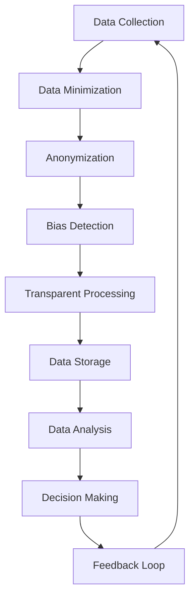

## 12.4 Ethical Considerations and Responsible Data Processing

### Introduction

In the era of big data and real-time processing, Apache Kafka has emerged as a pivotal technology for managing and processing data streams. However, with great power comes great responsibility. As Kafka enables the rapid processing and dissemination of data, it is imperative to consider the ethical implications of its use. This section delves into the ethical dimensions of data processing in Kafka applications, emphasizing responsible handling of data, privacy considerations, and the potential societal impact of real-time decision-making systems.

### The Importance of Ethics in Data Processing

Ethics in data processing is not merely a compliance checkbox but a fundamental aspect of building trust and ensuring the long-term sustainability of technological solutions. Ethical data practices involve adhering to principles such as fairness, accountability, and transparency, which are crucial in maintaining public trust and avoiding harm.

#### Fairness

Fairness in data processing ensures that systems do not perpetuate or exacerbate existing biases. This involves careful consideration of the data sources, algorithms, and decision-making processes to prevent discrimination against individuals or groups.

#### Accountability

Accountability involves establishing clear responsibilities and processes for data handling and decision-making. It ensures that there are mechanisms in place to address any issues or harms that arise from data processing activities.

#### Transparency

Transparency is about making data processing activities understandable and accessible to stakeholders. This includes clear communication about what data is collected, how it is used, and the decisions made based on it.

### Potential Risks and Unintended Consequences

While Kafka offers powerful capabilities for data processing, it also presents potential risks and unintended consequences that must be managed responsibly.

#### Privacy Violations

Real-time data processing can lead to privacy violations if sensitive information is not adequately protected. This includes unauthorized access to personal data and the potential for data breaches.

#### Bias and Discrimination

Algorithms and data processing systems can inadvertently perpetuate biases present in the data. This can lead to discriminatory outcomes, particularly if the data used for training models is not representative of the broader population.

#### Lack of Accountability

Without proper governance and accountability mechanisms, it can be challenging to trace decisions back to their source, making it difficult to address any issues that arise.

#### Societal Impact

Real-time decision-making systems can have significant societal impacts, influencing everything from individual privacy to public safety. It is crucial to consider these broader implications when designing and deploying Kafka-based systems.

### Implementing Ethical Data Practices

To mitigate these risks and ensure responsible data processing, organizations should implement ethical data practices. This involves a combination of technical, organizational, and cultural measures.

#### Data Minimization

Data minimization involves collecting only the data necessary for a specific purpose and retaining it only for as long as needed. This reduces the risk of privacy violations and data breaches.

#### Anonymization and Pseudonymization

Anonymization and pseudonymization techniques can help protect individual privacy by removing or obscuring personally identifiable information (PII) from data sets.

#### Bias Detection and Mitigation

Organizations should implement processes to detect and mitigate bias in data processing systems. This includes regular audits of data sets and algorithms to identify and address potential sources of bias.

#### Transparency and Communication

Clear communication about data processing activities is essential for building trust with stakeholders. This includes providing accessible information about what data is collected, how it is used, and the decisions made based on it.

#### Governance and Accountability

Establishing robust governance and accountability mechanisms is crucial for ensuring responsible data processing. This includes defining clear roles and responsibilities, as well as processes for addressing any issues that arise.

### Practical Applications and Real-World Scenarios

To illustrate these concepts, let's explore some practical applications and real-world scenarios where ethical considerations play a crucial role in Kafka-based systems.

#### Healthcare Data Processing

In healthcare, real-time data processing can improve patient outcomes by enabling timely interventions. However, it also raises significant privacy concerns. Implementing ethical data practices, such as data minimization and anonymization, is crucial to protect patient privacy while leveraging the benefits of real-time data processing.

#### Financial Services

In the financial sector, Kafka is often used for fraud detection and risk management. Ensuring fairness and accountability in these systems is essential to prevent discrimination and ensure that decisions are traceable and justifiable.

#### Smart Cities

Smart cities rely on real-time data processing to optimize urban infrastructure and services. However, this can raise privacy and surveillance concerns. Implementing transparency and governance measures can help address these issues and ensure that smart city initiatives are ethical and responsible.

### Code Examples

To demonstrate how ethical considerations can be integrated into Kafka applications, let's explore some code examples in Java, Scala, Kotlin, and Clojure.

#### Java Example: Anonymizing Data

```java
import org.apache.kafka.clients.producer.KafkaProducer;
import org.apache.kafka.clients.producer.ProducerRecord;
import java.util.Properties;

public class AnonymizeDataProducer {
    public static void main(String[] args) {
        Properties props = new Properties();
        props.put("bootstrap.servers", "localhost:9092");
        props.put("key.serializer", "org.apache.kafka.common.serialization.StringSerializer");
        props.put("value.serializer", "org.apache.kafka.common.serialization.StringSerializer");

        KafkaProducer<String, String> producer = new KafkaProducer<>(props);

        // Anonymize sensitive data before sending
        String originalData = "Sensitive Information";
        String anonymizedData = anonymize(originalData);

        ProducerRecord<String, String> record = new ProducerRecord<>("anonymized-topic", anonymizedData);
        producer.send(record);

        producer.close();
    }

    private static String anonymize(String data) {
        // Simple anonymization logic
        return data.replaceAll("[a-zA-Z]", "*");
    }
}
```

#### Scala Example: Implementing Data Minimization

```scala
import org.apache.kafka.clients.producer.{KafkaProducer, ProducerRecord}
import java.util.Properties

object DataMinimizationProducer extends App {
  val props = new Properties()
  props.put("bootstrap.servers", "localhost:9092")
  props.put("key.serializer", "org.apache.kafka.common.serialization.StringSerializer")
  props.put("value.serializer", "org.apache.kafka.common.serialization.StringSerializer")

  val producer = new KafkaProducer[String, String](props)

  // Collect only necessary data
  val necessaryData = "Essential Information"
  val record = new ProducerRecord[String, String]("minimal-topic", necessaryData)

  producer.send(record)
  producer.close()
}
```

#### Kotlin Example: Bias Detection

```kotlin
import org.apache.kafka.clients.producer.KafkaProducer
import org.apache.kafka.clients.producer.ProducerRecord
import java.util.Properties

fun main() {
    val props = Properties()
    props["bootstrap.servers"] = "localhost:9092"
    props["key.serializer"] = "org.apache.kafka.common.serialization.StringSerializer"
    props["value.serializer"] = "org.apache.kafka.common.serialization.StringSerializer"

    val producer = KafkaProducer<String, String>(props)

    // Detect and mitigate bias in data
    val data = "Potentially Biased Data"
    if (!isBiased(data)) {
        val record = ProducerRecord("bias-free-topic", data)
        producer.send(record)
    }

    producer.close()
}

fun isBiased(data: String): Boolean {
    // Simple bias detection logic
    return data.contains("bias")
}
```

#### Clojure Example: Ensuring Transparency

```clojure
(ns kafka.transparency
  (:import (org.apache.kafka.clients.producer KafkaProducer ProducerRecord)
           (java.util Properties)))

(defn -main []
  (let [props (doto (Properties.)
                (.put "bootstrap.servers" "localhost:9092")
                (.put "key.serializer" "org.apache.kafka.common.serialization.StringSerializer")
                (.put "value.serializer" "org.apache.kafka.common.serialization.StringSerializer"))
        producer (KafkaProducer. props)]

    ;; Log data processing activities for transparency
    (let [data "Transparent Data"]
      (println "Processing data:" data)
      (.send producer (ProducerRecord. "transparent-topic" data)))

    (.close producer)))
```

### Visualizing Ethical Data Processing

To further illustrate the concepts discussed, let's use a diagram to visualize the flow of ethical data processing in a Kafka-based system.



**Caption**: This diagram illustrates the flow of ethical data processing in a Kafka-based system, highlighting key steps such as data minimization, anonymization, bias detection, and transparent processing.

### References and Links

- [Apache Kafka Documentation](https://kafka.apache.org/documentation/)
- [Confluent Documentation](https://docs.confluent.io/)
- [Data Ethics and Privacy](https://www.dataprivacyandethics.com/)
- [Fairness, Accountability, and Transparency in Machine Learning](https://www.fatml.org/)

### Knowledge Check

To reinforce your understanding of ethical considerations in data processing, consider the following questions and challenges:

1. How can data minimization help reduce privacy risks in Kafka applications?
2. What are some techniques for detecting and mitigating bias in data processing systems?
3. Why is transparency important in real-time data processing, and how can it be achieved?
4. Discuss the potential societal impacts of real-time decision-making systems.
5. How can organizations establish accountability mechanisms for data processing activities?

### Summary

In conclusion, ethical considerations are a crucial aspect of responsible data processing in Apache Kafka applications. By adhering to principles such as fairness, accountability, and transparency, organizations can mitigate risks and ensure that their data processing activities are ethical and responsible. Implementing practices such as data minimization, anonymization, and bias detection can help protect individual privacy and prevent discrimination. As Kafka continues to play a central role in real-time data processing, it is essential to prioritize ethical considerations to build trust and ensure the long-term sustainability of technological solutions.

## Test Your Knowledge: Ethical Data Processing in Apache Kafka



### What is the primary benefit of data minimization in Kafka applications?

- [x] It reduces privacy risks by collecting only necessary data.
- [ ] It increases data processing speed.
- [ ] It enhances data accuracy.
- [ ] It simplifies data storage.

> **Explanation:** Data minimization reduces privacy risks by ensuring that only the necessary data is collected and retained, minimizing the potential for data breaches and unauthorized access.

### Which principle is crucial for ensuring that data processing systems do not perpetuate existing biases?

- [x] Fairness
- [ ] Accountability
- [ ] Transparency
- [ ] Efficiency

> **Explanation:** Fairness is crucial for ensuring that data processing systems do not perpetuate existing biases, as it involves careful consideration of data sources and algorithms to prevent discrimination.

### What is the role of accountability in ethical data processing?

- [x] Establishing clear responsibilities and processes for data handling and decision-making.
- [ ] Increasing data processing speed.
- [ ] Enhancing data accuracy.
- [ ] Simplifying data storage.

> **Explanation:** Accountability involves establishing clear responsibilities and processes for data handling and decision-making, ensuring that there are mechanisms in place to address any issues or harms that arise.

### How can transparency be achieved in real-time data processing?

- [x] By providing clear communication about data collection, usage, and decision-making processes.
- [ ] By increasing data processing speed.
- [ ] By enhancing data accuracy.
- [ ] By simplifying data storage.

> **Explanation:** Transparency can be achieved by providing clear communication about data collection, usage, and decision-making processes, making data processing activities understandable and accessible to stakeholders.

### What is a potential societal impact of real-time decision-making systems?

- [x] Influencing individual privacy and public safety.
- [ ] Increasing data processing speed.
- [ ] Enhancing data accuracy.
- [ ] Simplifying data storage.

> **Explanation:** Real-time decision-making systems can have significant societal impacts, influencing individual privacy and public safety, and it is crucial to consider these broader implications when designing and deploying such systems.

### Which technique can help protect individual privacy by removing personally identifiable information from data sets?

- [x] Anonymization
- [ ] Data minimization
- [ ] Bias detection
- [ ] Transparency

> **Explanation:** Anonymization helps protect individual privacy by removing or obscuring personally identifiable information (PII) from data sets.

### What is the purpose of bias detection in data processing systems?

- [x] To identify and address potential sources of bias in data sets and algorithms.
- [ ] To increase data processing speed.
- [ ] To enhance data accuracy.
- [ ] To simplify data storage.

> **Explanation:** Bias detection aims to identify and address potential sources of bias in data sets and algorithms, ensuring that data processing systems do not perpetuate or exacerbate existing biases.

### How can organizations establish accountability mechanisms for data processing activities?

- [x] By defining clear roles and responsibilities and processes for addressing issues.
- [ ] By increasing data processing speed.
- [ ] By enhancing data accuracy.
- [ ] By simplifying data storage.

> **Explanation:** Organizations can establish accountability mechanisms by defining clear roles and responsibilities and processes for addressing any issues that arise from data processing activities.

### Why is it important to consider ethical considerations in Kafka applications?

- [x] To build trust and ensure the long-term sustainability of technological solutions.
- [ ] To increase data processing speed.
- [ ] To enhance data accuracy.
- [ ] To simplify data storage.

> **Explanation:** Considering ethical considerations in Kafka applications is important to build trust and ensure the long-term sustainability of technological solutions, as it involves adhering to principles such as fairness, accountability, and transparency.

### True or False: Real-time data processing systems can have significant societal impacts.

- [x] True
- [ ] False

> **Explanation:** Real-time data processing systems can have significant societal impacts, influencing everything from individual privacy to public safety, and it is crucial to consider these broader implications when designing and deploying such systems.


