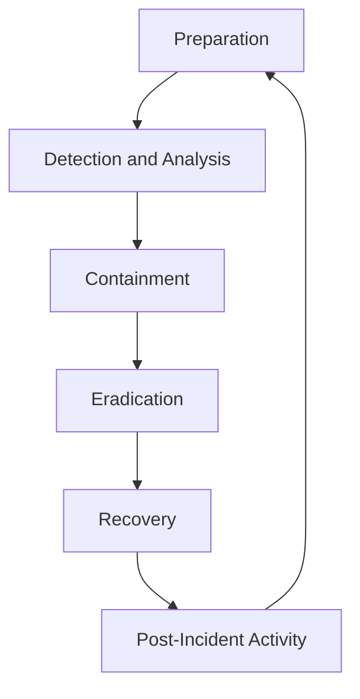

## 12.5.2 Security Incident Response

### Introduction

Security incidents can have significant impacts on the integrity, availability, and confidentiality of data within Apache Kafka environments. As Kafka is often a critical component in real-time data processing and event-driven architectures, a well-defined security incident response plan is essential. This section outlines a comprehensive approach to managing security incidents in Kafka, focusing on detection, containment, eradication, recovery, and lessons learned.

### Structured Incident Response Process

A structured incident response process is crucial for effectively managing security incidents. The process typically involves the following phases:

1. **Preparation**
2. **Detection and Analysis**
3. **Containment, Eradication, and Recovery**
4. **Post-Incident Activity**

#### 1. Preparation

Preparation involves establishing and maintaining an incident response capability. This includes:

- **Developing an Incident Response Plan**: Outline roles, responsibilities, and procedures for handling incidents.
- **Training and Awareness**: Conduct regular training sessions for the incident response team and stakeholders.
- **Tools and Resources**: Ensure the availability of necessary tools and resources, such as monitoring systems, forensic tools, and communication platforms.

#### 2. Detection and Analysis

Detection and analysis involve identifying potential security incidents and analyzing them to determine their scope and impact.

- **Monitoring and Alerts**: Implement continuous monitoring of Kafka clusters using tools like Prometheus and Grafana to detect anomalies.
- **Log Analysis**: Analyze Kafka logs for unusual patterns or unauthorized access attempts.
- **Threat Intelligence**: Use threat intelligence feeds to stay informed about emerging threats relevant to Kafka environments.

#### 3. Containment, Eradication, and Recovery

Once an incident is confirmed, the focus shifts to containing the threat, eradicating the root cause, and recovering affected systems.

- **Containment**: Isolate affected Kafka brokers or components to prevent further damage.
- **Eradication**: Remove malicious artifacts and patch vulnerabilities.
- **Recovery**: Restore Kafka services to normal operation, ensuring data integrity and availability.

#### 4. Post-Incident Activity

Post-incident activities involve reviewing the incident response process and implementing improvements.

- **Lessons Learned**: Conduct a post-mortem analysis to identify strengths and weaknesses in the response.
- **Documentation**: Document the incident and response actions for future reference.
- **Policy Updates**: Update security policies and procedures based on lessons learned.

### Roles and Communication During Incidents

Effective incident response requires clear roles and communication strategies.

- **Incident Response Team (IRT)**: Composed of security analysts, Kafka administrators, and IT staff responsible for managing the incident.
- **Communication Plan**: Establish a communication plan to keep stakeholders informed, including executives, legal teams, and affected users.
- **Coordination with External Parties**: Engage with external parties such as law enforcement or third-party security providers when necessary.

### Specific Considerations for Kafka Environments

Kafka environments have unique characteristics that require specific considerations during incident response.

- **Distributed Architecture**: Kafka's distributed nature can complicate incident detection and containment. Ensure comprehensive monitoring across all nodes.
- **Data Integrity**: Focus on maintaining data integrity during recovery, especially in scenarios involving data tampering or unauthorized access.
- **Replication and Partitioning**: Leverage Kafka's replication and partitioning features to enhance resilience and facilitate recovery.

### Common Security Incidents and Responses

Understanding common security incidents in Kafka environments can aid in developing effective response strategies.

#### Unauthorized Access

- **Detection**: Monitor access logs for unauthorized access attempts.
- **Response**: Implement access controls and review permissions. Consider using [12.2 Authorization and Access Control]( "Authorization and Access Control") mechanisms such as ACLs.

#### Data Exfiltration

- **Detection**: Use anomaly detection to identify unusual data transfer patterns.
- **Response**: Isolate affected components and review data flow configurations.

#### Denial of Service (DoS) Attacks

- **Detection**: Monitor for unusual spikes in traffic or resource usage.
- **Response**: Implement rate limiting and resource quotas to mitigate impact.

### Code Examples

To illustrate the implementation of security measures in Kafka, consider the following code snippets in Java, Scala, Kotlin, and Clojure.

#### Java

```java
import org.apache.kafka.clients.admin.AdminClient;
import org.apache.kafka.clients.admin.NewTopic;
import java.util.Collections;
import java.util.Properties;

public class KafkaSecurityExample {
    public static void main(String[] args) {
        Properties props = new Properties();
        props.put("bootstrap.servers", "localhost:9092");
        props.put("security.protocol", "SSL");
        props.put("ssl.truststore.location", "/path/to/truststore.jks");
        props.put("ssl.truststore.password", "password");

        AdminClient adminClient = AdminClient.create(props);
        NewTopic topic = new NewTopic("secure-topic", 1, (short) 1);
        adminClient.createTopics(Collections.singletonList(topic));
        adminClient.close();
    }
}
```

#### Scala

```scala
import org.apache.kafka.clients.admin.{AdminClient, NewTopic}
import java.util.Properties

object KafkaSecurityExample extends App {
  val props = new Properties()
  props.put("bootstrap.servers", "localhost:9092")
  props.put("security.protocol", "SSL")
  props.put("ssl.truststore.location", "/path/to/truststore.jks")
  props.put("ssl.truststore.password", "password")

  val adminClient = AdminClient.create(props)
  val topic = new NewTopic("secure-topic", 1, 1.toShort)
  adminClient.createTopics(java.util.Collections.singletonList(topic))
  adminClient.close()
}
```

#### Kotlin

```kotlin
import org.apache.kafka.clients.admin.AdminClient
import org.apache.kafka.clients.admin.NewTopic
import java.util.Properties

fun main() {
    val props = Properties().apply {
        put("bootstrap.servers", "localhost:9092")
        put("security.protocol", "SSL")
        put("ssl.truststore.location", "/path/to/truststore.jks")
        put("ssl.truststore.password", "password")
    }

    val adminClient = AdminClient.create(props)
    val topic = NewTopic("secure-topic", 1, 1.toShort())
    adminClient.createTopics(listOf(topic))
    adminClient.close()
}
```

#### Clojure

```clojure
(import '[org.apache.kafka.clients.admin AdminClient NewTopic]
        '[java.util Properties Collections])

(defn create-secure-topic []
  (let [props (doto (Properties.)
                (.put "bootstrap.servers" "localhost:9092")
                (.put "security.protocol" "SSL")
                (.put "ssl.truststore.location" "/path/to/truststore.jks")
                (.put "ssl.truststore.password" "password"))
        admin-client (AdminClient/create props)
        topic (NewTopic. "secure-topic" 1 (short 1))]
    (.createTopics admin-client (Collections/singletonList topic))
    (.close admin-client)))
```

### Visualizing Security Incident Response

To better understand the incident response process, consider the following flowchart:



**Caption**: This flowchart illustrates the cyclical nature of the security incident response process, emphasizing continuous improvement.

### References and Links

- [Apache Kafka Documentation](https://kafka.apache.org/documentation/)
- [Confluent Documentation](https://docs.confluent.io/)
- [12.2 Authorization and Access Control]( "Authorization and Access Control")

### Knowledge Check

To reinforce your understanding of security incident response in Kafka environments, consider the following questions and challenges.

### Summary

In this section, we explored the critical components of a security incident response process tailored for Apache Kafka environments. By understanding the structured phases of incident response, defining clear roles and communication strategies, and considering Kafka-specific challenges, organizations can effectively manage security incidents and minimize their impact.

## Test Your Knowledge: Security Incident Response in Apache Kafka



### What is the first phase of a structured incident response process?

- [x] Preparation
- [ ] Detection and Analysis
- [ ] Containment
- [ ] Recovery

> **Explanation:** Preparation is the first phase, focusing on establishing an incident response capability.

### Which tool can be used for continuous monitoring of Kafka clusters?

- [x] Prometheus
- [ ] Jenkins
- [ ] Ansible
- [ ] Terraform

> **Explanation:** Prometheus is commonly used for monitoring and alerting in Kafka environments.

### What is the primary goal during the containment phase of incident response?

- [x] Isolate affected components to prevent further damage
- [ ] Remove malicious artifacts
- [ ] Restore services to normal operation
- [ ] Conduct a post-mortem analysis

> **Explanation:** Containment focuses on isolating affected components to prevent further damage.

### Which of the following is a common security incident in Kafka environments?

- [x] Unauthorized Access
- [ ] Network Latency
- [ ] Data Serialization
- [ ] Schema Evolution

> **Explanation:** Unauthorized access is a common security incident that needs to be addressed.

### What should be done during the post-incident activity phase?

- [x] Conduct a post-mortem analysis
- [ ] Isolate affected components
- [ ] Implement access controls
- [ ] Monitor access logs

> **Explanation:** Post-incident activities include conducting a post-mortem analysis to identify improvements.

### Which programming language is NOT shown in the code examples?

- [ ] Java
- [ ] Scala
- [ ] Kotlin
- [x] Python

> **Explanation:** Python is not included in the provided code examples.

### What is a key consideration for Kafka environments during incident response?

- [x] Distributed Architecture
- [ ] Single Node Deployment
- [ ] Manual Data Processing
- [ ] Static Configuration

> **Explanation:** Kafka's distributed architecture requires specific considerations during incident response.

### Which phase involves removing malicious artifacts and patching vulnerabilities?

- [ ] Preparation
- [ ] Detection and Analysis
- [x] Eradication
- [ ] Recovery

> **Explanation:** Eradication involves removing malicious artifacts and patching vulnerabilities.

### What is the purpose of a communication plan during incidents?

- [x] Keep stakeholders informed
- [ ] Isolate affected components
- [ ] Remove malicious artifacts
- [ ] Conduct a post-mortem analysis

> **Explanation:** A communication plan ensures stakeholders are informed throughout the incident response process.

### True or False: Kafka's replication and partitioning features can enhance resilience during recovery.

- [x] True
- [ ] False

> **Explanation:** Kafka's replication and partitioning features can enhance resilience and facilitate recovery.


