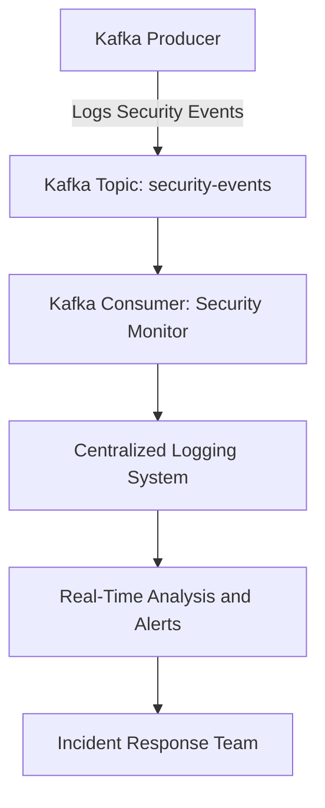

## 12.5 Auditing and Monitoring Security Events

In the realm of distributed systems and real-time data processing, security is paramount. Apache Kafka, as a central component of many data architectures, requires robust auditing and monitoring mechanisms to ensure the integrity, confidentiality, and availability of data. This section delves into the importance of auditing for security, provides guidance on setting up comprehensive logging, discusses tools for analyzing security events, and outlines best practices for incident response planning.

### Importance of Auditing for Security

Auditing is a critical aspect of security management in any system. It involves the systematic examination of logs and records to ensure compliance with security policies, detect anomalies, and respond to incidents. In the context of Apache Kafka, auditing serves several key purposes:

- **Accountability**: Auditing ensures that all actions within the Kafka environment are traceable to specific users or processes, promoting accountability.
- **Compliance**: Many industries are subject to regulations that require detailed logging and auditing of data access and changes, such as GDPR, HIPAA, and PCI DSS.
- **Incident Detection**: By analyzing audit logs, organizations can detect unauthorized access attempts, data breaches, and other security incidents.
- **Forensic Analysis**: In the event of a security breach, audit logs provide a detailed record of events that can be used for forensic analysis and to improve future security measures.

### Setting Up Comprehensive Logging

Effective auditing begins with comprehensive logging. Kafka provides several mechanisms for logging, which can be configured to capture detailed information about system operations and user activities.

#### Configuring Kafka Logging

Kafka's logging is based on the SLF4J (Simple Logging Facade for Java) API, with Log4j as the default logging framework. To configure logging in Kafka:

1. **Edit the `log4j.properties` file**: This file is located in the `config` directory of your Kafka installation. It defines the logging levels and appenders for different components.

    ```properties
    log4j.rootLogger=INFO, stdout, kafkaAppender
    log4j.appender.stdout=org.apache.log4j.ConsoleAppender
    log4j.appender.stdout.layout=org.apache.log4j.PatternLayout
    log4j.appender.stdout.layout.ConversionPattern=%d{ISO8601} [%t] %-5p %c %x - %m%n
    log4j.appender.kafkaAppender=org.apache.log4j.RollingFileAppender
    log4j.appender.kafkaAppender.File=/var/log/kafka/kafka.log
    log4j.appender.kafkaAppender.MaxFileSize=100MB
    log4j.appender.kafkaAppender.MaxBackupIndex=10
    log4j.appender.kafkaAppender.layout=org.apache.log4j.PatternLayout
    log4j.appender.kafkaAppender.layout.ConversionPattern=%d{ISO8601} [%t] %-5p %c %x - %m%n
    ```

2. **Set appropriate logging levels**: Adjust the logging levels based on your needs. Common levels include DEBUG, INFO, WARN, ERROR, and FATAL. For auditing purposes, INFO or DEBUG levels are often used to capture detailed information.

3. **Enable security logging**: Ensure that security-related events, such as authentication and authorization attempts, are logged. This can be configured in the Kafka broker settings.

#### Logging Best Practices

- **Centralize Logs**: Use a centralized logging system, such as Elasticsearch, Logstash, and Kibana (ELK stack), to aggregate logs from all Kafka brokers and clients.
- **Ensure Log Integrity**: Protect log files from unauthorized access and tampering. Use file permissions and encryption to secure logs.
- **Retain Logs Appropriately**: Define a log retention policy that balances storage costs with the need for historical data. Retain logs for a period that meets regulatory and business requirements.
- **Monitor Log Volume**: Regularly monitor the volume of logs generated to ensure that logging does not impact system performance.

### Tools for Analyzing Security Events

Analyzing security events involves processing and interpreting log data to identify potential security threats. Several tools and frameworks can assist in this process:

#### Apache Kafka's Own Tools

- **Kafka Connect**: Use Kafka Connect to stream logs to a centralized logging system for analysis.
- **Kafka Streams**: Implement real-time log analysis using Kafka Streams to detect anomalies and generate alerts.

#### Third-Party Tools

- **Splunk**: A powerful tool for searching, monitoring, and analyzing machine-generated data. Splunk can ingest Kafka logs and provide insights through dashboards and alerts.
- **ELK Stack**: Elasticsearch, Logstash, and Kibana form a popular open-source stack for log management and analysis. Use Logstash to parse Kafka logs and Elasticsearch to index them for search and analysis.
- **Graylog**: An open-source log management platform that can ingest Kafka logs and provide real-time search and analysis capabilities.

#### Implementing Real-Time Monitoring

Real-time monitoring of Kafka environments is crucial for detecting and responding to security incidents promptly. Consider the following strategies:

- **Set Up Alerts**: Configure alerts for specific security events, such as failed login attempts or unauthorized access to sensitive topics.
- **Use Dashboards**: Create dashboards that provide a real-time view of security metrics and trends.
- **Leverage Machine Learning**: Implement machine learning algorithms to detect anomalies and predict potential security threats.

### Best Practices for Incident Response Planning

Incident response planning is essential for minimizing the impact of security incidents and ensuring a swift recovery. A well-defined incident response plan should include the following components:

#### Preparation

- **Define Roles and Responsibilities**: Clearly define the roles and responsibilities of team members involved in incident response.
- **Develop Incident Response Procedures**: Create detailed procedures for identifying, containing, eradicating, and recovering from security incidents.
- **Conduct Regular Training**: Train team members on incident response procedures and conduct regular drills to test the effectiveness of the plan.

#### Detection and Analysis

- **Implement Continuous Monitoring**: Use continuous monitoring tools to detect security incidents in real-time.
- **Analyze Security Events**: Use log analysis tools to investigate security events and determine the scope and impact of incidents.

#### Containment, Eradication, and Recovery

- **Contain the Incident**: Implement measures to contain the incident and prevent further damage.
- **Eradicate the Threat**: Identify and eliminate the root cause of the incident.
- **Recover Systems**: Restore affected systems and data to normal operations.

#### Post-Incident Activities

- **Conduct a Post-Mortem**: Analyze the incident to identify lessons learned and improve future response efforts.
- **Update Security Policies**: Revise security policies and procedures based on insights gained from the incident.
- **Report to Stakeholders**: Communicate the incident and response actions to relevant stakeholders.

### Code Examples

To illustrate the concepts discussed, let's explore some code examples for logging and monitoring security events in Kafka.

#### Java Example: Logging Security Events

```java
import org.apache.kafka.clients.producer.KafkaProducer;
import org.apache.kafka.clients.producer.ProducerRecord;
import org.apache.kafka.common.serialization.StringSerializer;

import java.util.Properties;

public class SecurityEventLogger {

    public static void main(String[] args) {
        Properties props = new Properties();
        props.put("bootstrap.servers", "localhost:9092");
        props.put("key.serializer", StringSerializer.class.getName());
        props.put("value.serializer", StringSerializer.class.getName());

        KafkaProducer<String, String> producer = new KafkaProducer<>(props);

        String topic = "security-events";
        String key = "user-login";
        String value = "User JohnDoe logged in successfully";

        ProducerRecord<String, String> record = new ProducerRecord<>(topic, key, value);

        producer.send(record, (metadata, exception) -> {
            if (exception != null) {
                System.err.println("Error logging security event: " + exception.getMessage());
            } else {
                System.out.println("Security event logged to topic: " + metadata.topic());
            }
        });

        producer.close();
    }
}
```

#### Scala Example: Monitoring Security Events

```scala
import org.apache.kafka.clients.consumer.KafkaConsumer
import java.util.Properties
import scala.collection.JavaConverters._

object SecurityEventMonitor {

  def main(args: Array[String]): Unit = {
    val props = new Properties()
    props.put("bootstrap.servers", "localhost:9092")
    props.put("group.id", "security-monitor")
    props.put("key.deserializer", "org.apache.kafka.common.serialization.StringDeserializer")
    props.put("value.deserializer", "org.apache.kafka.common.serialization.StringDeserializer")

    val consumer = new KafkaConsumer[String, String](props)
    consumer.subscribe(List("security-events").asJava)

    while (true) {
      val records = consumer.poll(1000).asScala
      for (record <- records) {
        println(s"Received security event: ${record.key()} - ${record.value()}")
      }
    }
  }
}
```

#### Kotlin Example: Analyzing Security Events

```kotlin
import org.apache.kafka.clients.consumer.KafkaConsumer
import java.util.Properties

fun main() {
    val props = Properties().apply {
        put("bootstrap.servers", "localhost:9092")
        put("group.id", "security-analyzer")
        put("key.deserializer", "org.apache.kafka.common.serialization.StringDeserializer")
        put("value.deserializer", "org.apache.kafka.common.serialization.StringDeserializer")
    }

    val consumer = KafkaConsumer<String, String>(props)
    consumer.subscribe(listOf("security-events"))

    while (true) {
        val records = consumer.poll(1000)
        for (record in records) {
            println("Analyzing security event: ${record.key()} - ${record.value()}")
        }
    }
}
```

#### Clojure Example: Real-Time Security Monitoring

```clojure
(ns security-monitor.core
  (:require [clojure.java.io :as io])
  (:import [org.apache.kafka.clients.consumer KafkaConsumer]
           [org.apache.kafka.common.serialization StringDeserializer]))

(defn -main [& args]
  (let [props (doto (java.util.Properties.)
                (.put "bootstrap.servers" "localhost:9092")
                (.put "group.id" "security-monitor")
                (.put "key.deserializer" StringDeserializer)
                (.put "value.deserializer" StringDeserializer))
        consumer (KafkaConsumer. props)]
    (.subscribe consumer ["security-events"])
    (while true
      (let [records (.poll consumer 1000)]
        (doseq [record records]
          (println (str "Real-time security event: " (.key record) " - " (.value record))))))))
```

### Visualizing Security Monitoring

To enhance understanding, let's include a diagram that illustrates the flow of security event monitoring in a Kafka environment.



**Diagram Caption**: This diagram depicts the flow of security event monitoring in a Kafka environment, where events are logged by producers, consumed by monitoring applications, and analyzed in real-time to trigger alerts and inform incident response teams.

### References and Links

- [Apache Kafka Documentation](https://kafka.apache.org/documentation/)
- [Confluent Documentation](https://docs.confluent.io/)
- [ELK Stack Documentation](https://www.elastic.co/what-is/elk-stack)
- [Splunk Documentation](https://docs.splunk.com/Documentation/Splunk)
- [Graylog Documentation](https://docs.graylog.org/en/latest/)

### Knowledge Check

To reinforce your understanding of auditing and monitoring security events in Kafka, consider the following questions and exercises.

## Test Your Knowledge: Auditing and Monitoring Security Events in Kafka



### What is the primary purpose of auditing in a Kafka environment?

- [x] To ensure accountability and traceability of actions
- [ ] To improve data throughput
- [ ] To enhance data serialization
- [ ] To optimize network latency

> **Explanation:** Auditing ensures accountability and traceability of actions within a Kafka environment, which is crucial for security and compliance.

### Which tool is commonly used for centralized logging in Kafka environments?

- [x] ELK Stack
- [ ] Apache Flink
- [ ] Apache Beam
- [ ] Apache Camel

> **Explanation:** The ELK Stack (Elasticsearch, Logstash, Kibana) is commonly used for centralized logging and analysis in Kafka environments.

### What is a key benefit of real-time monitoring in Kafka?

- [x] Prompt detection and response to security incidents
- [ ] Increased data storage capacity
- [ ] Reduced network bandwidth usage
- [ ] Enhanced data compression

> **Explanation:** Real-time monitoring allows for prompt detection and response to security incidents, minimizing potential damage.

### Which of the following is a best practice for log retention?

- [x] Define a log retention policy that meets regulatory and business requirements
- [ ] Retain logs indefinitely
- [ ] Delete logs after one day
- [ ] Store logs only on local machines

> **Explanation:** A log retention policy should balance storage costs with the need for historical data, meeting regulatory and business requirements.

### What should be included in an incident response plan?

- [x] Roles and responsibilities, incident response procedures, and post-incident activities
- [ ] Only technical details of the system
- [ ] Financial reports
- [ ] Marketing strategies

> **Explanation:** An incident response plan should include roles and responsibilities, incident response procedures, and post-incident activities to ensure a comprehensive approach.

### Which programming language is NOT shown in the code examples for logging security events?

- [x] Python
- [ ] Java
- [ ] Scala
- [ ] Kotlin

> **Explanation:** The code examples provided are in Java, Scala, Kotlin, and Clojure, but not Python.

### What is the role of Kafka Connect in security event monitoring?

- [x] To stream logs to a centralized logging system for analysis
- [ ] To encrypt data at rest
- [ ] To manage Kafka topics
- [ ] To balance consumer load

> **Explanation:** Kafka Connect is used to stream logs to a centralized logging system, facilitating analysis and monitoring.

### How can machine learning be leveraged in security monitoring?

- [x] To detect anomalies and predict potential security threats
- [ ] To compress log files
- [ ] To increase data serialization speed
- [ ] To manage Kafka clusters

> **Explanation:** Machine learning can be used to detect anomalies and predict potential security threats, enhancing security monitoring.

### What is the significance of a post-mortem analysis in incident response?

- [x] To identify lessons learned and improve future response efforts
- [ ] To calculate financial losses
- [ ] To develop marketing strategies
- [ ] To increase data throughput

> **Explanation:** A post-mortem analysis helps identify lessons learned from an incident, improving future response efforts.

### True or False: Logs should be retained indefinitely to ensure comprehensive auditing.

- [ ] True
- [x] False

> **Explanation:** Logs should not be retained indefinitely; instead, a log retention policy should be defined to balance storage costs with the need for historical data.



By implementing the strategies and best practices outlined in this section, organizations can enhance their security posture and ensure the integrity of their Kafka environments.
