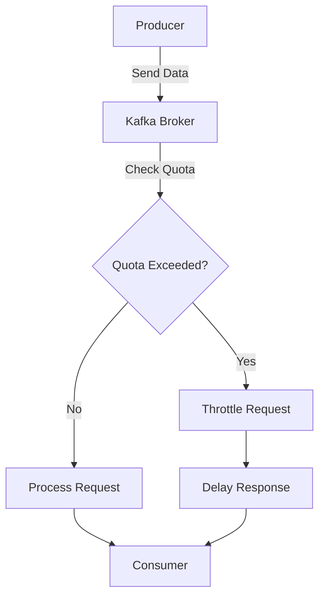

## 12.6.3 Resource Quotas and Throttling

In multi-tenant environments, managing resources effectively is crucial to ensure that no single tenant monopolizes the system's resources, thereby degrading the performance for others. Apache Kafka provides robust mechanisms for implementing resource quotas and throttling, which are essential for maintaining fair usage and optimal performance across tenants. This section delves into the intricacies of configuring and managing resource quotas and throttling in Kafka, providing expert guidance for software engineers and enterprise architects.

### Importance of Resource Management in Multi-Tenancy

In a multi-tenant architecture, multiple clients or tenants share the same Kafka cluster. Without proper resource management, a single tenant can consume excessive resources, leading to performance bottlenecks and service degradation for others. Implementing resource quotas and throttling ensures:

- **Fair Resource Allocation**: Each tenant receives a fair share of the cluster's resources.
- **Performance Stability**: Prevents any single tenant from overwhelming the system, maintaining consistent performance.
- **Cost Efficiency**: Optimizes resource usage, reducing unnecessary costs associated with over-provisioning.
- **Scalability**: Facilitates scaling by ensuring that resources are used efficiently and predictably.

### Configuring Resource Quotas in Kafka

Kafka allows administrators to set quotas on various resources, including network bandwidth, request rate, and storage. These quotas can be applied to clients (producers and consumers) and topics.

#### Quotas for Producers and Consumers

Kafka provides two main types of quotas for producers and consumers:

1. **Throughput Quotas**: Limit the amount of data a producer can send or a consumer can fetch per second.
2. **Request Quotas**: Limit the number of requests a client can make per second.

##### Configuring Throughput Quotas

To configure throughput quotas, you can use the `kafka-configs.sh` script. Here is an example of setting a producer quota:

```bash
bin/kafka-configs.sh --bootstrap-server localhost:9092 --alter --add-config 'producer_byte_rate=1048576' --entity-type clients --entity-name producer-client-id
```

This command sets a producer byte rate of 1 MB/s for a client with the ID `producer-client-id`.

Similarly, to set a consumer quota:

```bash
bin/kafka-configs.sh --bootstrap-server localhost:9092 --alter --add-config 'consumer_byte_rate=1048576' --entity-type clients --entity-name consumer-client-id
```

##### Configuring Request Quotas

Request quotas can be configured to limit the number of requests per second:

```bash
bin/kafka-configs.sh --bootstrap-server localhost:9092 --alter --add-config 'request_percentage=10' --entity-type clients --entity-name client-id
```

This command limits the client with ID `client-id` to 10% of the total request capacity.

#### Quotas for Topics

Kafka also allows setting quotas at the topic level, which can be useful for managing storage and ensuring that no single topic consumes disproportionate resources.

```bash
bin/kafka-configs.sh --bootstrap-server localhost:9092 --alter --add-config 'retention.bytes=1073741824' --entity-type topics --entity-name topic-name
```

This command sets a storage quota of 1 GB for the topic `topic-name`.

### Monitoring and Enforcing Quotas

Once quotas are configured, it is essential to monitor and enforce them to ensure compliance and detect violations.

#### Monitoring Quotas

Kafka provides several metrics that can be used to monitor quota usage. These metrics can be accessed via JMX (Java Management Extensions) and include:

- **kafka.server:type=BrokerTopicMetrics,name=BytesInPerSec**: Monitors the byte rate for producers.
- **kafka.server:type=BrokerTopicMetrics,name=BytesOutPerSec**: Monitors the byte rate for consumers.
- **kafka.server:type=BrokerTopicMetrics,name=RequestsPerSec**: Monitors the request rate.

These metrics can be visualized using tools like Prometheus and Grafana to provide real-time insights into quota usage.

#### Enforcing Quotas

Kafka enforces quotas by throttling clients that exceed their allocated resources. Throttling is achieved by delaying requests from clients that exceed their quotas, ensuring that they do not consume more than their fair share of resources.

### Handling Quota Violations

When a client exceeds its quota, Kafka applies throttling to bring the client's usage back within the allowed limits. Here are some strategies for handling quota violations:

- **Alerting**: Set up alerts to notify administrators when a client is throttled. This can be done using monitoring tools that support alerting based on JMX metrics.
- **Review and Adjust Quotas**: Regularly review quota configurations and adjust them based on usage patterns and business requirements.
- **Educate Tenants**: Provide tenants with guidelines on optimal resource usage and the implications of exceeding quotas.

### Practical Applications and Real-World Scenarios

In practice, resource quotas and throttling are used in various scenarios, such as:

- **Cloud-Based Multi-Tenant Platforms**: Ensuring fair resource allocation among different customers using a shared Kafka cluster.
- **Enterprise Data Hubs**: Managing resource usage across different departments or business units within an organization.
- **IoT Platforms**: Controlling the data ingestion rate from numerous IoT devices to prevent system overload.

### Code Examples

To illustrate the implementation of resource quotas and throttling, let's explore code examples in Java, Scala, Kotlin, and Clojure.

#### Java Example

```java
import org.apache.kafka.clients.admin.AdminClient;
import org.apache.kafka.clients.admin.AdminClientConfig;
import org.apache.kafka.clients.admin.Config;
import org.apache.kafka.clients.admin.ConfigEntry;
import org.apache.kafka.clients.admin.ConfigResource;

import java.util.Collections;
import java.util.Properties;

public class KafkaQuotaExample {
    public static void main(String[] args) {
        Properties props = new Properties();
        props.put(AdminClientConfig.BOOTSTRAP_SERVERS_CONFIG, "localhost:9092");

        try (AdminClient adminClient = AdminClient.create(props)) {
            ConfigResource resource = new ConfigResource(ConfigResource.Type.CLIENT, "producer-client-id");
            Config config = new Config(Collections.singletonList(new ConfigEntry("producer_byte_rate", "1048576")));
            adminClient.alterConfigs(Collections.singletonMap(resource, config)).all().get();
            System.out.println("Quota set successfully.");
        } catch (Exception e) {
            e.printStackTrace();
        }
    }
}
```

#### Scala Example

```scala
import org.apache.kafka.clients.admin.{AdminClient, AdminClientConfig, Config, ConfigEntry, ConfigResource}

import java.util.Properties
import scala.jdk.CollectionConverters._

object KafkaQuotaExample extends App {
  val props = new Properties()
  props.put(AdminClientConfig.BOOTSTRAP_SERVERS_CONFIG, "localhost:9092")

  val adminClient = AdminClient.create(props)
  val resource = new ConfigResource(ConfigResource.Type.CLIENT, "producer-client-id")
  val config = new Config(List(new ConfigEntry("producer_byte_rate", "1048576")).asJava)

  try {
    adminClient.alterConfigs(Map(resource -> config).asJava).all().get()
    println("Quota set successfully.")
  } catch {
    case e: Exception => e.printStackTrace()
  } finally {
    adminClient.close()
  }
}
```

#### Kotlin Example

```kotlin
import org.apache.kafka.clients.admin.AdminClient
import org.apache.kafka.clients.admin.AdminClientConfig
import org.apache.kafka.clients.admin.Config
import org.apache.kafka.clients.admin.ConfigEntry
import org.apache.kafka.clients.admin.ConfigResource

fun main() {
    val props = Properties()
    props[AdminClientConfig.BOOTSTRAP_SERVERS_CONFIG] = "localhost:9092"

    AdminClient.create(props).use { adminClient ->
        val resource = ConfigResource(ConfigResource.Type.CLIENT, "producer-client-id")
        val config = Config(listOf(ConfigEntry("producer_byte_rate", "1048576")))

        try {
            adminClient.alterConfigs(mapOf(resource to config)).all().get()
            println("Quota set successfully.")
        } catch (e: Exception) {
            e.printStackTrace()
        }
    }
}
```

#### Clojure Example

```clojure
(ns kafka-quota-example
  (:import (org.apache.kafka.clients.admin AdminClient AdminClientConfig Config ConfigEntry ConfigResource)
           (java.util Properties Collections)))

(defn set-quota []
  (let [props (doto (Properties.)
                (.put AdminClientConfig/BOOTSTRAP_SERVERS_CONFIG "localhost:9092"))
        admin-client (AdminClient/create props)
        resource (ConfigResource. ConfigResource$Type/CLIENT "producer-client-id")
        config (Config. (Collections/singletonList (ConfigEntry. "producer_byte_rate" "1048576")))]
    (try
      (.get (.all (.alterConfigs admin-client (Collections/singletonMap resource config))))
      (println "Quota set successfully.")
      (catch Exception e
        (.printStackTrace e))
      (finally
        (.close admin-client)))))

(set-quota)
```

### Visualizing Resource Quotas and Throttling

To better understand the flow of resource quotas and throttling in Kafka, consider the following diagram:



**Caption**: This diagram illustrates the process of handling producer requests in Kafka. If a producer exceeds its quota, the request is throttled, delaying the response to ensure fair resource usage.

### Key Takeaways

- **Resource quotas and throttling are essential** for managing resources in multi-tenant Kafka environments.
- **Quotas can be configured** for producers, consumers, and topics to ensure fair usage.
- **Monitoring and enforcement** are crucial to detect and handle quota violations effectively.
- **Practical applications** include cloud platforms, enterprise data hubs, and IoT systems.

### Knowledge Check

To reinforce your understanding of resource quotas and throttling in Kafka, try answering the following questions.

## Test Your Knowledge: Kafka Resource Quotas and Throttling Quiz



### What is the primary purpose of implementing resource quotas in Kafka?

- [x] To ensure fair resource allocation among tenants
- [ ] To increase the speed of data processing
- [ ] To reduce the number of Kafka brokers
- [ ] To eliminate the need for monitoring tools

> **Explanation:** Resource quotas ensure fair allocation of resources among tenants, preventing any single tenant from monopolizing the system.

### Which command is used to set a producer byte rate quota in Kafka?

- [x] `kafka-configs.sh --alter --add-config 'producer_byte_rate=1048576'`
- [ ] `kafka-topics.sh --create --config 'producer_byte_rate=1048576'`
- [ ] `kafka-consumer-groups.sh --describe --config 'producer_byte_rate=1048576'`
- [ ] `kafka-acls.sh --add --config 'producer_byte_rate=1048576'`

> **Explanation:** The `kafka-configs.sh` script is used to alter configurations, including setting producer byte rate quotas.

### How does Kafka enforce quotas when a client exceeds its allocated resources?

- [x] By throttling the client's requests
- [ ] By shutting down the client's connection
- [ ] By increasing the client's quota automatically
- [ ] By sending an alert to the client

> **Explanation:** Kafka enforces quotas by throttling requests from clients that exceed their allocated resources.

### What metric can be used to monitor the byte rate for producers in Kafka?

- [x] `kafka.server:type=BrokerTopicMetrics,name=BytesInPerSec`
- [ ] `kafka.server:type=BrokerTopicMetrics,name=BytesOutPerSec`
- [ ] `kafka.server:type=BrokerTopicMetrics,name=RequestsPerSec`
- [ ] `kafka.server:type=BrokerTopicMetrics,name=MessagesInPerSec`

> **Explanation:** The `BytesInPerSec` metric monitors the byte rate for producers.

### Which of the following is a benefit of implementing resource quotas in Kafka?

- [x] Fair resource allocation
- [x] Performance stability
- [ ] Increased hardware costs
- [ ] Reduced data throughput

> **Explanation:** Resource quotas ensure fair allocation and performance stability, without necessarily increasing costs or reducing throughput.

### What is the role of monitoring tools in managing Kafka quotas?

- [x] To provide real-time insights into quota usage
- [ ] To automatically adjust quotas based on usage
- [ ] To replace the need for manual configuration
- [ ] To eliminate the need for throttling

> **Explanation:** Monitoring tools provide real-time insights into quota usage, helping administrators manage resources effectively.

### How can Kafka administrators handle quota violations?

- [x] By setting up alerts for throttling events
- [x] By reviewing and adjusting quotas regularly
- [ ] By disabling quotas for problematic clients
- [ ] By increasing the number of Kafka brokers

> **Explanation:** Administrators can handle violations by setting up alerts and regularly reviewing quotas.

### What is a practical application of resource quotas in Kafka?

- [x] Ensuring fair resource allocation in cloud-based platforms
- [ ] Increasing the number of Kafka topics
- [ ] Reducing the need for data encryption
- [ ] Eliminating the need for consumer groups

> **Explanation:** Resource quotas are used to ensure fair allocation in shared environments like cloud platforms.

### Which command sets a storage quota for a Kafka topic?

- [x] `kafka-configs.sh --alter --add-config 'retention.bytes=1073741824'`
- [ ] `kafka-topics.sh --create --config 'retention.bytes=1073741824'`
- [ ] `kafka-consumer-groups.sh --describe --config 'retention.bytes=1073741824'`
- [ ] `kafka-acls.sh --add --config 'retention.bytes=1073741824'`

> **Explanation:** The `kafka-configs.sh` script is used to set storage quotas for topics.

### True or False: Kafka automatically increases quotas for clients that frequently exceed their limits.

- [ ] True
- [x] False

> **Explanation:** Kafka does not automatically increase quotas; administrators must manually adjust them based on usage patterns.



By mastering resource quotas and throttling in Kafka, you can ensure fair resource allocation, maintain performance stability, and optimize the efficiency of your multi-tenant environments.
