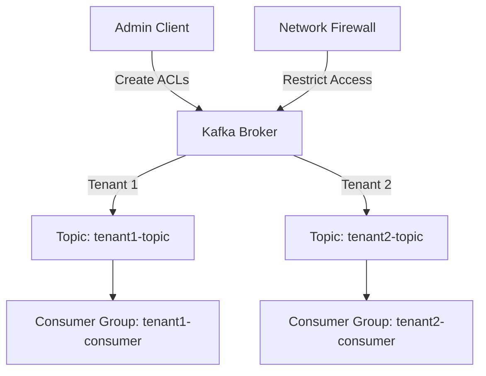

## 12.6.4 Tenant Isolation Strategies

In multi-tenant environments, ensuring that each tenant's data and operations are isolated from others is crucial for security, compliance, and performance. Apache Kafka, as a distributed streaming platform, provides several mechanisms to achieve tenant isolation. This section delves into advanced strategies for isolating tenant data and operations, ensuring that tenants cannot access or interfere with each other's data.

### Introduction to Tenant Isolation

Tenant isolation in Kafka involves creating boundaries between different tenants' data and operations. This is essential to prevent data leakage, unauthorized access, and performance degradation. Effective tenant isolation strategies can help maintain compliance with data protection regulations and enhance the overall security posture of the Kafka deployment.

### Key Concepts in Tenant Isolation

Before diving into specific strategies, it's important to understand the key concepts that underpin tenant isolation in Kafka:

- **Logical Isolation**: Segregating data and operations at the application level, often using namespaces or unique identifiers.
- **Physical Isolation**: Using separate hardware or virtual resources to isolate tenants.
- **Network Isolation**: Implementing network-level controls to restrict access between tenants.
- **Data Encryption**: Encrypting data at rest and in transit to ensure confidentiality.
- **Access Control**: Implementing strict access controls to manage who can access tenant data and operations.

### Logical Isolation Strategies

Logical isolation involves using Kafka's inherent features to separate tenant data and operations. This can be achieved through:

#### Topic-Level Isolation

- **Separate Topics for Each Tenant**: Create distinct Kafka topics for each tenant. This ensures that data is logically separated, and access can be controlled at the topic level.
- **Naming Conventions**: Use consistent naming conventions to easily identify and manage tenant-specific topics. For example, prefix topic names with the tenant ID.

#### Access Control Lists (ACLs)

- **Granular Permissions**: Use Kafka's ACLs to define fine-grained permissions for each tenant. This includes specifying which users or services can produce or consume messages from tenant-specific topics.
- **Role-Based Access Control (RBAC)**: Implement RBAC to manage permissions based on roles rather than individual users, simplifying access management.

### Physical Isolation Strategies

Physical isolation involves using separate hardware or virtual resources to ensure tenant data and operations are isolated:

#### Dedicated Clusters

- **Separate Kafka Clusters**: Deploy separate Kafka clusters for each tenant. This provides the highest level of isolation but can be resource-intensive.
- **Virtualized Environments**: Use virtualization technologies to create isolated environments for each tenant within a shared infrastructure.

#### Resource Quotas

- **Quota Management**: Implement resource quotas to limit the amount of resources (e.g., CPU, memory, disk) each tenant can consume. This prevents a single tenant from monopolizing shared resources.

### Network Isolation Strategies

Network isolation involves implementing network-level controls to restrict access between tenants:

#### Virtual Private Clouds (VPCs)

- **Isolated VPCs**: Deploy Kafka clusters within isolated VPCs for each tenant. This ensures that network traffic is contained within the tenant's environment.
- **VPC Peering**: Use VPC peering to enable secure communication between tenant environments if necessary.

#### Security Groups and Firewalls

- **Security Group Rules**: Define security group rules to control inbound and outbound traffic to Kafka brokers. This can be used to restrict access to tenant-specific IP ranges.
- **Network Firewalls**: Implement network firewalls to provide an additional layer of security, blocking unauthorized access to tenant environments.

### Data Encryption Strategies

Data encryption is a critical component of tenant isolation, ensuring that data remains confidential both at rest and in transit:

#### Encryption at Rest

- **Per-Tenant Encryption Keys**: Use separate encryption keys for each tenant's data. This ensures that even if one tenant's data is compromised, other tenants' data remains secure.
- **Encryption Tools**: Leverage tools like Apache Kafka's built-in support for encryption or third-party solutions to encrypt data at rest.

#### Encryption in Transit

- **SSL/TLS**: Enable SSL/TLS encryption for all Kafka communications. This protects data as it moves between producers, brokers, and consumers.
- **Mutual TLS Authentication**: Implement mutual TLS authentication to verify the identity of both parties in a communication, enhancing security.

### Access Control and Authentication

Access control and authentication are vital for ensuring that only authorized users and services can access tenant data and operations:

#### Authentication Mechanisms

- **SASL Authentication**: Use SASL (Simple Authentication and Security Layer) to authenticate users and services. This can be combined with Kerberos, OAuth, or other authentication protocols.
- **OAuth and OpenID Connect**: Integrate OAuth and OpenID Connect for modern, token-based authentication.

#### Authorization Strategies

- **Fine-Grained ACLs**: Define fine-grained ACLs to control access to Kafka resources. This includes specifying which users or services can perform actions like producing or consuming messages.
- **Apache Ranger**: Use Apache Ranger for centralized security administration, providing a unified approach to managing access controls across multiple tenants.

### Logging and Monitoring in Isolated Environments

Logging and monitoring are essential for maintaining visibility and ensuring compliance in isolated environments:

#### Tenant-Specific Logging

- **Separate Log Streams**: Create separate log streams for each tenant. This ensures that logs are isolated and can be monitored independently.
- **Log Aggregation Tools**: Use log aggregation tools like ELK Stack (Elasticsearch, Logstash, Kibana) or Splunk to centralize and analyze logs.

#### Monitoring and Alerting

- **Tenant-Specific Metrics**: Collect and monitor metrics specific to each tenant. This includes tracking resource usage, performance, and security events.
- **Alerting Systems**: Implement alerting systems to notify administrators of potential issues or security incidents within tenant environments.

### Practical Applications and Real-World Scenarios

Tenant isolation strategies are crucial in various real-world scenarios, including:

- **Financial Services**: Ensuring that sensitive financial data is isolated and secure across different clients.
- **Healthcare**: Protecting patient data and ensuring compliance with regulations like HIPAA.
- **SaaS Platforms**: Providing secure, isolated environments for each customer in a multi-tenant SaaS application.

### Code Examples

To illustrate tenant isolation strategies, let's explore code examples in Java, Scala, Kotlin, and Clojure for setting up ACLs and encryption.

#### Java Example: Setting Up ACLs

```java
import org.apache.kafka.clients.admin.AdminClient;
import org.apache.kafka.clients.admin.AdminClientConfig;
import org.apache.kafka.clients.admin.AclBinding;
import org.apache.kafka.common.acl.AclOperation;
import org.apache.kafka.common.acl.AclPermissionType;
import org.apache.kafka.common.resource.ResourceType;
import org.apache.kafka.common.resource.ResourcePattern;

import java.util.Collections;
import java.util.Properties;

public class KafkaAclExample {
    public static void main(String[] args) {
        Properties props = new Properties();
        props.put(AdminClientConfig.BOOTSTRAP_SERVERS_CONFIG, "localhost:9092");

        try (AdminClient adminClient = AdminClient.create(props)) {
            AclBinding aclBinding = new AclBinding(
                new ResourcePattern(ResourceType.TOPIC, "tenant1-topic", PatternType.LITERAL),
                new AccessControlEntry("User:tenant1-user", "*", AclOperation.READ, AclPermissionType.ALLOW)
            );

            adminClient.createAcls(Collections.singletonList(aclBinding)).all().get();
            System.out.println("ACL created successfully for tenant1-topic.");
        } catch (Exception e) {
            e.printStackTrace();
        }
    }
}
```

#### Scala Example: Setting Up ACLs

```scala
import org.apache.kafka.clients.admin.{AdminClient, AdminClientConfig, AclBinding}
import org.apache.kafka.common.acl.{AclOperation, AclPermissionType}
import org.apache.kafka.common.resource.{ResourceType, ResourcePattern}

import java.util.Properties
import scala.jdk.CollectionConverters._

object KafkaAclExample extends App {
  val props = new Properties()
  props.put(AdminClientConfig.BOOTSTRAP_SERVERS_CONFIG, "localhost:9092")

  val adminClient = AdminClient.create(props)

  val aclBinding = new AclBinding(
    new ResourcePattern(ResourceType.TOPIC, "tenant1-topic", ResourcePattern.WildcardType.LITERAL),
    new AccessControlEntry("User:tenant1-user", "*", AclOperation.READ, AclPermissionType.ALLOW)
  )

  try {
    adminClient.createAcls(List(aclBinding).asJava).all().get()
    println("ACL created successfully for tenant1-topic.")
  } catch {
    case e: Exception => e.printStackTrace()
  } finally {
    adminClient.close()
  }
}
```

#### Kotlin Example: Setting Up ACLs

```kotlin
import org.apache.kafka.clients.admin.AdminClient
import org.apache.kafka.clients.admin.AdminClientConfig
import org.apache.kafka.clients.admin.AclBinding
import org.apache.kafka.common.acl.AclOperation
import org.apache.kafka.common.acl.AclPermissionType
import org.apache.kafka.common.resource.ResourceType
import org.apache.kafka.common.resource.ResourcePattern

fun main() {
    val props = Properties().apply {
        put(AdminClientConfig.BOOTSTRAP_SERVERS_CONFIG, "localhost:9092")
    }

    AdminClient.create(props).use { adminClient ->
        val aclBinding = AclBinding(
            ResourcePattern(ResourceType.TOPIC, "tenant1-topic", ResourcePattern.WildcardType.LITERAL),
            AccessControlEntry("User:tenant1-user", "*", AclOperation.READ, AclPermissionType.ALLOW)
        )

        try {
            adminClient.createAcls(listOf(aclBinding)).all().get()
            println("ACL created successfully for tenant1-topic.")
        } catch (e: Exception) {
            e.printStackTrace()
        }
    }
}
```

#### Clojure Example: Setting Up ACLs

```clojure
(ns kafka-acl-example
  (:import [org.apache.kafka.clients.admin AdminClient AdminClientConfig AclBinding]
           [org.apache.kafka.common.acl AclOperation AclPermissionType]
           [org.apache.kafka.common.resource ResourceType ResourcePattern]))

(defn create-acl []
  (let [props (doto (java.util.Properties.)
                (.put AdminClientConfig/BOOTSTRAP_SERVERS_CONFIG "localhost:9092"))
        admin-client (AdminClient/create props)
        acl-binding (AclBinding.
                      (ResourcePattern. ResourceType/TOPIC "tenant1-topic" ResourcePattern$WildcardType/LITERAL)
                      (AccessControlEntry. "User:tenant1-user" "*" AclOperation/READ AclPermissionType/ALLOW))]
    (try
      (.get (.all (.createAcls admin-client [acl-binding])))
      (println "ACL created successfully for tenant1-topic.")
      (catch Exception e
        (.printStackTrace e))
      (finally
        (.close admin-client)))))

(create-acl)
```

### Visualizing Tenant Isolation

To better understand tenant isolation strategies, let's visualize the architecture using a Mermaid.js diagram.



**Diagram Description**: This diagram illustrates a Kafka broker managing separate topics for two tenants. Each tenant has its own consumer group, and ACLs are used to control access. A network firewall provides an additional layer of security.

### Recommendations and Best Practices

- **Regular Security Assessments**: Conduct regular security assessments to identify and mitigate potential vulnerabilities in tenant isolation strategies.
- **Automate ACL Management**: Use automation tools to manage ACLs and other security configurations, reducing the risk of human error.
- **Monitor Resource Usage**: Continuously monitor resource usage to ensure that tenants do not exceed their allocated quotas.
- **Stay Informed on Compliance**: Keep abreast of data protection regulations and ensure that tenant isolation strategies comply with relevant laws.

### Knowledge Check

To reinforce your understanding of tenant isolation strategies, consider the following questions:

1. What are the key differences between logical and physical isolation in Kafka?
2. How can ACLs be used to enhance tenant isolation?
3. What are the benefits of using separate encryption keys for each tenant?
4. How can network isolation be achieved in a multi-tenant Kafka environment?
5. Why is it important to monitor tenant-specific metrics?

### Conclusion

Implementing effective tenant isolation strategies in Apache Kafka is essential for maintaining security, compliance, and performance in multi-tenant environments. By leveraging logical, physical, and network isolation techniques, along with robust access control and encryption strategies, organizations can ensure that tenant data and operations remain secure and isolated.

## Test Your Knowledge: Advanced Tenant Isolation Strategies Quiz



### What is the primary purpose of tenant isolation in a multi-tenant Kafka environment?

- [x] To prevent data leakage and unauthorized access between tenants.
- [ ] To improve network speed.
- [ ] To reduce storage costs.
- [ ] To simplify configuration management.

> **Explanation:** Tenant isolation is crucial for preventing data leakage and unauthorized access, ensuring that each tenant's data and operations are secure and separate from others.

### Which of the following is a logical isolation strategy in Kafka?

- [x] Using separate topics for each tenant.
- [ ] Deploying separate Kafka clusters for each tenant.
- [ ] Implementing network firewalls.
- [ ] Using VPC peering.

> **Explanation:** Logical isolation involves using Kafka's features, such as separate topics, to segregate tenant data and operations.

### What is a benefit of using per-tenant encryption keys?

- [x] It ensures that if one tenant's data is compromised, others remain secure.
- [ ] It reduces the complexity of key management.
- [ ] It improves data processing speed.
- [ ] It simplifies network configuration.

> **Explanation:** Using separate encryption keys for each tenant ensures that even if one tenant's data is compromised, other tenants' data remains secure.

### How can network isolation be achieved in a Kafka environment?

- [x] By deploying Kafka clusters within isolated VPCs.
- [ ] By using shared network resources.
- [ ] By reducing the number of brokers.
- [ ] By disabling SSL/TLS.

> **Explanation:** Deploying Kafka clusters within isolated VPCs ensures that network traffic is contained within the tenant's environment, providing network isolation.

### Which tool can be used for centralized security administration in Kafka?

- [x] Apache Ranger
- [ ] Apache Zookeeper
- [ ] Kafka Connect
- [ ] Prometheus

> **Explanation:** Apache Ranger provides centralized security administration, allowing for unified management of access controls across multiple tenants.

### What is the role of ACLs in tenant isolation?

- [x] To define fine-grained permissions for each tenant.
- [ ] To encrypt data at rest.
- [ ] To manage network traffic.
- [ ] To monitor resource usage.

> **Explanation:** ACLs (Access Control Lists) are used to define fine-grained permissions, specifying which users or services can access tenant-specific resources.

### Which of the following is a physical isolation strategy?

- [x] Deploying separate Kafka clusters for each tenant.
- [ ] Using separate topics for each tenant.
- [ ] Implementing SSL/TLS encryption.
- [ ] Using log aggregation tools.

> **Explanation:** Physical isolation involves using separate hardware or virtual resources, such as deploying separate Kafka clusters for each tenant.

### Why is it important to monitor tenant-specific metrics?

- [x] To track resource usage and performance for each tenant.
- [ ] To reduce storage costs.
- [ ] To simplify configuration management.
- [ ] To improve network speed.

> **Explanation:** Monitoring tenant-specific metrics helps track resource usage and performance, ensuring that tenants do not exceed their allocated quotas.

### What is the benefit of using VPC peering in a multi-tenant Kafka environment?

- [x] It enables secure communication between tenant environments.
- [ ] It reduces storage costs.
- [ ] It simplifies configuration management.
- [ ] It improves data processing speed.

> **Explanation:** VPC peering allows for secure communication between tenant environments, maintaining network isolation while enabling necessary interactions.

### True or False: Tenant isolation strategies are only necessary for compliance with data protection regulations.

- [ ] True
- [x] False

> **Explanation:** While compliance is a key reason for tenant isolation, it is also essential for security, performance, and preventing unauthorized access between tenants.


