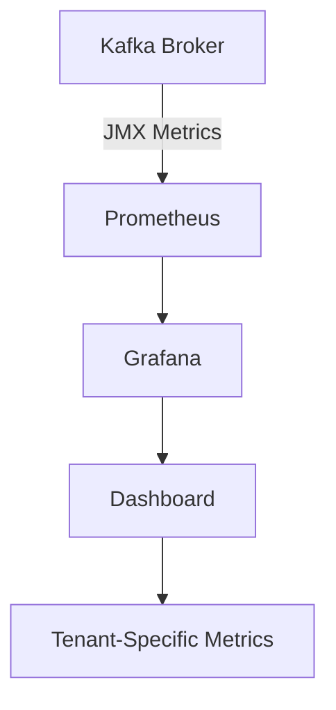
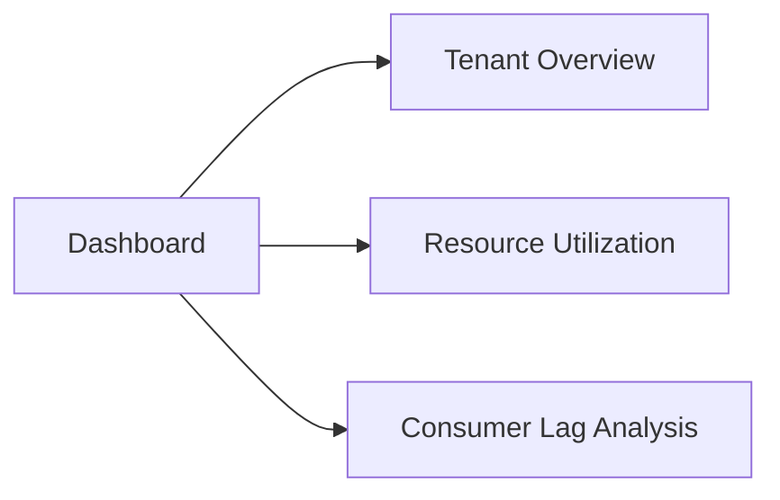

## 12.6.5 Monitoring Multi-Tenant Environments

In the realm of modern distributed systems, Apache Kafka stands out as a robust platform for handling real-time data streams. As organizations scale, they often adopt multi-tenant architectures to efficiently manage resources and costs. Monitoring these environments is crucial for ensuring performance, security, and compliance. This section delves into the strategies and best practices for monitoring multi-tenant Kafka deployments, focusing on tenant-specific metrics, dashboards, alerting mechanisms, and maintaining tenant privacy.

### Understanding Multi-Tenant Architectures in Kafka

**Multi-tenancy** refers to a software architecture where a single instance of a system serves multiple customers, known as tenants. In a Kafka context, this involves sharing Kafka clusters among different teams or applications, each acting as a tenant. This setup offers cost efficiency and simplified management but introduces challenges in monitoring and ensuring isolation.

#### Key Concepts

- **Tenant Isolation**: Ensuring that the activities of one tenant do not adversely affect others.
- **Resource Quotas**: Allocating specific resources to each tenant to prevent resource hogging.
- **Security and Privacy**: Protecting tenant data from unauthorized access and ensuring compliance with data protection regulations.

### Collecting and Analyzing Metrics Per Tenant

To effectively monitor a multi-tenant Kafka environment, it's essential to collect and analyze metrics specific to each tenant. This involves tracking resource usage, performance, and potential issues on a per-tenant basis.

#### Metrics Collection

1. **Partition and Topic Metrics**: Monitor the number of partitions and topics each tenant uses. This helps in understanding the load distribution and potential bottlenecks.
2. **Consumer Lag**: Track the lag for each tenant's consumer groups to identify processing delays.
3. **Throughput and Latency**: Measure the data throughput and latency for each tenant to ensure SLA compliance.
4. **Error Rates**: Monitor error rates in message production and consumption to detect anomalies.

#### Tools and Techniques

- **JMX (Java Management Extensions)**: Use JMX to expose Kafka metrics, which can be collected by monitoring tools like Prometheus.
- **Prometheus and Grafana**: Leverage Prometheus for metrics collection and Grafana for visualization. Configure Prometheus to scrape metrics from Kafka brokers and create Grafana dashboards for tenant-specific views.



*Diagram: A flowchart showing the collection of Kafka metrics using JMX, Prometheus, and Grafana.*

#### Code Example: Prometheus Configuration

```yaml
# prometheus.yml
scrape_configs:
  - job_name: 'kafka'
    static_configs:
      - targets: ['localhost:9090']
    metrics_path: '/metrics'
    params:
      tenant: ['tenant1', 'tenant2'] # Specify tenants
```

**Explanation**: This configuration sets up Prometheus to scrape metrics from a Kafka broker, with parameters to filter metrics by tenant.

### Dashboards and Reports

Creating intuitive dashboards and reports is crucial for visualizing tenant-specific metrics and gaining insights into their usage patterns.

#### Designing Dashboards

- **Tenant Overview**: A high-level view showing key metrics for each tenant, such as throughput, latency, and error rates.
- **Resource Utilization**: Detailed charts displaying CPU, memory, and disk usage per tenant.
- **Consumer Lag Analysis**: Visualizations highlighting consumer lag trends over time.

#### Example: Grafana Dashboard



*Diagram: A simplified representation of a Grafana dashboard structure for monitoring multi-tenant environments.*

#### Code Example: Grafana Dashboard JSON

```json
{
  "title": "Kafka Multi-Tenant Monitoring",
  "panels": [
    {
      "title": "Tenant Overview",
      "type": "graph",
      "targets": [
        {
          "expr": "sum(rate(kafka_server_broker_topic_metrics_messages_in_total{tenant='tenant1'}[5m]))",
          "legendFormat": "Tenant 1"
        },
        {
          "expr": "sum(rate(kafka_server_broker_topic_metrics_messages_in_total{tenant='tenant2'}[5m]))",
          "legendFormat": "Tenant 2"
        }
      ]
    }
  ]
}
```

**Explanation**: This JSON snippet configures a Grafana panel to display message rates for different tenants.

### Alerting on Tenant-Specific Issues

Proactive alerting is essential for maintaining the health of a multi-tenant Kafka environment. Alerts should be configured to notify administrators of tenant-specific issues before they escalate.

#### Alerting Strategies

- **Threshold-Based Alerts**: Set thresholds for critical metrics such as consumer lag and error rates. Trigger alerts when these thresholds are breached.
- **Anomaly Detection**: Use machine learning models to detect unusual patterns in tenant metrics, indicating potential issues.

#### Example: Prometheus Alerting Rule

```yaml
# alert.rules
groups:
- name: kafka_alerts
  rules:
  - alert: HighConsumerLag
    expr: kafka_consumer_lag{tenant="tenant1"} > 1000
    for: 5m
    labels:
      severity: critical
    annotations:
      summary: "High consumer lag for tenant1"
      description: "Consumer lag for tenant1 has exceeded 1000 for more than 5 minutes."
```

**Explanation**: This rule triggers an alert if the consumer lag for tenant1 exceeds 1000 for more than 5 minutes.

### Best Practices for Maintaining Tenant Privacy

While monitoring multi-tenant environments, it's crucial to ensure that tenant data remains private and secure. Here are some best practices:

1. **Data Anonymization**: Anonymize sensitive data in logs and metrics to prevent unauthorized access.
2. **Access Controls**: Implement strict access controls to ensure that only authorized personnel can view tenant-specific data.
3. **Encryption**: Use encryption for data at rest and in transit to protect tenant information.
4. **Compliance**: Ensure monitoring practices comply with relevant data protection regulations, such as GDPR and CCPA.

### Real-World Scenarios and Applications

Consider a scenario where a financial services company uses Kafka to process transactions for multiple clients. Each client represents a tenant, and monitoring their specific metrics is crucial for ensuring service quality and compliance.

- **Scenario**: A sudden spike in consumer lag for a particular tenant could indicate a downstream processing issue, requiring immediate attention.
- **Application**: By setting up tenant-specific dashboards and alerts, the company can quickly identify and resolve such issues, minimizing impact on client services.

### Conclusion

Monitoring multi-tenant environments in Apache Kafka is a complex but essential task for ensuring performance, security, and compliance. By collecting and analyzing tenant-specific metrics, designing intuitive dashboards, and implementing robust alerting mechanisms, organizations can effectively manage their Kafka deployments. Additionally, adhering to best practices for tenant privacy ensures that monitoring activities remain secure and compliant.

## Test Your Knowledge: Advanced Kafka Multi-Tenant Monitoring Quiz



### What is a key benefit of monitoring multi-tenant environments in Kafka?

- [x] Ensures tenant-specific performance and compliance.
- [ ] Reduces the need for resource allocation.
- [ ] Eliminates the need for encryption.
- [ ] Simplifies Kafka configuration.

> **Explanation:** Monitoring multi-tenant environments helps ensure that each tenant's performance and compliance requirements are met.

### Which tool is commonly used for visualizing Kafka metrics?

- [x] Grafana
- [ ] Jenkins
- [ ] Ansible
- [ ] Terraform

> **Explanation:** Grafana is widely used for visualizing metrics collected from Kafka and other systems.

### What is the purpose of setting up tenant-specific dashboards?

- [x] To provide insights into each tenant's usage patterns.
- [ ] To reduce the number of Kafka brokers.
- [ ] To increase data throughput.
- [ ] To simplify consumer group management.

> **Explanation:** Tenant-specific dashboards provide insights into usage patterns, helping administrators manage resources effectively.

### How can you ensure tenant privacy in monitoring data?

- [x] By anonymizing sensitive data.
- [ ] By increasing data retention periods.
- [ ] By reducing the number of partitions.
- [ ] By disabling encryption.

> **Explanation:** Anonymizing sensitive data helps protect tenant privacy in monitoring data.

### What is a common alerting strategy for tenant-specific issues?

- [x] Threshold-Based Alerts
- [ ] Increasing partition count
- [ ] Disabling consumer groups
- [ ] Reducing topic replication

> **Explanation:** Threshold-based alerts notify administrators when critical metrics exceed predefined limits.

### Which metric is crucial for identifying processing delays in Kafka?

- [x] Consumer Lag
- [ ] Partition Count
- [ ] Topic Size
- [ ] Broker Uptime

> **Explanation:** Consumer lag is a key metric for identifying processing delays in Kafka.

### What is the role of Prometheus in Kafka monitoring?

- [x] Collecting and storing metrics
- [ ] Managing Kafka brokers
- [ ] Configuring Kafka topics
- [ ] Deploying Kafka clusters

> **Explanation:** Prometheus collects and stores metrics, which can be visualized using tools like Grafana.

### How can anomaly detection be used in Kafka monitoring?

- [x] To identify unusual patterns in tenant metrics
- [ ] To increase data throughput
- [ ] To simplify Kafka configuration
- [ ] To reduce consumer lag

> **Explanation:** Anomaly detection helps identify unusual patterns in metrics, indicating potential issues.

### What is a benefit of using JMX for Kafka monitoring?

- [x] It exposes Kafka metrics for collection by monitoring tools.
- [ ] It simplifies Kafka broker deployment.
- [ ] It increases data retention periods.
- [ ] It reduces the number of partitions.

> **Explanation:** JMX exposes Kafka metrics, allowing them to be collected by monitoring tools like Prometheus.

### True or False: Encryption is not necessary for tenant privacy in Kafka monitoring.

- [ ] True
- [x] False

> **Explanation:** Encryption is essential for protecting tenant data privacy in Kafka monitoring.



By implementing these strategies and best practices, organizations can effectively monitor their multi-tenant Kafka environments, ensuring optimal performance and security for each tenant.
