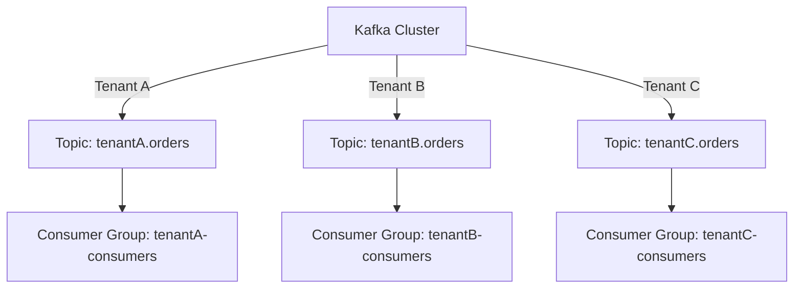

## 12.6 Securing Kafka in Multi-Tenant Environments

### Introduction

As organizations increasingly adopt Apache Kafka for real-time data processing, the demand for multi-tenant Kafka environments has grown. Multi-tenancy allows multiple clients or business units to share the same Kafka infrastructure while maintaining data isolation and security. This section explores the challenges of securing Kafka in multi-tenant environments and provides strategies for ensuring data isolation, implementing tenant-specific security configurations, and managing multi-tenant clusters effectively.

### Challenges of Multi-Tenancy in Kafka

Multi-tenancy in Kafka presents several challenges, primarily revolving around data isolation, resource allocation, and security. Understanding these challenges is crucial for designing a secure and efficient multi-tenant Kafka environment.

#### Data Isolation

- **Problem**: Ensuring that data from one tenant is not accessible to others is a fundamental requirement. Data breaches or leaks can have severe legal and financial consequences.
- **Solution**: Implement strict access controls and encryption mechanisms to protect tenant data.

#### Resource Allocation

- **Problem**: Efficiently allocating resources such as CPU, memory, and network bandwidth among tenants can be challenging. Over-provisioning resources for one tenant can lead to resource starvation for others.
- **Solution**: Use resource quotas and monitoring tools to ensure fair resource distribution.

#### Security

- **Problem**: Each tenant may have different security requirements, making it difficult to implement a one-size-fits-all security policy.
- **Solution**: Implement flexible security configurations that can be tailored to individual tenant needs.

### Methods for Isolating Tenant Data and Resources

Data isolation is critical in multi-tenant environments to prevent unauthorized access and data breaches. Here are some methods to achieve effective data isolation in Kafka:

#### Topic-Level Isolation

- **Strategy**: Create separate Kafka topics for each tenant to ensure data is logically isolated.
- **Implementation**: Use a naming convention that includes the tenant identifier in the topic name (e.g., `tenantA.orders`, `tenantB.orders`).

#### Access Control Lists (ACLs)

- **Strategy**: Use Kafka's built-in ACLs to restrict access to topics, consumer groups, and other resources.
- **Implementation**: Define ACLs that grant permissions based on tenant-specific roles and responsibilities.

#### Encryption

- **Strategy**: Encrypt data both at rest and in transit to protect sensitive information.
- **Implementation**: Use SSL/TLS for encrypting data in transit and enable Kafka's built-in encryption features for data at rest.

#### Resource Quotas

- **Strategy**: Implement resource quotas to prevent one tenant from monopolizing resources.
- **Implementation**: Use Kafka's quota management features to set limits on the number of requests, bandwidth, and storage per tenant.

### Implementing Per-Tenant Security Configurations

Implementing security configurations tailored to each tenant's needs is essential for maintaining a secure multi-tenant environment. Here are some strategies to achieve this:

#### Role-Based Access Control (RBAC)

- **Description**: Use RBAC to manage permissions based on roles assigned to users or applications.
- **Implementation**: Define roles with specific permissions and assign them to users or applications based on their responsibilities.

#### Fine-Grained Access Control

- **Description**: Implement fine-grained access control to provide more precise control over who can access what data.
- **Implementation**: Use tools like Apache Ranger to define and enforce fine-grained access policies.

#### Tenant-Specific Security Policies

- **Description**: Develop security policies that cater to the specific needs of each tenant.
- **Implementation**: Work with tenants to understand their security requirements and configure Kafka accordingly.

### Best Practices for Monitoring and Managing Multi-Tenant Clusters

Effective monitoring and management are crucial for maintaining a secure and efficient multi-tenant Kafka environment. Here are some best practices:

#### Monitoring Tools

- **Description**: Use monitoring tools to track the performance and security of your Kafka cluster.
- **Implementation**: Tools like Prometheus, Grafana, and Confluent Control Center can provide insights into cluster health and tenant activity.

#### Logging and Auditing

- **Description**: Implement logging and auditing to track access and changes to the Kafka environment.
- **Implementation**: Use Kafka's logging features and integrate with external logging solutions for comprehensive auditing.

#### Incident Response

- **Description**: Develop an incident response plan to address security breaches or performance issues.
- **Implementation**: Define roles and responsibilities for incident response and conduct regular drills to ensure readiness.

#### Capacity Planning

- **Description**: Plan for capacity to ensure that your Kafka cluster can handle the demands of all tenants.
- **Implementation**: Use historical data and growth projections to plan for future capacity needs.

### Code Examples

To illustrate these concepts, let's explore some code examples in Java, Scala, Kotlin, and Clojure for implementing tenant-specific configurations and access controls.

#### Java Example: Configuring ACLs

```java
import org.apache.kafka.clients.admin.AdminClient;
import org.apache.kafka.clients.admin.NewTopic;
import org.apache.kafka.common.acl.AclBinding;
import org.apache.kafka.common.acl.AclOperation;
import org.apache.kafka.common.acl.AclPermissionType;
import org.apache.kafka.common.resource.ResourcePattern;
import org.apache.kafka.common.resource.ResourceType;

import java.util.Collections;
import java.util.Properties;

public class KafkaAclExample {
    public static void main(String[] args) {
        Properties props = new Properties();
        props.put("bootstrap.servers", "localhost:9092");
        AdminClient adminClient = AdminClient.create(props);

        // Define ACL for a specific tenant
        AclBinding aclBinding = new AclBinding(
            new ResourcePattern(ResourceType.TOPIC, "tenantA.orders", PatternType.LITERAL),
            new AccessControlEntry("User:tenantA", "*", AclOperation.READ, AclPermissionType.ALLOW)
        );

        // Apply the ACL
        adminClient.createAcls(Collections.singletonList(aclBinding));
        adminClient.close();
    }
}
```

#### Scala Example: Creating Topics for Tenants

```scala
import org.apache.kafka.clients.admin.{AdminClient, NewTopic}
import java.util.Properties
import scala.jdk.CollectionConverters._

object KafkaTopicExample extends App {
  val props = new Properties()
  props.put("bootstrap.servers", "localhost:9092")
  val adminClient = AdminClient.create(props)

  // Create a topic for a specific tenant
  val newTopic = new NewTopic("tenantB.orders", 3, 1.toShort)
  adminClient.createTopics(List(newTopic).asJava)
  adminClient.close()
}
```

#### Kotlin Example: Setting Resource Quotas

```kotlin
import org.apache.kafka.clients.admin.AdminClient
import org.apache.kafka.clients.admin.Config
import org.apache.kafka.clients.admin.ConfigEntry
import org.apache.kafka.common.config.ConfigResource
import java.util.Properties

fun main() {
    val props = Properties()
    props["bootstrap.servers"] = "localhost:9092"
    val adminClient = AdminClient.create(props)

    // Set resource quotas for a specific tenant
    val configResource = ConfigResource(ConfigResource.Type.CLIENT, "tenantC")
    val config = Config(listOf(ConfigEntry("quota.producer.byte-rate", "1048576")))
    adminClient.alterConfigs(mapOf(configResource to config))
    adminClient.close()
}
```

#### Clojure Example: Encrypting Data in Transit

```clojure
(ns kafka.security
  (:import [org.apache.kafka.clients.producer KafkaProducer ProducerRecord]
           [java.util Properties]))

(defn create-producer []
  (let [props (doto (Properties.)
                (.put "bootstrap.servers" "localhost:9092")
                (.put "key.serializer" "org.apache.kafka.common.serialization.StringSerializer")
                (.put "value.serializer" "org.apache.kafka.common.serialization.StringSerializer")
                (.put "security.protocol" "SSL")
                (.put "ssl.truststore.location" "/path/to/truststore.jks")
                (.put "ssl.truststore.password" "password"))]
    (KafkaProducer. props)))

(defn send-message [producer topic key value]
  (.send producer (ProducerRecord. topic key value)))

(defn -main []
  (let [producer (create-producer)]
    (send-message producer "tenantD.orders" "key1" "value1")
    (.close producer)))
```

### Visualizing Multi-Tenant Kafka Architecture

To better understand the architecture of a multi-tenant Kafka environment, consider the following diagram:



**Diagram Description**: This diagram illustrates a Kafka cluster with separate topics and consumer groups for each tenant, ensuring data isolation and security.

### Conclusion

Securing Kafka in multi-tenant environments requires careful planning and implementation of data isolation, resource allocation, and security policies. By following the strategies and best practices outlined in this section, you can create a secure and efficient multi-tenant Kafka environment that meets the needs of all tenants.

### Knowledge Check

To reinforce your understanding of securing Kafka in multi-tenant environments, consider the following questions and challenges:

1. What are the key challenges of implementing multi-tenancy in Kafka?
2. How can you ensure data isolation between tenants in a Kafka cluster?
3. What role do ACLs play in securing a multi-tenant Kafka environment?
4. How can you implement tenant-specific security configurations in Kafka?
5. What are some best practices for monitoring and managing multi-tenant Kafka clusters?

### Quiz

## Test Your Knowledge: Securing Kafka in Multi-Tenant Environments



### What is a primary challenge of multi-tenancy in Kafka?

- [x] Data isolation
- [ ] High throughput
- [ ] Low latency
- [ ] Easy configuration

> **Explanation:** Data isolation is crucial in multi-tenant environments to ensure that data from one tenant is not accessible to others.

### How can you achieve topic-level isolation in Kafka?

- [x] Create separate topics for each tenant
- [ ] Use a single topic for all tenants
- [ ] Encrypt all data
- [ ] Use a single consumer group for all tenants

> **Explanation:** Creating separate topics for each tenant ensures logical data isolation.

### Which tool can be used for fine-grained access control in Kafka?

- [x] Apache Ranger
- [ ] Apache Zookeeper
- [ ] Apache Flink
- [ ] Apache Spark

> **Explanation:** Apache Ranger provides fine-grained access control for Kafka resources.

### What is the purpose of resource quotas in a multi-tenant Kafka environment?

- [x] To prevent one tenant from monopolizing resources
- [ ] To increase data throughput
- [ ] To reduce latency
- [ ] To simplify configuration

> **Explanation:** Resource quotas ensure fair distribution of resources among tenants.

### Which of the following is a best practice for monitoring multi-tenant Kafka clusters?

- [x] Use tools like Prometheus and Grafana
- [ ] Use a single monitoring tool
- [ ] Monitor only critical tenants
- [ ] Disable monitoring for performance

> **Explanation:** Tools like Prometheus and Grafana provide insights into cluster health and tenant activity.

### How can you implement tenant-specific security policies in Kafka?

- [x] Work with tenants to understand their security requirements
- [ ] Use a single security policy for all tenants
- [ ] Disable security features
- [ ] Use default Kafka settings

> **Explanation:** Understanding tenant-specific security requirements allows for tailored security configurations.

### What is the role of logging and auditing in a multi-tenant Kafka environment?

- [x] To track access and changes
- [ ] To increase data throughput
- [ ] To reduce latency
- [ ] To simplify configuration

> **Explanation:** Logging and auditing help track access and changes, ensuring security and compliance.

### Which of the following is a method for encrypting data in transit in Kafka?

- [x] Use SSL/TLS
- [ ] Use plain text
- [ ] Use a single encryption key for all data
- [ ] Disable encryption

> **Explanation:** SSL/TLS encrypts data in transit, protecting it from unauthorized access.

### What is a key benefit of using RBAC in Kafka?

- [x] Managing permissions based on roles
- [ ] Increasing data throughput
- [ ] Reducing latency
- [ ] Simplifying configuration

> **Explanation:** RBAC allows for managing permissions based on roles, enhancing security.

### True or False: Multi-tenancy in Kafka simplifies resource allocation.

- [ ] True
- [x] False

> **Explanation:** Multi-tenancy complicates resource allocation as it requires careful planning to ensure fair distribution among tenants.


