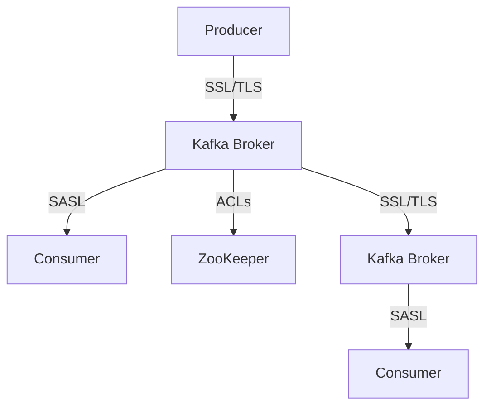

## 12.7.1 Regular Security Assessments

In the rapidly evolving landscape of cybersecurity, regular security assessments are crucial for maintaining the integrity, confidentiality, and availability of systems. For Apache Kafka, a distributed streaming platform widely used for building real-time data pipelines and streaming applications, security assessments are vital to safeguard against potential threats and vulnerabilities. This section delves into the various types of security assessments, provides guidance on conducting assessments specific to Kafka, discusses tools and resources available, and outlines strategies for prioritizing and remediating findings.

### Understanding Security Assessments

Security assessments are systematic evaluations of an organization's information systems to identify vulnerabilities, threats, and risks. They help ensure that security controls are effective and that systems comply with relevant regulations and standards. The primary types of security assessments include:

- **Vulnerability Scanning**: Automated tools scan systems for known vulnerabilities, misconfigurations, and outdated software.
- **Penetration Testing**: Ethical hackers simulate attacks to identify exploitable vulnerabilities.
- **Compliance Audits**: Assessments ensure that systems adhere to industry standards and regulations, such as GDPR, HIPAA, and PCI DSS.

### Conducting Security Assessments for Kafka

Apache Kafka's architecture, which involves producers, brokers, consumers, and ZooKeeper (or KRaft in newer versions), presents unique security challenges. Conducting security assessments for Kafka requires a comprehensive understanding of its components and configurations.

#### Vulnerability Scanning

Vulnerability scanning for Kafka involves identifying weaknesses in the Kafka cluster, including:

- **Broker Configurations**: Ensure brokers are configured securely, with appropriate authentication and authorization mechanisms in place.
- **Network Security**: Scan for open ports and services that may expose Kafka to external threats.
- **Software Versions**: Check for outdated Kafka versions and dependencies that may have known vulnerabilities.

**Tools for Vulnerability Scanning**:

- **Nessus**: A widely-used vulnerability scanner that can identify misconfigurations and vulnerabilities in Kafka environments.
- **OpenVAS**: An open-source alternative to Nessus, suitable for scanning Kafka clusters for vulnerabilities.
- **Qualys**: Provides cloud-based vulnerability scanning and management solutions.

#### Penetration Testing

Penetration testing for Kafka involves simulating attacks to uncover vulnerabilities that may not be detected by automated scans. Key areas to focus on include:

- **Authentication Mechanisms**: Test the robustness of SSL/TLS and SASL configurations.
- **Access Controls**: Attempt to bypass ACLs and gain unauthorized access to Kafka topics.
- **Data Integrity**: Simulate attacks to alter or intercept data in transit.

**Tools for Penetration Testing**:

- **Metasploit**: A powerful framework for developing and executing exploit code against a remote target machine.
- **Burp Suite**: Useful for testing web interfaces and APIs that interact with Kafka.
- **Kali Linux**: A Linux distribution with a suite of penetration testing tools.

#### Compliance Audits

Compliance audits for Kafka ensure that the system adheres to relevant regulations and standards. This involves:

- **Data Protection**: Verify that data encryption is implemented for data at rest and in transit.
- **Access Management**: Ensure that access controls comply with regulatory requirements.
- **Logging and Monitoring**: Check that logging is configured to capture security-relevant events and that logs are monitored for suspicious activity.

**Tools for Compliance Audits**:

- **Splunk**: Provides comprehensive logging and monitoring capabilities, useful for compliance audits.
- **ELK Stack (Elasticsearch, Logstash, Kibana)**: An open-source alternative for log management and analysis.
- **AuditBoard**: A platform for managing compliance audits and assessments.

### Strategies for Prioritizing and Remediating Findings

Once vulnerabilities and compliance issues are identified, it's crucial to prioritize and remediate them effectively. Here are some strategies:

- **Risk Assessment**: Evaluate the potential impact and likelihood of each finding to prioritize remediation efforts.
- **Patch Management**: Regularly update Kafka and its dependencies to address known vulnerabilities.
- **Configuration Management**: Review and update Kafka configurations to align with security best practices.
- **Incident Response**: Develop and test incident response plans to address security breaches promptly.

### Practical Applications and Real-World Scenarios

Regular security assessments are not just theoretical exercises; they have practical applications in real-world scenarios. For instance:

- **Financial Services**: A bank using Kafka for real-time fraud detection must ensure that its Kafka deployment is secure to protect sensitive financial data.
- **Healthcare**: A healthcare provider using Kafka for patient data streaming must comply with HIPAA regulations, necessitating regular compliance audits.
- **E-commerce**: An online retailer using Kafka for order processing must secure its Kafka cluster to prevent data breaches and ensure customer trust.

### Code Examples

To illustrate the implementation of security measures in Kafka, consider the following code examples in Java, Scala, Kotlin, and Clojure.

#### Java Example: Configuring SSL for Kafka

```java
Properties props = new Properties();
props.put("bootstrap.servers", "localhost:9093");
props.put("security.protocol", "SSL");
props.put("ssl.truststore.location", "/var/private/ssl/kafka.client.truststore.jks");
props.put("ssl.truststore.password", "test1234");
props.put("ssl.keystore.location", "/var/private/ssl/kafka.client.keystore.jks");
props.put("ssl.keystore.password", "test1234");
props.put("ssl.key.password", "test1234");

// Create a Kafka producer with SSL configuration
KafkaProducer<String, String> producer = new KafkaProducer<>(props);
```

#### Scala Example: Configuring SASL for Kafka

```scala
import java.util.Properties
import org.apache.kafka.clients.producer.{KafkaProducer, ProducerRecord}

val props = new Properties()
props.put("bootstrap.servers", "localhost:9093")
props.put("security.protocol", "SASL_SSL")
props.put("sasl.mechanism", "PLAIN")
props.put("sasl.jaas.config", "org.apache.kafka.common.security.plain.PlainLoginModule required username='user' password='password';")

// Create a Kafka producer with SASL configuration
val producer = new KafkaProducer[String, String](props)
```

#### Kotlin Example: Configuring ACLs for Kafka

```kotlin
val props = Properties()
props["bootstrap.servers"] = "localhost:9093"
props["security.protocol"] = "SASL_SSL"
props["sasl.mechanism"] = "PLAIN"
props["sasl.jaas.config"] = "org.apache.kafka.common.security.plain.PlainLoginModule required username='user' password='password';"

// Create a Kafka producer with ACL configuration
val producer = KafkaProducer<String, String>(props)
```

#### Clojure Example: Configuring Kafka with Kerberos

```clojure
(def props
  {"bootstrap.servers" "localhost:9093"
   "security.protocol" "SASL_PLAINTEXT"
   "sasl.mechanism" "GSSAPI"
   "sasl.kerberos.service.name" "kafka"})

;; Create a Kafka producer with Kerberos configuration
(def producer (KafkaProducer. props))
```

### Visualizing Kafka Security Architecture

To better understand the security architecture of Kafka, consider the following diagram illustrating the flow of data and security components.



**Caption**: This diagram illustrates the security architecture of Kafka, highlighting the use of SSL/TLS for data encryption, SASL for authentication, and ACLs for access control.

### References and Links

- [Apache Kafka Documentation](https://kafka.apache.org/documentation/)
- [Confluent Documentation](https://docs.confluent.io/)
- [Nessus Vulnerability Scanner](https://www.tenable.com/products/nessus)
- [OpenVAS](https://www.openvas.org/)
- [Metasploit Framework](https://www.metasploit.com/)

### Knowledge Check

To reinforce your understanding of regular security assessments for Kafka, consider the following questions:

1. What are the primary types of security assessments?
2. How can vulnerability scanning be applied to Kafka?
3. What tools are available for penetration testing Kafka environments?
4. Why are compliance audits important for Kafka deployments?
5. How can risk assessment help prioritize remediation efforts?

### Embrace the Journey

Regular security assessments are an ongoing process that requires vigilance and adaptation to new threats. By integrating these assessments into your Kafka deployment strategy, you can enhance the security posture of your systems and protect valuable data. Encourage critical thinking and exploration by considering how these concepts apply to your own projects and environments.

### Best Practices for Tags

- Use Specific and Relevant Tags
- Use 4 to 8 relevant and specific tags that reflect the article's content.
- Tags should reflect key topics, technologies, or concepts, such as programming languages, Kafka features, design patterns, or integration techniques discussed in the article.
- Keep tag names consistent and properly capitalized (e.g., "Apache Kafka", "Scala", "Stream Processing").
- Wrap tags in double-quotes.
- Avoid tags containing `#` characters. For example, use "CSharp" instead of "C#", use "FSharp" instead of "F#".

## Test Your Knowledge: Regular Security Assessments for Apache Kafka



### What is the primary purpose of vulnerability scanning in Kafka security assessments?

- [x] To identify known vulnerabilities and misconfigurations.
- [ ] To simulate real-world attacks.
- [ ] To ensure compliance with regulations.
- [ ] To monitor system performance.

> **Explanation:** Vulnerability scanning is used to identify known vulnerabilities and misconfigurations in systems, helping to address security weaknesses.

### Which tool is commonly used for penetration testing in Kafka environments?

- [x] Metasploit
- [ ] Nessus
- [ ] Splunk
- [ ] Qualys

> **Explanation:** Metasploit is a widely-used framework for penetration testing, allowing testers to simulate attacks and identify vulnerabilities.

### What is the role of compliance audits in Kafka security?

- [x] To ensure adherence to industry standards and regulations.
- [ ] To identify software vulnerabilities.
- [ ] To simulate cyber attacks.
- [ ] To optimize system performance.

> **Explanation:** Compliance audits verify that systems adhere to industry standards and regulations, ensuring legal and regulatory compliance.

### How can risk assessment help prioritize remediation efforts?

- [x] By evaluating the potential impact and likelihood of each finding.
- [ ] By identifying the most expensive vulnerabilities.
- [ ] By focusing on the easiest issues to fix.
- [ ] By ignoring low-risk vulnerabilities.

> **Explanation:** Risk assessment evaluates the potential impact and likelihood of each finding, helping prioritize remediation efforts based on risk.

### Which of the following is a tool for vulnerability scanning?

- [x] Nessus
- [ ] Metasploit
- [ ] Burp Suite
- [ ] Kali Linux

> **Explanation:** Nessus is a widely-used vulnerability scanner that identifies misconfigurations and vulnerabilities in systems.

### What is the primary focus of penetration testing?

- [x] Simulating attacks to identify exploitable vulnerabilities.
- [ ] Ensuring compliance with regulations.
- [ ] Monitoring system performance.
- [ ] Identifying software updates.

> **Explanation:** Penetration testing focuses on simulating attacks to identify exploitable vulnerabilities in systems.

### Which security protocol is used for encrypting data in transit in Kafka?

- [x] SSL/TLS
- [ ] SASL
- [ ] Kerberos
- [ ] OAuth

> **Explanation:** SSL/TLS is used for encrypting data in transit, ensuring secure communication between Kafka components.

### What is the purpose of access control lists (ACLs) in Kafka?

- [x] To manage permissions and restrict access to Kafka resources.
- [ ] To encrypt data at rest.
- [ ] To simulate cyber attacks.
- [ ] To monitor system performance.

> **Explanation:** ACLs manage permissions and restrict access to Kafka resources, ensuring only authorized users can access sensitive data.

### Which of the following is a compliance audit tool?

- [x] Splunk
- [ ] Nessus
- [ ] Metasploit
- [ ] OpenVAS

> **Explanation:** Splunk provides comprehensive logging and monitoring capabilities, useful for compliance audits.

### True or False: Regular security assessments are a one-time activity.

- [ ] True
- [x] False

> **Explanation:** Regular security assessments are an ongoing process that requires continuous vigilance and adaptation to new threats.



By following these guidelines and leveraging the tools and techniques discussed, you can enhance the security of your Apache Kafka deployments and ensure they remain resilient against evolving threats.
